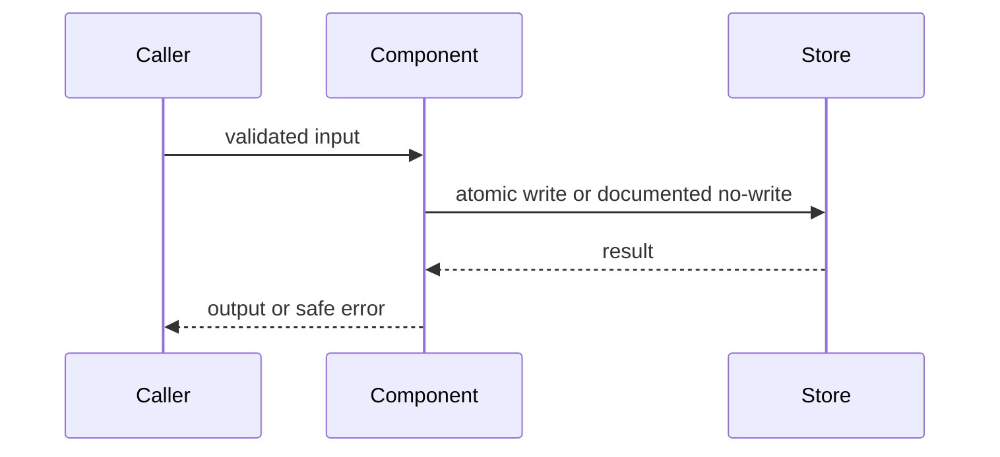

# 写入 Figura 实现方案

当用户要求把已经讨论的 Figura 方案写入实现记录时使用。本 skill 维护索引 `../../../docs/figura-implementation-content.md` 和逐 change 记录；不生成 OpenSpec 工件、不实现代码。

## 写入前

- 先读索引和与目标 change 对应的记录；核对 `../../../src/figura/` 代码、相关主规格及活动/归档工件，避免重复记录或把历史草案当成新决定。
- OpenSpec 读取前执行 `openspec store list --json`，确认 Figura store；后续支持 store 参数的命令使用实际返回的 store id（当前通常是 `figura`）。仅在方案涉及已存在的规格或 change 时读取。
- 未定且会影响范围、字段合同或兼容性的选择标为“待确认”，说明受影响内容；继续记录已明确的部分，不替用户作决定。
- 仅当需要记录供应商当前 API、模型 ID 等易变事实时查阅对应官方资料。

## 记录位置与索引

- 索引保留在 `docs/figura-implementation-content.md`，只写文档规则、change 概览、实施状态、OpenSpec 状态、简短交付摘要、后续交接和指向详细记录的链接。不要把完整字段合同复制进索引。
- 新 change 的详细记录放在 `docs/figura-implementation/changes/<change-slug>.md`。已有 OpenSpec id 时复用；proposal 尚未建立时用已讨论的 change 名称生成稳定 slug，并将 OpenSpec 状态标为“未建立”。
- 当前 Provider、Run 两条记录仍在索引文件内。若用户只要求记录另一个新 change，不要顺带迁移它们；若用户明确要求更新这两条记录，先按其现有位置更新，不另建重复记录。只有用户要求整理/迁移文档时才移动既有记录。
- 新记录或更新记录后，同步维护索引对应行及相对链接。状态分别记录实施状态、OpenSpec 状态和决定状态，不互相替代。

## 执行命令

从 Figura 仓库根目录执行。只读取实现证据；不得打印环境密钥或读取 `.env` 内容。

```sh
git status --short -- docs/figura-implementation-content.md docs/figura-implementation src/figura
rg -n "^##|^###" docs/figura-implementation-content.md
rg --files docs | rg '^docs/figura-implementation/'
rg --files src/figura
rg -n "class |def |Provider|Run|Session|Checkpoint" src/figura
openspec store list --json
openspec list --json --store figura
openspec status --change "change-id" --json --store figura
```

使用实际 store id 替换示例中的 `figura`。仅读取相关主规格或工件；活动 change 路径以 status 输出为准，归档 change 从 archive 文件列表定位。

写入后执行格式检查，并人工核对索引链接、五部分结构和合同完整度：

```sh
git diff --check -- docs/figura-implementation-content.md docs/figura-implementation/changes
git diff --cached --check -- docs/figura-implementation-content.md docs/figura-implementation/changes
```

本 skill 不运行应用测试；用户另行要求验证时才运行适用命令。

## Change 记录模板

每条新记录按以下五部分组织。五个一级部分必须保留并填写；无适用内容时写明“不适用：原因”，方案未定时写“待确认：问题及影响”。可按 change 需要增加表格行，不要增加一组重复的顶层章节。

````markdown
# `<change-id-or-slug>` · <中文标题>

> 最近更新：YYYY-MM-DD。实施状态：计划中。OpenSpec 状态：未建立。

## 1. 概览与决定

- **问题与目标**：
- **完成结果**：用户或调用方能观察到什么。
- **本次范围**：
- **明确不包含**：
- **前置依赖**：
- **基线与来源**：当前代码证据、Figura 主规格、相关活动/归档 change、仅供参考的草案。
- **OpenSpec**：proposal/spec/design/tasks 的链接；尚未建立时写明。

| 主题 | 决定/现状 | 决策状态（已确认/暂定/待确认） | 依据 | 受影响字段/组件 |
|---|---|---|---|---|
| 替换此示例 |  |  |  |  |

## 2. 实现合同

### 组件

| 组件/源码路径 | 职责 | 输入 → 输出 | 依赖/调用关系 | 实施状态与证据 |
|---|---|---|---|---|
| 替换此示例 |  |  |  |  |

### 字段

每个字段一行；嵌套对象逐层展开。枚举列全合法值及未知值行为；集合写明元素结构、顺序、去重和数量/字节上限。

| 字段路径（一字段一行） | 类型、必填/可空、默认值、约束 | 来源/owner、读写方与时机 | 生命周期、持久化与暴露范围 | 校验/错误 | 计划或实现状态、证据 |
|---|---|---|---|---|---|
| object.field |  |  |  |  |  |

### API、事件与错误

| API/event/error | 调用/触发方 | 输入 → 输出字段 | 校验、错误结果与安全消息 | 副作用、顺序、幂等/重试 | 状态与证据 |
|---|---|---|---|---|---|
| 替换此示例 |  |  |  |  |  |

### 安全、资源与兼容

- 敏感数据：来源与 owner、可读取组件、传输/持久化/保留期、日志/API 投影。
- 资源限制：请求/内容/图片/集合等上限及超限行为。
- 版本与兼容：schema/API/payload/event/config 版本、不匹配行为、迁移和旧数据兼容；无相关内容时解释原因。

## 3. 核心流程

按关键场景分别记录触发者、前置条件、参与组件、字段变换与校验、状态变化、持久化/事务边界、返回结果以及失败和恢复路径。流程中的字段名应与第 2 部分一致。

1. **触发与输入**：
2. **执行与校验**：
3. **状态/持久化/事件**：
4. **返回结果**：
5. **失败、结果未知与恢复**：

| 实体/状态 | 触发与前置条件 | 状态变化/副作用 | 终态、并发或重入规则 |
|---|---|---|---|
| 替换此示例 |  |  |  |

三个及以上组件参与的主要流程附 Mermaid sequence diagram，并与上述步骤及合同表保持一致；简单流程不强制画图。



## 4. 实现对照

方案阶段将代码状态标为“尚未实现/未核实”；回填时逐项核对字段、组件、API、状态和流程。历史草案只保留仍能解释当前差异或后续决策的内容。

| 字段/组件/行为 | 本 change 计划 | 当前代码 | 主规格/OpenSpec | 差异、影响与后续 owner | 证据/状态 |
|---|---|---|---|---|---|
| 替换此示例 |  |  |  |  |  |

## 5. 验证与交接

### 验证

| 类型 | 精确命令/操作 | 结果/预期 | 覆盖边界与来源 |
|---|---|---|---|
| 计划验证（尚未执行） |  |  |  |
| 已观察验证（仅填实际执行） |  |  |  |

### 交接

- **待确认及影响**：
- **未实现/暂缓**：
- **前置或后续 change**：
- **下一 owner/入口**：
````

## 完整度规则

- 字段合同必须逐字段记录类型、可空/必填/默认、约束、owner、读写方与时机、持久化/生命周期、暴露范围、校验和状态/证据。适用项不能用“其他字段”等概括。
- 组件必须具体到源码路径，并记录职责、输入、输出、依赖和状态。
- 端到端流程必须覆盖正常和失败分支、事务或明确无写入、幂等/并发规则、对外结果及恢复 owner；所有字段和图表名称须互相吻合。
- 决策状态只用“已确认/暂定/待确认”；实施状态与 OpenSpec 状态独立维护。只有检查代码后才标“已实现”。
- 计划验证与实际执行结果分开记录；不得把预期命令或旧记录写成本次已通过。

## 边界

- 只修改实现索引和目标 change 记录，不修改代码、OpenSpec proposal/spec/design/tasks、主规格或归档工件。
- 正式 OpenSpec proposal 使用 `$openspec-propose`，实现使用 `$openspec-apply-change`；计划写完后可告知后续入口，不自动执行。
- 若用户要求按已完成实现回填，使用 `$figura-implementation-reconcile`。

完成后报告更新的索引行和记录路径、已确认与待确认内容，以及尚未执行的步骤。
