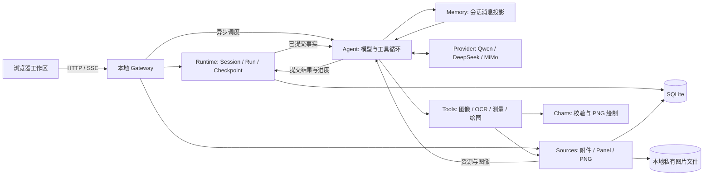

# Figura

**用自然语言读懂图表，并把图像或结构化数据重新组织成图表。**

Figura 是一个本地图表分析工作区。用户在浏览器中创建会话、上传图片并描述目标，Agent 按需调用图像、OCR、测量和绘图工具，返回中文分析或可预览、下载的 PNG 图表。工具调用过程按每次运行展示，后续对话可以继续使用同一会话中的已有资源。

本文介绍当前 `src/figura/` 实现。仓库同时保留旧 `src/chartagent/`，两套运行入口、配置和数据目录相互独立。

## 当前可以做什么

| 能力 | 当前行为 |
| --- | --- |
| 图表阅读 | 按需加载原图，结合视觉理解、OCR 和测量回答标题、单位、类别、趋势与数值问题 |
| 多图分析 | 根据模型提出的多边形区域，把仪表盘或拼图拆成命名 Panel，分别观察与测量 |
| 图表测量 | 支持柱状图、折线图、散点图和饼图；OCR 与测量可限定在临时多边形范围内 |
| 图表生成 | 从用户提供的数据或图像分析结果组装 `ChartFigure`，支持单图和多图画布，生成 PNG |
| 会话工作区 | 创建、切换和删除会话，上传及预览附件，查看分区图像、分析回答与生成图，下载 PNG |
| 过程查看 | 按 Run 展示工具时间线，按需展开参数与结果摘要，并查看成功 OCR／测量的观察图 |
| 停止与恢复 | 可请求协作停止；Gateway 启动和运行期间会恢复持久化 Run，未知执行结果不会被盲目重放 |
| Provider 重试 | 对已确认且分类为临时的网络或服务失败自动重试；每个逻辑模型请求最多四次物理尝试，不设 Run 累计次数 |
| 上下文占比 | 使用本地统一规则估算最近一次请求的输入 token；配置模型窗口后显示近似占比，只用于观察，不限制请求 |
| 持久化与对话 | SQLite 保存输入、模型与工具执行事实、checkpoint 和事件；后续 Run 从同一会话的已提交事实重建对话 |
| 模型接入 | 在网页中选择已配置的 Qwen、DeepSeek 或 MiMo；模型 ID 由后端固定 |

测量工具返回的是候选观察。轴标定不足时会保留像素信息与警告，不能把这些结果直接当作精确数据。当前生成图经过结构和语义校验并可由 Agent 回看；独立的生成图验证、发布和新 Figura 评测链尚未实现。

## 快速开始

### 1. 准备运行环境

从仓库根目录执行以下命令。Python 命令统一使用名为 `agent` 的 Conda 环境；已有该环境时跳过创建步骤。

```bash
conda create -n agent python=3.11 -y
conda run -n agent python -m pip install -e '.[dev]'
npm --prefix frontend install
```

后端声明支持 Python 3.10 及以上。前端启动脚本使用 `import.meta.dirname`，可使用 Node.js 22 及以上版本。当前 Run 执行锁依赖 `fcntl`，后端应在 macOS 或 Linux 上运行。

主要依赖包括 React、TypeScript、Vite、OpenAI Python SDK、RapidOCR、Pillow、NumPy 和 Matplotlib，完整清单见 [pyproject.toml](pyproject.toml) 与 [frontend/package.json](frontend/package.json)。

### 2. 配置模型

如果还没有 `.env`，复制配置模板：

```bash
cp .env.example .env
```

至少配置一个 Figura Provider。例如，使用 DeepSeek 时填写：

```dotenv
FIGURA_DEEPSEEK_API_KEY=your_api_key
FIGURA_DEEPSEEK_BASE_URL=https://api.deepseek.com
FIGURA_DEEPSEEK_TIMEOUT_SECONDS=60
FIGURA_DEEPSEEK_THINKING_MODE=true
```

Figura 只读取 `FIGURA_*` 模型配置。模板中的 `OPENAI_*`、`QWEN_*`、`DEEPSEEK_*` 和 `CHARTAGENT_*` 属于旧 ChartAgent，不会配置新 Figura。

| Provider | 当前固定模型 ID | 必填配置 | Endpoint 配置 |
| --- | --- | --- | --- |
| Qwen | `qwen3.8-flash` | `FIGURA_QWEN_API_KEY`、`FIGURA_QWEN_BASE_URL` | 无默认地址；填写与 API key 所属区域及工作空间匹配的 OpenAI 兼容地址 |
| DeepSeek | `deepseek-flash` | `FIGURA_DEEPSEEK_API_KEY` | `FIGURA_DEEPSEEK_BASE_URL`，默认 `https://api.deepseek.com` |
| MiMo | `mimo-v2.6-flash` | `FIGURA_MIMO_API_KEY` | `FIGURA_MIMO_BASE_URL`，默认 `https://api.xiaomimimo.com/v1`；使用其他套餐时同时配置匹配的地址和 key |

各 Provider 可设置 `FIGURA_<PROVIDER>_TIMEOUT_SECONDS` 和 `FIGURA_<PROVIDER>_THINKING_MODE`，默认分别为 `60` 和 `true`。还可按 Provider 设置 `FIGURA_<PROVIDER>_MAX_COMPLETION_TOKENS`；它只配置单次模型请求的输出上限，不形成 Run 累计预算。Qwen、DeepSeek 还可配置 `REASONING_EFFORT`，具体取值见 [.env.example](.env.example)。网页按本地配置显示可用 Provider；这个检查不会验证远端连通性、额度或请求是否能成功。

#### 可选：显示上下文占比

Figura 对所有 Provider 统一使用 `tiktoken/o200k_base` 估算最近一次模型请求的输入 token。准备编码缓存后重启服务：

```bash
conda run -n agent python -c "import tiktoken; tiktoken.get_encoding('o200k_base')"
```

此准备步骤首次需要下载公开编码资源，运行期估算不访问网络。默认使用系统临时目录中的 tiktoken 缓存；需要持久缓存时，在准备命令和 Gateway 环境中设置同一个 `TIKTOKEN_CACHE_DIR`。缓存缺失、损坏或被禁用时，模型调用仍继续，输入区显示“上下文待估算”；准备缓存后需重启服务。

在 `.env` 中填写 `FIGURA_QWEN_CONTEXT_WINDOW_TOKENS`、`FIGURA_DEEPSEEK_CONTEXT_WINDOW_TOKENS` 或 `FIGURA_MIMO_CONTEXT_WINDOW_TOKENS`，值取实际模型服务合同中的正整数容量，即可显示占比。没有有效容量时只显示估算 token 数，不猜测模型窗口。

计数包括实际发送的指令、工具定义、历史、工具参数/结果与回放 continuation。每次出现的图片按 1,024 tokens 近似，不计算 base64 文本。输入区的“上下文 ≈”对应最近请求；不累计多次调用，不计算草稿或正在生成的回复。点击指示器可查看数量、原请求模型与说明。重试复用同一估算，超过 100% 也不会在本地阻止发送。

估算快照保存在 binding v2 JSON，旧 v1 历史可读取和重试，不回填。没有新增 SQL 表。升级前备份本地 Runtime 数据；产生 v2 binding 后，降级到只支持 v1 的代码需要恢复升级前备份。

### 3. 启动 Figura

```bash
npm --prefix frontend run dev:figura
```

打开 [Figura 浏览器工作区](http://127.0.0.1:1421/)。默认地址为：

| 服务 | 地址 |
| --- | --- |
| React / Vite | `http://127.0.0.1:1421` |
| Figura Gateway | `http://127.0.0.1:8766` |
| 健康检查 | `http://127.0.0.1:8766/api/v1/health` |

启动器先等待 Gateway 就绪，再启动 Vite。按 **Ctrl-C** 会停止它创建的进程组；不要在相同端口启动多个实例。这个入口运行浏览器工作区，无需 Rust 或 Tauri。

Gateway 加载仓库根目录的 `.env`，已有进程环境变量优先。修改 Provider 配置后，重启启动器。

## 使用方式

1. 创建会话，选择一个可用 Provider。
2. 分析图片时上传附件，并选中要用于本次消息的图片；直接绘图时可在消息中提供数据。
3. 用自然语言说明希望得到的结果。Agent 会按任务选择工具，不要求每次都执行 OCR、分图或测量。
4. 查看回答和 Run 工具时间线。成功分割的 Panel、观察图与生成图可按需预览，生成图可下载为 PNG。
5. 在同一会话继续提问，引用先前图像或已生成图表。每个会话同时最多运行一个 Run。

可尝试以下请求：

```text
这张图展示了什么？说明横纵轴、单位和主要趋势，不确定的数值请标出来。

把这张仪表盘中的图表分开，分别说明结论，再比较它们的共同趋势。

尽量读取柱状图各类别的数值；如果无法可靠标定坐标轴，请说明限制。

根据以下数据生成柱状图：一月 12，二月 18，三月 15。标题为“季度销量”。

把刚才的数据同时画成柱状图和折线图，放在同一张画布中。
```

支持上传 PNG、JPEG、GIF 和 WebP。上传时图片先保存到本地；Agent 调用 `load_image` 等需要图像回看的工具后，相关图片才会进入所选 Provider 的模型请求。运行、附件和图表文件保存在本机，模型推理仍需要访问配置的远端服务。

已被 Run 引用的附件不能单独删除。会话删除需要网页确认，且会话必须没有运行中的 Run；删除会同时清理该会话的执行事实、附件、Panel 和渲染文件。

## 工作原理

Figura 将模型决策、工具执行、持久化和浏览器展示分别交给明确的组件。



- **Session 与 Run**：Session 是会话和资源归属边界，一次用户提交创建一个 Run。Run 输入、执行事实与 checkpoint 持久化；HTTP 重复提交通过幂等键复用原 Run。
- **Agent 与提示**：Agent 运行模型—工具循环。每次模型请求提供稳定行为规则、当前工具目录和 Run 资源索引三个 SYSTEM 指令块，再组装完整会话消息及最近工具批次需要回看的图像。
- **Memory 与资源目录**：后续 Run 从同会话较早终态 Run 的事实重建 user、assistant 和 tool 消息。资源目录统一索引附件、Panel、OCR、测量、ChartFigure 和 ChartRender，由已提交事实重建，不另存一份结果库。
- **工具与图表**：工具按版本化 Schema 校验输入和结果。`ChartSpecData` 描述单图，`ChartFigure` 描述多图画布；组装成功后，渲染工具使用已提交 Figure 生成 PNG。
- **网页与事件**：SSE 通知生命周期和进度变化，前端重新读取安全摘要。工具详情、观察图和 PNG 按需加载；事件流不复制完整工具 payload。

### 当前工具

Gateway 当前注册的工具版本为 `figura-web-v6`。

| 工具 | 用途 |
| --- | --- |
| `load_image` | 加载被授权的附件或 Panel，供模型在下一轮观察 |
| `decompose_chart_image` | 按模型提出的规范化多边形分割附件，保存命名 Panel |
| `extract_text` | 独立 OCR，返回文字、位置与置信度 |
| `measure_bars` | 观察柱体、类别、基线与可标定的数值 |
| `measure_lines` | 观察折线系列、采样点及坐标标定信息 |
| `measure_scatter` | 观察散点位置与可标定的坐标 |
| `measure_pie` | 观察饼图扇区、角度与符合条件的比例 |
| `assemble_chart_figure` | 解析和校验画布及各图的 ChartSpec，可引用同会话成功测量调用 |
| `render_chart_figure` | 渲染已提交的 ChartFigure，保存并返回 PNG 元数据 |

测量引用只证明对应成功工具调用存在，不能证明画布中填写的数据与测量值一致。工具完整输入输出和恢复策略见 [Tools 文档](docs/figura/tools.md)。

### 恢复边界

Gateway 在启动和运行期间会扫描并恢复持久化的 running Run。已提交结果可以复用；安全且幂等的工具可按原调用身份恢复。

已确认的临时 Provider 失败会在同一个持久请求绑定下自动重试，最多四次物理尝试（含首次）；认证、额度耗尽、无效请求和无法分类的失败不会自动重试。没有确定响应的请求通常保持结果未知，不会盲目再次发送；只有满足严格条件的纯生成请求才可能在旧执行 owner 已退出后替换尝试。工具失败不会由通用工具层自动重复执行，模型可根据已知结果决定下一步。副作用不明的调用不会被盲目重放。

网页提供“停止分析”操作。它会记录协作停止请求，让当前已开始的步骤有机会提交结果，再由 Agent 在安全边界结束；如果正在运行的处理器没有返回，界面会继续显示等待停止。Figura 网页没有手动重试或重新打开终态 Run 的按钮；失败或中断后可在同一会话提交新消息。会话历史保留完整消息，尚无自动摘要或裁剪；上下文估算超过配置容量也不会在本地截断或拦截，请求仍可能被 Provider 拒绝。

## 配置与本地数据

| 配置项 | 默认值 | 作用 |
| --- | --- | --- |
| `FIGURA_DATA_DIR` | 仓库根目录下 `.figura/` | SQLite 与私有图片的统一根目录；相对路径从仓库根目录解析 |
| `FIGURA_GATEWAY_PORT` | `8766` | Gateway 端口 |
| `VITE_DEV_PORT` | `1421`（Figura 启动器） | Vite 端口 |
| `VITE_DEV_HOST` | `127.0.0.1`（Figura 启动器） | 前端 loopback 地址 |
| `FIGURA_WEB_ORIGINS` | 端口 `1421` 的本地 HTTP Origins | Gateway 浏览器来源白名单；启动器自动补入当前前端端口的 loopback Origins |
| `FIGURA_CONDA_ENV` | `agent` | 启动器使用的 Conda 环境 |
| `FIGURA_CONDA_EXECUTABLE` | `conda` | 启动器使用的 Conda 可执行程序 |
| `FIGURA_<PROVIDER>_MAX_COMPLETION_TOKENS` | 未设置 | 单次请求输出 token 配置，不是 Run 总预算 |
| `FIGURA_<PROVIDER>_CONTEXT_WINDOW_TOKENS` | 未设置 | 上下文占比的显示分母；没有有效值时只显示输入估算 |
| `TIKTOKEN_CACHE_DIR` | 系统临时缓存 | 可选的 tokenizer 编码持久缓存目录 |

启动器端口等选项从启动进程环境读取，可这样覆盖：

```bash
FIGURA_GATEWAY_PORT=8876 VITE_DEV_PORT=1521 npm --prefix frontend run dev:figura
```

默认数据布局如下，目录按需创建：

```text
.figura/
├── figura.sqlite3     # Session、Run、执行事实、checkpoint 与来源元数据
├── attachments/      # 上传图片
├── panels/           # 分割后的独立 PNG
├── chart-renders/    # 生成图表 PNG
└── .run-locks/       # Run 独占执行锁
```

Runtime 与 Sources 共用一份 SQLite。图片字节保存在私有文件中，OCR／测量观察图按需重建；图表的完整结构和结果借用通用工具事实保存。Provider continuation 作为私有执行数据保存，公开 DTO 不返回它，也不返回 API key、原始 endpoint、本机文件路径或原始 Provider 响应。

`.env` 和 `.figura/` 已被 Git 忽略。备份或迁移数据时停止服务，并保留整个数据目录，使数据库引用与图片文件一起迁移。新 Figura 不会自动读取或合并旧 `.chartagent/` 数据。

## 开发与验证

### 常用命令

```bash
# 完整 Python 测试，包含 Figura 与旧 ChartAgent
conda run -n agent python -m pytest -q

# 聚焦当前 Figura 的运行、Agent 与网页边界
conda run -n agent python -m pytest -q tests/test_figura_run_execution_core.py tests/test_figura_agent_executor.py tests/test_figura_gateway.py

# 前端类型检查与生产构建
npm --prefix frontend run build

# 前端及启动器静态 smoke 检查
npm --prefix frontend run smoke

# 启动器信号处理与端口释放检查，使用隔离端口
npm --prefix frontend run smoke:launcher

# 提交前检查
git diff --check
```

前端改动需运行 build 和 smoke；启动器改动还需运行 smoke:launcher。Python 行为改动先运行对应测试文件，再运行完整测试。OCR 相关命令始终使用 `agent` 环境。

单独启动 Figura Gateway：

```bash
conda run -n agent python -m figura.gateway
```

主要 HTTP 路由位于 `/api/v1`，下表省略该前缀：

| 路由 | 用途 |
| --- | --- |
| `GET /health` | 本地配置与服务健康信息 |
| `GET /sessions`、`POST /sessions` | 列出或创建会话 |
| `GET /sessions/{sessionId}`、`DELETE /sessions/{sessionId}` | 会话快照或没有活动 Run 的会话删除 |
| `GET /sessions/{sessionId}/attachments`、`POST /sessions/{sessionId}/attachments?filename=...` | 附件列表或原始图片字节上传 |
| `GET /sessions/{sessionId}/panels`、`GET /sessions/{sessionId}/panels/{panelId}/content` | 分区列表或 PNG 读取 |
| `POST /sessions/{sessionId}/runs` | 创建 Run，必需 `Idempotency-Key`，请求包含 `text`、`attachmentIds`、`providerId` |
| `GET /sessions/{sessionId}/runs/{runId}/history`、`GET /sessions/{sessionId}/runs/{runId}/events` | 历史读取或 SSE，使用 `afterSequence` 游标 |
| `GET /sessions/{sessionId}/runs/{runId}/timeline` | 工具步骤摘要 |
| `GET /sessions/{sessionId}/runs/{runId}/timeline/{callId}`、`GET /sessions/{sessionId}/runs/{runId}/timeline/{callId}/observation` | 安全详情或 OCR／测量观察图 |
| `GET /sessions/{sessionId}/runs/{runId}/chart-renders/{callId}/content` | 成功渲染的图表 PNG |

Gateway 绑定 `127.0.0.1`，写请求校验明确的本地 Origin。所有资源读取都检查 Session 归属；工具执行由 Agent 驱动，没有独立网页测量或绘图操作 API。完整 HTTP 与 DTO 合同见 [Gateway 代码](src/figura/gateway/application.py)、[主规格](openspec/figura/openspec/specs/figura-web-gateway/spec.md) 和 [Web 文档](docs/figura/web.md)。

### 目录导航

```text
src/figura/
├── agent/        # ReAct 编排、请求组装、提示资产与资源目录
├── runtime/      # Session / Run、持久事实、checkpoint 与工具执行
├── providers/    # Provider 配置、适配器与归一化合同
├── tools/        # 工具注册、Schema、handler 与测量传感器
├── sources/      # 附件、Panel、渲染图像与私有文件
├── charts/       # ChartSpec / ChartFigure、校验与绘制
├── memory/       # 从 Run 事实重建会话消息
├── gateway/      # HTTP / SSE、安全投影与异步调度
├── storage/      # 共享 SQLite、事务与 schema
└── shared/       # JSON Schema 与图像限制

frontend/src/     # React 工作区、API 适配器、纯领域逻辑与共享组件
frontend/scripts/ # 开发启动器与 smoke 检查
tests/            # Python 测试与图表 fixtures
docs/figura/      # 当前 Figura 的领域文档
openspec/figura/openspec/ # 当前 Figura 主规格与变更归档
```

### 旧 ChartAgent 入口

以下命令保留用于旧系统开发与兼容性对照：

| 命令 | 运行内容 |
| --- | --- |
| `npm --prefix frontend run dev` | 默认旧工作区的 Mock／离线前端，端口 `1420` |
| `npm --prefix frontend run dev:gateway` | 旧 ChartAgent Gateway 与 Vite，默认端口 `8765`／`1420` |
| `conda run -n agent python -m chartagent --agent` | 旧 Agent CLI |
| `npm --prefix frontend run tauri:dev:gateway` | 旧 ChartAgent Tauri 开发入口，需要 Rust 工具链 |

当前新 Figura 以 `dev:figura` 浏览器入口运行，尚未接入 Tauri。旧系统的 review gate、发布与 evaluation 能力不能视作新 Figura 已实现功能。

## 常见问题

**Provider 不可用或创建 Run 失败**

确认填写的是 `FIGURA_*` 配置；Qwen 需要显式填写 BASE_URL。修改后重启服务。health 只做本地配置检查，远端认证、网络或模型请求失败仍会在运行时出现。

**提示 `No module named 'rapidocr'`**

先核对运行环境：

```bash
conda run -n agent python -c "import rapidocr"
```

若该环境确实未安装依赖，重新运行前述 `pip install -e '.[dev]'`。不要先切换到系统 Python。

**端口被占用**

停止先前启动器，或通过进程环境设置不同的 `FIGURA_GATEWAY_PORT` 和 `VITE_DEV_PORT`。普通 `npm run dev` 与 `dev:figura` 使用不同默认端口和不同应用模式。

**重启后 Run 失败，或工具显示需要对账**

先查看 Run 状态和安全错误摘要。结果未知的模型请求不会无条件重发；只有可重建的纯生成请求在旧执行 owner 已退出且仍有尝试额度时才可能替换。需要对账的工具不会被盲目执行；在终态后可提交新消息。不要把 SSE 断开等同于任务已经停止。

**生成图中文字显示为方框**

渲染器使用本机字体，候选包括 PingFang SC、Arial Unicode MS 和 Noto Sans CJK SC。运行机器需要具有可用中文字体，尤其是在 Linux 环境中。

## 进一步阅读

- [系统总览](docs/figura-implementation-overview.md)：大组件关系、数据流与实现边界。
- [Agent](docs/figura/agent.md) · [Runtime](docs/figura/runtime.md) · [Memory](docs/figura/memory.md)：编排、恢复与对话投影。
- [Tools](docs/figura/tools.md) · [Sources](docs/figura/sources.md) · [Charts](docs/figura/charts.md)：观察工具、来源管理与图表合同。
- [Provider](docs/figura/provider.md) · [Web](docs/figura/web.md) · [Validation](docs/figura/validation.md)：模型、网页和共享校验边界；细节以当前代码与主规格为准。
- [Figura 主规格](openspec/figura/openspec/specs/) · [已完成变更归档](openspec/figura/openspec/changes/archive/)：主规格记录当前需求；归档保留对应 change 的设计、delta 与任务历史。`openspec sync` 同步主规格后，仍需完成归档步骤。
- [架构设计草案](docs/figura-architecture-design.md)：长期设计方向，其中尚未实现的能力以系统总览和当前代码为准。
