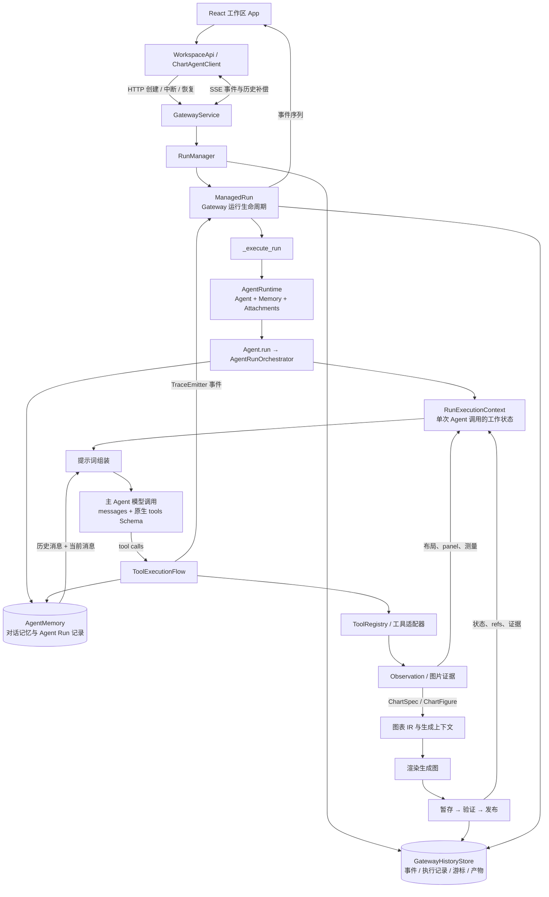
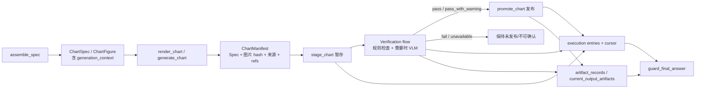

# Figura 当前项目架构与运行数据流分析

> 核对日期：2026-09-24
> 本文描述仓库当前实现，不代表重构方案。字段名以代码中的 Python 名称为主；传到前端/Gateway JSON 时，部分字段会转换为 camelCase。本文重点梳理一次运行从用户提交到结果展示的路径，以及负责保存状态的主要对象。

## 1. 先看整体结构



这张图里有三类状态，不要把它们当成一个大 context：

1. **对话上下文**：Memory 选择要送给模型的消息历史。
2. **单次执行状态**：`RunExecutionContext` 保存本次 Agent 调用中工具、panel、证据和产物的工作数据。
3. **运行生命周期与恢复状态**：Gateway 的 `ManagedRun` 维护对外状态；`GatewayHistoryStore` 维护可持久化事件和可恢复执行记录。

另外，代码里的 `AgentRuntime` 是资源组合对象；提示词所说的 `runtime` 通常指被渲染成 JSON 的运行状态摘要。两者是不同含义。

## 2. 各模块的责任边界

| 模块/对象 | 主要责任 | 它不负责什么 |
|---|---|---|
| `frontend/src/App.tsx` | 收集输入和附件、发起/恢复/中断 run、把事件映射到工作区状态 | 不执行 Agent 编排，不直接调用工具实现 |
| `WorkspaceApi` / `ChartAgentClient` | 前端 API 稳定门面；Gateway 与 mock 提供同一接口 | 不拥有 run 状态合并策略 |
| `createRunController` | 独占 SSE 订阅、事件序号游标、断线重连、拉取历史补偿、终态收敛 | 不决定模型下一步做什么 |
| `GatewayService` | 校验请求、解析会话与附件、启动/中断/恢复 run、映射安全错误 | 不负责 Agent 内部的模型回合和工具执行顺序 |
| `RunManager` | 管理活动/近期 Gateway runs、线程池、并发限制与过期清理 | 不承载 Agent 对话 prompt |
| `ManagedRun` | 一个 Gateway run 的线程安全生命周期、事件序号、取消信号、恢复投影 | 不等同于 Memory 里的 Agent `Run` |
| `AgentRuntime` | 创建并持有一次 Agent 执行需要的 Agent、Memory 和附件注册表 | 不等同于 per-run 的 `RunExecutionContext` |
| `Agent` | 持有模型 client、工具注册表、静态 system prompt、运行配置及执行协作者 | 不独立实现所有 run 调度细节 |
| `AgentRunOrchestrator` | 拥有 Agent 单次 `run()` 的恢复、提示词、模型回合、工具批次和结束流程 | 不是 Gateway HTTP/SSE 生命周期管理器 |
| `RunExecutionContext` | 暂存一次 Agent invocation 期间要共享的可变状态 | 不是数据库表，也不是整个 Runtime 的永久配置 |
| `AgentMemory` | 存储 Agent 的 Session、Run、Record；为模型构建受预算约束的消息列表 | 不等同于 Gateway 的执行游标和协议事件 |
| `GatewayHistoryStore` / durable port | 保存 Gateway run、协议事件、执行记录与游标、图片/生成图引用等 | 不作为普通对话历史直接注入 prompt |
| `ToolRegistry` | 决定当前 Agent 可用的工具定义和真实调用函数 | 不替模型决定调用哪个工具 |
| `MeasurementSession` | 保存某附件/panel 的最新测量尝试，并验证后续局部测量引用 | 测量结果不是自动采纳的事实 |
| `ChartSpec` / `ChartFigure` | 结构化描述单图或复合图，以及其来源和覆盖约束 | 不保存整次对话状态 |
| Verification flow | 绑定实际图片、Spec 摘要、源范围，执行验证并在条件满足时发布 | 不代替模型选择分析意图 |

### 周边模块在主运行链中的位置

| 子系统 | 在架构中的位置 |
|---|---|
| `client/` | 适配 provider/model API，把 provider 响应规范化为统一结果和 ToolCall，分类模型错误；Agent 的模型调用入口 |
| `tools/` | `ToolRegistry` 管理可用工具；`tools/adapters/` 连接附件与图表领域，`tools/chart/` 承担图表渲染/校验等实现 |
| `trace/` | `TraceEmitter` 把模型、工具、观察、验证等节点转换成有界结构化事件；Gateway 将事件编号、脱敏并提供 SSE/历史读取 |
| `measurement/` | 保存测量尝试、候选证据、scope 和质量状态；Agent 通过它约束下一次测量或组装引用 |
| `spec/` | ChartSpec、ChartFigure、Collection 和 generation context 等图表中间表示及其校验/摘要 |
| `verification/` | 图表输出校验、verification result、manifest、暂存/发布协调；需要时调用专门的 VLM 检查 prompt |
| `evaluation/` | 从 Gateway/trace 等记录构建只读 evaluation bundle、timeline 与报告；它是分析运行结果的旁路，不参与普通用户请求的模型回合 |
| CLI / Gateway entrypoints | `chartagent --agent` 和 `chartagent.gateway` 复用 `create_agent_runtime()` 的 Agent 构造边界；Gateway 模式额外接上 ManagedRun、durable port 与事件传输 |

### “Run”在当前代码中有两个所有者

- `chartagent.memory.models.Run` 是 Agent Memory 的会话记录：`id`、`session_id`、`ordinal`、`status`、`terminal_kind`、时间戳、`records`。
- `gateway.run_lifecycle.ManagedRun` 是 HTTP/SSE 可见的 Gateway 生命周期对象：状态、事件流、取消、错误、父子 run、恢复状态等。
- Gateway 在 `_execute_run()` 中用相同 `run_id` 创建 Agent Runtime，因此两边关联同一轮工作，但字段、持久化表和职责并不相同。Agent 通常先完成 Memory `Run`；Agent 返回后 Gateway 再结束 `ManagedRun`。

## 3. 从用户提交到模型回复：完整顺序

### 3.1 发起

1. 用户在 `App.tsx` 提交文本和选中的附件 ID。
2. `WorkspaceApi` 调用 `ChartAgentClient`；Gateway 实现向 `/sessions/{sessionId}/runs` 发送 `POST`，内容包括 `text`、`attachmentIds`、可选 `provider`，并可能带 `Idempotency-Key`。
3. `GatewayService._start_managed_run()` 校验文本、附件 ID、provider 和幂等键，再由 `_prepare_prompt()` 解析会话、附件授权、文件可读性和 hash。若请求未带附件 ID，代码只会在恰有一个活动源图时自动选它；存在多个活动源时要求明确选择。
4. `RunManager.start()` 创建 `ManagedRun` 并提交后台 worker。Gateway 返回 `RunAccepted`，前端随后订阅 run 事件。

### 3.2 Gateway 建立执行环境

5. `_execute_run()` 先把输入写成 Gateway durable execution entry，初始 `next_action=model`。
6. Gateway 创建一次 `AgentRuntime`：解析 provider/model 和模型 client，构造 SQLite Agent Memory、`AttachmentRegistry`、`ToolRegistry`，注册内置工具、图片加载工具和图表工具；把 run ID、Trace sink、图片观察 sink、中断事件、恢复状态、durable execution port 传入 Agent。
7. `runtime.agent.run(prompt)` 进入 `AgentRunOrchestrator.run()`。Agent Memory `begin_run()` 创建 Agent 层的 `Run`，再创建本次 invocation 的 `RunExecutionContext`。

### 3.3 初始化 Agent invocation 状态

8. 如果是恢复运行，Orchestrator 从恢复投影恢复受限消息、panel/layout cache、产物索引、当前生成输出、图片引用、measurement sessions。恢复数据被投影回工作对象后会继续做 source/ref 检查。
9. Orchestrator 把用户输入追加为 Memory 的 user record，并加入 `current_messages`。文本里出现的 `att_...` ID 会成为本次 `attachment_ids`，附件会绑定到 Agent Run。Gateway 把附件 ID、文件名、MIME 和字节数作为注册附件说明附在 user message 文本中；图片字节不会随请求预先上传给模型。模型需要看图时，可调用 `load_image`，其视觉结果再以多模态 tool observation 消息加入对话。因此 `user_input` 不是 system prompt 字段，而是 user message 内容。
10. 从 AttachmentRegistry/Memory 恢复该来源可复用的 `PanelHandoff`，得到本 run 的 `layout_contexts`。初始化 ToolRegistry 工具列表与 TraceEmitter。若恢复动作指向 verify/promote，先按恢复引用继续该检查/发布。
11. 如果 checkpoint 表示有已提交的待执行工具调用，模型调用可以重建该 tool call 并执行，不必先再问模型；其他情况下根据 `nextAction` 继续模型或最终答复处理。

### 3.4 每个模型回合

12. Orchestrator 基于 `RunExecutionContext` 组装动态提示词：本次已注册工具、panel inventory、当前来源/测量/恢复/预算状态、产物索引。
13. `AgentMemory.context()` 组装模型消息：当前 system 消息、已完成的历史 run（预算够时放原始消息，预算不够时放确定性摘要）、当前 `current_messages`。当前运行中的历史预留在预算中，较早历史不能挤掉当前请求。
14. `execute_model_turn()` 调用 `client.chat(messages, tools=tools, **chat_kwargs)`。也就是说，API 原生工具 Schema 是 `tools=` 参数；文字 prompt 中的工具说明是单独的可读说明。
15. 如果模型给出普通文本，先用已提交的 verification/promotion 事实和 `current_output_artifacts` 校验有关“已验证/已发布”的表述，然后写入 Memory 和 durable final entry，Agent Run 结束。
16. 如果模型给出 tool calls，先把 assistant 工具调用消息加入本轮对话，再由 `ToolExecutionFlow` 顺序处理每个调用。

### 3.5 工具执行与回到模型

17. 工具执行按调用准备参数，检查附件/panel 范围、测量目标和 recovery replay policy，再通过 Registry 分发到真实函数。
18. `inspect_chart_layout` / `decompose_chart_image` 返回的有效 layout context 会缓存到 `layout_contexts`；可持久化的 panel 也会通过 Memory 保存 handoff。
19. 测量工具的 Observation 会注册为 `MeasurementAttempt`，更新与附件/panel 对应的 `MeasurementSession`。后续 `assemble_spec` 可以用 `measurement_ref + evidence_refs` 指向实际测量证据；代码验证引用是否属于当前 attempt 和当前 panel。
20. `assemble_spec` 产出 ChartSpec、ChartFigure 或 Collection；渲染工具产生图片。生成图片进入 staging/verification/promotion 流程。所有工具 Observation、图片引用、trace 事件和 Agent memory record 会按各自协议写入。
21. 每个 tool result 作为 tool message 加到 `current_messages`；如果有工具图片，图片/观察引用会以视觉证据消息加入对话。随后回到步骤 12，生成下一轮 prompt。
22. 达到 `max_steps` 会写 budget terminal answer；Gateway 根据 Agent 结果发出 `final_answer` 或 failure/interruption 事件，并结束 `ManagedRun`。

### 3.6 前端接收

23. Gateway 事件都有 `run_id` 与递增 `sequence`，通过 SSE 送到前端。
24. `createRunController()` 是前端事件流唯一所有者：合并事件、维护 `afterSequence` cursor、断线后先用 run history reconcile，再按退避重连；收到终态历史后将 UI 收敛到 `completed`、`failed` 或 `interrupted`。
25. React 组件展示时间线、产物与状态；不会在浏览器重新编排 Agent 执行。

## 4. 关键字段与对象

### 4.1 `AgentRuntime` 与 `Agent`

`AgentRuntime`（`runtime/models.py`）只有三个字段：

| 字段 | 含义 |
|---|---|
| `agent` | 实际工作的 Agent |
| `memory` | 命名 session 时创建的 `SQLiteAgentMemory`；否则可为 `None`，Agent 自己默认使用 `InMemoryAgentMemory` |
| `attachments` | 附件注册表；Gateway 的实例关联 Memory 的附件与 panel handoff 存储 |

它的 `close()` 关闭 SQLite Memory。Gateway 当前会为每个执行任务创建 runtime，并在 Agent 返回后关闭它。它是“依赖资源的容器”，不保存“下一步该执行什么”。

`Agent` 持有的主要运行配置/协作者：

| 字段 | 意义 |
|---|---|
| `client` / `registry` | 模型 client 和可调用工具注册表 |
| `_system` / `max_steps` / `_chat_kwargs` | 静态职责 prompt、模型回合上限、传给 client 的模型参数 |
| `_trace_sink` / `_trace_reasoning` / `_trace_run_id` | trace 输出与安全控制 |
| `_run_id` / `_interruption_event` | 本次 run 关联和中断检查 |
| `_visual_observation_sink` | 把工具产生的图像引用交给 Gateway 持久化 |
| `memory` / `attachments` | Agent 历史与附件入口 |
| `_recovery_context` / `_durable_execution_port` | 恢复输入与 Gateway durable execution 回调 |
| `context_budget` | Memory 为模型消息上下文分配的预算 |
| `_messages` / `_current_messages` | 完整模型消息视图与本次用户 turn 消息缓存 |
| `_verification_flow` | 生成图验证及发布协作者 |

### 4.2 `RunExecutionContext`：字段逐项说明

定义在 `agent/execution.py`，它是一个 Agent invocation 的可变工作区。字段本身不等于 prompt：Orchestrator 从中选取并裁剪一部分，另一些只给工具执行、trace、final answer guard 或恢复用。

| 字段 | 当前含义 | 主要消费者/是否直接进入模型上下文 |
|---|---|---|
| `run` | Agent Memory 的当前 `Run` 对象 | Memory、工具执行；不是 prompt JSON |
| `user_input` | 本轮原始字符串或多模态内容列表 | 用于初始化 user message；进入对话消息，不作为动态状态字段 |
| `recovery` | Gateway 传来的恢复状态字典 | 初始化/恢复流程；不是整包注入 prompt |
| `layout_contexts` | 按来源或 attachment+panel key 保存的布局、坐标和验证上下文 | 工具参数准备、panel inventory 投影、恢复 |
| `artifact_records` | 当前 run 的 observation/panel/ChartSpec/生成图等有界摘要记录，最多保留 48 条 | 由 `build_artifact_index()` 投影到 artifact prompt 层 |
| `current_output_artifacts` | 当前输出集中的 generated chart 条目子集 | final answer guard 与恢复；**不作为 `artifact_records` 的同义字段直接传入 prompt builder** |
| `visual_references` | 工具图片在 Gateway 中的安全引用/元数据，最多恢复 32 条 | 图片 Observation、恢复、timeline/reference；不将图像字节写进 prompt JSON |
| `measurement_sessions` | 按 measurement session ID 索引的当前 measurement attempt | measurement 工具目标校验；汇总为 runtime prompt 中的测量证据 |
| `max_layout_contexts` | layout cache 上限，当前默认 32 | 布局缓存控制；不进 prompt |
| `attachment_ids` | 本轮允许作为来源的附件 ID 列表 | 当前来源状态、工具授权/来源校验、Recovery |
| `selected_panel_id` | 最近一次工具参数选中的 panel ID | 选择 panel inventory 当前条目，再投影为 selected panel |
| `current_tool_name` | 最近执行工具的稳定工具名 | 作为动态状态摘要传给 prompt |
| `pending_action` | 面向模型的简短下一步提示文本；工具执行前/后会更新 | 进入动态 runtime prompt；它是说明性文本，不是 Gateway 恢复游标，也不保证就是实际 next action |
| `messages` | 本轮下一次模型调用要用的完整消息数组，通常每回合由 Memory 重新构建 | 直接传给模型 |
| `current_messages` | 当前用户 turn 的增量消息顺序：用户输入、assistant tool call、tool result、可能的视觉证据消息；恢复时也会装入已提交的本轮消息前缀 | Memory 用它组装 `messages`；最终作为历史消息传模型 |
| `tools` | 从 Registry 解析出的工具 Schema 列表 | `client.chat(..., tools=tools)` 的原生工具定义 |
| `emitter` | 本次 run 的 TraceEmitter 或 `None` | trace/Gateway timeline，不进 prompt |
| `pending_recovery_calls` | checkpoint 已提交、待继续分发的 ToolCall | 执行恢复；存在时跳过新的模型请求 |
| `model_entry_id` | 当前 durable model response entry ID | 关联 tool result、verification、promotion 幂等键和恢复；不进 prompt |

容易误读的两点：

- `messages` 和 `current_messages` 不是两套平行历史。`current_messages` 是本轮增量（或恢复的本轮前缀）消息；`messages` 是 Memory 每次模型调用前拼好的完整输入。
- `artifact_records` 是面向 prompt/索引的宽泛记录；`current_output_artifacts` 是生成图的窄集合，用于准确限制最终回答能声称哪些输出通过验证/发布。

### 4.3 提示词内容与 `RunExecutionContext` 的关系

主 Agent 每回合送入模型的东西可分为：

| 部分 | 从哪里来 | 传输位置 |
|---|---|---|
| 四份静态职责提示 | `static/agent.md`、`evidence.md`、`workflow.md`、`response.md` | system message 开头；`AGENT_SYSTEM_PROMPT` 在 Runtime 构造 Agent 时已加载 |
| 动态工具说明 | `ToolRegistry` 的工具定义 | system message 的动态文本；包含工具用途、参数名、必填项和原生 schema 的可读版 |
| 当前运行状态 | `RunExecutionContext`、`layout_contexts`、measurement sessions 等选出并限长 | system message 的 runtime JSON |
| 产物与证据索引 | `artifact_records` | system message 的 artifact JSON |
| 对话历史 | Memory `context()` + 当前 `current_messages` | 独立的 user/assistant/tool/system messages；用户输入作为 user message |
| API 原生工具 Schema | `RunExecutionContext.tools` / Registry | 独立 `tools=` 参数传给模型 API |

因此并不是把整个 `RunExecutionContext` 序列化进 system prompt。它是本轮 prompt 的多项**上游来源之一**：runtime 状态挑字段；artifact index 读 `artifact_records`；工具说明和原生 Schema 读 Registry；对话历史由 Memory 负责组装。

当前 Runtime prompt JSON 的 `state` 字段由 `build_runtime_context()` 固定投影为：

`run_id`、`phase`、`active_source`、`selected_panel`、`current_tool`、`pending_action`、`interrupted`、`recovery_status`、`retry_budget`、`measurement_evidence`、`generation_context`、`decision_context`；另有同级 `panel_inventory`。

当前 Orchestrator 显式提供的状态包括 `run_id`、`phase`、`active_source`、`selected_panel`、`current_tool`、`pending_action`、`measurement_evidence`、`recovery_status`、`retry_budget`、`generation_context`、`decision_context`。`interrupted` 等默认值由 builder 投影补齐。

动态层是有界投影：最多 64 个工具、32 个 panel、48 条 artifact record；runtime JSON 上限 12,000 字符，artifact summary 先按 16,000 字符限制，过长时压缩并有 32,000 字符的压缩上限。这里限制的是各层序列化内容大小，不是模型 tokenizer 的精确 token 数。

`assemble_prompt_context()` 也会构建一个包含 static/tools/runtime/artifacts/system 的完整结果。但当前 Orchestrator 使用 Agent 已有的 `agent._system`，只拼接 helper 返回的三段动态文本。因而这里会多计算一份 static prompt 字符串，但从当前调用看，并没有把 static 部分拼进最终 system message 两次。

验证器使用另一份独立的 `verification/chart-verification.md`，经 Verification flow 的模型调用使用；它不是上述主 Agent 的四份静态提示之一。

### 4.4 Memory：Agent 对话记忆和恢复消息

`AgentMemory` 接口很小：`begin_run()`、`append()`、`finish()`、`context()`。默认内存实现为 `InMemoryAgentMemory`；指定会话名时由 Runtime 建立 `SQLiteAgentMemory`。

主要数据对象：

| 对象 | 字段 |
|---|---|
| `Session` | `id`、`name`、`created_at`、`updated_at` |
| Memory `Run` | `id`、`session_id`、`ordinal`、`status`、`terminal_kind`、`created_at`、`updated_at`、`records[]` |
| `Record` | `kind`、`payload`、`sequence`、`created_at` |
| `Attachment` | `id`、`session_id`、`run_id`、`ordinal`、`canonical_path`、`filename`、`media_type`、`byte_count`、`sha256`、`created_at` |

SQLite Agent Memory 表：

| 表 | 用途/重要字段 |
|---|---|
| `sessions` | 会话 ID/name/创建与更新时间 |
| `runs` | 每个 Agent run 的序号、状态、终止原因与时间 |
| `records` | 按 run 和 sequence 保存 kind 与 `payload_json` |
| `attachments` | 私有文件路径、媒体信息、大小与 hash；对外 metadata 会裁掉本地路径 |
| `session_state` | session 当前活动 attachment ID 列表 |
| `panel_handoffs` | session 下 panel 的版本、来源 attachment/hash、状态和 `record_json` |

`context()` 的普通对话规则是：system message（若有）+ 已完成历史 runs + 当前 messages。旧 run 消息超过预算时做确定性摘要。错误、中断 run 不会像正常完成历史那样自动复用为普通历史。恢复执行走显式 `execution_context()`，只根据经过授权的 Gateway execution prefix 还原受限模型消息；两种路径分开。

记录经过 sanitize/截断：隐藏 reasoning/raw/credential/image bytes/data URL 等敏感或大字段；工具 message 会尽量维持有效 JSON 形式。

### 4.5 Gateway 运行状态和 durable execution 字段

`ManagedRun` 的主要内存字段可按用途归类：

| 用途 | 字段 |
|---|---|
| 身份/关系 | `run_id`、`session_id`、`retry_of`、`parent_run_id`、`root_run_id`、`continuation_kind` |
| 请求来源 | `provider`、`model` |
| 终态 | `status`、`answer`、`error_code`、`error_status`、`error_message`、`error_reason` |
| 时间/保留 | `created_at`、`finished_at`、`retention_seconds` |
| 持久化/取消 | `history_store`、`history_warning`、`cancel_requested`、`_interrupt_event` |
| 事件流 | 有界 `_events`、`_next_sequence`、`_condition` |
| 父执行引用 | `_execution_parent_references` |
| 恢复展示 | `recovery`（或从 HistoryStore 读取投影） |

Gateway 对外的 `RunAccepted` 只返回有限字段：`runId`、`sessionId`、`status`、可选 `provider`/`model`、`terminalCode`/`terminalMessage`、`retryOf`、`parentRunId`、`rootRunId`、`continuationKind`、`recovery`。Recovery projection 的字段是 `status`、`cursorId`、`nextAction`、`blockedReason`、`updatedAt`。这是 API 投影，不是 `RunExecutionContext` 的 JSON 序列化。

Gateway `RunEvent` 字段：`run_id`、`sequence`、`kind`、`payload`、`timestamp`；内部还可保留受限 `detail_payload` 供检查用途。对外事件身份为 `runId:sequence`。

耐久执行由 `GatewayDurableExecutionPort` 绑定一个 `ManagedRun` 和 session，然后调用 HistoryStore：

| 对象 | 字段/枚举 | 作用 |
|---|---|---|
| `ExecutionEntry` | `run_id`、`sequence`、`kind`、`payload`、`entry_id`、`work_key`、`created_at` | 有序保存已提交的执行事实。kind：`input`、`model_response`、`tool_result`、`verification_result`、`promotion_result`、`final_answer` |
| `ExecutionCursor` | `run_id`、`entry_cursor`、`turn`、`next_action`、`references`、`version` | 指明已提交前缀及恢复允许的唯一下一步 |
| `NextAction` | `kind`；依类型附 `message_entry_id`、`call_id`、`staged_ref`、`verification_ref` 或 `answer_entry_id` | `model`、`tool`、`verify`、`promote`、`final` 五类动作之一 |

Gateway 持久化不止 run 状态：`gateway_runs` 保存 lifecycle/provider/parent/retention 等；`gateway_run_events` 保存协议事件；`gateway_run_execution_entries` 和 `gateway_run_execution_cursors` 保存执行前缀与恢复游标；artifact 表保存受管图片和生成图元数据。它们和 Agent Memory 的 `runs`、`records` 是不同表/用途。

### 4.6 恢复状态投影包含什么

`recovery_state_from_entries()` 从 durable execution entries + cursor 重建传给 Agent 的恢复字典。当前常规字段如下：

| 字段 | 含义 |
|---|---|
| `prompt` | 恢复时使用的用户请求文本 |
| `messages` | 根据已提交前缀重建的有限模型消息，最多 48 条 |
| `attachmentIds` | 输入 entry 授权的附件引用 |
| `currentTurn` / `modelStepCount` | 已到达的回合和已提交模型响应数量 |
| `nextAction` | 从 cursor 取出的 `model/tool/verify/promote/final` |
| `pendingToolCalls` | 如果 next action 是 tool，从已提交模型回复取回的工具调用 |
| `visualReferences` | 受管图片引用，最多 32 条 |
| `artifactIndex` | 重建的 artifact 记录，最多 48 条 |
| `currentOutputArtifacts` / `currentOutputRecords` | 当前生成输出及其验证/发布关联事实 |
| `layoutContexts` | 已恢复的 panel/layout 范围 |
| `measurementSessions` | 已恢复的 measurement session/当前 attempt |
| `executionModelEntryId` | 正在处理的 model response entry ID |
| `parentRunId` / `executionCursor` | 恢复来源和执行游标位置 |

部分流程会额外生成 `resumeCheckpointAction`、`resumeStagedRef`、`resumeToolCallId`；发现未能安全对账的调用时有 `unreconciledToolCall`；next action 为 final 且答复可取回时有 `pendingAnswer`。恢复前还要校验 cursor、父 run 关系、附件/产物引用和调用副作用。恢复数据里有大段模型 `messages` 并不代表它被直接作为一个 prompt 状态块；Orchestrator 把它们还原到 `current_messages` 后再走 Memory 的消息组装。

### 4.7 附件、Panel 和 Measurement 字段

**附件**以 opaque `attachment_id` 引用。AttachmentRegistry 根据 session 归属、文件存在/可读、MIME、大小和 hash 验证附件。内部 `Attachment` 有 `canonical_path`，但面向 Agent 工具或事件的 metadata 只暴露有限字段；prompt/runtime 用的是附件 ID，不应该把本地路径当作 source identity。

**PanelHandoff** 是跨 run 可复用的 panel 范围记录：

`session_id`、`attachment_id`、`attachment_sha256`、`panel_id`、`revision`、`name`、`slug`、`role`、`chart_type`、`source_bbox`、`analysis_scope`、`confidence`、`status`、`warnings`、`evidence`、`origin_run_id`、`supersedes_panel_id`、`schema_version`、`updated_at`。

它包含 source 坐标和分析 scope，供之后 run 校验来源是否匹配，再转成 `layout_contexts`。prompt 中的 `panel_inventory` 是这个内部状态的安全摘要，包括 panel ID/name/chart type/source attachment、bbox/status/resource ref；不是原始完整 handoff。

**MeasurementAttempt** 是一次测量工具结果：

`attempt_id`、`session_id`、`run_id`、`attachment_id`、`panel_id`、`parent_attempt_id`、`tool`、`status`、`scope`、`effective_scope`、`observation_scope`、`target`、`target_fingerprint`、`quality`、`evidence`、`evidence_refs`、`series_metadata`、`created_at`。

**MeasurementSession** 归属于一个 `session_id/run_id/attachment_id/panel_id`，并持有 `current` attempt。它会验证后续测量目标是否对应当前 panel、父 attempt 是否是当前结果，evidence refs 是否存在且有可用几何范围。测量结果在设计上是候选证据，模型还需把实际 refs 传给 `assemble_spec`，或明确调用有界测量工具。

**Tool** 的注册定义字段是 `name`、`description`、`parameters`、`fn`、`display_name`、`group`、`replay_effect`。其中 `fn` 是真实 Python 执行函数，不会发给模型；`name/description/parameters` 形成模型工具接口，`display_name/group` 用于本地展示和 trace，`replay_effect` 标识恢复时可重放（`replay_safe`）、本地幂等写（`idempotent_local_write`）或需要对账（`reconcile_required`）。

### 4.8 产物记录、最终输出和 `generation_context`

#### `artifact_records`

`artifact_records` 是本次执行期间的**混合索引**，由工具 observation、Gateway visual refs 和 chart verification facts 转成。类型可能包括：`observation`、`panel`、`ChartSpec`、`ChartFigure`、`ChartSpecCollection`、`generated_chart`。常见索引字段：

`artifact_id`、`kind`、`status`、`staged_ref`、`artifact_id_published`、`verification`、`generation_context`、`source_attachment_ids`、`panel_ids`、`collection_id`、`child_chart_ids`、`measurement_status`、`measurement_reference`、`measurement_issues`、`measurement_evidence_refs`、`measurement_series_metadata`、`measurement_scope`、`measurement_effective_scope`、`measurement_observation_scope`；部分 observation 记录还带 `lineage`、`confidence`、`warnings`、`resource_refs`。

这里列的是 Agent 内部 `artifact_records` 可能携带的字段。传给模型前，`build_artifact_index()` 会按固定白名单再裁剪：例如 `lineage`、`confidence`、`warnings`、`resource_refs`、记录顶层的 `source_scope` 和 `coverage` 不会原样进入 artifact prompt；`generation_context` 自己仍包含来源范围和覆盖摘要。它是便于提示词和 trace 查找的 bounded projection，不是完整工具原始结果的替代品；完整工具返回仍作为 Tool message / execution entry 保留，图片本体通常保存在 Gateway 的受管 artifact 区。

#### `current_output_artifacts`

该字段只收集 `kind == "generated_chart"` 的产物记录，给 final-answer guard 用。Guard 把它们与已提交的 `verification_result` 和 `promotion_result` 关联，判断本次输出是否全部通过验证/发布，防止答复虚报“已验证”“已发布”。

因此两者有交集但职责不同：

- `artifact_records`：广义索引，供模型看上下文，也包含 panel/测量/Observation/Spec 等。
- `current_output_artifacts`：窄集合，只列最终答复要核对的当前生成图。
- `current_output_artifacts` 本身没有单独作为一个提示词区块注入；artifact prompt 当前基于 `artifact_records` 生成。`artifact_records` 中会有 generated chart 记录，所以模型能看到其中的产物摘要，但这和把 `current_output_artifacts` 原字段单独注入不同。

#### ChartSpec / ChartFigure 的图表字段

图表 IR 的主要字段形状如下，帮助区分“图表内容”与“Agent 执行 context”：

| 对象 | 字段/结构 |
|---|---|
| `DataPoint` | `category`、`value`、`x`、`y`、`series`、`confidence` |
| `ChartMetadata` | `chart_type`、`title`、`source`、`note` |
| `Axis` / `Axes` | `Axis`: `label`、`categories`、`min_value`、`max_value`；`Axes`: `x`、`y` |
| `ChartSpec` | `metadata`、`dataset[]`、可选 `axes`、`provenance`、`generation_context` |
| `FigureSource` / `FigureLayout` | `FigureSource`: `attachment_id`、`panel_id`；`FigureLayout`: `type`、`columns` |
| `ChartCoverage` | `source_series`、`represented_series`、`omitted_series`、`status`、`basis` |
| `ChartFigureItem` | `chart_id`、`spec`、`title` |
| `ChartFigure` | `figure_id`、`source`、`layout`、`charts[]`、`coverage`、可选 `generation_context` |
| `ChartSpecCollection` | `collection_id`、有序 `figures[]` |

#### `GenerationContext`

`generation_context` 是附着在 `ChartSpec` 或 `ChartFigure` 上的单个图表生成意图与来源约束对象，不是 `RunExecutionContext` 的独立字段。它的顶层字段：

- `mode`：来源关联/生成模式。
- `source_scope`：如附件 ID、panel IDs、revision 等来源范围。
- `coverage`：`basis`、`source_series`、`represented_series`、`intentionally_omitted_series`、`status`，描述图表表达了哪些系列、哪些系列有意省略。
- `selection_basis`：系列/来源选择依据。
- `goal_summary`：有界文字目标。
- `version`：schema 版本。

ChartSpec/ChartFigure 是该完整意图的所属对象；artifact record、runtime state 和 Gateway 的 chart manifest/GeneratedChartReference 是为提示词、验证和 API 展示而做的投影/复制。Manifest 还通过 `chart_spec_digest`、`generation_context_digest` 把渲染图片与 Spec/上下文绑定起来。

#### `ChartManifest` 与对外生成图引用

`ChartManifest` 是暂存/验证阶段绑定图表身份的记录，字段包括：

`staged_ref`、`run_id`、`session_id`、`work_key`、`tool_call_id`、`output_ordinal`、`image_sha256`、`media_type`、`byte_count`、`chart_spec`、`chart_spec_digest`、`chart_type`、`title`、`width`、`height`、`source_attachment_ids`、`panel_ids`、`generation_context`、`generation_context_digest`、`figure_id`、`collection_id`、`child_chart_ids`、`source_revision`、`policy_version`、`semantic_required`、`allow_warnings`、`max_attempts`、`version`。

Gateway/API 返回的 `GeneratedChartReference` 是安全展示投影，包含 `artifact_id`、`media_type`、`caption`、`byte_count`、`chart_type`、`title`、`width`、`height`、`status`、`reason`、`staged_ref`、`verification`、`figure_id`、`collection_id`、`child_chart_ids`、`source`、`layout`、`coverage`、`generation_context`、`generation_context_digest`、`panel_ids`、`source_attachment_ids`。它提供下载/预览状态与来源信息，不包含本机文件路径。

## 5. 生成图的专门流转



1. 渲染后产生图片和 ChartSpec/ChartFigure；Verification flow 校验 Spec 绑定、Spec digest、图片 hash、源 attachment/panel、尺寸和生成上下文摘要。
2. 通过 Gateway durable port 暂存 chart 和 manifest，得到 `staged_ref`。
3. Verification flow 保存 `verification_result`；达到 `pass` 或 `pass_with_warning` 等许可状态后，再由 promote 路径发布，形成 `artifact_id` 与 `promotion_result`。
4. 不通过或无法确认时保持未发布；运行恢复靠 durable cursor 的 `verify` / `promote` next action 和 staged/verification refs 继续处理。
5. 最终答复校验只根据当前输出集及已提交的 verification/promotion 事实做判断。UI 可显示预览/已发布状态，但生成图字节不会作为普通 prompt JSON 注入。

## 6. 当前重复、投影和容易混淆处

以下是代码现状的描述，不是已选定的清理方案。

| 现象 | 当前代码里的具体表现 | 容易产生的误解 |
|---|---|---|
| `runtime` 一词有多种含义 | `AgentRuntime` 类、prompt 的 `runtime` dynamic layer、Gateway run 执行环境 | 误以为它们是同一个状态对象 |
| 两层 Run 生命周期 | Agent Memory 的 `Run` + Gateway `ManagedRun`；部分 status/时间/ID 信息同义但存储用途不同 | 看起来像两个地方都在“管理 run” |
| `artifact_records` 与 `current_output_artifacts` | 前者混合 artifact/evidence 索引，后者是最终输出校验使用的 generated chart 子集 | 误以为重复状态或认为后者就是 prompt artifact index |
| `generation_context` 多次投影 | 存在 ChartSpec/ChartFigure 上，同时可出现在 artifact index、runtime state、`decision_context`、manifest/API ref | 同一意图事实可能在 prompt 内重复出现；运行本身不是只存一份副本 |
| `measurement_evidence` 与 `decision_context.evidence` | runtime state 直接放测量摘要；`decision_context` 也把测量引用、scope、refs 等再组织一次 | 误以为是两种独立测量结果；实际主要是两个视图/形状 |
| panel 数据多种表示 | 原始 `layout_contexts`、selected panel 摘要、`panel_inventory`、measurement scope 都可能带相同 panel ID | 不清楚哪个是完整路由缓存、哪个只给模型看 |
| 工具说明与原生 schema 并行 | system 的 `dynamic/tools.md` 文本会渲染 schema；同一工具又经 `tools=` 发 API 原生 schema | 理解为两份不同工具授权。实际都来自 Registry，但一种是人类可读 prompt，一种是 API 协议字段 |
| `pending_action` 与 `nextAction` 同名近似 | `pending_action` 是给模型看的普通短句；Gateway `ExecutionCursor.next_action` 是强类型恢复动作 | 容易把展示提示当作可靠的恢复状态 |
| helper 组装值未全部采用 | `assemble_prompt_context()` 返回 static + 三个动态层和完整 `system`；Orchestrator 当前重用 `agent._system`，拼 helper 的 dynamic 层 | 静态文本 builder 有一次额外计算，但从此调用路径没有重复注入 |
| `decision_context` 的 timeline 描述与实际使用不一致 | 模块 docstring 描述“Agent prompt and timeline”；当前搜索到的生产消费点在 Agent prompt 组装链，没看到 timeline 直接消费该对象 | 注释表达的共享意图不能直接当作已实现事实 |

### 当前字段来源关系简图

```text
RunExecutionContext
├─ layout_contexts ──> panel_inventory + selected_panel ──> runtime prompt
├─ measurement_sessions ──> measurement_evidence ─────────> runtime prompt
│                            └─> decision_context.evidence ─> runtime prompt
├─ artifact_records ──> artifact prompt
│       └─ generated_chart rows  (与 current_output_artifacts 有重合)
├─ current_output_artifacts ──> final answer guard / recovery
├─ current_tool_name + pending_action ──> runtime prompt
├─ tools ──> tools dynamic prompt + API 原生 tools Schema
├─ current_messages ──> AgentMemory.context() ──> messages ──> 模型
└─ recovery ──> 初始化/恢复；由 Gateway cursor + execution entries 重建

ChartSpec/ChartFigure.generation_context
├─ artifact_records[*].generation_context ──> artifact prompt
├─ active generation_context ───────────────> runtime prompt
├─ decision_context.generation_context ─────> runtime prompt 的嵌套投影
└─ ChartManifest / GeneratedChartReference ─> 校验、恢复、API 展示
```

## 7. 数据归属速查

| 问题 | 主要数据所有者 |
|---|---|
| 当前模型请求的完整消息列表是什么？ | 每个模型回合临时生成的 `RunExecutionContext.messages`，内容由 Agent Memory `context()` 组装 |
| 当前用户 turn 的消息顺序是什么？ | `RunExecutionContext.current_messages` |
| 哪些工具允许调用、参数 schema 是什么？ | `ToolRegistry`；文字 prompt 与 API tools 参数都由它生成 |
| 当前 run 的活动 panel/scope 是什么？ | `RunExecutionContext.layout_contexts`；跨 run 可复用的 handoff 存在 SQLite `panel_handoffs` |
| 当前候选测量证据是什么？ | `RunExecutionContext.measurement_sessions` 中各 `MeasurementSession.current` |
| 当前有哪些 observation、panel、Spec 和图产物摘要？ | `RunExecutionContext.artifact_records` |
| 当前输出图表是否验证/发布完成？ | `current_output_artifacts` 与 Gateway durable 的 verification/promotion entries 一起核对 |
| Gateway 是否还在跑、是否中断、有哪些 SSE 事件？ | `ManagedRun`（实时）+ `GatewayHistoryStore`（持久化） |
| 恢复时下一个安全动作是什么？ | `ExecutionCursor.next_action` + 已提交 execution entries；不是 `pending_action` |
| 附件是否属于当前 session、文件有无变化？ | `AttachmentRegistry` + SQLite attachment 元数据/hash |

## 8. 主要源码入口

- Agent / 单次 run：[agent/loop.py](../src/chartagent/agent/loop.py)、[agent/orchestrator.py](../src/chartagent/agent/orchestrator.py)、[agent/execution.py](../src/chartagent/agent/execution.py)、[agent/turn.py](../src/chartagent/agent/turn.py)、[agent/tool_execution.py](../src/chartagent/agent/tool_execution.py)
- Runtime 资源：[runtime/factory.py](../src/chartagent/runtime/factory.py)、[runtime/models.py](../src/chartagent/runtime/models.py)
- Prompt：[prompting/loader.py](../src/chartagent/prompting/loader.py)、[static/agent.md](../src/chartagent/prompting/assets/static/agent.md)、[dynamic/runtime.md](../src/chartagent/prompting/assets/dynamic/runtime.md)
- Memory：[memory/models.py](../src/chartagent/memory/models.py)、[memory/store.py](../src/chartagent/memory/store.py)、[memory/context.py](../src/chartagent/memory/context.py)、[memory/sqlite.py](../src/chartagent/memory/sqlite.py)
- Gateway lifecycle / recovery：[gateway/service.py](../src/chartagent/gateway/service.py)、[gateway/run_manager.py](../src/chartagent/gateway/run_manager.py)、[gateway/run_lifecycle.py](../src/chartagent/gateway/run_lifecycle.py)、[gateway/execution_record.py](../src/chartagent/gateway/execution_record.py)、[gateway/execution_context.py](../src/chartagent/gateway/execution_context.py)、[gateway/persistence.py](../src/chartagent/gateway/persistence.py)
- 附件、panel、measurement：[attachments/registry.py](../src/chartagent/attachments/registry.py)、[panels.py](../src/chartagent/panels.py)、[measurement/lifecycle.py](../src/chartagent/measurement/lifecycle.py)
- 产物与验证：[agent/artifacts.py](../src/chartagent/agent/artifacts.py)、[spec/context.py](../src/chartagent/spec/context.py)、[spec/chartspec.py](../src/chartagent/spec/chartspec.py)、[verification/models.py](../src/chartagent/verification/models.py)、[verification/flow.py](../src/chartagent/verification/flow.py)、[agent/final_answer.py](../src/chartagent/agent/final_answer.py)
- 前端请求与事件收敛：[App.tsx](../frontend/src/App.tsx)、[api/workspace.ts](../frontend/src/api/workspace.ts)、[api/gatewayClient.ts](../frontend/src/api/gatewayClient.ts)、[domain/run/controller.ts](../frontend/src/domain/run/controller.ts)

本文是架构说明文件；未修改应用代码，也未运行测试。
