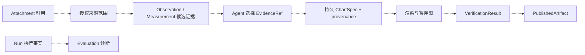

# Figura 系统总览

> 更新日期：2026-09-28。范围：新 Figura 的当前工作树 `src/figura/`。代码、主规格、归档记录、目标设计和旧 `chartagent` 分别标记。本文是入口；组件内部流程与完整字段见按领域划分的专题文档。

## 1. 一眼看懂 Figura

Figura 接收用户文本和图像，创建可恢复的 Run，让 Agent 调用模型与工具。一个 Session 中后续 Run 会从较早终态 Run 的持久事实重建完整对话。**当前新 Figura 已有内部 ReAct、跨 Run 对话投影、显式图像加载与 Panel 分割、本地 HTTP/SSE Gateway 和 React 网页入口**。测量、证据选择、生产图表生成、验证、发布与评测链尚未实现；仓库中的 `src/chartagent/` 是旧系统，不能把其能力画作新 Figura 的已运行组件。

```mermaid
flowchart LR
    UI[Web: React 界面] -->|FiguraClient / Workspace API| Gateway[Web: 本地 Gateway]
    Gateway -->|Session、Run 查询与创建| Runtime[Runtime]
    Gateway -->|图片上传、列表、内容读取| Attach[Sources]
    Attach -->|Session 附件元数据| Runtime
    Attach -->|私有附件图像| Files[(私有图片文件)]
    Gateway -->|Panel 列表与 PNG 读取| Panels[Panels]
    Panels -->|Panel 元数据| DB[(Figura SQLite)]
    Panels -->|独立 Panel PNG| Files
    Gateway -->|异步提交已持久化 Run| Dispatcher[Run Dispatcher]
    Dispatcher -->|execute(session_id, run_id)| Agent[Agent]
    Gateway -->|本地配置可用性| Provider[Provider Boundary]
    Runtime -->|RunState、Checkpoint| Agent[Agent]
    Agent -->|读取较早的终态 RunState| Runtime
    Agent -->|当前 Run 与较早 Run 的事实| Memory[Memory]
    Memory -->|完整有序角色消息| Agent
    Runtime -->|Run 输入与已提交工具事实| ImageState[RunExecutionState]
    Panels -->|Panel 记录| ImageState
    ImageState -->|附件清单与已提交 Panels| Agent
    Agent -->|ProviderRequest| Provider[Provider]
    Provider -->|ProviderResponse| Agent
    Agent -->|image load / decomposition calls| Tools[Tools]
    Tools -->|按 Session 读取附件| Attach
    Tools -->|按 Session 读取 Panel / 写入 Panel| Panels
    Tools -->|ToolExecutionResult| Agent
    Agent -->|执行事实、Attempt、终态| Runtime
    Runtime -->|SQLite Run 事实与事件| DB
    Runtime -->|安全 Session / Run / Event 投影| Gateway
    Gateway -->|JSON / SSE| UI
    Chart[Charts: ChartSpecData] -.->|尚未接入组装工具与 Run| Agent
```

实线是当前新 Figura 的工作树路径；虚线表示已实现的 ChartSpecData 尚未接入 Agent 与 Run。规划能力另见[第 4 节](#4-规划能力与边界)。Web Gateway 只公开安全投影，并通过有界异步 Dispatcher 进入 Agent；当前 Registry 提供 `load_image` 和 `decompose_chart_image`，不包含测量或生产图表工具。Run Runtime 的执行事实是恢复依据；Agent 的 Session Memory 是从这些事实重建的只读调用期投影，没有独立消息表。Gateway 的会话消息投影则只展示持久用户输入与已接受最终答案，两者用途不同。事件只是安全投影。每次模型请求都含有调用期附件/Panel 清单；原图和 Panel 图像字节只在最近已提交工具批次显式加载后进入当前 Provider 请求，Run 输入仍只保存附件 ID。

## 2. 大组件与下钻入口

| 组件 | 职责与跨组件交付 | 当前状态 | 内部文档 |
|---|---|---|---|
| Runtime | Session、Run、执行事实、Attempt、Checkpoint、生命周期事件；交付可恢复 `RunState` 和同 Session 较早 Run 的一致快照；每 Session 至多一个 running Run | 当前已实现 | [Runtime](figura/runtime.md) |
| Sources | 负责 Session 附件的验证、私有保存与授权读取 | 当前工作树已实现附件能力 | [Sources](figura/sources.md) |
| Panels | 保存每个分区的不可变元数据和独立 PNG；从 Run 输入及已提交工具结果重建图像清单 | 当前工作树已有实现；change 尚未归档 | [Panels](figura/panels.md) |
| Agent | 按 checkpoint 组装请求、协调模型和工具、提交结果与终态；由 Gateway Dispatcher 异步调用 | 当前工作树已实现同步 ReAct、图像清单和显式图像加载 | [Agent 编排](figura/agent.md) |
| Memory | 从同 Session 的 Run 事实构建完整角色消息；无独立持久化、裁剪或摘要 | 当前已实现 Session 对话投影 | [Memory](figura/memory.md) |
| Provider | 选择固定 provider/model，归一化请求、响应和安全失败 | 已实现 Qwen、DeepSeek、MiMo | [Provider](figura/provider.md) |
| Tools | 版本化定义、参数/结果校验及 handler；执行事实归 Runtime | 当前 Registry 提供 `load_image` 与 `decompose_chart_image` | [Tools](figura/tools.md) |
| Validation | 有界 JSON 与受支持 Schema 子集的校验，供多个领域消费 | 已实现基础校验 | [Validation](figura/validation.md) |
| Web | 本地 Gateway、Session/Run/Panel HTTP API、安全历史投影和 SSE；前端经 Figura client 复用工作区 UI | 当前已实现 Panel 读取与预览；尚无测量或图表生成接口 | [Web](figura/web.md) |
| Charts | 当前提供单图内容值 `ChartSpecData`、解析、校验和规范序列化 | Core 已实现，主规格已同步，change 已归档；后续图表链未实现 | [Charts](figura/charts.md) |

## 3. 跨组件内容流

1. **网页输入与身份**：React Figura UI 通过 `FiguraClient` 调用 loopback Gateway。Gateway 创建/列出 Session，并委托 Attachment Service 上传、读取和删除图片；Run 创建只提交文本、有序附件 ID、provider ID 与幂等键。Runtime 先处理幂等重放，再拒绝同 Session 的第二个 running Run；成功时校验附件归属并保存输入、初始 checkpoint、Run 和创建事件。图片字节留在私有文件中。见[网页边界](figura/web.md)、[运行时](figura/runtime.md#2-内部流转)和[附件](figura/sources.md#2-内部流转)。
2. **重建 Session 对话**：每次模型动作前，Agent 向 Runtime 读取目标 Run 之前的终态 RunState；Runtime 在一个 SQLite 读快照中按 ordinal 排序并检查范围与完整性。Session Memory 将历史 Run 以及当前 Run 的已提交前缀投影为完整 user/assistant/tool 消息。见[Session Memory](figura/memory.md#3-内部流转与失败边界)。
3. **组装模型请求**：Agent 从 Run 输入和同 Session 较早 Run 输入构建有序、去重的附件清单，并从成功的 `decompose_chart_image` 结果重建已提交 Panels。每次模型请求先附加文本清单；只有紧接前一次请求且已提交的工具批次中成功 `load_image` 的图像，才以 ImageBlock 加入请求。Agent 校验完整 ProviderRequest；不裁剪历史，超出 Provider 硬限制时在 attempt claim 前失败。见[Agent 编排](figura/agent.md#2-内部流转)和[Panels](figura/panels.md#2-内部流转)。
4. **工具与恢复**：Tool Runtime 校验并执行 `load_image` 或 `decompose_chart_image`；Panels 保存分割后的 PNG 与元数据，Runtime 记录工具调用和结果事实。Panel 仅在对应成功 ToolResultFact 提交后进入清单和网页投影。分割是带 call-scoped 幂等键的本地写入；其余不确定工具效果不会由 Agent 自动重放。Gateway 启动时按稳定顺序发现 running Runs，并交给同一 Dispatcher/Agent 恢复路径。分别见[Tool 调用](figura/tools.md#2-内部流转)和[运行时恢复](figura/runtime.md#2-内部流转)。
5. **返回网页**：Gateway 从 Runtime 读取 Session snapshot、Run history 和安全事件，再投影 JSON/SSE；Session-scoped Panel 路由只返回成功工具结果对应的元数据和 `image/png`。Conversation 按 Run 展示 Panel 懒加载预览，同时不把 Agent 的完整 Session Memory、工具消息或 Provider continuation 暴露为普通对话。详见[网页端边界](figura/web.md)。
6. **图表链**：当前 `ChartSpecData` 能表达并验证单图内容，但尚不保存为 Run 图表对象，也没有来源证据、渲染、验证或发布连接。[规划能力](#4-规划能力与边界)只画为目标关系，不属于上述实线路径。

## 4. 规划能力与边界

下表和虚线图只说明[架构设计草案](figura-architecture-design.md)中的目标，不把规划对象算作当前新 Figura 的运行组件。独立合同落地时，应先判断领域 owner，再在现有领域文档扩展或新增简短领域名的子文档。

| 目标能力 | 新 Figura 当前状态 | 需要明确的合同 |
|---|---|---|
| Observation、Measurement、Evidence | 尚无生产工具与对应持久事实 | 候选观察和测量、Agent 明确选证及证据生命周期 |
| 持久 ChartSpec 与来源 | 目前只有纯内容值 `ChartSpecData` | 带身份的图表对象、确切内容版本、来源与证据引用 |
| 生成图、验证与发布 | 尚无渲染、验证或发布服务 | 暂存图与 ChartSpec 绑定、验证结果、幂等发布身份 |
| Evaluation | 尚无新 Figura 评测适配 | 从权威 Run 事实生成诊断，避免另建在线事实来源 |



Panel 已在当前工作树实现；字段和生命周期见[Panels](figura/panels.md)，该 change 尚未归档。架构草案中的 Observation、Measurement、Evidence、图表 provenance、渲染、验证与发布仍是规划能力。测量输出是候选证据，不自动成为图表事实。旧 `src/chartagent/` 有部分对应实现，其对象身份、字段和存储不能直接视作新 Figura 合同。

## 5. 阅读与状态规则

查**完整字段**时，从组件表进入该合同的 owner 专题；跨领域使用者只链接并解释消费方式。专题边界由模型的语义、权威 owner、生命周期和不变量决定，后续出现独立领域时增建子文档，不能按调用链强行合并。嵌套值、联合 payload、枚举和字段来源在所属专题展开。查长期完整产品构想时，参阅[Figura 架构设计草案](figura-architecture-design.md)，其中未实现部分不自动成为当前合同。

当前主规格位于 `openspec/figura/openspec/specs/`。Web 的 Gateway/Client 主规格及 ChartSpec Core 主规格已存在；`connect-figura-web-frontend` 与 `add-figura-chartspec-core` 均位于归档目录。它们的完成状态不代表规划中的证据、渲染或发布链已实现。旧系统代码与规格分别位于 `src/chartagent/` 和 `openspec/chartagent/`，只在迁移或兼容性分析中对照。
