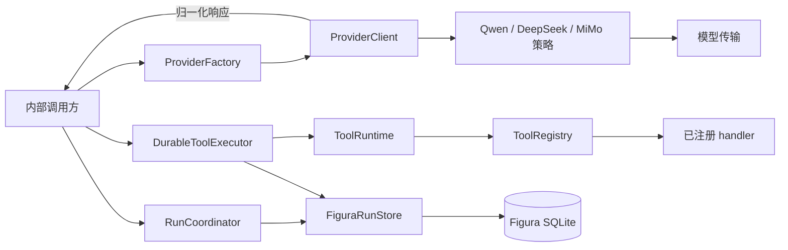

# Figura 实现总览

> 更新日期：2026-09-27。范围：当前工作树中的 `src/figura/`；OpenSpec 的同步与归档状态单独列出。本文记录实现现状，详细行为合同见 [Figura 主规格](../openspec/figura/openspec/specs/)。

## 1. 当前边界

Figura 目前提供可独立调用的模型 Provider、工具执行设施、SQLite Run 核心和耐久工具执行。调用方需要自行串联模型调用与 Run 提交；完整 Agent ReAct 循环尚未建立。

| 能力 | 当前状态 | 入口 |
|---|---|---|
| Qwen、DeepSeek、MiMo 模型调用 | 已实现；显式选择固定 provider/model | `src/figura/providers/` |
| 工具定义、注册、参数校验与调用 | 已实现；尚无 Figura 业务工具集合 | `src/figura/tools/` |
| Session/Run、执行事实、checkpoint、生命周期事件 | 已实现；SQLite schema v3 | `src/figura/runtime/coordinator.py`、`store.py` |
| 耐久工具执行、未知结果恢复 | 已实现；按工具声明的 `replay_effect` 处理 | `src/figura/runtime/tool_execution.py` |
| Provider continuation 随 Run 保存 | 当前工作树已实现；对应 change 仍在活动目录 | `src/figura/runtime/models.py`、`_codec.py`、`store.py` |
| Agent ReAct 循环、Figura Gateway/前端接入 | 尚未实现 | 后续 change |

## 2. 组件与关系

| 组件 | 职责与输入 → 输出 | 源码入口 |
|---|---|---|
| ProviderFactory / ProviderClient | 校验显式 provider/model 与服务配置；请求 → 归一化 `ProviderResponse` 或安全错误 | `src/figura/providers/client.py`、`adapters/` |
| ToolRegistry / ToolRuntime | 冻结工具定义与版本；`ToolInvocation` + `ToolContext` → 有界 `ToolExecutionResult` | `src/figura/tools/registry.py`、`runtime.py` |
| RunCoordinator | 校验创建/推进请求；调用 Store 原子提交 Run 与模型事实 | `src/figura/runtime/coordinator.py` |
| DurableToolExecutor | 按已提交工具调用顺序记录 attempt、执行 handler、提交结果或恢复未知状态 | `src/figura/runtime/tool_execution.py` |
| FiguraRunStore | Session/Run、执行事实、continuation、checkpoint、事件与幂等映射的持久化和一致性校验 | `src/figura/runtime/store.py` |

这里的“内部调用方”代表应用层调用代码，当前没有 Figura Gateway 或自动 ReAct 调度器。ProviderClient 不直接写 Run；模型响应由调用方交给 RunCoordinator 提交。

## 3. 核心数据归属

| 对象 / 核心字段 | Owner 与用途 | 存储及对外边界 |
|---|---|---|
| `ProviderRequest.provider_id`、`model_id`、`instructions`、`messages`、`tools`、`options` | Provider 层定义单次调用输入；固定配对为 `qwen/qwen3.8-flash`、`deepseek/deepseek-flash`、`mimo/mimo-v2.6-flash` | 调用期对象；凭据和 endpoint 留在服务端配置。见 `providers/models.py`、`config.py` |
| `ProviderResponse.assistant_content`、`tool_calls`、`finish_reason`、`usage`、`continuation` | Provider 层归一化返回；`continuation` 为私有后续调用数据 | `to_public_dict()` 排除 continuation；持久化由 Runtime 显式提交。见 `providers/models.py` |
| `ToolDefinition.name`、`parameters_schema`、`result_schema`、`replay_effect`、`handler` | ToolRegistry 拥有版本化可调用集合；ToolRuntime 校验输入、输出和安全错误 | 定义在进程内；`replay_effect` 决定未知 attempt 的恢复路径。见 `tools/contracts.py` |
| `Session.session_id`、`name`、时间字段；`Run.run_id`、`session_id`、`status`、`provider`、`model`、终态字段 | RunCoordinator 发起变更，FiguraRunStore 保存唯一 Run 生命周期 | `sessions`、`runs`；`Run.to_public_dict()` 只投影安全摘要。见 `runtime/models.py`、`store.py` |
| `RunInput.text`、`attachment_ids`、`requested_provider`、`requested_model` | 初始 `ExecutionRecord` 的 input payload | 当前创建入口只接受文本；非空 `attachment_ids` 被拒绝。见 `runtime/coordinator.py` |
| `ExecutionRecord.record_id`、`record_sequence`、`record_kind`、`payload` | Store 按 Run 追加 input、model_response、final_answer 事实 | `run_execution_records`；私有 payload 不直接作为公开事件。见 `runtime/models.py`、`store.py` |
| `ModelResponseFact.continuation_ref`；`ProviderContinuationFact.continuation_id`、`response_record_id`、`provider_id`、`format_version`、`reasoning_content` | 模型响应引用同一 Run、同一 response 的私有 continuation | `run_provider_continuations` 随模型事实原子写入；内部 `RunState.provider_continuations` 可恢复，公开摘要和事件不含原文。见 `runtime/_codec.py`、`store.py` |
| `ToolExecutionFact.tool_sequence`、`fact_kind`、`payload` | Store 保存 tool_call、tool_attempt_started、tool_result；Executor 推进执行 | `run_tool_execution_facts`；结果与 checkpoint 原子提交。见 `runtime/models.py`、`tool_execution.py` |
| `ExecutionCheckpoint.revision`、两个 committed sequence、`next_action` | Store 保存 Run 的唯一推进点；revision 用于拒绝过期提交 | `run_execution_checkpoints`；`next_action` 为 model/tool_execution/tool_attempt/final。见 `runtime/models.py`、`store.py` |
| `RunStreamEvent.event_sequence`、`event_kind`、`payload`；创建幂等键摘要 | Store 保存有界生命周期事件和 Session 范围的创建幂等映射 | `run_stream_events`、`run_idempotency`；当前无 Figura SSE Gateway。见 `runtime/store.py` |

## 4. 关键流转

1. **创建 Run**：RunCoordinator 校验文本、显式 provider/model 和可用性；Store 在一个事务中写入 Run、input fact、初始 checkpoint、创建事件及幂等映射。同一 Session 内相同键与相同请求返回原 Run，冲突请求报错。
2. **模型响应**：调用方获取 `ProviderResponse` 后传给 RunCoordinator。Store 校验 Run 身份与 checkpoint revision，在一个事务中写入 model_response、可选 continuation、按顺序排列的 tool_call facts 和下一动作。无工具调用时下一动作为 final。
3. **工具执行**：DurableToolExecutor 取得 Run 锁，先持久化 attempt 再调用 ToolRuntime；工具参数和结果受 schema、大小及错误边界约束。工具结果与 checkpoint 一起提交，随后继续处理同批调用。
4. **未知工具结果**：`replay_safe` 可重放；`idempotent_local_write` 使用稳定幂等键重放；`reconcile_required` 保持等待可信核对。单纯读取 Run 不触发工具执行。
5. **结束 Run**：在可完成的 checkpoint 上提交 final_answer 并转为 completed；失败或中断通过唯一终态变更保存安全错误和生命周期事件。当前尚无自动循环来调用这些步骤。

## 5. 规格、change 与待完成

主规格：[model-provider](../openspec/figura/openspec/specs/model-provider/spec.md) · [tool-runtime](../openspec/figura/openspec/specs/tool-runtime/spec.md) · [run-execution-core](../openspec/figura/openspec/specs/run-execution-core/spec.md) · [durable-tool-execution](../openspec/figura/openspec/specs/durable-tool-execution/spec.md) · [provider-continuation-persistence](../openspec/figura/openspec/specs/provider-continuation-persistence/spec.md)。

已归档的四个基础 change：[model-client](../openspec/figura/openspec/changes/archive/2026-09-26-add-figura-model-client/proposal.md) · [tool-runtime](../openspec/figura/openspec/changes/archive/2026-09-26-add-figura-tool-runtime/proposal.md) · [run-execution-core](../openspec/figura/openspec/changes/archive/2026-09-26-add-figura-run-execution-core/proposal.md) · [durable-tool-execution](../openspec/figura/openspec/changes/archive/2026-09-26-add-figura-durable-tool-execution/proposal.md)。[provider-continuation-persistence](../openspec/figura/openspec/changes/add-figura-provider-continuation-persistence/proposal.md) 当前仍为活动 change；任务 15/15 勾选，代码和主规格已存在于当前工作树，尚未归档。

下一阶段的主要空白是 Agent ReAct 调度、模型历史组装、具体业务工具、附件与图表工作流，以及 Figura Gateway/前端接入。它们可参考 [Figura 设计草案](figura-architecture-design.md)，但该草案不代表已实现。

本次依据当前代码、主规格及 `openspec list/status --store figura` 核对文档；本次未运行应用测试。
