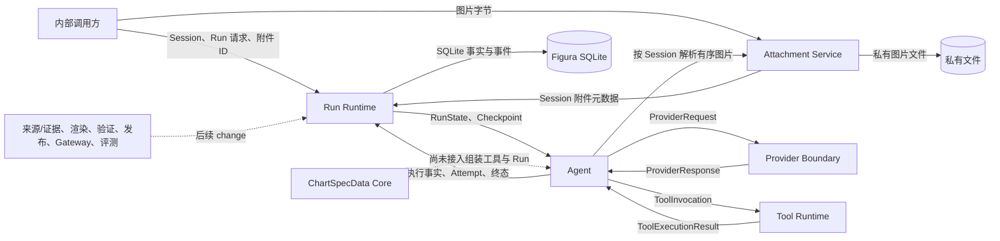

# Figura 系统总览

> 更新日期：2026-09-27。范围：新 Figura 的当前工作树 `src/figura/`。代码、主规格、归档记录、目标设计和旧 `chartagent` 分别标记。本文是入口；组件内部流程与完整字段见按领域划分的专题文档。

## 1. 一眼看懂 Figura

Figura 接收用户文本和图像，创建可恢复的 Run，让 Agent 调用模型与工具。目标产品链还包括来源观察、证据选择、图表组装、渲染、验证和发布。**当前新 Figura 已落地内部文本/图像 ReAct 与耐久执行基础**。新 Figura 尚无 Gateway/前端入口、生产图表工具、图像发布与评测链；仓库中的 `src/chartagent/` 是旧系统，不能把其能力画作新 Figura 的已运行组件。

实线是当前新 Figura 的内部路径；虚线表示未接入的 ChartSpecData 或仅在目标设计中的能力。Run Runtime 的执行事实是恢复依据；事件只是安全投影。模型请求中的 `ImageBlock` 是调用期内容，Run 输入只保存附件 ID。

## 2. 大组件与下钻入口

| 组件 | 职责与跨组件交付 | 当前状态 | 内部文档 |
|---|---|---|---|
| Run Runtime | Session、Run、执行事实、Attempt、Checkpoint、生命周期事件；交付可恢复 `RunState` | 当前工作树已实现 | [运行时与恢复](figura/runtime.md) |
| Attachment Service | 验证并私有保存 Session 图片；交付经 Session 校验的 `ImageBlock` | 已实现，未接 Gateway/前端 | [附件与来源边界](figura/attachments.md) |
| Agent | 按 checkpoint 组装请求、协调模型和工具、提交结果与终态 | 已实现内部同步 ReAct | [Agent 编排](figura/agent.md) |
| Provider Boundary | 选择固定 provider/model，归一化请求、响应和安全失败 | 已实现 Qwen、DeepSeek、MiMo | [Provider 集成](figura/provider.md) |
| Tool Runtime | 版本化定义、参数/结果校验及 handler；执行事实归 Runtime | 基础设施已实现，无生产图表工具 | [Tool 能力与调用](figura/tools.md) |
| 共享 JSON Schema 合同 | 有界 JSON 与受支持 Schema 子集的校验，供多个领域消费 | 已实现基础校验 | [共享验证合同](figura/shared-validation.md) |
| ChartSpecData Core | 单图内容值、解析、校验和规范序列化 | 当前工作树有未提交代码；change 已移入未提交归档目录，主规格已出现 | [图表内容模型](figura/chartspec.md) |
| 来源、证据、产物与发布 | 观察、选证、渲染、验证、发布 | 新 Figura 尚未实现 | [后续能力边界](figura/future-boundaries.md) |
| Gateway、前端与评测 | 对外输入、事件投影、可视化和诊断 | 新 Figura 尚未实现；旧系统另有实现 | [后续能力边界](figura/future-boundaries.md) |

## 3. 跨组件内容流

1. **输入与身份**：内部调用方创建 Session、上传图片，再用文本与有序 `attachment_ids` 创建 Run。Runtime 在创建事务中校验附件同属 Session，保存 `RunInput`、初始 `ExecutionCheckpoint`、Run 和创建事件；图片字节留在私有文件中。见[运行时](figura/runtime.md#2-内部流转)和[附件](figura/attachments.md#2-内部流转)。
2. **模型轮次**：Agent 从已提交的 `RunState` 重建历史，Attachment Service 把引用图片解析为调用期 `ImageBlock`，工具 Registry 投影为模型可见定义。Provider 返回规范化 `ProviderResponse` 后，Runtime 提交响应、continuation、工具调用意图、Attempt 结论与下一 checkpoint。分别见[Agent 编排](figura/agent.md#2-内部流转)、[Provider 合同](figura/provider.md#2-内部流转)。
3. **工具与恢复**：Tool Runtime 校验并执行 handler；Runtime 单独记录调用、启动和结果。已启动但结果不明的工具效果不会由 Agent 自动重放；已启动但未提交响应的 Provider attempt 也不会自动重发。分别见[Tool 调用](figura/tools.md#2-内部流转)和[运行时恢复](figura/runtime.md#2-内部流转)。
4. **图表链**：当前 `ChartSpecData` 能表达并验证单图内容，但尚不保存为 Run 图表对象，也没有来源证据、渲染、验证或发布连接。目标链见[后续能力边界](figura/future-boundaries.md)，不属于上述实线执行图。

## 4. 阅读与状态规则

查**完整字段**时，从组件表进入该合同的 owner 专题；跨领域使用者只链接并解释消费方式。专题边界由模型的语义、权威 owner、生命周期和不变量决定，后续出现独立领域时增建子文档，不能按调用链强行合并。嵌套值、联合 payload、枚举和字段来源在所属专题展开。查长期完整产品构想时，参阅[Figura 架构设计草案](figura-architecture-design.md)，其中未实现部分不自动成为当前合同。

当前主规格位于 `openspec/figura/openspec/specs/`。`add-figura-chartspec-core` 已从活动列表消失，归档目录和主规格均在当前未提交工作树中；这不代表后续持久 ChartSpec 或渲染链已实现。旧系统代码与规格分别位于 `src/chartagent/` 和 `openspec/chartagent/`，只在迁移或兼容性分析中对照。
