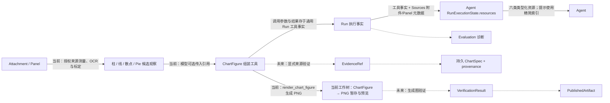

# Figura 系统总览

> 更新日期：2026-10-06。范围：新 Figura 的当前工作树 `src/figura/`。代码、主规格、归档记录、活动 change、目标设计和旧 `chartagent` 分别标记。本文是入口；组件内部流程与完整字段见按领域划分的专题文档。

## 1. 一眼看懂 Figura

Figura 接收用户文本和图像，创建可恢复的 Run，让 Agent 调用模型与工具。一个 Session 中后续 Run 从持久事实重建完整规范历史；容量已配置且本地估算达到阈值时，模型请求可使用有来源引用的旧历史摘要和近期原始尾部，摘要不会替代或删除原事实。模型也可通过历史工具按引用搜索、读取旧消息、工具结果、资源元数据，或显式加载历史图像。**当前工作树已有内部 ReAct、跨 Run 对话投影、按上下文占比触发的旧历史压缩、来源可追溯的摘要、历史按需检索与图像读取、图像加载与 Panel 分割、独立 OCR、四类图表测量、ChartFigure 组装与 PNG 渲染工具，以及最近模型请求的本地上下文估算；网页已有协作停止、工具时间线、整会话删除、所有成功生成图的大图查看和 PNG 下载。**普通模型请求由 Agent 提供稳定规则、当前工具目录、可选历史摘要与资源/异常状态索引；规范会话消息与按需图像仍单独组装。普通稳定规则仍按四份资产的原顺序加载，额外摘要请求独立读取 `compaction.md`；工具字段解释在原生 Schema，透明像素按白底合成并排除全透明内容。稳定规则按用户目标选择证据和动作，并说明观察、图表构建与答复边界；详细规则见 [Agent 专题](figura/agent.md#提示分层与代码职责)。Agent 将目标 Run 已提交前缀、较早终态 Run 的事实与 Sources 元数据重建为调用期 `RunExecutionState` 完整资源目录；只有近期历史、摘要来源或当前动作相关的资源定位信息进入提示，其余内容仍可通过历史工具读取。目录不持久化；完整工具输入/结果仍来自 Runtime 通用工具事实，图片文件由 Sources 管理。估算只提供占比并触发可选压缩，不是请求准入或 Run 输出预算。通用证据生命周期、生成图验证、发布与评测链尚未实现。仓库中的 `src/chartagent/` 是旧系统，不能把其能力画作新 Figura 的已运行组件。

当前新生成的历史摘要采用字段化分层合同，将目标、约束、决定、事实、进度状态、问题、资源和未接受提议分别保存；每项保留授权来源引用。已有 checkpoint 可继续读取；下一次压缩时按来源整理为完整分层摘要，不增加数据库字段。

```mermaid
flowchart LR
    UI[Web: React 界面] -->|FiguraClient / Workspace API| Gateway[Web: 本地 Gateway]
    Gateway -->|Session、Run 查询、创建、停止请求与整会话删除| Runtime[Runtime]
    Gateway -->|附件/Panel 操作与 ChartFigure PNG 内容读取| Sources
    Sources -->|附件与 Panel 元数据| DB[(Figura SQLite / storage)]
    Sources -->|私有附件、独立 Panel 与 ChartFigure PNG| Files[(私有图片文件)]
    Gateway --> Delete[Web: Session 删除协调]
    Delete -->|同一事务删除 Session 聚合| Runtime
    Delete -->|暂存 / 回滚恢复 / 提交清理| Sources
    Gateway -->|异步提交、启动恢复与周期补偿| Dispatcher[Run Dispatcher]
    Dispatcher -->|扫描持久 running Run| Runtime
    Dispatcher -->|execute(session_id, run_id)| Agent[Agent]
    Gateway -->|本地配置可用性| Provider[Provider Boundary]
    Runtime -->|RunState、请求绑定、重试到期时间、停止请求与私有续接| Agent
    Agent -->|读取较早的终态 RunState| Runtime
    Agent -->|当前 Run 与较早 Run 的事实| Memory[Memory]
    Runtime -->|Session 摘要检查点与压缩操作| Agent
    Memory -->|规范历史与异常终态投影| Agent
    Agent -->|模型选定的历史读取工具调用| Tools[Tools]
    Tools -->|search_history / read_history| Memory
    Tools -->|read_resource_image| Reader[RunExecutionImageReader]
    Runtime -->|Run 输入与已提交工具事实| Catalog[Agent RunExecutionStateService]
    Sources -->|附件元数据与 Panel 记录| Catalog
    Catalog -->|完整 resources: Attachment / Panel / OCR / Measurement / ChartFigure / ChartRender| Agent
    Agent -->|最新工具批次中需回看的类型化图像引用| Reader
    Gateway -->|授权读取成功 OCR / 测量观察图| Reader
    Reader -->|授权读取 Attachment / Panel / ChartRender| Sources
    Reader -->|原图、观察标注图或 ChartRender PNG| Agent
    Reader -->|按需返回观察图 PNG| Gateway
    Agent -->|稳定规则、工具目录、可选摘要与资源索引 + 当前历史/所需图像| Provider[Provider]
    Provider -->|ProviderResponse| Agent
    Agent -->|图像 / OCR / 测量 / assemble / render 工具调用| Tools
    Tools -->|ChartSpec / ChartFigure 校验与绘图| Chart[Charts]
    Chart -->|校验结果与 PNG 字节| Tools
    Tools -->|读取来源或保存渲染 PNG| Sources
    Tools -->|ToolExecutionResult| Agent
    Agent -->|执行事实、Attempt、终态| Runtime
    Runtime -->|Session、Run 事实与事件| DB
    Runtime -->|安全 Session / Run / Event 投影| Gateway
    Catalog -->|仅构造安全渲染摘要| Gateway
    Gateway -->|受授权渲染内容读取| Sources
    Gateway -->|JSON / SSE / 授权 PNG 预览与下载| UI
```

图中的完整资源目录是 Agent 从已提交事实重建的调用期投影，不是 Runtime 的持久字段或额外结果存储。模型请求可只投影近期与摘要来源相关的资源定位信息；服务端仍保留授权前缀内的完整目录，Agent 可通过历史工具继续查找。OCR/测量/组装/渲染完整结果仍由通用 ToolResultFact 保留，ChartFigure 完整值从其成功调用事实恢复，渲染 PNG 保存在 Sources。来源引用定位规范事实，不复制事实权威。Web 的工具时间线也只从已提交工具事实生成摘要与详情；`run_progress` 事件用于提示前端重新读取，不承载工具结果。各 change 的当前状态见[第 5 节](#5-阅读与状态规则)；领域合同见 Agent、Runtime、Memory、Tools、Sources 与 Web 专题。

## 2. 大组件与下钻入口

| 组件 | 职责与跨组件交付 | 当前状态 | 内部文档 |
|---|---|---|---|
| Runtime | Session、Run、执行事实、Attempt、Checkpoint、上下文摘要检查点与压缩操作、生命周期与进度事件；交付可恢复 `RunState` 和同 Session 较早 Run 的一致快照；每 Session 至多一个 running Run | 当前工作树已实现；schema v12；持久 Provider 请求绑定/重试、上下文摘要 CAS、单动作执行所有权、停止请求、受控 Session 删除与安全终态说明 | [Runtime](figura/runtime.md) |
| Sources | 管理 Session 附件与 Panel 元数据、私有附件/Panel 图像和 ChartFigure PNG 文件、图像验证/处理和授权读取；与 Runtime 共用一份 SQLite | 已实现；渲染 PNG 只存私有文件，无独立元数据表；整会话删除含文件暂存、恢复与启动对账 | [Sources](figura/sources.md) |
| Agent | 按 checkpoint 组装请求、决定是否请求压缩、协调模型与工具、提交结果与终态；从 Run 事实和 Sources 元数据重建类型化资源目录 | 当前工作树已实现 ReAct、摘要生成调用、历史/资源提示投影、源响应续接重放与 prepare→claim→dispatch；压缩失败沿完整历史路径 fallback | [Agent 编排与资源目录](figura/agent.md) |
| Memory | 从同 Session 的 Run 事实构建规范历史、异常终态与来源引用；提供只读搜索、完整内容读取和资源元数据定位 | 当前工作树实现来源可寻址历史检索；摘要检查点由 Runtime 持久化，Memory 不另存历史副本 | [Memory](figura/memory.md) |
| Provider | 选择固定 provider/model，归一化请求、响应和安全失败；估算实际输入、上下文容量和网络故障分类 | 已实现 Qwen、DeepSeek、MiMo；容量是可选配置；估算可参与 Agent 阈值判断；重试由 Agent/Runtime 协作完成 | [Provider](figura/provider.md) |
| Tools | 版本化定义、参数/结果校验及 handler；执行事实归 Runtime | 当前工作树 `figura-web-v8` 保留 12 个工具，补齐工具/参数语义，收窄历史图像引用并统一透明像素观察；历史读取不执行旧工具 | [Tools](figura/tools.md) |
| Shared / Validation | 被多个能力复用的 JSON Schema 校验与图像大小限制 | 当前已实现 | [Validation](figura/validation.md) |
| Storage | 一份 SQLite 的连接、事务和 schema 初始化；由 Runtime 与 Sources 共用 | 当前已实现 | [Runtime](figura/runtime.md)、[Sources](figura/sources.md) |
| Web | 本地 Gateway、Session/Run/Panel/ChartFigure 渲染内容与工具时间线只读 HTTP API、安全历史投影和 SSE；前端经 Figura client 复用工作区 UI | 当前工作树已实现协作停止、周期恢复调度、活动状态补读、会话删除与图片/工具时间线；详情与观察图按需读取 | [Web](figura/web.md) |
| Charts | `ChartSpecData` 单图值与 `ChartFigure` 多图画布值，严格解析、规范序列化、纯校验和 PNG 绘制 | 已实现；单图与画布分属 `chartspec/`、`chartfigure/`；绘图按实际文字布局，越界/重叠失败，pie 显示百分比 | [Charts](figura/charts.md) |

## 3. 跨组件内容流

1. **网页输入与身份**：React Figura UI 通过 `FiguraClient` 调用 loopback Gateway。Gateway 创建/列出 Session，并提供确认后的整会话删除；删除须无 running Run，在同一 SQLite 事务与 Sources 文件暂存流程中清除该 Session 内容。Gateway 委托 Sources 上传、读取和删除附件，或读取 Panel；Run 创建只提交文本、有序附件 ID、provider ID 与幂等键。Runtime 先处理幂等重放，再拒绝同 Session 的第二个 running Run；成功时校验附件归属并保存输入、初始 checkpoint、Run 和创建事件。图片字节留在私有文件中。见[网页边界](figura/web.md)、[运行时](figura/runtime.md#2-内部流转)和[Sources](figura/sources.md#2-内部流转与不变量)。
2. **重建 Session 对话**：每次模型动作前，Agent 向 Runtime 读取目标 Run 之前的终态 RunState。Memory 从 Run 事实重建规范闭合历史与异常 outcome；若有有效摘要检查点，普通请求会以摘要替代其覆盖的旧原始消息，并保留之后的 raw tail。规范历史及原事实始终可按来源引用读取。见[Session Memory](figura/memory.md#3-内部流转与失败边界)。
3. **估算、压缩与组装请求**：Provider 对已准备请求给出本地 token 估算。只有选中模型配置了有效容量且输入估算达到约 80% 时，Agent 才对可压缩的较早完整 Run 发起额外纯文本摘要请求；摘要每条内容都必须带授权消息或工具结果来源引用。普通请求保留当前 Run 输入/已提交前缀和近期 raw tail，并携带摘要及来源索引。Agent 将请求拆为稳定规则、Registry 工具目录、可选摘要索引、精简资源/异常状态索引；原生工具 Schema 仍走 Provider contract。完整六类 `RunExecutionState.resources` 目录始终在服务端可读，提示只包括近期、摘要来源或当前动作相关的资源定位信息。`search_history`/`read_history` 可查读当前 Session 授权前缀的历史消息、工具结果、异常 outcome 与资源元数据；`read_resource_image` 仅在模型明确请求时把授权历史图像加入下一次请求。摘要生成失败不改动已有检查点或 Run 事实，退回完整历史请求路径；完整请求若无法 prepare，则沿原失败路径终结，不静默裁剪。私有 continuation 仍按源响应关联。摘要和普通请求都在 Provider attempt claim 前 prepare，重试沿用既有 request binding。见[Agent](figura/agent.md)、[Provider](figura/provider.md)、[Memory](figura/memory.md)、[Tools](figura/tools.md)和[Runtime](figura/runtime.md)。
4. **工具、渲染与恢复**：Tool Runtime 校验图像/Panel、OCR、四类测量、`assemble_chart_figure` 和 `render_chart_figure`。组装工具委托 Charts 严格解析与语义校验，并检查同 Session 目录中已提交成功的测量引用。渲染工具只接受已提交 Figure；Charts 生成 PNG，Sources 按 `(run_id, call_id)` 私下保存，Runtime 仍沿用通用工具事实持久化调用和结果。Agent 从成功配对事实重建 Figure 与渲染资源；同批次成功 PNG 随后加入下一次 Provider 请求。网页内容路由核对 Session、成功事实、摘要和文件。没有独立 Figure/渲染表。Panel 与渲染文件为幂等本地写，观察和 Figure 组装为 `replay_safe`。分别见[Tool 调用](figura/tools.md#2-内部流转)、[画布组装](figura/tools.md#7-图表画布组装工具)、[图表渲染](figura/tools.md#8-图表渲染工具)、[Charts](figura/charts.md)、[Sources](figura/sources.md)和[Agent 资源目录](figura/agent.md#4-runexecutionstate-资源合同与完整字段)。
5. **返回网页**：Gateway 从 Runtime 读取 Session snapshot、Run history 和安全事件，再投影 JSON/SSE。Run 工具时间线从当前 Run 的 ToolCall、Attempt 和 Result 事实生成；列表先返回有界摘要，详情与 OCR/测量观察图按需读取。持久 `run_progress` SSE 事件只通知前端刷新时间线，不携带工具 payload。Session-scoped Panel 与 ChartFigure 渲染路由只提供成功工具结果对应的 PNG；Run DTO 附加渲染摘要，React Gallery 按渲染所在 Run 懒加载所有成功预览，每张均可打开交互大图并通过同一授权内容路由下载 PNG。Conversation 不把 Agent 的完整 Session Memory、工具消息或 Provider continuation 暴露为普通对话。详见[网页端边界](figura/web.md)。
6. **图表链**：当前有 `ChartSpecData`、`ChartFigure`、纯 PNG renderer、Sources 私有 PNG 文件保存和网页预览；Figure 全文/摘要及渲染调用/结果分别借用 Run 工具调用/结果事实保留，Agent 可跨 Run 从统一资源目录索引成功画布与渲染内容。仍没有单独图表对象表、来源证据模型、生成图验证、发布或 Evaluation。[规划能力](#4-规划能力与边界)标出这些未实现部分。

7. **停止、恢复与后续对话**：停止请求经 Gateway 写入 Runtime 独立控制事务；Agent 在执行 owner 保护下允许已开始动作提交真实结果，随后在边界 interrupted。Dispatcher 启动与周期扫描都从持久 checkpoint 推进；已确认的临时 Provider 错误按同一 binding 最多四次物理 attempt 自动重试。结果未知的请求不会无条件重发，满足条件的纯生成请求仅在旧 owner 已退出时可替换；安全工具沿原调用身份有限恢复。后续 Run 保留闭合交互，将合法未完成末尾批次整体转换为异常上下文；成功资源仍可授权引用，未知调用不会被补造成结果。完整流程见 [Runtime](figura/runtime.md#停止所有权与恢复事务)、[Agent](figura/agent.md#异常-run-推进与后续请求)、[Memory](figura/memory.md#合法异常尾部投影) 和 [Web](figura/web.md#协作停止与客户端生命周期)。

执行策略在当前工作树中已统一：Run 没有累计模型轮次、工具次数、时间或 token 配额；每个逻辑 Provider 请求最多四个物理 attempt（首次加最多三次），只对已分类的临时失败自动重试，工具失败仍由模型决定后续动作。共享执行 JSON 单元默认 32 MiB，图片、事件、隐私、并发和领域保护各自保留。Token 估算不限制请求；只有容量已配置且估算达到约 80% 时才触发可选摘要。上下文估算、压缩和按需检索现已落入当前工作树，并有已归档 change 和同步主规格；无容量/估算失败时不自动压缩，摘要失败则保留完整历史请求路径。字段与边界见 [Provider](figura/provider.md)、[Runtime](figura/runtime.md#providerrequestbinding) 和 [Validation](figura/validation.md)。

## 4. 规划能力与边界

下表和虚线图中的虚线只说明[架构设计草案](figura-architecture-design.md)里尚未实现的目标。当前工作树有四类图表测量、独立 OCR 文字观察、可选多边形范围与有门槛的数值坐标/扇区比例；这些仍是工具候选观察，不等于通用证据域或完整图表事实。独立合同落地时，应先判断领域 owner，再在现有领域文档扩展或新增简短领域名的子文档。

| 目标能力 | 新 Figura 当前状态 | 需要明确的合同 |
|---|---|---|
| 图像文字与图表测量 | 当前工作树 `figura-web-v8` 注册 `extract_text` 和四类 `measure_*`；五种工具均可选传入临时多边形观察范围。OCR 与测量完整结果仍保存在通用 Run 工具事实，并由 Agent 资源目录分别索引为 `ocr`、`measurement`；透明像素解码与可见区域规则已实现，主规格已同步 | 尚无通用 `EvidenceRef`、Agent 显式选证与证据生命周期；候选观察不会自动成为图表事实 |
| 独立图表对象与来源 | 当前 `ChartFigure` 完整 JSON 可随成功 assembly 工具事实跨 Run 保留；尚无独立 ChartFigure 表、修改版本或证据对象 | 是否增加可编辑图表实体、来源绑定和通用证据生命周期 |
| 生成图、验证与发布 | 当前工作树已有 ChartFigure→PNG 绘制、Sources 私有文件保存、Agent 当前批次图像回看及 Web 预览；Chart rendering 主规格已同步且 change 已归档。尚无图表验证或发布服务 | 验证结果、ChartSpec/来源绑定、幂等发布身份 |
| Evaluation | 尚无新 Figura 评测适配 | 从权威 Run 事实生成诊断，避免另建在线事实来源 |



附件与 Panel 目前属于同一个 Sources 能力；渲染 PNG 是按 Run/调用身份保存的私有文件，不新增 Source metadata 模型。模型字段见[Sources](figura/sources.md)，完整资源目录合同见[Agent](figura/agent.md#4-runexecutionstate-资源合同与完整字段)，工具输入输出见[Tools](figura/tools.md#6-图像与测量工具合同)。此前已完成的观察、Figure assembly、渲染、统一资源目录和分层提示 change（包括 `improve-figura-prompt-assets`）以及本次提示润色与透明解码均已归档且主规格已同步。测量引用标识成功工具调用，不证明 ChartSpec 数据值正确；旧 `src/chartagent/` 的身份、字段和存储不能直接视作新 Figura 合同。

## 5. 阅读与状态规则

查**完整字段**时，从组件表进入该合同的 owner 专题；跨领域使用者只链接并解释消费方式。专题边界由模型的语义、权威 owner、生命周期和不变量决定，后续出现独立领域时增建子文档，不能按调用链强行合并。嵌套值、联合 payload、枚举和字段来源在所属专题展开。查长期完整产品构想时，参阅[Figura 架构设计草案](figura-architecture-design.md)，其中未实现部分不自动成为当前合同。

当前主规格位于 `openspec/figura/openspec/specs/`。截至 2026-10-06，本次提示润色、独立摘要资产、工具 Schema 说明与透明像素观察已在当前工作树实现；五份 delta 已与主规格逐项核对并归档至[变更记录](../openspec/figura/openspec/changes/archive/2026-10-06-refine-figura-prompts-and-tool-guidance/design.md)。此前上下文压缩与检索 change 也已归档并同步主规格。归档记录需求演进，不代表代码已提交或发布；实现与主规格修改仍可能处于未提交工作树。旧系统代码与规格分别位于 `src/chartagent/` 和 `openspec/chartagent/`，只在迁移或兼容性分析中对照。


当前实现已接通协作停止、异常历史续用、上下文压缩和渐进式历史读取：Web 保存停止请求，Agent 在 Run owner 保护下完成当前动作并在边界收尾；Gateway 周期扫描补偿无人执行的 running Run。Memory 将合法异常尾部转为来源可寻址的 outcome。摘要覆盖的旧消息仍保留规范事实，可由历史工具搜索并精确读取；历史图像需显式请求，不能仅凭目录自动加载。新增字段和读取合同见 [Runtime](figura/runtime.md)、[Memory](figura/memory.md)、[Agent](figura/agent.md)与[Tools](figura/tools.md)。

上下文能力的当前实现依据见[归档设计](../openspec/figura/openspec/changes/archive/2026-10-05-session-context-compaction/design.md)；本轮已核对其四份 delta 与主规格一致。

### 规格与实现的已知差异

截至 2026-10-06，本次 Agent 执行、图像观察解码、上下文压缩、历史取回与工具运行时的五份 delta 均已同步并归档；本轮核对未发现这些合同与当前工作树实现之间的已知差异。工作树状态不表示代码已提交或发布。


本轮提示、检索、压缩、工具与图像观察合同分别见 [Agent ReAct](../openspec/figura/openspec/specs/agent-react-execution/spec.md)、[历史检索](../openspec/figura/openspec/specs/session-context-retrieval/spec.md)、[上下文压缩](../openspec/figura/openspec/specs/session-context-compaction/spec.md)、[工具运行时](../openspec/figura/openspec/specs/tool-runtime/spec.md)和[图像观察解码](../openspec/figura/openspec/specs/image-observation-decoding/spec.md)主规格。结构与回归测试不证明真实模型遵循效果。
