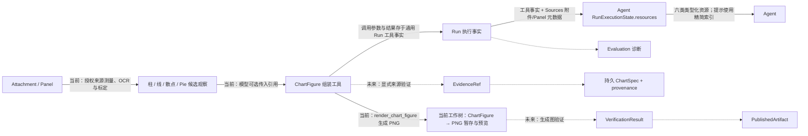

# Figura 系统总览

> 更新日期：2026-10-02。范围：新 Figura 的当前工作树 `src/figura/`。代码、主规格、归档记录、目标设计和旧 `chartagent` 分别标记。本文是入口；组件内部流程与完整字段见按领域划分的专题文档。

## 1. 一眼看懂 Figura

Figura 接收用户文本和图像，创建可恢复的 Run，让 Agent 调用模型与工具。一个 Session 中后续 Run 会从较早终态 Run 的持久事实重建完整对话。**当前工作树已有内部 ReAct、跨 Run 对话投影、图像加载与 Panel 分割、独立 OCR、四类图表测量、ChartFigure 组装与 PNG 渲染工具，网页已有工具时间线、整会话删除、所有成功生成图的大图查看和 PNG 下载。**每次模型请求由 Agent 依次提供稳定规则、当前工具目录和 Run 资源目录三个 SYSTEM 指令块；会话消息与上一工具批次的图像回看仍单独组装。稳定提示规则按用户目标选择证据和动作，并说明观察、图表构建与答复边界；详细规则见 [Agent 专题](figura/agent.md#提示分层与代码职责)。Agent 将目标 Run 已提交前缀、较早终态 Run 的事实与 Sources 元数据重建为调用期 `RunExecutionState` 资源目录，统一索引附件、Panel、OCR、测量、ChartFigure 和 ChartRender。目录不持久化；完整工具输入/结果仍来自 Runtime 通用工具事实，图片文件由 Sources 管理。通用证据生命周期、生成图验证、发布与评测链尚未实现。仓库中的 `src/chartagent/` 是旧系统，不能把其能力画作新 Figura 的已运行组件。

```mermaid
flowchart LR
    UI[Web: React 界面] -->|FiguraClient / Workspace API| Gateway[Web: 本地 Gateway]
    Gateway -->|Session、Run 查询、创建与整会话删除| Runtime[Runtime]
    Gateway -->|附件/Panel 操作与 ChartFigure PNG 内容读取| Sources
    Sources -->|附件与 Panel 元数据| DB[(Figura SQLite / storage)]
    Sources -->|私有附件、独立 Panel 与 ChartFigure PNG| Files[(私有图片文件)]
    Gateway --> Delete[Web: Session 删除协调]
    Delete -->|同一事务删除 Session 聚合| Runtime
    Delete -->|暂存 / 回滚恢复 / 提交清理| Sources
    Gateway -->|异步提交已持久化 Run| Dispatcher[Run Dispatcher]
    Dispatcher -->|execute(session_id, run_id)| Agent[Agent]
    Gateway -->|本地配置可用性| Provider[Provider Boundary]
    Runtime -->|RunState、Checkpoint 与源响应私有续接| Agent
    Agent -->|读取较早的终态 RunState| Runtime
    Agent -->|当前 Run 与较早 Run 的事实| Memory[Memory]
    Memory -->|完整有序角色消息| Agent
    Runtime -->|Run 输入与已提交工具事实| Catalog[Agent RunExecutionStateService]
    Sources -->|附件元数据与 Panel 记录| Catalog
    Catalog -->|resources: Attachment / Panel / OCR / Measurement / ChartFigure / ChartRender| Agent
    Agent -->|最新工具批次中需回看的类型化图像引用| Reader[RunExecutionImageReader]
    Gateway -->|授权读取成功 OCR / 测量观察图| Reader
    Reader -->|授权读取 Attachment / Panel / ChartRender| Sources
    Reader -->|原图、观察标注图或 ChartRender PNG| Agent
    Reader -->|按需返回观察图 PNG| Gateway
    Agent -->|三层 SYSTEM 指令 + 完整历史 + 最新批次图像| Provider[Provider]
    Provider -->|ProviderResponse| Agent
    Agent -->|图像 / OCR / 测量 / assemble / render 工具调用| Tools[Tools]
    Tools -->|ChartSpec / ChartFigure 校验与绘图| Chart[Charts]
    Chart -->|校验结果与 PNG 字节| Tools
    Tools -->|读取来源或保存渲染 PNG| Sources
    Tools -->|ToolExecutionResult| Agent
    Agent -->|执行事实、Attempt、终态| Runtime
    Runtime -->|Session、Run 事实与事件| DB
    Runtime -->|安全 Session / Run / Event 投影| Gateway
    Catalog -->|仅构造安全渲染摘要| Gateway
    Gateway -->|受授权渲染内容读取| Sources
    Gateway -->|JSON / SSE / 授权 PNG 预览与下载| UI
```

图中的资源目录是 Agent 从已提交事实重建的调用期投影，不是 Runtime 的新字段、持久集合或额外结果存储。OCR/测量/组装/渲染完整结果仍由通用 ToolResultFact 保留，ChartFigure 完整值从其成功调用事实恢复，渲染 PNG 保存在 Sources。Web 的工具时间线也只从已提交工具事实生成摘要与详情；`run_progress` 事件用于提示前端重新读取，不承载工具结果。各 change 的当前状态见[第 5 节](#5-阅读与状态规则)；领域合同见 Agent、Runtime、Sources 与 Web 专题。

## 2. 大组件与下钻入口

| 组件 | 职责与跨组件交付 | 当前状态 | 内部文档 |
|---|---|---|---|
| Runtime | Session、Run、执行事实、Attempt、Checkpoint、生命周期与进度事件；交付可恢复 `RunState` 和同 Session 较早 Run 的一致快照；每 Session 至多一个 running Run | 已实现；当前 schema v9，支持受控 Session 整体删除、本地 Provider 准备失败的安全终态说明 | [Runtime](figura/runtime.md) |
| Sources | 管理 Session 附件与 Panel 元数据、私有附件/Panel 图像和 ChartFigure PNG 文件、图像验证/处理和授权读取；与 Runtime 共用一份 SQLite | 已实现；渲染 PNG 只存私有文件，无独立元数据表；整会话删除含文件暂存、恢复与启动对账 | [Sources](figura/sources.md) |
| Agent | 按 checkpoint 组装请求、协调模型和工具、提交结果与终态；从 Run 事实和 Sources 元数据重建类型化资源目录，并统一授权图像读取 | 已实现 ReAct、三层中文提示、六类资源目录、最新工具批次图像回看、源响应续接重放与 prepare→claim→dispatch；最新静态资产补强已归档，代码尚未提交 | [Agent 编排与资源目录](figura/agent.md) |
| Memory | 从同 Session 的 Run 事实构建完整角色消息；无独立持久化、裁剪或摘要 | 已实现完整 Session 对话投影；续接由 Agent 请求边界私下关联，Memory 无该 payload | [Memory](figura/memory.md) |
| Provider | 选择固定 provider/model，归一化请求、响应和安全失败 | 已实现 Qwen、DeepSeek、MiMo；prepare/dispatch 分离，DeepSeek 续接区分缺失、空字符串和 null | [Provider](figura/provider.md) |
| Tools | 版本化定义、参数/结果校验及 handler；执行事实归 Runtime | 当前工作树 `figura-web-v6` 提供 `assemble_chart_figure` 与 `render_chart_figure`；图表渲染 change 已归档且主规格已同步 | [Tools](figura/tools.md) |
| Shared / Validation | 被多个能力复用的 JSON Schema 校验与图像大小限制 | 当前已实现 | [Validation](figura/validation.md) |
| Storage | 一份 SQLite 的连接、事务和 schema 初始化；由 Runtime 与 Sources 共用 | 当前已实现 | [Runtime](figura/runtime.md)、[Sources](figura/sources.md) |
| Web | 本地 Gateway、Session/Run/Panel/ChartFigure 渲染内容与工具时间线只读 HTTP API、安全历史投影和 SSE；前端经 Figura client 复用工作区 UI | 已实现会话删除、Panel/生成图懒加载预览、生成图大图及下载、Run 工具时间线；详情与观察图按需读取 | [Web](figura/web.md) |
| Charts | `ChartSpecData` 单图值与 `ChartFigure` 多图画布值，严格解析、规范序列化、纯校验和 PNG 绘制 | 已实现；单图与画布分属 `chartspec/`、`chartfigure/`；绘图按实际文字布局，越界/重叠失败，pie 显示百分比 | [Charts](figura/charts.md) |

## 3. 跨组件内容流

1. **网页输入与身份**：React Figura UI 通过 `FiguraClient` 调用 loopback Gateway。Gateway 创建/列出 Session，并提供确认后的整会话删除；删除须无 running Run，在同一 SQLite 事务与 Sources 文件暂存流程中清除该 Session 内容。Gateway 委托 Sources 上传、读取和删除附件，或读取 Panel；Run 创建只提交文本、有序附件 ID、provider ID 与幂等键。Runtime 先处理幂等重放，再拒绝同 Session 的第二个 running Run；成功时校验附件归属并保存输入、初始 checkpoint、Run 和创建事件。图片字节留在私有文件中。见[网页边界](figura/web.md)、[运行时](figura/runtime.md#2-内部流转)和[Sources](figura/sources.md#2-内部流转与不变量)。
2. **重建 Session 对话**：每次模型动作前，Agent 向 Runtime 读取目标 Run 之前的终态 RunState；Runtime 在一个 SQLite 读快照中按 ordinal 排序并检查范围与完整性。Session Memory 将历史 Run 以及当前 Run 的已提交前缀投影为完整 user/assistant/tool 消息。见[Session Memory](figura/memory.md#3-内部流转与失败边界)。
3. **组装模型请求**：Agent 从 Runtime 当前及较早 Run 的已提交事实和 Sources 附件/Panel 元数据重建 `RunExecutionState.resources`，其中统一包含附件、Panel、OCR、测量、ChartFigure、ChartRender 六类内容。Agent 将请求拆为稳定中文规则、当前 Registry 的工具名称/描述、目标 Run 的资源索引三个有序 SYSTEM 指令块；原生工具 Schema 仍由 Provider tools contract 提供。完整工具 JSON 仍从 Memory ToolMessage 提供，三层提示不写入 Run 事实。当前 Run 最新工具批次需要回看的成功图像由 `RunExecutionImageReader` 依据目录引用读取，并按工具调用顺序加入下一次 Provider 请求；历史 Run 的图像不自动重放。私有 continuation 从当前及较早 Run 按精确源响应关联，仅同 provider/受支持格式附加，不进入 Memory 或 Prompt 的三层 SYSTEM。Agent 创建 client 并先 prepare 完整请求与专属 payload，随后在锁内复查 checkpoint、claim attempt 并 dispatch；预检拒绝不产生 attempt，安全原因保留在既有 Run 终态。见[Agent 提示分层与资源目录](figura/agent.md#提示分层与代码职责)、[Session Memory](figura/memory.md)和[Sources](figura/sources.md#2-内部流转与不变量)。
4. **工具、渲染与恢复**：Tool Runtime 校验图像/Panel、OCR、四类测量、`assemble_chart_figure` 和 `render_chart_figure`。组装工具委托 Charts 严格解析与语义校验，并检查同 Session 目录中已提交成功的测量引用。渲染工具只接受已提交 Figure；Charts 生成 PNG，Sources 按 `(run_id, call_id)` 私下保存，Runtime 仍沿用通用工具事实持久化调用和结果。Agent 从成功配对事实重建 Figure 与渲染资源；同批次成功 PNG 随后加入下一次 Provider 请求。网页内容路由核对 Session、成功事实、摘要和文件。没有独立 Figure/渲染表。Panel 与渲染文件为幂等本地写，观察和 Figure 组装为 `replay_safe`。分别见[Tool 调用](figura/tools.md#2-内部流转)、[画布组装](figura/tools.md#7-图表画布组装工具)、[图表渲染](figura/tools.md#8-图表渲染工具)、[Charts](figura/charts.md)、[Sources](figura/sources.md)和[Agent 资源目录](figura/agent.md#4-runexecutionstate-资源合同与完整字段)。
5. **返回网页**：Gateway 从 Runtime 读取 Session snapshot、Run history 和安全事件，再投影 JSON/SSE。Run 工具时间线从当前 Run 的 ToolCall、Attempt 和 Result 事实生成；列表先返回有界摘要，详情与 OCR/测量观察图按需读取。持久 `run_progress` SSE 事件只通知前端刷新时间线，不携带工具 payload。Session-scoped Panel 与 ChartFigure 渲染路由只提供成功工具结果对应的 PNG；Run DTO 附加渲染摘要，React Gallery 按渲染所在 Run 懒加载所有成功预览，每张均可打开交互大图并通过同一授权内容路由下载 PNG。Conversation 不把 Agent 的完整 Session Memory、工具消息或 Provider continuation 暴露为普通对话。详见[网页端边界](figura/web.md)。
6. **图表链**：当前有 `ChartSpecData`、`ChartFigure`、纯 PNG renderer、Sources 私有 PNG 文件保存和网页预览；Figure 全文/摘要及渲染调用/结果分别借用 Run 工具调用/结果事实保留，Agent 可跨 Run 从统一资源目录索引成功画布与渲染内容。仍没有单独图表对象表、来源证据模型、生成图验证、发布或 Evaluation。[规划能力](#4-规划能力与边界)标出这些未实现部分。

## 4. 规划能力与边界

下表和虚线图中的虚线只说明[架构设计草案](figura-architecture-design.md)里尚未实现的目标。当前工作树有四类图表测量、独立 OCR 文字观察、可选多边形范围与有门槛的数值坐标/扇区比例；这些仍是工具候选观察，不等于通用证据域或完整图表事实。独立合同落地时，应先判断领域 owner，再在现有领域文档扩展或新增简短领域名的子文档。

| 目标能力 | 新 Figura 当前状态 | 需要明确的合同 |
|---|---|---|
| 图像文字与图表测量 | 当前工作树 `figura-web-v6` 注册 `extract_text` 和四类 `measure_*`；五种工具均可选传入临时多边形观察范围。OCR 与测量完整结果仍保存在通用 Run 工具事实，并由 Agent 资源目录分别索引为 `ocr`、`measurement`；相关 change 已归档且主规格已同步 | 尚无通用 `EvidenceRef`、Agent 显式选证与证据生命周期；候选观察不会自动成为图表事实 |
| 独立图表对象与来源 | 当前 `ChartFigure` 完整 JSON 可随成功 assembly 工具事实跨 Run 保留；尚无独立 ChartFigure 表、修改版本或证据对象 | 是否增加可编辑图表实体、来源绑定和通用证据生命周期 |
| 生成图、验证与发布 | 当前工作树已有 ChartFigure→PNG 绘制、Sources 私有文件保存、Agent 当前批次图像回看及 Web 预览；Chart rendering 主规格已同步且 change 已归档。尚无图表验证或发布服务 | 验证结果、ChartSpec/来源绑定、幂等发布身份 |
| Evaluation | 尚无新 Figura 评测适配 | 从权威 Run 事实生成诊断，避免另建在线事实来源 |



附件与 Panel 目前属于同一个 Sources 能力；渲染 PNG 是按 Run/调用身份保存的私有文件，不新增 Source metadata 模型。模型字段见[Sources](figura/sources.md)，完整资源目录合同见[Agent](figura/agent.md#4-runexecutionstate-资源合同与完整字段)，工具输入输出见[Tools](figura/tools.md#6-图像与测量工具合同)。观察、Figure assembly、渲染、统一资源目录和分层提示相关 change（包括 `improve-figura-prompt-assets`）均已归档，相关主规格已同步。测量引用标识成功工具调用，不证明 ChartSpec 数据值正确；旧 `src/chartagent/` 的身份、字段和存储不能直接视作新 Figura 合同。

## 5. 阅读与状态规则

查**完整字段**时，从组件表进入该合同的 owner 专题；跨领域使用者只链接并解释消费方式。专题边界由模型的语义、权威 owner、生命周期和不变量决定，后续出现独立领域时增建子文档，不能按调用链强行合并。嵌套值、联合 payload、枚举和字段来源在所属专题展开。查长期完整产品构想时，参阅[Figura 架构设计草案](figura-architecture-design.md)，其中未实现部分不自动成为当前合同。

当前主规格位于 `openspec/figura/openspec/specs/`。截至 2026-10-02，`openspec list --store figura --json` 未列出活动 change。统一资源目录、分层提示（包括 `improve-figura-prompt-assets`）、测量、图像观察、Figure assembly 和图表渲染相关 change 已归档，相关 delta 已同步进主规格，但仍有下表列出的历史段落冲突。prompt 资产和相应规格在当前工作树中有未提交改动；归档不代表代码已提交或发布。旧系统代码与规格分别位于 `src/chartagent/` 和 `openspec/chartagent/`，只在迁移或兼容性分析中对照。


### 规格与实现的已知差异

本次以当前代码核对主规格，发现以下已存在的文字冲突。它们不代表当前代码同时提供两套合同；本次只维护架构文档，保留 OpenSpec 原文供后续显式同步。

| 边界 | 当前实现与较新主规格 | 仍残留的旧规格文字 |
|---|---|---|
| 跨 Run Provider 续接 | Agent 按同 Session 源 Run/响应重放兼容值；[Session Memory](../openspec/figura/openspec/specs/session-memory/spec.md) 已允许；中性 Memory 仍不含 payload | [Agent ReAct](../openspec/figura/openspec/specs/agent-react-execution/spec.md) 仍有仅当前 Run / 禁止跨 Run 段落与场景 |
| 统一资源目录 | `RunExecutionState` 只有 `run_id`、`resources`；类型化引用和内容见 [run-execution-resources](../openspec/figura/openspec/specs/run-execution-resources/spec.md) 与 [Agent 字段](figura/agent.md#4-runexecutionstate-资源合同与完整字段) | [柱状测量](../openspec/figura/openspec/specs/bar-chart-measurement/spec.md)、[OCR](../openspec/figura/openspec/specs/ocr-text-observation/spec.md)、[画布组装](../openspec/figura/openspec/specs/chart-figure-assembly/spec.md)、[渲染](../openspec/figura/openspec/specs/chart-rendering/spec.md) 仍引用 `available_attachments`、`panels`、`chart_figures`、`chart_renders` 旧分散字段 |

本轮维护核对了总览和全部九篇专题，按当前定义检查 Python dataclass 字段及 Web DTO/接口、公开投影、跨组件读写和失败恢复路径。文档维护不证明应用回归测试通过，也不表示已提交或发布。
