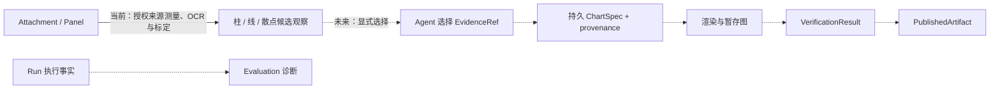

# Figura 系统总览

> 更新日期：2026-09-29。范围：新 Figura 的当前工作树 `src/figura/`。代码、主规格、归档记录、目标设计和旧 `chartagent` 分别标记。本文是入口；组件内部流程与完整字段见按领域划分的专题文档。

## 1. 一眼看懂 Figura

Figura 接收用户文本和图像，创建可恢复的 Run，让 Agent 调用模型与工具。一个 Session 中后续 Run 会从较早终态 Run 的持久事实重建完整对话。**当前新 Figura 已有内部 ReAct、跨 Run 对话投影、图像加载与 Panel 分割，以及二维柱状图、折线图和散点图测量工具。**测量结合 OCR、坐标轴刻度关联与线性标定；结果保留像素观察，仅在标定满足门槛时给出图表单位坐标。本地 HTTP/SSE Gateway 和 React 网页入口也已接入。通用证据生命周期、生产图表生成、验证、发布与评测链尚未实现。仓库中的 `src/chartagent/` 是旧系统，不能把其能力画作新 Figura 的已运行组件。

```mermaid
flowchart LR
    UI[Web: React 界面] -->|FiguraClient / Workspace API| Gateway[Web: 本地 Gateway]
    Gateway -->|Session、Run 查询与创建| Runtime[Runtime]
    Gateway -->|附件与 Panel 上传、列表、内容读取| Sources[Sources]
    Sources -->|附件与 Panel 元数据| DB[(Figura SQLite / storage)]
    Sources -->|私有附件文件与独立 Panel PNG| Files[(私有图片文件)]
    Gateway -->|异步提交已持久化 Run| Dispatcher[Run Dispatcher]
    Dispatcher -->|execute(session_id, run_id)| Agent[Agent]
    Gateway -->|本地配置可用性| Provider[Provider Boundary]
    Runtime -->|RunState、Checkpoint| Agent
    Agent -->|读取较早的终态 RunState| Runtime
    Agent -->|当前 Run 与较早 Run 的事实| Memory[Memory]
    Memory -->|完整有序角色消息| Agent
    Runtime -->|Run 输入与已提交工具事实| ImageState[Agent RunExecutionState]
    Sources -->|附件元数据、Panel 记录与授权读取| ImageState
    ImageState -->|可用图像清单| Agent
    Agent -->|ProviderRequest| Provider[Provider]
    Provider -->|ProviderResponse| Agent
    Agent -->|load_image / decompose_chart_image / measure_bars / measure_lines / measure_scatter| Tools[Tools：图像与笛卡尔测量]
    Tools -->|按 Session 授权读取、写入图像资源| Sources
    Sources -->|被测图像字节| Tools
    Tools -->|ToolExecutionResult| Agent
    Sources -->|授权源图像用于下一请求的测量回看图| Agent
    Agent -->|执行事实、Attempt、终态| Runtime
    Runtime -->|Session、Run 事实与事件| DB
    Runtime -->|安全 Session / Run / Event 投影| Gateway
    Gateway -->|JSON / SSE| UI
    Chart[Charts: ChartSpecData] -.->|尚未接入组装工具与 Run| Agent
```

实线是当前新 Figura 的工作树路径；虚线表示已实现的 ChartSpecData 尚未接入 Agent 与 Run。规划能力另见[第 4 节](#4-规划能力与边界)。Web Gateway 通过有界异步 Dispatcher 进入 Agent；当前 `figura-web-v3` Registry 提供 `load_image`、`decompose_chart_image`、`measure_bars`、`measure_lines` 和 `measure_scatter`。三个测量工具从当前 Session 授权的附件或 Panel 读取图像，由 OCR/笛卡尔传感器返回像素几何、刻度与有门槛的线性标定观察，不确定性由 Agent 处理，不自动重测。Run Runtime 的执行事实是恢复依据；测量成功结果或安全失败随 `ToolResultFact` 持久化，Agent 的 `RunExecutionState.measurements` 按授权来源重建为只读调用期投影，不另建测量存储。模型通过完整 Session Memory 的工具消息读取测量 JSON；紧接测量批次的下一次请求还会按调用顺序附上由源图像和已提交结果即时生成的标注图。标注图不持久化，也不会从旧批次或旧 Run 自动重放。Session Memory 本身没有独立消息表；Gateway 的会话消息投影只展示持久用户输入与已接受最终答案。每次模型请求都含调用期附件/Panel 清单；原图仅由最新已提交批次成功的 `load_image` 加载，Run 输入仍只保存附件 ID。

## 2. 大组件与下钻入口

| 组件 | 职责与跨组件交付 | 当前状态 | 内部文档 |
|---|---|---|---|
| Runtime | Session、Run、执行事实、Attempt、Checkpoint、生命周期事件；交付可恢复 `RunState` 和同 Session 较早 Run 的一致快照；每 Session 至多一个 running Run | 当前工作树已实现；Sources/Execution 持久化边界重构仍处于待提案状态 | [Runtime](figura/runtime.md) |
| Sources | 管理 Session 附件与 Panel 元数据、私有图像文件、图像验证/处理和授权读取；与 Runtime 共用一份 SQLite | 当前工作树已实现；Sources/Execution 持久化边界重构仍处于待提案状态 | [Sources](figura/sources.md) |
| Agent | 按 checkpoint 组装请求、协调模型和工具、提交结果与终态；重建图像状态和测量观察，并为最新测量结果构造调用期标注图 | 当前工作树已实现同步 ReAct、四字段 `RunExecutionState` 投影和测量视觉回看 | [Agent 编排](figura/agent.md) |
| Memory | 从同 Session 的 Run 事实构建完整角色消息；无独立持久化、裁剪或摘要 | 当前已实现 Session 对话投影 | [Memory](figura/memory.md) |
| Provider | 选择固定 provider/model，归一化请求、响应和安全失败 | 已实现 Qwen、DeepSeek、MiMo | [Provider](figura/provider.md) |
| Tools | 版本化定义、参数/结果校验及 handler；执行事实归 Runtime | 当前 `figura-web-v3` 提供图像与 Panel 工具，以及柱状图、折线图、散点图测量 | [Tools](figura/tools.md) |
| Shared / Validation | 被多个能力复用的 JSON Schema 校验与图像大小限制 | 当前已实现 | [Validation](figura/validation.md) |
| Storage | 一份 SQLite 的连接、事务和 schema 初始化；由 Runtime 与 Sources 共用 | 当前已实现 | [Runtime](figura/runtime.md)、[Sources](figura/sources.md) |
| Web | 本地 Gateway、Session/Run/Panel HTTP API、安全历史投影和 SSE；前端经 Figura client 复用工作区 UI | 当前已实现 Panel 读取与预览；测量由 Run 工具事实保存，没有独立前端测量 API | [Web](figura/web.md) |
| Charts | 当前提供单图内容值 `ChartSpecData`、解析、校验和规范序列化 | Core 已实现，主规格已同步，change 已归档；后续图表链未实现 | [Charts](figura/charts.md) |

## 3. 跨组件内容流

1. **网页输入与身份**：React Figura UI 通过 `FiguraClient` 调用 loopback Gateway。Gateway 创建/列出 Session，并委托 Sources 上传、读取和删除附件，或读取 Panel；Run 创建只提交文本、有序附件 ID、provider ID 与幂等键。Runtime 先处理幂等重放，再拒绝同 Session 的第二个 running Run；成功时校验附件归属并保存输入、初始 checkpoint、Run 和创建事件。图片字节留在私有文件中。见[网页边界](figura/web.md)、[运行时](figura/runtime.md#2-内部流转)和[Sources](figura/sources.md#2-内部流转与不变量)。
2. **重建 Session 对话**：每次模型动作前，Agent 向 Runtime 读取目标 Run 之前的终态 RunState；Runtime 在一个 SQLite 读快照中按 ordinal 排序并检查范围与完整性。Session Memory 将历史 Run 以及当前 Run 的已提交前缀投影为完整 user/assistant/tool 消息。见[Session Memory](figura/memory.md#3-内部流转与失败边界)。
3. **组装模型请求**：Agent 从 Runtime Run 输入和 Sources 附件元数据构建有序、去重的附件清单，并结合成功的 `decompose_chart_image` 结果和 Sources Panel 记录重建可用图像状态。每次模型请求先附加文本清单；最新已提交工具批次中的成功 `load_image` 原图和成功测量结果标注图，按工具调用顺序加入请求，重复加载的原图只加入一次。标注图由授权源图像和已提交测量 JSON 即时重建，只服务于紧接的下一请求。Session Memory 按完整历史投影所有已提交工具结果；`RunExecutionState.measurements` 不作为重复 JSON 提示注入。Agent 在 attempt claim 前校验 Provider 限制，失败时不发请求。见[Agent 编排](figura/agent.md#2-内部流转)、[Session Memory](figura/memory.md)和[Sources](figura/sources.md#2-内部流转与不变量)。
4. **工具与恢复**：Tool Runtime 校验并执行 `load_image`、`decompose_chart_image`、`measure_bars`、`measure_lines` 或 `measure_scatter`。Sources 保存分割后的 PNG 与元数据，并为三个测量工具提供已授权源图像；共享 OCR 与笛卡尔轴处理提供刻度、类别标签、图例关联及满足门槛的线性标定。柱状图、折线图和散点图分别输出自身几何及不确定性。Runtime 记录所有工具调用与结果事实；Panel 仅在对应成功 ToolResultFact 提交后进入 Agent 清单和网页投影。测量结果不另建 store；Agent 按 Session 内授权来源重建有序 `MeasurementObservation`。Panel 分割是带 call-scoped 幂等键的本地写入；图像读取和测量为 `replay_safe`。Gateway 启动时按稳定顺序发现 running Runs，并交给同一 Dispatcher/Agent 恢复路径。分别见[Tool 调用](figura/tools.md#2-内部流转)、[Agent 运行态](figura/agent.md#4-运行时状态字段)和[运行时恢复](figura/runtime.md#2-内部流转)。
5. **返回网页**：Gateway 从 Runtime 读取 Session snapshot、Run history 和安全事件，再投影 JSON/SSE；Session-scoped Panel 路由只返回成功工具结果对应的元数据和 `image/png`。Conversation 按 Run 展示 Panel 懒加载预览，同时不把 Agent 的完整 Session Memory、工具消息或 Provider continuation 暴露为普通对话。详见[网页端边界](figura/web.md)。
6. **图表链**：当前 `ChartSpecData` 能表达并验证单图内容，但尚不保存为 Run 图表对象，也没有来源证据、渲染、验证或发布连接。[规划能力](#4-规划能力与边界)只画为目标关系，不属于上述实线路径。

## 4. 规划能力与边界

下表和虚线图中的虚线只说明[架构设计草案](figura-architecture-design.md)里尚未实现的目标。当前工作树已有三类笛卡尔图表测量、OCR 轴刻度观察与有门槛的数值轴标定；这些结果仍是工具候选观察，不等于通用证据域或完整图表事实。独立合同落地时，应先判断领域 owner，再在现有领域文档扩展或新增简短领域名的子文档。

| 目标能力 | 新 Figura 当前状态 | 需要明确的合同 |
|---|---|---|
| 笛卡尔图表测量与 Evidence | `measure_bars`、`measure_lines`、`measure_scatter` 已在当前工作树注册；OCR 与坐标轴标定按门槛产生图表单位观察，完整工具结果作为 Run 工具事实保存。`RunExecutionState.measurements` 从已提交事实重建，不单独持久化；对应主规格已同步，change 已归档 | 尚无通用 `EvidenceRef`、Agent 显式选证与证据生命周期；候选观察不会自动成为图表事实 |
| 持久 ChartSpec 与来源 | 目前只有纯内容值 `ChartSpecData` | 带身份的图表对象、确切内容版本、来源与证据引用 |
| 生成图、验证与发布 | 尚无渲染、验证或发布服务 | 暂存图与 ChartSpec 绑定、验证结果、幂等发布身份 |
| Evaluation | 尚无新 Figura 评测适配 | 从权威 Run 事实生成诊断，避免另建在线事实来源 |



附件与 Panel 目前属于同一个 Sources 能力；模型字段见[Sources](figura/sources.md)，Panel 与测量观察投影见[Agent](figura/agent.md#4-运行时状态字段)，测量结果 JSON 见[Tools](figura/tools.md#6-图像与测量工具合同)。`add-figura-cartesian-chart-measurements` 已归档且相关主规格已同步；实现当前存在于工作树，代码尚有未提交改动。测量输出仍是候选证据，不自动成为图表事实。旧 `src/chartagent/` 有部分对应实现，其对象身份、字段和存储不能直接视作新 Figura 合同。

## 5. 阅读与状态规则

查**完整字段**时，从组件表进入该合同的 owner 专题；跨领域使用者只链接并解释消费方式。专题边界由模型的语义、权威 owner、生命周期和不变量决定，后续出现独立领域时增建子文档，不能按调用链强行合并。嵌套值、联合 payload、枚举和字段来源在所属专题展开。查长期完整产品构想时，参阅[Figura 架构设计草案](figura-architecture-design.md)，其中未实现部分不自动成为当前合同。

当前主规格位于 `openspec/figura/openspec/specs/`。Agent ReAct、Panel 图像观察、柱状图、折线图和散点图测量、Web Gateway/Client、ChartSpec Core 等主规格均已存在；已完成 change 位于 `openspec/figura/openspec/changes/archive/`。`openspec list --json --store figura` 当前还列出 `refactor-figura-leaf-domains` 与 `refactor-figura-sources-execution-persistence`，状态均为 `no-tasks`，不能据此认定已决定或实现迁移。笛卡尔测量代码目前在工作树中，不能据此称为已提交发布。旧系统代码与规格分别位于 `src/chartagent/` 和 `openspec/chartagent/`，只在迁移或兼容性分析中对照。
