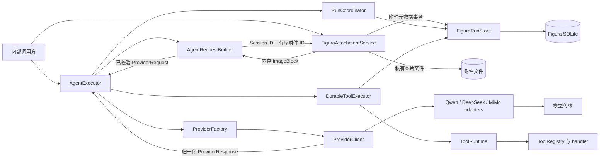

# Figura 实现总览

> 更新日期：2026-09-27。范围：当前工作树中的 `src/figura/`。代码实现、主规格同步和 change 归档状态分别标注。

## 1. 当前边界

Figura 当前工作树已具备 Provider、工具运行时、耐久 Run 核心、Session 级私有图片附件和内部文本/图像 ReAct 循环。Agent 能从已提交的 Run 事实组装模型请求，按 checkpoint 调用模型或执行工具；附件能力目前只在后端内部使用，尚未接入 Figura Gateway/前端，也没有生产图表分析工具。

| 能力 | 当前状态 | 入口 |
|---|---|---|
| Qwen、DeepSeek、MiMo Provider | 已实现；Run 显式保存 provider/model 选择 | `src/figura/providers/` |
| 工具定义、注册、投影、参数/结果校验 | 已实现；目前没有 Figura 生产图表工具集合 | `src/figura/tools/` |
| Session/Run、执行事实、checkpoint、生命周期事件 | 已实现；SQLite schema v5，支持 v0–v4 迁移 | `src/figura/runtime/` |
| Session 图片附件 | 已实现内部存储、校验、列举、解析和未引用删除；Run 引用后保留 | `src/figura/attachments/`、`src/figura/runtime/store.py` |
| 耐久工具执行与显式未知结果恢复 | 已实现；按 `replay_effect` 处理，Agent 不自动恢复不确定工具效果 | `src/figura/runtime/tool_execution.py` |
| Provider continuation 持久化 | 已实现；与模型响应关联并随 Run 恢复 | `src/figura/runtime/models.py`、`store.py` |
| 内部 ReAct Agent | 已实现；文本与有序图像、同步、非流式；每 Run 最多 8 次 Provider attempt、32 个已启动逻辑工具调用 | `src/figura/agent/` |
| Figura Gateway/前端附件上传与选择、生产图表工作流 | 尚未实现 | 后续 change |

## 2. 组件与关系

| 组件 | 职责与输入 → 输出 | 源码入口 |
|---|---|---|
| AgentExecutor | 读取 Run checkpoint，只执行其当前动作；协调请求构建、单次 Provider 调用、工具批次、恢复和终结 | `src/figura/agent/executor.py` |
| AgentRequestBuilder | 由 Run 持久化输入、按 Session 解析有序图像、模型响应、工具结果和 continuation 重建有界 Provider 请求；使用固定 v1 系统指令 | `src/figura/agent/request.py`、`assets/system-v1.md` |
| FiguraAttachmentService | 有界接收并验证图片；按 Session 返回元数据或为 Agent 解析图像；协调引用保护、删除和启动时文件对账 | `src/figura/attachments/service.py` |
| ProviderFactory / ProviderClient | 依据 Run 已选 provider/model 创建客户端；单次请求归一化为响应或安全错误 | `src/figura/providers/client.py`、`adapters/` |
| RunCoordinator | 校验 Run 创建和推进；生成 attempt 身份，协调响应提交、失败与孤立 attempt 处理 | `src/figura/runtime/coordinator.py` |
| DurableToolExecutor | 按持久化顺序启动和执行工具调用；支持按 Agent 剩余预算限制本轮调用数 | `src/figura/runtime/tool_execution.py` |
| ToolRegistry / ToolRuntime | 提供版本化工具定义；执行参数、handler 和结果校验 | `src/figura/tools/registry.py`、`runtime.py` |
| FiguraRunStore | 持久化并重建 Session/Run、附件元数据、执行事实、continuation、ProviderAttempt、checkpoint 和事件 | `src/figura/runtime/store.py` |

Agent 和附件服务目前都是内部能力，没有 Gateway 或前端入口。附件元数据由 FiguraRunStore 写入 SQLite，图片字节保存在按 opaque ID 派生的私有文件中。Provider 请求由 Agent 发送，模型响应经 RunCoordinator 提交；工具副作用只经 DurableToolExecutor 执行。

## 3. 核心数据归属

| 对象 / 关键字段 | Owner 与用途 | 持久化及边界 | 源码依据 |
|---|---|---|---|
| `ProviderRequest.provider_id`、`model_id`、`instructions`、`messages`、`tools`、`options` | Provider 层定义一次模型请求；AgentRequestBuilder 投影 Run 历史 | 调用期对象；凭据和 endpoint 留在 Provider 配置，不进入 Run 事实 | `providers/models.py`、`agent/request.py` |
| `ImageBlock.media_type`、`image_bytes` | AgentRequestBuilder 从 Session 附件服务取得经校验的图像内容 | 仅用于内存 Provider 请求；图片字节不写入 Run 事实、事件或普通日志，`image_bytes` 不参与 repr | `providers/models.py`、`attachments/service.py`、`agent/request.py` |
| `ProviderResponse.assistant_content`、`tool_calls`、`finish_reason`、`usage`、`continuation` | ProviderClient 归一化模型结果 | continuation 为私有数据；公开投影不返回 continuation，Runtime 仅在响应提交时持久化 | `providers/models.py`、`runtime/coordinator.py` |
| `ToolDefinition`、`ToolRegistry.version` | ToolRegistry 拥有可调用工具定义及版本；包含参数/结果 schema、`replay_effect` 和 handler | Registry 与 handler 在进程内；Run 工具事实记录调用时的 registry 版本 | `tools/contracts.py`、`tools/registry.py` |
| `Run.run_id`、`session_id`、`status`、`provider`、`model`、终态字段 | RunCoordinator 发起变更；Store 是 Run 生命周期持久化 owner | `runs` 表；provider/model 在 Run 创建后固定 | `runtime/models.py`、`runtime/store.py` |
| `RunInput.text`、有序 `attachment_ids`、请求 provider/model | Run 的唯一初始输入事实；最多 16 个不重复附件 ID | `run_execution_records` 只保存文本和 ID，不含图像字节；创建时同事务校验附件归属 | `runtime/models.py`、`runtime/_codec.py`、`runtime/coordinator.py`、`runtime/store.py` |
| `AttachmentMetadata.attachment_id`、`session_id`、`filename`、`media_type`、`byte_count`、`created_at` | FiguraAttachmentService 管理的 Session 附件元数据 | SQLite `attachments` 表仅含这六项；文件路径由服务端 ID 派生，不进入元数据或公开投影 | `runtime/models.py`、`runtime/store.py`、`attachments/service.py` |
| `ModelResponseFact`、`FinalAnswerFact`、`ExecutionRecord.record_id/record_sequence/record_kind` | Store 按 Run 追加输入、模型响应和最终答案 | `run_execution_records`；响应内容不作为生命周期事件公开 | `runtime/models.py`、`runtime/store.py` |
| `ProviderContinuationFact.continuation_id`、`response_record_id`、`provider_id`、`format_version`、`reasoning_content` | Store 保存与来源模型响应绑定的 Provider 私有续接内容 | `run_provider_continuations`；仅内部 RunState 重建使用，不进入公开事件或诊断文本 | `runtime/models.py`、`runtime/_codec.py`、`runtime/store.py` |
| `ProviderAttempt.attempt_id`、`attempt_sequence`、`base_record_sequence`、`base_tool_sequence`、`status`、`response_record_id`、`failure_code`、时间字段 | RunCoordinator 在 Provider 请求前 claim；成功、已知失败或未知结果只允许完成一次 | `run_provider_attempts`；状态为 `started`、`response_committed`、`known_failure` 或 `outcome_unknown`；最多 8 条/Run，不存 prompt、凭据或原始响应 | `runtime/models.py`、`runtime/coordinator.py`、`runtime/store.py` |
| `ToolCallFact`、`ToolAttemptStartedFact`、`ToolResultFact` | Store 记录模型提出的调用意图、handler 启动和结果；Executor 负责推进 | `run_tool_execution_facts`；Agent 以已启动的不同调用数计算 32 次预算 | `runtime/models.py`、`runtime/tool_execution.py` |
| `ExecutionCheckpoint.revision`、提交游标、`next_action` | Store 唯一记录 Run 当前推进点；CAS revision 拒绝过期写入 | `run_execution_checkpoints`；动作包括 model、provider_attempt、tool_execution、tool_attempt、final | `runtime/models.py`、`runtime/store.py` |
| `RunState.provider_attempts`、`tool_facts`、`provider_continuations` | Store 的内部恢复视图；Agent/请求构建器读取 | 内部字段，不扩展 Run 的公开字段或 SSE 事件 | `runtime/models.py`、`runtime/store.py` |
| `RunStreamEvent.event_sequence`、`event_kind`、`payload` 与创建幂等映射 | Store 保存有界生命周期事件及 Session 内创建去重 | `run_stream_events`、`run_idempotency`；当前没有 Figura SSE Gateway | `runtime/models.py`、`runtime/store.py` |

## 4. 关键流转

1. **创建 Run**：RunCoordinator 校验文本、Session 和显式 provider/model；Store 在同一事务校验有序附件 ID 都属于该 Session，并原子写入 Run、含 ID 的 input record、初始 checkpoint、创建事件和幂等映射，不发起 Provider 请求。
2. **模型动作**：AgentRequestBuilder 从已提交事实重建历史，按 Run Session 和持久化 ID 顺序解析图片，构造“原始文本 + 图像”用户消息，再附上固定 v1 系统指令和当前 Registry 工具投影；后续模型轮次仍重建相同原始图像消息。只删除最旧的完整已解决轮次，并在 claim 前验证图片数量、单图/总图大小及完整 Provider 请求限制。Agent 在 Run 锁内持久化 ProviderAttempt 后调用选定客户端一次；响应、continuation、工具调用意图、attempt 状态和下一 checkpoint 原子提交。
3. **工具动作**：Agent 根据 Run 中已启动的不同逻辑调用数计算剩余预算，并将上限传给 DurableToolExecutor。Executor 串行启动调用、执行 handler、提交结果和 checkpoint；只有完整工具批次落盘后 Agent 才能继续模型动作。
4. **恢复未知工作**：仍为 `started` 的 ProviderAttempt 在取得 Run 锁后被标记为 `outcome_unknown`，Run 以 `provider_outcome_unknown` 失败，不重发、不切换模型。若 checkpoint 指向未解决的工具 attempt，Agent 返回该状态，不自动 replay 或 reconcile；读取本身不触发外部动作。
5. **终结 Run**：Agent 只接受有非空文本的 `stop` 响应作为最终答案；有效工具调用继续循环。无效响应、预算耗尽或确定性 Provider 失败走有界失败终态。终态 Run 再次执行时原样返回。

## 5. 规格、change 与待完成

主规格：[agent-react-execution](../openspec/figura/openspec/specs/agent-react-execution/spec.md) · [image-attachment-storage](../openspec/figura/openspec/specs/image-attachment-storage/spec.md) · [model-provider](../openspec/figura/openspec/specs/model-provider/spec.md) · [tool-runtime](../openspec/figura/openspec/specs/tool-runtime/spec.md) · [run-execution-core](../openspec/figura/openspec/specs/run-execution-core/spec.md) · [durable-tool-execution](../openspec/figura/openspec/specs/durable-tool-execution/spec.md) · [provider-continuation-persistence](../openspec/figura/openspec/specs/provider-continuation-persistence/spec.md)。

| OpenSpec 项目 | 状态 |
|---|---|
| `add-figura-agent-react-loop` | 已归档，任务 22/22 完成；delta spec 已同步到主规格。见 [归档 proposal](../openspec/figura/openspec/changes/archive/2026-09-27-add-figura-agent-react-loop/proposal.md)。 |
| `add-figura-image-attachment-runtime` | 实现任务 18/18 完成；3 份 delta spec 已同步并归档。见 [归档 proposal](../openspec/figura/openspec/changes/archive/2026-09-27-add-figura-image-attachment-runtime/proposal.md)。 |
| 已归档基础 change | [model-client](../openspec/figura/openspec/changes/archive/2026-09-26-add-figura-model-client/proposal.md)、[tool-runtime](../openspec/figura/openspec/changes/archive/2026-09-26-add-figura-tool-runtime/proposal.md)、[run-execution-core](../openspec/figura/openspec/changes/archive/2026-09-26-add-figura-run-execution-core/proposal.md)、[durable-tool-execution](../openspec/figura/openspec/changes/archive/2026-09-26-add-figura-durable-tool-execution/proposal.md)、[provider-continuation-persistence](../openspec/figura/openspec/changes/archive/2026-09-27-add-figura-provider-continuation-persistence/proposal.md)。 |

现有 `agent-react-execution` 主规格的 Purpose 仍写“text-only”，与已同步的图像请求要求不完全一致；本次按同步规则保留了既有 Purpose，后续需单独直接修订该段。后续主要空白：具体业务图表工具、基于附件的图表分析工作流、Figura Gateway/前端入口。[Figura 架构设计草案](figura-architecture-design.md)可供方向参考，不代表这些能力已实现。

本次依据当前 `src/figura/` 工作树、Figura 主规格、change 列表与归档目录核对。归档后 `openspec validate --all --strict --store figura` 检查 7 份主规格并全部通过；本次归档状态核对和总览更新未运行应用测试。
