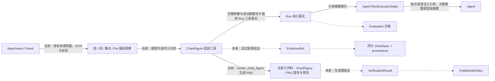

# Figura 系统总览

> 更新日期：2026-09-30。范围：新 Figura 的当前工作树 `src/figura/`。代码、主规格、归档记录、目标设计和旧 `chartagent` 分别标记。本文是入口；组件内部流程与完整字段见按领域划分的专题文档。

## 1. 一眼看懂 Figura

Figura 接收用户文本和图像，创建可恢复的 Run，让 Agent 调用模型与工具。一个 Session 中后续 Run 会从较早终态 Run 的持久事实重建完整对话。**当前工作树已有内部 ReAct、跨 Run 对话投影、图像加载与 Panel 分割、独立 OCR、四类图表测量、ChartFigure 组装与 PNG 渲染工具。**图像观察、Figure 和渲染结果摘要沿用 Run 通用工具事实；Agent 运行态重建测量、Figure 与渲染观察。渲染 PNG 私下保存在 Sources 文件区，没有独立 Figure 或渲染元数据表；Web 通过 Run 摘要与受授权内容路由提供预览。图表渲染主规格已同步，change 已归档；相关代码仍在当前工作树。通用证据生命周期、生成图验证、发布与评测链尚未实现。仓库中的 `src/chartagent/` 是旧系统，不能把其能力画作新 Figura 的已运行组件。

```mermaid
flowchart LR
    UI[Web: React 界面] -->|FiguraClient / Workspace API| Gateway[Web: 本地 Gateway]
    Gateway -->|Session、Run 查询与创建| Runtime[Runtime]
    Gateway -->|附件/Panel 操作与 ChartFigure PNG 内容读取| Sources
    Sources -->|附件与 Panel 元数据| DB[(Figura SQLite / storage)]
    Sources -->|私有附件、独立 Panel 与 ChartFigure PNG| Files[(私有图片文件)]
    Gateway -->|异步提交已持久化 Run| Dispatcher[Run Dispatcher]
    Dispatcher -->|execute(session_id, run_id)| Agent[Agent]
    Gateway -->|本地配置可用性| Provider[Provider Boundary]
    Runtime -->|RunState、Checkpoint| Agent
    Agent -->|读取较早的终态 RunState| Runtime
    Agent -->|当前 Run 与较早 Run 的事实| Memory[Memory]
    Memory -->|完整有序角色消息| Agent
    Runtime -->|Run 输入与已提交工具事实| ImageState[Agent RunExecutionState]
    Sources -->|附件元数据、Panel 记录与授权资源读取| ImageState
    ImageState -->|图像清单、测量观察、Figure 与渲染摘要| Agent
    Agent -->|ProviderRequest| Provider[Provider]
    Provider -->|ProviderResponse| Agent
    Agent -->|load_image / decompose_chart_image / extract_text / 四类测量 / assemble_chart_figure / render_chart_figure| Tools[Tools：图像、观察、组装与渲染调用]
    Tools -->|ChartSpec / ChartFigure 校验与 ChartFigure 绘图| Chart[Charts]
    Chart -->|已校验 Figure 与 PNG 字节| Tools
    Tools -->|读取源图或持久化渲染 PNG| Sources
    Sources -->|授权源图像与已存 PNG| Tools
    Tools -->|ToolExecutionResult| Agent
    Sources -->|源图与当前批次回看图像用于下一请求| Agent
    Agent -->|执行事实、Attempt、终态| Runtime
    Runtime -->|Session、Run 事实与事件| DB
    Runtime -->|安全 Session / Run / Event 投影| Gateway
    ImageState -->|已提交渲染摘要| Gateway
    Gateway -->|受授权渲染内容读取| Sources
    Sources -->|已提交 PNG 内容| Gateway
    Gateway -->|JSON / SSE| UI
    Tools -->|组装/渲染参数和成功摘要| Runtime
    Runtime -->|已提交组装/渲染调用与结果事实| ImageState
```

实线表示当前新 Figura 工作树路径；本次图表渲染代码在当前工作树，尚未提交。图表渲染主规格已同步，关联 change 已归档。Web Gateway 经有界异步 Dispatcher 进入 Agent；当前 `figura-web-v6` Registry 在图像/Panel、OCR、四类测量和 `assemble_chart_figure` 外提供 `render_chart_figure`。OCR 与四种测量共五种观察工具从当前 Session 授权的附件或 Panel 读取图像并返回有界结果；图像加载和分割是另两项工具。Runtime 通用 ToolCallFact 保存完整 Figure/渲染调用参数，成功 ToolResultFact 保存摘要；Agent 重建有序 Figure 与渲染观察。渲染工具只接受已提交的同 Session Figure 引用；Charts 纯函数绘图，Sources 按 `(run_id, call_id)` 私下保存校验后的 PNG，Runtime 仍只保存通用工具事实。Agent 将当前工具批次成功渲染的图片加入紧接着的 Provider 请求；Gateway 仅公开已成功提交的渲染摘要和 Session-scoped PNG 内容路由，React 按 Run 懒加载预览。没有独立 Figure 或渲染元数据表。测量观察只读投影不另建存储；OCR/测量 JSON 仍由完整 Session Memory 的工具消息提供。OCR/测量标注图按需生成、不持久化。Session Memory 没有独立消息表；Gateway 会话消息只展示持久用户输入与已接受最终答案。每次模型请求都含调用期附件/Panel/Figure 摘要清单；原图仅由最新已提交批次成功的 `load_image` 加载，Run 输入仍只保存附件 ID。

## 2. 大组件与下钻入口

| 组件 | 职责与跨组件交付 | 当前状态 | 内部文档 |
|---|---|---|---|
| Runtime | Session、Run、执行事实、Attempt、Checkpoint、生命周期事件；交付可恢复 `RunState` 和同 Session 较早 Run 的一致快照；每 Session 至多一个 running Run | 当前工作树已实现；Sources/Execution 持久化边界重构仍处于待提案状态 | [Runtime](figura/runtime.md) |
| Sources | 管理 Session 附件与 Panel 元数据、私有附件/Panel 图像和 ChartFigure PNG 文件、图像验证/处理和授权读取；与 Runtime 共用一份 SQLite | 当前工作树已实现；渲染 PNG 只存私有文件，无独立渲染元数据表 | [Sources](figura/sources.md) |
| Agent | 按 checkpoint 组装请求、协调模型和工具、提交结果与终态；重建图像状态、测量观察、Figure 与渲染摘要 | 当前工作树有同步 ReAct、六字段 `RunExecutionState` 投影、工具事实恢复和成功渲染 PNG 回看 | [Agent 编排](figura/agent.md) |
| Memory | 从同 Session 的 Run 事实构建完整角色消息；无独立持久化、裁剪或摘要 | 当前已实现 Session 对话投影 | [Memory](figura/memory.md) |
| Provider | 选择固定 provider/model，归一化请求、响应和安全失败 | 已实现 Qwen、DeepSeek、MiMo | [Provider](figura/provider.md) |
| Tools | 版本化定义、参数/结果校验及 handler；执行事实归 Runtime | 当前工作树 `figura-web-v6` 提供 `assemble_chart_figure` 与 `render_chart_figure`；图表渲染 change 已归档，代码尚未提交 | [Tools](figura/tools.md) |
| Shared / Validation | 被多个能力复用的 JSON Schema 校验与图像大小限制 | 当前已实现 | [Validation](figura/validation.md) |
| Storage | 一份 SQLite 的连接、事务和 schema 初始化；由 Runtime 与 Sources 共用 | 当前已实现 | [Runtime](figura/runtime.md)、[Sources](figura/sources.md) |
| Web | 本地 Gateway、Session/Run/Panel/ChartFigure 渲染内容 HTTP API、安全历史投影和 SSE；前端经 Figura client 复用工作区 UI | 当前工作树已实现 Panel 与 ChartFigure PNG 懒加载预览；测量仍由 Run 工具事实保存 | [Web](figura/web.md) |
| Charts | `ChartSpecData` 单图值与 `ChartFigure` 多图画布值，严格解析、规范序列化、纯校验和 PNG 绘制 | ChartSpec Core、Figure assembly、Chart rendering change 已归档；单图与画布分别位于 `chartspec/`、`chartfigure/` | [Charts](figura/charts.md) |

## 3. 跨组件内容流

1. **网页输入与身份**：React Figura UI 通过 `FiguraClient` 调用 loopback Gateway。Gateway 创建/列出 Session，并委托 Sources 上传、读取和删除附件，或读取 Panel；Run 创建只提交文本、有序附件 ID、provider ID 与幂等键。Runtime 先处理幂等重放，再拒绝同 Session 的第二个 running Run；成功时校验附件归属并保存输入、初始 checkpoint、Run 和创建事件。图片字节留在私有文件中。见[网页边界](figura/web.md)、[运行时](figura/runtime.md#2-内部流转)和[Sources](figura/sources.md#2-内部流转与不变量)。
2. **重建 Session 对话**：每次模型动作前，Agent 向 Runtime 读取目标 Run 之前的终态 RunState；Runtime 在一个 SQLite 读快照中按 ordinal 排序并检查范围与完整性。Session Memory 将历史 Run 以及当前 Run 的已提交前缀投影为完整 user/assistant/tool 消息。见[Session Memory](figura/memory.md#3-内部流转与失败边界)。
3. **组装模型请求**：Agent 从 Runtime Run 输入和 Sources 附件元数据构建有序、去重的附件清单，并重建已提交 Panel、测量观察、Figure 与渲染观察。`RunExecutionState.chart_renders` 用于渲染事实完整性和 Gateway 投影；提示中的图像清单列出附件、Panel 与成功 Figure 摘要，不把渲染观察另行复制为提示文本。当前 Run 最新工具批次需要回看的成功图像按调用顺序加入下一次 Provider 请求；旧 Run 的图像不自动重放。Figure 摘要不含 ChartSpec 数据集，完整内容来自 Memory 中普通工具调用历史。Agent 在 attempt claim 前校验 Provider 限制。见[Agent 编排](figura/agent.md#2-内部流转)、[Session Memory](figura/memory.md)和[Sources](figura/sources.md#2-内部流转与不变量)。
4. **工具、渲染与恢复**：Tool Runtime 校验图像/Panel、OCR、四类测量、`assemble_chart_figure` 和 `render_chart_figure`。组装工具委托 Charts 严格解析与语义校验，并检查同 Session 已提交成功的测量引用。渲染工具只接受已提交 Figure；Charts 生成 PNG，Sources 按 `(run_id, call_id)` 私下保存，Runtime 仍沿用通用工具事实持久化调用和成功摘要。Agent 投影有成功配对事实的渲染观察；同一批次成功 PNG 随后加入下一次 Provider 请求。网页内容路由核对 Session、成功事实、摘要和文件。没有独立 Figure/渲染表。Panel 与渲染文件为幂等本地写，观察和 Figure 组装为 `replay_safe`。分别见[Tool 调用](figura/tools.md#2-内部流转)、[画布组装](figura/tools.md#7-图表画布组装工具)、[图表渲染](figura/tools.md#8-图表渲染工具)、[Charts](figura/charts.md)、[Sources](figura/sources.md)和[Agent 运行态](figura/agent.md#4-运行时状态字段)。
5. **返回网页**：Gateway 从 Runtime 读取 Session snapshot、Run history 和安全事件，再投影 JSON/SSE。Session-scoped Panel 与 ChartFigure 渲染路由只提供成功工具结果对应的 PNG；Run DTO 附加渲染摘要，React Gallery 按来源 Run 懒加载预览。Conversation 不把 Agent 的完整 Session Memory、工具消息或 Provider continuation 暴露为普通对话。详见[网页端边界](figura/web.md)。
6. **图表链**：当前有 `ChartSpecData`、`ChartFigure`、纯 PNG renderer、Sources 私有 PNG 文件保存和网页预览；Figure 全文/摘要及渲染调用/结果分别借用 Run 工具调用/结果事实保留，Agent 可跨 Run 索引成功画布与渲染摘要。仍没有单独图表对象表、来源证据模型、生成图验证、发布或 Evaluation。[规划能力](#4-规划能力与边界)标出这些未实现部分。

## 4. 规划能力与边界

下表和虚线图中的虚线只说明[架构设计草案](figura-architecture-design.md)里尚未实现的目标。当前工作树有四类图表测量、独立 OCR 文字观察、可选多边形范围与有门槛的数值坐标/扇区比例；这些仍是工具候选观察，不等于通用证据域或完整图表事实。独立合同落地时，应先判断领域 owner，再在现有领域文档扩展或新增简短领域名的子文档。

| 目标能力 | 新 Figura 当前状态 | 需要明确的合同 |
|---|---|---|
| 图像文字与图表测量 | 当前工作树 `figura-web-v6` 注册 `extract_text` 和 `measure_bars`、`measure_lines`、`measure_scatter`、`measure_pie`；五种工具可选传入临时多边形观察范围。OCR 与各测量完整结果作为 Run 工具事实保存；`RunExecutionState.measurements` 仅投影四种测量，OCR 留在普通工具历史。主规格已同步，change 已归档，代码尚未提交 | 尚无通用 `EvidenceRef`、Agent 显式选证与证据生命周期；候选观察不会自动成为图表事实 |
| 独立图表对象与来源 | 当前 `ChartFigure` 完整 JSON 可随成功 assembly 工具事实跨 Run 保留；尚无独立 ChartFigure 表、修改版本或证据对象 | 是否增加可编辑图表实体、来源绑定和通用证据生命周期 |
| 生成图、验证与发布 | 当前工作树已有 ChartFigure→PNG 绘制、Sources 私有文件保存、Agent 当前批次图像回看及 Web 预览；Chart rendering 主规格已同步、change 已归档，代码尚未提交。尚无图表验证或发布服务 | 验证结果、ChartSpec/来源绑定、幂等发布身份 |
| Evaluation | 尚无新 Figura 评测适配 | 从权威 Run 事实生成诊断，避免另建在线事实来源 |



附件与 Panel 目前属于同一个 Sources 能力；渲染 PNG 是按 Run/调用身份保存的私有文件，不新增 Source metadata 模型。模型字段见[Sources](figura/sources.md)，Panel、测量、Figure 与渲染观察投影见[Agent](figura/agent.md#4-运行时状态字段)，图像/测量/Figure/渲染工具输入输出见[Tools](figura/tools.md#6-图像与测量工具合同)。`add-figura-scoped-chart-observation`、`add-figura-chart-figure-assembly` 与 `add-figura-chart-rendering` 均已于 2026-09-29 归档，相关主规格已同步；观察、Figure assembly 和渲染代码仍在工作树。当前 `add-figura-chart-generation` 只登记在 OpenSpec 列表中，尚无 proposal、spec、design 或 tasks 文件，不能据名称推断其范围。测量引用标识成功工具调用，不证明 ChartSpec 数据值正确；旧 `src/chartagent/` 的身份、字段和存储不能直接视作新 Figura 合同。

## 5. 阅读与状态规则

查**完整字段**时，从组件表进入该合同的 owner 专题；跨领域使用者只链接并解释消费方式。专题边界由模型的语义、权威 owner、生命周期和不变量决定，后续出现独立领域时增建子文档，不能按调用链强行合并。嵌套值、联合 payload、枚举和字段来源在所属专题展开。查长期完整产品构想时，参阅[Figura 架构设计草案](figura-architecture-design.md)，其中未实现部分不自动成为当前合同。

当前主规格位于 `openspec/figura/openspec/specs/`。Agent ReAct、Panel 图像观察、OCR 文字观察、柱状图/折线图/散点图/Pie 测量、Web Gateway/Client、ChartSpec Core、ChartFigure assembly 与 Chart rendering 等主规格均已存在。`add-figura-chart-rendering` 已归档至 `openspec/figura/openspec/changes/archive/2026-09-29-add-figura-chart-rendering/`，主规格已同步，工作树代码未提交。已完成 change 位于 `openspec/figura/openspec/changes/archive/`。`openspec list --json --store figura` 当前还列出 `add-figura-chart-generation`、`refactor-figura-leaf-domains` 与 `refactor-figura-sources-execution-persistence`；前者缺少规划产物，后两者状态均为 `no-tasks`，不能据此认定已决定或实现迁移。归档和任务完成不能据此称为已提交发布。旧系统代码与规格分别位于 `src/chartagent/` 和 `openspec/chartagent/`，只在迁移或兼容性分析中对照。
