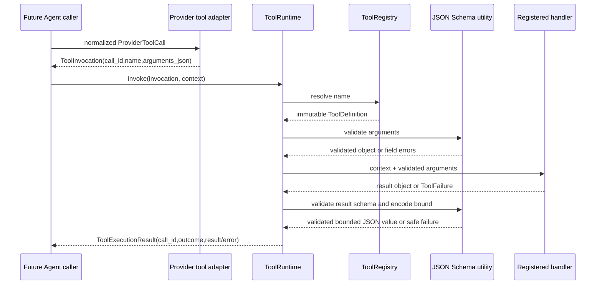

# `add-figura-tool-runtime` · Figura 工具运行时基础设施

> 最近更新：2026-09-26。实施状态：已实现。OpenSpec 状态：主规格已同步、已归档。

## 1. 概览与决定

**来源与基线**

- 目标来源：用户同意先建立 ToolRuntime 设施层，再接持久工具执行与 ReAct Agent 循环。
- 当前代码证据：[Provider models](../../../src/figura/providers/models.py)、[Provider validation](../../../src/figura/providers/validation.py)、[Provider client](../../../src/figura/providers/client.py)、[Run models](../../../src/figura/runtime/models.py)、[Run coordinator](../../../src/figura/runtime/coordinator.py)、[Run store](../../../src/figura/runtime/store.py)。
- 主规格：[model-provider](../../../openspec/figura/openspec/specs/model-provider/spec.md)、[run-execution-core](../../../openspec/figura/openspec/specs/run-execution-core/spec.md)。
- 参考：旧版 [ChartAgent ToolDefinition](../../../src/chartagent/tools/core/definition.py)、[ToolRegistry/dispatch](../../../src/chartagent/tools/core/registry.py)；[Figura architecture draft](../../figura-architecture-design.md) 只作候选参考，不视为已确认要求。
- OpenSpec change：[proposal](../../../openspec/figura/openspec/changes/archive/2026-09-26-add-figura-tool-runtime/proposal.md)、[tool-runtime delta spec](../../../openspec/figura/openspec/changes/archive/2026-09-26-add-figura-tool-runtime/specs/tool-runtime/spec.md)、[design](../../../openspec/figura/openspec/changes/archive/2026-09-26-add-figura-tool-runtime/design.md)、[tasks](../../../openspec/figura/openspec/changes/archive/2026-09-26-add-figura-tool-runtime/tasks.md)。归档目录中的任务均已完成，delta spec 已同步至[主规格](../../../openspec/figura/openspec/specs/tool-runtime/spec.md)。

**目标与范围**

- **问题与目标：** Provider 已能传递函数 Schema 并规范化 tool call，Figura 尚无应用层工具定义、注册、输入校验、handler 分发和结果合同。此 change 建立一个不依赖 ChartAgent 领域逻辑、可供后续 Agent 和 durable runtime 使用的工具执行设施层。
- **完成结果：** 内部调用方可从版本化、不可变 Registry 获取同源的模型可见工具定义；将一个 Provider tool call 转成单次 `ToolInvocation`；只有通过输入 Schema 校验且未取消的调用才会触发对应 handler；可安全关联的成功/失败均返回有界、与原 `call_id` 关联的 `ToolExecutionResult`。无法建立安全结果身份的 malformed invocation 或 context/call-ID mismatch 会抛 `ToolInvocationError`。
- **本次范围：** Provider-neutral 工具合同；有限 JSON Schema 结构与实例校验；不可变 Registry；Provider function-tool 投影/调用映射；同步单次 dispatch；有界 JSON 结果；安全错误与 replay-effect 元数据。
- **明确不包含：** 具体图表、附件、测量、渲染或发布工具；Agent/ReAct 循环、Prompt/history；Run 工具调用/结果事实、checkpoint、event、SQLite migration、continuation 持久化；重试、resume、reconcile、并行；Gateway、SSE、CLI/UI 与展示字段。
- **前置依赖：** 现有 `ProviderToolCall` / `FunctionTool` 与 Provider 的端点能力校验；已归档的 Run execution core 提供后续 durable owner，但本 change 不修改其行为。
- **OpenSpec：** Figura store `figura`；change `add-figura-tool-runtime`；新增 `tool-runtime` capability。delta spec 已同步，change 已归档；当前 `openspec list --json --store figura` 返回无活动 change。

### 决定状态

| 主题 | 决定/现状 | 决策状态 | 依据 | 受影响字段/组件 |
|---|---|---|---|---|
| 先建工具设施层 | ToolDefinition、Registry、schema 校验和单次 handler 分发先于 ReAct loop | 已确认 | 用户要求先讨论/建立 ToolRuntime，再进入 Agent 核心 | `figura.tools.*` |
| Provider 与 Runtime 分层 | ToolRuntime 不调用 Provider；Run store 不由 ToolRuntime 写入 | 已确认 | 当前 Provider 与 Run 主规格已有独立边界 | Provider adapter、ToolRuntime |
| input/result schema | 两者必填，顶层均为 object；result schema 是工具 handler 的输出合同 | 已确认 | 用户同意每个工具都声明 result schema | `ToolDefinition.parameters_schema`、`result_schema` |
| Registry 生命周期 | build-once、显式版本、定义有序且不可变；单个实例即该 ToolRuntime 可用的工具集合 | 已实现（当前合同） | 便于后续冻结 Run 的工具表；当前没有 per-Run 权限输入 | `ToolRegistry.version`、`definitions` |
| handler 接口 | 同步 `handler(context, validated_arguments)`，不展开成 `**kwargs` | 已实现（当前合同） | 与同步 Provider client 配合；不继承旧版 dispatcher 细节 | `ToolDefinition.handler`、`ToolContext` |
| Schema 校验器 | 抽取纯共享 JSON Schema 子集工具；Provider 保留 endpoint-specific 检查 | 已实现 | Provider schema 结构与 Runtime 实例检查共用基础 utility，Provider strict/endpoint 规则仍留在 provider 层 | `figura.json_schema`、`providers.validation` |
| Replay effect | 声明 `replay_safe`、`idempotent_local_write`、`reconcile_required`；本 change 不执行重试 | 已实现（当前合同） | 为后续恢复合同留接口；当前 Runtime 不消费该字段作恢复决策 | `ReplayEffect`、`ToolDefinition.replay_effect` |
| 初始 resource limits | 定义集中常量：64 tools、128 KiB/schema、512 KiB/registry schemas+descriptions、64 KiB/input args、256 KiB/result、2048 bytes/description、16 schema depth、256 properties/object | 已实现（实际值见字段表） | 有界默认值；以后真实工具可再评估，不暴露为模型参数 | `tools.limits`、`figura.json_schema` |
| 附件/来源权限 | 此 change 的 `ToolContext` 只携带 Run/Session/call ID 与取消信号，不添加附件、Evidence 或文件路径 | 已确认（本 change 范围） | Run 当前拒绝非空 attachments；授权上下文由后续领域工具决定 | `ToolContext` |

## 2. 实现合同

### 组件

| 组件/源码路径 | 职责 | 输入 → 输出 | 依赖/调用关系 | 实施状态与证据 |
|---|---|---|---|---|
| `src/figura/json_schema.py` | 有限 Schema dialect 的结构校验、实例校验、规范 JSON 编码和边界检查 | schema / JSON value → normalized value 或 SchemaIssue/受控定义错误 | Provider request validation 与 ToolRuntime 共用；不依赖 Provider、Run、ChartAgent | 已实现；`validate_schema_definition`、`validate_instance`、`canonical_json_dumps`、`normalize_json_value` |
| `src/figura/tools/contracts.py` | 定义 ToolDefinition、ToolContext、ToolInvocation/InvocationError、ToolExecutionResult/Error、ToolFailure、ReplayEffect 及 JSON freeze helper | typed in-memory values → validated immutable values | 被 Registry、Runtime、Provider adapter 引用 | 已实现；没有单独 JSONValue type alias；字段偏差见第 4 节 |
| `src/figura/tools/registry.py` | 构造有版本的不可变 Registry、唯一名称查找和稳定顺序 | version + ordered definitions → registry 或 ToolDefinitionError | 调用 shared JSON Schema utility；被 Provider projection/ToolRuntime 使用 | 已实现；`.version`、`.definitions`、`.by_name`、`.get()`；无公开 aggregate-byte 派生属性 |
| `src/figura/tools/provider.py` | 将定义投影为 `FunctionTool`；将 `ProviderToolCall` 映射为 provider-neutral `ToolInvocation` | Registry / ProviderToolCall → FunctionTool tuple / ToolInvocation | 依赖 `figura.providers.models`，Provider 不反向依赖 tools | 已实现；API 名为 `project_provider_tools`、`normalize_provider_tool_call` |
| `src/figura/tools/runtime.py` | 单次调用查找、解析、校验、调用 handler、校验输出并规范错误 | ToolInvocation + ToolContext → ToolExecutionResult | 依赖 Registry、Schema utility；不调用 Provider、RunStore 或事件系统 | 已实现；单次同步 dispatch，无 batch、重试、持久化或 Agent loop |
| `src/figura/providers/validation.py` | 负责 Provider request/endpoint 能力检查；通用 Schema 结构检查委托 shared utility | ProviderRequest + provider profile → 接受或 ProviderInputError | 共用 Schema utility；strict/endpoint 规则留在 provider 层 | 已实现；`validate_schema_definition` 已接入，Provider-specific 校验保留 |
| `tests/test_figura_json_schema.py` | 覆盖 Schema 方言、实例匹配、边界和安全 JSON 编码 | schemas/values → asserted outcomes | shared utility 与 Provider | 已存在且曾执行；本次未重跑 |
| `tests/test_figura_tool_registry.py`、`tests/test_figura_tool_runtime.py` | 用假 handler 验证 Registry、投影、dispatch、错误、关联和 limits | fake ToolDefinition/ToolInvocation → asserted outcomes | `figura.tools.*` | 已存在且曾执行；覆盖 Registry 与 Runtime；不添加生产 chart tool |
| `tests/test_figura_provider.py` | 保持 Provider adapter、请求校验、schema 表示/拒绝行为兼容 | Provider inputs → normalized response / bounded failure | `figura.providers.*` | 已存在且曾执行；本次未重跑 |

### 字段

以下保留原计划合同用于对照；字段状态按当前代码回填。字符串上限分别注明 UTF-8 bytes 或 Python 字符数，不能互相替代。实现与合同不一致处集中列于第 4 节。

#### JSON Schema dialect

| 字段路径（一字段一行） | 类型、必填/可空、默认值、约束 | 来源/owner、读写方与时机 | 生命周期、持久化与暴露范围 | 校验/错误 | 当前实现状态与证据 |
|---|---|---|---|---|---|
| `JSONSchemaValue` | JSON value：null/bool/finite number/string/array/object；object key 为 str；tuples 归一为 arrays | tool author 提供 definition；Registry 构造及 handler 输入/输出校验读取 | 仅内存；不持久化 | 非有限数、超深值、对象属性超限或非 JSON Python 类型拒绝 | 已实现于 `normalize_json_value`；没有单独的 `JSONSchemaValue` 类型别名 |
| `JSON_SCHEMA_DIALECT_VERSION` | 原计划为常量字符串 `figura-json-schema-v1` | shared utility owner | 原计划为进程常量 | — | 未实现；当前 dialect 由 `SUPPORTED_SCHEMA_KEYWORDS`、`SCHEMA_TYPES` 和实现行为隐式确定，没有版本常量 |
| `schema.type` | 支持 `object/string/integer/number/boolean/array/null`；可省略于普通子 Schema，ToolDefinition 顶层要求 object | tool definition 作者；shared utility 读取 | Registry definition 内；Provider projection 只带 parameters | 未知类型拒绝；bool 不算 integer；整数值 float（如 `1.0`）可匹配 integer | 已实现；`SCHEMA_TYPES`、`_matches_type`、Registry `require_object=True` |
| `schema.properties` | object；最多 256 fields/object；属性名必须为 str；Schema 深度最多 16 | definition 作者；utility 校验；实例验证读取 | ToolDefinition 中 defensive copy；Provider projection 只返回 parameters | 非 mapping、超过上限、子 Schema 非法拒绝；空属性名目前可通过（与原计划“非空”不同） | 已实现；`MAX_SCHEMA_PROPERTIES`、`_validate_schema_node`；空名偏差见第 4 节 |
| `schema.required` | str[]；缺省为空；元素唯一且必须存在于 properties | definition 作者；utility 校验 Schema 与调用实例 | Schema definition 中 | 重复/不存在字段拒绝；实例缺失时返回首个 JSON Pointer issue | 已实现；`_validate_schema_node`、`_validate_instance_node` |
| `schema.additionalProperties` | bool 或 Schema；不提供时当前允许额外字段（符合 JSON Schema 默认语义） | definition 作者；utility 校验额外实例字段 | Schema definition 中 | false 时额外字段不匹配；Schema 值递归匹配；其他类型拒绝 | 已实现；与原计划默认 false 不同，见第 4 节 |
| `schema.items` | 可选 Schema；约束 array 中每一项 | definition 作者；utility 递归校验和实例匹配 | Schema definition 中 | 非 Schema 或超深层拒绝 | 已实现；结构检查及递归实例校验 |
| `schema.enum` / `schema.const` | enum 为 1–256 项 JSON value；const 为任意 JSON value | definition 作者；utility 结构与实例检查 | Schema definition 中 | 不匹配返回首个 `SchemaIssue` 和 JSON Pointer | 已实现；`_validate_schema_node`、`_json_equal` |
| `schema.numeric_bounds` | `minimum/maximum/exclusiveMinimum/exclusiveMaximum` 必须是 finite int/float，bool 除外 | definition 作者；utility 对有限数值实例比较 | Schema definition 中 | 非有限/非数值限制拒绝；约束之间的逻辑矛盾不预先检测 | 已实现；`_validate_instance_node` |
| `schema.string_bounds` | `minLength/maxLength` 非负 int；可选 `pattern` 为 ≤8192 Python 字符的有效 Python regex | definition 作者；utility 对字符串实例检查 | Schema definition 中 | 边界越界返回 issue；pattern 使用 `re.search` 语义，不承诺完整 JSON Schema regex 兼容 | 已实现；pattern 行为与原计划需说明的兼容范围不同 |
| `schema.array_bounds` | `minItems/maxItems` 非负 int；`uniqueItems` bool；可选 `items` Schema | definition 作者；utility 对 array 实例校验 | Schema definition 中 | 非法约束/实例违反限制拒绝；没有额外的全局 array 长度常量 | 已实现；数组长度由 Schema 约束与整体值深度控制 |
| `schema.anyOf` | 至少两个子 Schema；每项递归遵循同一 dialect | definition 作者；utility 构造/实例校验 | Schema definition 中 | 空/单元素/非 Schema 列表拒绝；任一子 Schema 命中则匹配 | 已实现；`_validate_schema_node`、`_validate_instance_node` |
| `schema.description/title` | 可选 string；各自≤8192 Python 字符；包含在 Schema canonical byte 上限 | definition 作者 | parameters 的子字段描述可投影给 Provider；result schema 不投影 | 类型/字符数超限或 Schema 总字节超限拒绝 | 已实现；字段文本用字符数限长，不是 UTF-8 byte limit |
| `schema.unsupported_keywords` | 不在支持集合的关键字（包括 `$ref/oneOf/allOf/format`） | tool definition 作者 | 不保留，不投影 | 明确拒绝，不静默删除或放宽 | 已实现；精确集合见上文 `SUPPORTED_SCHEMA_KEYWORDS` |
| `schema.depth` | Schema root depth=0，最大 16；JSON instance 最大 depth=64 | shared utility 计算 | Schema definition/value 校验期 | 超过各自上限拒绝或返回 issue | 已实现；`MAX_SCHEMA_DEPTH=16`、`MAX_VALUE_DEPTH=64` |
| `schema.canonical_bytes` | 单 Schema≤128 KiB UTF-8 canonical JSON | shared utility 在 Registry 构造时计算 | 仅 Registry 内存；不持久化 | 超限拒绝 | 已实现；`MAX_SCHEMA_BYTES`、`MAX_TOOL_SCHEMA_BYTES` |
| `registry.schema_and_description_bytes` | 所有 input/result schemas canonical JSON + descriptions 合计≤512 KiB UTF-8 | Registry 构造时累计 | Registry 生命周期内 | 超限拒绝 Registry | 已实现检查；没有公开 `registry_schema_bytes` 派生属性 |

支持 keyword 精确集合为：`type`、`properties`、`required`、`additionalProperties`、`items`、`enum`、`description`、`title`、`minimum`、`maximum`、`exclusiveMinimum`、`exclusiveMaximum`、`minLength`、`maxLength`、`pattern`、`minItems`、`maxItems`、`uniqueItems`、`anyOf`、`const`。不在集合内的关键字均拒绝；Provider 仍可按模型/端点拒绝其无法忠实表达的 Schema。

#### ToolDefinition 与 ToolRegistry

| 字段路径（一字段一行） | 类型、必填/可空、默认值、约束 | 来源/owner、读写方与时机 | 生命周期、持久化与暴露范围 | 校验/错误 | 当前实现状态与证据 |
|---|---|---|---|---|---|
| `ToolDefinition.name` | str；必填；ASCII pattern `[A-Za-z0-9_-]{1,64}`；Registry 内唯一 | tool author 提供；Registry 唯一键；Provider 映射和 invocation resolve 使用 | Registry 生命周期；模型可见 | invalid/duplicate name 在 Registry build 时拒绝；未知 invocation 返回 bounded `unknown_tool` | 已实现；`contracts.py` `_TOOL_NAME`、`registry.py` 唯一性检查、Runtime lookup |
| `ToolDefinition.description` | str；必填；≤2,048 UTF-8 bytes；原计划要求非空 | tool author 提供；Registry/Provider projection 读取 | 模型可见；handler/private data 不投影 | 类型、UTF-8 编码和 byte 上限检查；空字符串当前可通过，与原计划不同 | 已实现；`ToolDefinition.__post_init__`；偏差见第 4 节 |
| `ToolDefinition.parameters_schema` | JSON object Schema；必填；顶层 `type=object`；单 Schema≤128 KiB | tool author 提供；definition 防御性冻结；Registry 再作结构校验；输入验证读取；Provider adapter 投影 | Registry 内；仅投影结果给 Provider；不持久化 | unsupported/invalid 结构 fail closed；当前没有 schema version 常量 | 已实现；`contracts._freeze_schema`、`registry.py`、`json_schema.py` |
| `ToolDefinition.result_schema` | JSON object Schema；必填；顶层 `type=object`；单 Schema≤128 KiB | tool author 提供；definition 防御性冻结；Registry 校验；handler 返回后验证 | 仅内部输出合同；不投影为 Provider function 参数 Schema | 不匹配回 `invalid_result`（非原计划中的 `result_schema_violation`） | 已实现；`registry.py`、`runtime._success_or_failure`；具体错误码差异见第 4 节 |
| `ToolDefinition.replay_effect` | 必填 `ReplayEffect`：`replay_safe` / `idempotent_local_write` / `reconcile_required` | tool author 声明；Registry 保留；后续 durable owner 才解释 | Registry 内存定义；不写 Run，不投模型 | 未知值在 definition 构造时拒绝 | 已实现；`ReplayEffect`、`contracts.ToolDefinition`；本 Runtime 不执行重放 |
| `ToolDefinition.handler` | 同步 callable，接收 `(ToolContext, Mapping[str, Any])` 并返回 object；必填 | composition/tool author 注入；ToolRuntime 调用一次 | 仅进程内；repr 隐藏；不进入 Provider schema、事件或持久化 | callable 签名需可绑定两个参数且不得是 coroutine/async-generator function；意外返回 awaitable 会转 `handler_failed` | 已实现；`contracts._is_sync_handler`、`runtime.invoke`；输出由 Runtime 再检查 |
| `ToolRegistry.version`（init 参数 `registry_version`） | str；必填非空；≤128 UTF-8 bytes，由 composition owner 显式设置 | Registry 创建；Runtime/Provider adapter 可读取 | 仅当前 Registry；本 change 不冻结进 Run | 空、编码错误、超限拒绝 build | 已实现；公开属性名是 `.version`，不是计划表中的 `.registry_version` |
| `ToolRegistry.definitions` | ordered tuple[ToolDefinition]；0–64 项；声明顺序稳定 | composition owner 提供；Registry 创建时校验 | Registry 生命周期内不可变；不持久化 | 超数、重复 name、非 ToolDefinition 或无效 schema 拒绝；空 Registry 当前允许 | 已实现；与原计划“至少一项”不同 |
| `ToolRegistry.by_name` | Mapping[str,ToolDefinition]；由 definitions 构造；MappingProxyType 只读映射 | Registry 内创建；ToolRuntime 按 name 查找 | 同 Registry 生命周期；Provider adapter 只迭代公开 metadata | key 与 definition.name 对应 | 已实现；计划字段名 `definitions_by_name` 未采用 |
| `ToolRegistry.registry_schema_bytes` | 原计划的只读派生 int；schemas + descriptions ≤512 KiB | Registry builder 累计 | 只为构造期 bounds | 超限拒绝 Registry | 限额检查已实现，但没有该公开字段/属性；构造器只累计局部 `total_bytes` |

#### ToolContext 与 ToolInvocation

| 字段路径（一字段一行） | 类型、必填/可空、默认值、约束 | 来源/owner、读写方与时机 | 生命周期、持久化与暴露范围 | 校验/错误 | 当前实现状态与证据 |
|---|---|---|---|---|---|
| `ToolContext.run_id` | str；必填非空 opaque ID；当前没有长度上限 | Agent/durable caller 构造；handler 可读取 | 单次 handler 调用；不持久化、不投影给模型 | 只检查非空字符串；不是授权凭据 | 已实现于 `ToolContext.__post_init__`；原计划 1–128 byte 限制未实现 |
| `ToolContext.session_id` | str；必填非空 opaque ID；当前没有长度上限 | caller 从 Run 所属 Session 取得 | 单次 handler 调用；不持久化 | 只检查非空字符串；handler 仍须使用授权服务校验访问 | 已实现；原计划长度限制未实现 |
| `ToolContext.call_id` | str；必填 opaque ID；1–256 UTF-8 bytes；与 invocation 相同 | ProviderToolCall 经 adapter 保留；Runtime 检查一致性 | 单次调用；用于结果关联，不是认证秘密 | 空/超限拒绝；context 与 invocation 不匹配抛 `call_id_mismatch` | 已实现；`_validate_call_id`、`ToolRuntime.invoke` |
| `ToolContext.cancellation` | `CancellationSignal`；默认新建不取消 signal；只提供 `is_cancelled()` | execution owner 创建/触发；handler 可轮询 | 进程内、不可序列化、不持久、不传模型 | Runtime 在 handler 前查询；signal 检查异常按 cancelled 处理；handler 内需合作轮询 | 已实现；无强制终止保证 |
| `ToolInvocation.call_id` | str；必填 opaque ID；≤256 UTF-8 bytes | `ProviderToolCall.call_id` 映射；ToolRuntime 输入 | 单次 invocation；结果原样复用 | 缺失/超限由构造或 Provider adapter 抛 `ToolInvocationError`；不产生未关联结果 | 已实现；`ToolInvocation.__post_init__`、provider adapter |
| `ToolInvocation.name` | str；必填；符合 `[A-Za-z0-9_-]{1,64}` | ProviderToolCall.name 映射 | 单次 invocation；用于 Registry resolve | 语法无效抛 `invalid_tool_name`；语法有效但未注册返回 `unknown_tool` | 已实现；定义和调用均再校验 |
| `ToolInvocation.arguments_json` | str；必填；Runtime 接受 UTF-8≤64 KiB；JSON 顶层必须 object；禁止重复 object key、NaN/Infinity | ProviderToolCall.arguments 原样映射；Runtime 解码 | 调用期内存；repr 隐藏；不写日志/Run/event | malformed/non-object/schema mismatch/超限均不运行 handler，返回 bounded error | 已实现；`_parse_arguments`；实际错误码见 API 表 |

#### ToolExecutionResult、ToolExecutionError 与 ToolFailure

| 字段路径（一字段一行） | 类型、必填/可空、默认值、约束 | 来源/owner、读写方与时机 | 生命周期、持久化与暴露范围 | 校验/错误 | 当前实现状态与证据 |
|---|---|---|---|---|---|
| `ToolExecutionResult.call_id` | str；必填；与原 invocation 完全一致 | ToolRuntime 复制；未来 Agent 可转为 Provider tool message | 单次返回对象；不持久化 | envelope 绑定原 call id | 已实现；`runtime._failed`、success constructor |
| `ToolExecutionResult.tool_name` | str；必填；符合工具名 pattern；unknown_tool 结果也保留请求名 | ToolRuntime 从 invocation 填入 | 单次返回对象；不包括 handler | tool name 必须匹配 pattern | 已实现；contracts validation |
| `ToolExecutionResult.outcome` | `ToolOutcome` enum 必填：`succeeded` / `failed` | ToolRuntime 判定 | 单次结果；内部 | success 仅带 result；failure 仅带 error | 已实现；`ToolExecutionResult.__post_init__` |
| `ToolExecutionResult.result` | `Mapping[str,Any]`；succeeded 必填、failed 必须为空；canonical JSON≤256 KiB UTF-8 | handler 返回后由 Runtime 校验 Schema、JSON 与字节数 | 单次结果内存；repr 隐藏；当前不经 Agent/DB | 非 JSON/nonfinite/schema mismatch/超限转 bounded failure；成功值冻结为只读 Mapping | 已实现；result Schema 错误码为 `invalid_result` |
| `ToolExecutionResult.error` | `ToolExecutionError`；failed 必填、succeeded 必须为空 | Runtime 校验或 handler failure 创建 | 单次结果；error 字段参与 repr；不写 Run 事实 | mutual-exclusive envelope；自定义 message 的语义脱敏由 handler owner负责 | 已实现；dataclass invariant |
| `ToolExecutionError.code` | str；pattern `[a-z][a-z0-9_.-]{0,63}`；handler code 来自 ToolFailure | Runtime 或受控 handler failure 创建 | 单次结果；可供 Agent 分类 | 不在 `ToolExecutionError` 内枚举内建 code；只检查 pattern | 已实现；`_ERROR_CODE`、`ToolExecutionError.__post_init__` |
| `ToolExecutionError.message` | str；≤512 UTF-8 bytes；代码未要求非空 | Runtime 固定消息或 handler 显式提供的 safe message | 可作为未来模型 observation；不写普通日志 | 超限拒绝构造，不截断；自定义 ToolFailure message 的语义脱敏由 handler owner负责 | 已实现；与原计划“必填非空、截断”不同 |
| `ToolExecutionError.retryable` | bool 必填；不等同于 replay-safe | Runtime/handler 显式提供；Agent 可用于后续决策提示 | 单次结果；本层不据此重放 | 参数 Schema mismatch 当前为 true；其他 Runtime 内建失败通常为 false；ToolFailure 可自行声明 | 已实现；没有自动 retry |
| `ToolExecutionError.field_path` | JSON Pointer str 或 None；≤256 UTF-8 bytes | Schema validator 或 handler 提供 | 单次结果；可供未来模型修正参数；不含本机路径 | 非法 pointer/过长拒绝构造；Runtime 超长 Schema pointer 会省略 | 已实现；`_is_json_pointer`、`MAX_ERROR_POINTER_BYTES` |
| `ToolInvocationError.code` | str；pattern `[a-z][a-z0-9_.-]{0,63}`；非 enum | Provider adapter/ToolRuntime 在无法建立安全 envelope 时抛出 | 单次 API exception；不持久化、不作为 tool observation | 如 `invalid_call_id`、`invalid_tool_name`、`invalid_invocation`、`invalid_context`、`call_id_mismatch` | 已实现；实际 code 集合比计划表更宽/命名不同 |
| `ToolInvocationError.message` | str；bounded safe message；≤512 UTF-8 bytes | Runtime/API boundary 创建 | 只给内部 caller | 不含 raw arguments/provider payload | 已实现；constructor 校验 code pattern 和 message bytes |
| `ToolFailure.code` | str；必填；与 ToolExecutionError code pattern 一致 | handler 显式抛出以表达已知安全业务失败 | 仅进程内异常/结果转换 | Runtime 将其 error 原样作为失败结果；构造失败的值无法抛出 | 已实现；`ToolFailure` |
| `ToolFailure.message` | str；≤512 UTF-8 bytes；代码未要求非空 | handler 明确提供 | 转换成 ToolExecutionError 后可成为未来模型 observation | 不含自动脱敏；handler owner 负责语义脱敏 | 已实现；`ToolExecutionError` 限制生效 |
| `ToolFailure.retryable` | bool；默认 `False` | handler owner 声明可否由后续 Agent 重试 | 仅 result metadata | Runtime 不执行 retry；durable owner 后续结合 replay_effect 判断 | 已实现；`ToolFailure.__init__` 默认 false |
| `ToolFailure.field_path` | str 或 None；≤256 UTF-8 bytes JSON Pointer | handler 可选提供 | 转换后位于 error 结果 | 非法路径由构造时拒绝，不会自动改固定错误 | 已实现；与原计划“省略或映射”不同 |

#### Replay classification 与硬上限

| 字段路径（一字段一行） | 类型、必填/可空、默认值、约束 | 来源/owner、读写方与时机 | 生命周期、持久化与暴露范围 | 校验/错误 | 当前实现状态与证据 |
|---|---|---|---|---|---|
| `ReplayEffect.REPLAY_SAFE` | 字符串值 `replay_safe` | Tool author 声明；durable owner 后续读取 | Registry 内存定义；本 change 不持久化 | 只对无副作用/可安全重复工具成立 | 已实现；Runtime 不读取作重放决策 |
| `ReplayEffect.IDEMPOTENT_LOCAL_WRITE` | 字符串值 `idempotent_local_write` | Tool author 声明；future store/recovery owner 解释 | 同上 | 不能让 Runtime 自动重试 | 已实现 |
| `ReplayEffect.RECONCILE_REQUIRED` | 字符串值 `reconcile_required` | Tool author 声明；future recovery owner 解释 | 同上 | 结果未知时不得盲目重复 | 已实现 |
| `MAX_TOOL_COUNT` | int=64 | `figura.tools.limits` | Registry 构造限额 | 第65项拒绝；0项当前允许 | 已实现；Provider 也有独立同值 limit |
| `MAX_SCHEMA_BYTES` / `MAX_TOOL_SCHEMA_BYTES` | int=128 KiB/schema | `figura.json_schema` / `figura.tools.limits` | definition/Registry build | 单个 Schema 超限拒绝 | 已实现；两模块各有边界常量 |
| `MAX_REGISTRY_BYTES` | int=512 KiB；所有 parameters/result schema canonical JSON + description 合计 | Registry builder | Registry build | 超限拒绝 | 已实现；非单独公开的 registry 字段 |
| `MAX_ARGUMENT_BYTES` | int=64 KiB UTF-8 | ToolRuntime | invoke 解析前 | 超限返回 `arguments_too_large`，不调用 handler | 已实现 |
| `MAX_RESULT_BYTES` | int=256 KiB UTF-8 canonical JSON | ToolRuntime/ToolExecutionResult | handler 返回后序列化检查 | 超限返回 `result_too_large`，不暴露 payload | 已实现；对象只在内存，未持久化 |
| `MAX_TOOL_DESCRIPTION_BYTES` | int=2,048 UTF-8 bytes | ToolDefinition construction | definition build/projection | 超限拒绝；空字符串当前允许 | 已实现；空字符串差异见第 4 节 |
| `MAX_REGISTRY_VERSION_BYTES` | int=128 UTF-8 bytes | Registry build | Registry build | 超限拒绝 | 已实现 |
| `MAX_CALL_ID_BYTES` | int=256 UTF-8 bytes | ToolContext/Invocation/Result construction | adapter/runtime input/output | 空/超限 `invalid_call_id` | 已实现；Provider 自身另按字符数验证 |
| `MAX_ERROR_MESSAGE_BYTES` | int=512 UTF-8 bytes | InvocationError/ExecutionError | error creation | 超限拒绝构造；不自动截断 | 已实现 |
| `MAX_ERROR_POINTER_BYTES` | int=256 UTF-8 bytes | ToolExecutionError/Runtime | error creation | 超限 pointer 在 Runtime 上省略；手动构造 error 则拒绝 | 已实现 |
| `MAX_SCHEMA_DEPTH` | int=16；root depth=0 | shared Schema utility | schema definition validation | 超深定义拒绝 | 已实现 |
| `MAX_SCHEMA_PROPERTIES` | int=256/object | shared Schema utility | schema definition validation | 超量定义拒绝 | 已实现 |
| `MAX_VALUE_DEPTH` / `MAX_OBJECT_PROPERTIES` | int=64 nested value depth / 256 fields per JSON object | shared Schema utility | JSON normalize/instance validation | 超深或过宽对象拒绝；不限制 list 长度 | 已实现；原计划字段表漏记这两项 |

### API、事件与错误

| API/event/error | 调用/触发方 | 输入 → 输出字段 | 校验、错误结果与安全消息 | 副作用、顺序、幂等/重试 | 当前实现状态与证据 |
|---|---|---|---|---|---|
| `ToolRegistry(registry_version, definitions)` | composition root | version + ordered ToolDefinition sequence → read-only Registry | `ToolDefinitionError` 拒绝无效 version、entries、duplicate names、Schema 和 limits；handler 尚不运行 | 只创建内存对象；不调用 handler/Provider/Store | 已实现；`registry.py` |
| `project_provider_tools(registry)` | request assembler/test | Registry definitions → ordered `tuple[FunctionTool,...]` | 只投影 name/description/parameters；handler/result_schema/replay/context 不暴露；Provider 再执行 endpoint capability checks | 纯转换；保持顺序；strict 使用 `FunctionTool` 默认值 | 已实现；`tools/provider.py` |
| `normalize_provider_tool_call(call)` | Agent adapter/test | `ProviderToolCall(call_id,name,arguments)` → `ToolInvocation` | 保留 call_id/name/arguments；拒绝错误 envelope，不泄露原始 SDK object | 无 handler/Store 副作用 | 已实现；`tools/provider.py` |
| `ToolRuntime.invoke(invocation, context)` | caller/test | 单 ToolInvocation + ToolContext → ToolExecutionResult；identity/context mismatch → ToolInvocationError | 失败码含 `unknown_tool`、`invalid_arguments`、`arguments_too_large`、`cancelled`、`handler_failed`、`invalid_result`、`result_too_large`；Schema issue 可带 field_path | 最多调一个 handler 一次；无重试、无并行、无 batch、无写入 | 已实现；`tools/runtime.py` |
| `ToolFailure` conversion | registered handler | typed failure fields → failed ToolExecutionResult | code/message/retryable/field_path 受限；合法 ToolFailure 按原错误值返回 | 不自动 retry | 已实现；不主动改写合法自定义文案 |
| handler unexpected exception | handler invocation | arbitrary Python `Exception` → fixed `handler_failed` result | 不带 exception string、stack、credentials、路径或原始 payload | handler 可能已发生副作用；Runtime 不假定可重放，不重复调用 | 已实现；同步 handler 的 awaitable 返回也收束为此错误 |
| Public Run/SSE event | none in this change | 不适用 | 不定义 ToolRuntime public projection/event | ToolContext、args、results 不写 RunStreamEvent | 明确排除；协调层仍拒绝 tool calls |
| SQLite write/read API | none in this change | 不适用 | Run core 不接收 tool facts | 无 DB transaction/schema migration | 明确排除；本 change 不触碰 store |

### 安全、资源与兼容

- **敏感数据：** `ToolInvocation.arguments_json`、handler result 和 context 均为内部调用数据；`ToolInvocation.arguments_json`、`ToolExecutionResult.result`、handler 和 cancellation callback 的 repr 被隐藏，`ToolContext` 的 Run/Session/call ID 仍会显示在 repr 中。Runtime 不记录原始参数、结果或异常。handler、依赖 port、credentials 和 filesystem handles 不进入 Provider 投影或 Run event；handler 自己负责结果语义脱敏。
- **模型暴露：** Provider 只得到 Registry 投影中的 `name`、`description` 和 `parameters_schema`。`result_schema`、`replay_effect`、handler、ToolContext、`retryable` decision source 不作为 function definition 暴露。将来结果通过 Provider `tool` message 回到模型时，Agent 必须复用相同 call_id 并保持有界 JSON；本 change 不构造对话消息。
- **附件/图片：** 本 change 不携带图片字节，不访问本机路径、附件或 Evidence。未来大图与产物通过授权的 opaque reference/artifact contract 处理；不塞入通用 ToolExecutionResult。
- **资源限制：** 数值见字段表；JSON Schema 仅接受明确 subset。Registry build 超限失败；invocation 参数超限不触发 handler；result 超限不暴露 payload；nonfinite JSON number、重复参数对象 key 均拒绝。Provider 当前 aggregate request text limit 和 endpoint capability validation 仍生效。
- **并发/重入：** Registry immutable。每次 `invoke` 单次同步，调用方若有 provider batch 必须按 Provider 顺序逐个 await/call；ToolRuntime 不保存跨调用状态、去重 call_id 或分配模型轮次预算。Run revision/持久幂等由后续 execution owner 实现。
- **取消/超时：** 传入 cooperative cancellation signal；调用前检查，handler 运行中自行轮询。Runtime 不承诺强杀同步 Python 函数，也不实现 hard timeout。background worker/runner 在后续 Agent execution change 决定。
- **版本/迁移：** Registry 构造参数 `registry_version` 由 composition root 显式提供，实例通过 `.version` 读取；当前只驻留内存，不写 Run。JSON Schema dialect 没有单独版本常量，由支持的 keyword/type 集合及实现确定。`ToolInvocation` / `ToolExecutionResult` 不含 payload schema_version，因为没有持久化；未来 durable facts 应有自己的 record schema_version。Provider request schema_version 和 SQLite user_version 均未修改，无旧数据迁移。

## 3. 核心流程

### 正常分发

1. **触发与输入：** composition root 提供显式 `registry_version` 和有序 ToolDefinition 列表；ToolRuntime 创建时持有不可变 Registry。未来 Provider request assembler 从该 Registry 生成 `FunctionTool[]`，Provider 自己校验 provider/endpoint 对 Schema 的支持。
2. **执行与校验：** Agent 将一个规范化 `ProviderToolCall` 转为 `ToolInvocation` 并配上 Run/Session/call ID、cancellation signal。ToolRuntime 检查上下文关联、注册名称、参数 byte limit、JSON 语法、重复 key/nonfinite、顶层 object 和 parameters_schema；随后检查 cancellation，再最多调用 handler 一次。call ID/context 不匹配会抛 `ToolInvocationError`，其余可关联失败会成为 `ToolExecutionResult`。
3. **结果验证：** handler 返回 object 或抛出 typed ToolFailure；普通异常由 Runtime 收束为固定安全错误。成功 object 通过 result_schema、JSON 序列化和 result byte limit 后创建成功 envelope；结果字段与 error 互斥。
4. **返回结果：** ToolRuntime 将 `ToolExecutionResult.call_id` 原样保留并返回给调用方。后续 Agent 层负责映射为 Provider `tool` message，使用同一 `tool_call_id`；ToolRuntime 不直接构造 ProviderMessage 或再次调用模型。
5. **状态与持久化：** Registry 和调用结果仅为进程内值；ToolRuntime 不 append ExecutionRecord、不推进 checkpoint、不发 RunStreamEvent。当前 RunCoordinator 收到带 `tool_calls`/continuation 的 response 仍拒绝，直到后续 durable tool-execution change 完成。

### 失败与未知副作用

- 未知工具、格式/schema 错误、参数超限：handler 不执行；返回可判别 bounded error，call_id 保留。
- handler 显式 ToolFailure：转成受控错误结果；按 handler 声明的 retryable flag 返回提示，不实际重试。
- handler 普通异常：可能已经发生副作用，Runtime 只回 `handler_failed`；不泄露异常，也不重复执行。durable owner 将来负责记录 in-flight/unknown outcome 和 reconcile 策略。
- result schema/序列化/字节上限失败：丢弃超限/不匹配 result，不返回原值；为实现错误而不是模型可修正参数。
- 调用开始前 cancellation 已置位：返回 cancelled，不调用 handler。运行中的同步 handler 只有协作式取消能力；硬中断暂不承诺。
- Registry build/Provider schema projection 失败：在发送模型请求或工具调用前失败，不产生 handler/DB 副作用；Provider 的端点能力错误继续由 ProviderInputError 层映射。

| 实体/状态 | 触发与前置条件 | 状态变化/副作用 | 终态、并发或重入规则 |
|---|---|---|---|
| Registry construction | runtime composition；definitions 均为静态实现/配置输入 | 无持久状态；成功时产生 immutable versioned Registry | build 完毕后不能 register/remove/replace；并发 reader 只读 |
| Tool invocation | caller 提供有效 ToolInvocation 与匹配 ToolContext | ephemeral `received → validated → handler_called → result_created`；未持久化 | 单 invocation 单 handler call；不同 invocation 的顺序由 caller 保证 |
| Input rejection | name 未知、JSON无效、schema mismatch、limit 或预取消 | 不进入 handler；返回 failed result | 同一错误不触发内部重试 |
| Handler side effect | 参数已通过 schema；handler 可执行自身领域副作用 | Runtime 无法观察/持久化操作 intent 与完成边界 | handler exception 后效果可能未知；禁止本层自动重放 |
| Result rejection | handler 返回但输出格式/Schema/limit 无效 | 不向 caller 返回原始 result；产生 safe failed result | 不重跑 handler；恢复/对账交后续 owner |
| Run/Checkpoint | 本 change 不调用 RunCoordinator/Store | Run status、records、checkpoint、events 均不变 | 当前 Run commit仍拒绝 tool calls |

## 4. 实现对照

| 字段/组件/行为 | OpenSpec 合同/原计划 | 当前代码 | 规格状态 | 差异、影响与后续 owner | 证据/状态 |
|---|---|---|---|---|---|
| 共享 JSON Schema utility | 有限 dialect；定义和实例校验；canonical JSON 与 bounds；Provider 复用结构检查 | 已实现 `validate_schema_definition`、`validate_instance`、`normalize_json_value`、`canonical_json_dumps`；Provider 已委托结构验证 | 新 `tool-runtime` 主规格已同步 | 实际 dialect 没有版本常量；`additionalProperties` 缺省时允许额外字段；空 property 名被接受；pattern 使用 Python `re.search` 语义。这些行为要在后续 Schema 合同/工具 Schema中显式考虑 | `src/figura/json_schema.py`、`src/figura/providers/validation.py`；已实现，细节差异待后续评估 |
| ToolDefinition | name、description、parameters/result Schema、replay effect、私有同步 handler | 已实现于 `tools/contracts.py` | 归档 delta spec 要求完整 definition | description 空字符串可通过校验；计划要求非空。tool author 需自行避免将敏感信息写入 description 或 ToolFailure message | `src/figura/tools/contracts.py`；已实现，存在上述校验差异 |
| ToolRegistry | 显式版本、有序 immutable definitions、unique name、read-only lookup、aggregate bounds | 已实现；公开 `.version`、`.definitions`、`.by_name`、`.get()` | 归档 tasks 2.2–2.5 全部完成 | 允许 0 项 Registry；计划表写了至少 1 项。`registry_schema_bytes` 未保留为公开属性，aggregate bytes 只在构造期检查 | `src/figura/tools/registry.py`；已实现，非阻塞 API 差异 |
| Provider 工具投影/调用映射 | 将 definition 投影为 FunctionTool，只带 name/description/parameters；规范化 tool call | 已实现 `project_provider_tools`、`normalize_provider_tool_call` | `model-provider` 主规格保留现有协议；`tool-runtime` 新增 adapter | adapter 文件/函数名与原计划不同；严格 Schema 和 endpoint 兼容仍由 Provider validation 负责 | `src/figura/tools/provider.py`、`providers/models.py`；已实现 |
| Invocation 与 context | call ID/name/raw JSON args；Run/Session/call ID 与 cancellation signal | 已实现 `ToolInvocation`、`ToolContext`、`CancellationSignal` | 归档 delta spec 要求合法 identity/context call-ID 匹配 | Run/Session ID 只校验非空，没有原计划 1–128 byte bounds。预取消检查在 Schema 校验之后、handler 之前；没有运行中强制取消或 hard timeout | `src/figura/tools/contracts.py`、`runtime.py`；已实现，字段限长差异待 future caller 决定 |
| 单次 dispatch / 错误结果 | 有效参数只调用一次；错误 bounded；call ID 保留；不 retry/parallelize | 已实现同步 `ToolRuntime.invoke` | 归档 delta spec 的 invocation/result/replay requirements 已同步 | 实际错误码较少且命名不同：Schema 输入失败为 `invalid_arguments`（retryable=true），结果 Schema 失败为 `invalid_result`；call/context identity mismatch 直接抛 `ToolInvocationError`。计划表中的 `result_schema_violation` 等名字未采用 | `src/figura/tools/runtime.py`、`contracts.py`；已实现，错误码为调用方当前合同 |
| Handler/result boundary | typed ToolFailure；安全化未知异常；结果 Schema/JSON/size 检查；success/error exclusive | 已实现；result 保存为冻结 Mapping，大小按 canonical JSON 测量 | 归档 delta spec 要求 bounded result 与安全 error | 合法 ToolFailure message 保留原文（仅限 512 UTF-8 bytes，不保证语义脱敏）；普通 Python Exception 使用固定 `handler_failed`；不做自动 retry | `runtime.py`、`contracts.py`；已实现 |
| Replay effect | 三种 effect 与 definition/registry 绑定，不执行 retry | `ReplayEffect` enum 已实现并随定义保留 | `tool-runtime` spec 已同步 | 未被当前 ToolRuntime 消费；后续 durable execution owner 负责结合记录和未知副作用进行恢复判断 | `contracts.py`、`registry.py`；已实现声明字段 |
| Limits | tools、Schema、registry、arguments、results、descriptions、IDs、errors 有界 | 计划主要 byte limits 已实现；另有 JSON value depth=64、object properties=256、error pointer=256 bytes | strict archived task 4.1 boundary 已完成 | context Run/Session ID 无单独上限；list 长度没有独立全局上限；description/schema `title/description/pattern` 不同字段按不同 byte/character 规则计量 | `tools/limits.py`、`json_schema.py`；见字段表 |
| Run records/checkpoint | 明确不修改 Run persistence/event/checkpoint | 当前协调层仍拒绝 response 中的 `tool_calls` 或 continuation | `run-execution-core` 主规格保持不变；工具记录不在此 capability | 后续 durable tool execution change 需要定义 tool facts、checkpoint 动作、未知结果与迁移 | `runtime/coordinator.py` 中 tool-call/continuation guard；本 change 未改 |
| Provider continuation | 本次不持久化 ProviderContinuation | Provider continuation 仍是 Provider-owned value；无本 change 的 durable storage 接入 | `model-provider` 将 durable storage 留给后续 execution owner | 继续交由 durable tool execution / execution-record change | `providers/models.py` 与 Provider spec；本 change 不改 |
| 具体 chart tools、Agent loop、UI | 本次明确排除 | 未加入 `src/figura` 的 tool definitions、ReAct loop 或 UI 呈现 | 新 `tool-runtime` capability 只定义设施层 | 后续先接 durable execution，再建立 Agent loop，然后另行定每个领域工具及权限/呈现合同 | `src/figura/tools/` 仅基础合同/runtime；本 change 不包含领域工具 |
| OpenSpec 生命周期 | tasks 全部完成；同步主规格后归档 | change 位于日期归档目录；Figura store 无活动 change | 主规格 `tool-runtime` 已存在 | 无遗留 OpenSpec task；本记录只跟踪实现，不再编辑归档物 | archived `tasks.md` 全部 `[x]`；`openspec list --json --store figura` 返回 `changes: []` |

## 5. 验证与交接

### 验证

| 类型 | 精确命令/操作 | 结果/预期 | 覆盖边界与来源 |
|---|---|---|---|
| 已执行（实现阶段历史结果；本次未重跑） | `conda run -n agent python -m pytest -q tests/test_figura_json_schema.py tests/test_figura_provider.py tests/test_figura_tool_registry.py tests/test_figura_tool_runtime.py` | 55 passed | 覆盖 Schema、Provider 兼容、Registry、Runtime；不验证真实 Provider 线上工具执行 |
| 已执行（实现阶段历史结果；本次未重跑） | `conda run -n agent python -m pytest -q` | 641 passed；实现阶段运行两次 | 仓库 Python suite；属于实现阶段记录，不是本次 reconcile 的新验证 |
| 已执行（归档前历史结果） | `openspec validate add-figura-tool-runtime --strict --no-interactive --store figura` | change valid | 归档前严格校验；当前 change 已归档，Figura store 无活动 change |
| 已执行（本次 reconcile） | `openspec list --json --store figura`；检查归档 `tasks.md` | `changes: []`；归档任务全部标记 `[x]` | 确认活动/归档生命周期，不代表代码测试 |
| 已执行（本次 reconcile，编辑后） | `git diff --check` / `git diff --cached --check` 针对索引文件；尾随空白扫描针对索引与详细记录 | 无 whitespace error / 无尾随空白匹配 | Git diff 检查不覆盖 untracked 详细记录；另对详细记录扫描空白 |
| 已执行（本次 reconcile） | 本地相对 Markdown 链接路径检查 | 无缺失相对链接 | 检查索引和该 change 记录里的仓库内相对链接 |
| 未执行（本次 reconcile） | Python tests / Provider network calls | 未运行 | 本技能按 observed implementation reconcile；保留实现阶段历史结果，不把它们记成本次通过 |

### 交接

- **本 change 完成范围：** 共享 JSON Schema 子集、Provider schema validation 复用、ToolDefinition/ToolRegistry/Provider adapter、单次 ToolRuntime dispatch、结果与错误合同、对应测试均已存在；归档 tasks 全部完成。没有未完成的 OpenSpec task。
- **实现差异/后续决策：** 需要后续决定是否要求 ToolDefinition description 非空、是否对 Run/Session ID 加 byte 上限、是否显式暴露 registry aggregate byte count，以及是否为 JSON Schema dialect 增加版本常量。修订这些项会改变定义或调用方合同；空 `additionalProperties` 语义、空 property name 与错误码命名也应由主规格或后续 change 明确，当前不在本次自动修改代码。
- **明确暂缓：** durable tool call/result facts、checkpoint 动作、unknown-outcome/reconcile、Provider continuation 持久化、Agent/ReAct loop、具体 chart tools、附件/来源授权与 UI/Gateway 展示均不属于本 change。
- **前置或后续 change：** 前置为已归档 `add-figura-model-client` 和 `add-figura-run-execution-core`。后续先定义 durable tool execution + continuation/unknown-outcome handling，再做 Agent ReAct 核心循环，之后逐个添加真实图表工具及权限/呈现合同。
- **下一 owner/入口：** ToolRuntime 基础设施现已完成并归档；下一方向应新开 OpenSpec change。讨论下一个实现范围前，使用 `$figura-implementation-read` 对照当前实现记录、持久执行边界和 Agent/ReAct 设计。
