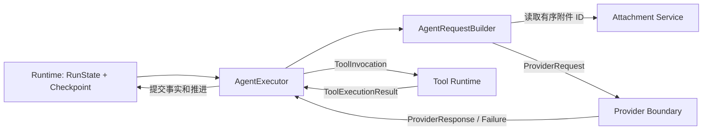

# Agent：Run 决策与编排

> [返回总览](../figura-implementation-overview.md)。本篇只描述 Agent 的编排责任；Provider 与 Tool 的完整字段分别见[Provider](provider.md)和[Tool](tools.md)，持久执行事实见[Run Runtime](runtime.md)。

## 1. 职责与边界

`AgentExecutor` 从当前 `RunState.checkpoint.next_action` 选择一步动作；`AgentRequestBuilder` 把已提交的输入、模型响应、工具结果和私有 continuation 重建为一次模型请求。Agent 协调 Provider、Tool 和 Runtime，但不拥有它们的合同或另存一份 Run 状态。当前是内部同步、非流式文本/图像 ReAct；没有独立的 Agent 持久模型。

## 2. 内部流转

1. **读取动作**：只按 checkpoint 的 `action_kind` 推进 model、provider_attempt、tool_execution、tool_attempt 或 final。终态 Run 原样返回；无法取得 Run 锁时读取当前状态。
2. **组装请求**：从唯一 `RunInput` 取文本与有序附件 ID，按 Session 解析图像；从完整已提交轮次重建原角色历史，附上固定系统指令和当前 Registry 的工具投影。校验图片和 Provider 请求限额；超限时只裁剪最旧完整轮次。
3. **模型动作**：请求构建成功后，在锁内先由 Runtime claim Provider attempt，再调用 ProviderClient 一次。响应交给 Runtime 提交；明确失败与未知结果分别处理，不自动重发已启动请求。
4. **工具动作**：模型提出的工具调用按原顺序交给 DurableToolExecutor；它通过 ToolRuntime 执行并向 Runtime 追加尝试和结果事实。完整批次提交后 Agent 才继续模型动作；未解决的工具尝试不会自动 replay。
5. **终结**：只有非空文本的 `stop` 响应成为最终答案；无效响应、预算耗尽或确定性失败进入失败终态。每 Run 最多 8 次 Provider attempt、32 个已启动逻辑工具调用。

## 3. 跨领域内容合同

| 输入或输出 | 合同 owner | Agent 的使用方式 |
|---|---|---|
| `RunState`、`ExecutionCheckpoint`、`RunInput` | [Run Runtime](runtime.md#4-完整模型字段) | 读取已提交事实和下一动作，不另建持久副本 |
| `AttachmentMetadata`、图像解析 | [附件](attachments.md#3-完整模型字段) | 按 Session 和有序 ID 取得调用期图片 |
| `ProviderRequest`、`ProviderResponse` | [Provider](provider.md#4-完整模型字段) | 组装请求、消费规范化结果；字段合同由 Provider 边界定义 |
| `ToolDefinition`、`ToolInvocation`、`ToolExecutionResult` | [Tool](tools.md#4-完整模型字段) | 投影可用工具、提交调用、消费结果 |

当前 `src/figura/agent/` 没有 Agent 自有 dataclass，因而本篇没有为编排过程虚构字段表；未来若出现独立 Agent 领域值，应先按[维护 skill](../../.codex/skills/figura-implementation-overview/SKILL.md)的归属规则判断。

## 4. 不变量、状态与依据

请求必须从已提交 Run 事实重建；图片字节只存在于调用期 Provider 消息；Provider 和工具的不确定外部效果不会因读取或普通执行循环而自动重试。当前新 Figura 无图表分析工具或 Gateway 调用入口。代码：[AgentExecutor](../../src/figura/agent/executor.py)、[AgentRequestBuilder](../../src/figura/agent/request.py)；主规格：[Agent ReAct](../../openspec/figura/openspec/specs/agent-react-execution/spec.md)。
