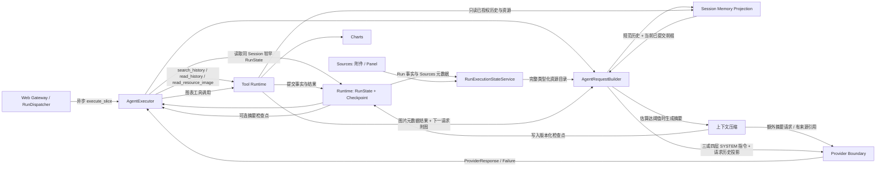

# Agent：Run 决策与编排

> 更新日期：2026-10-10。[返回总览](../figura-implementation-overview.md)。本篇说明 Agent 编排及其调用期派生运行态；Provider 与 Tool 的完整字段分别见[Provider](provider.md)和[Tool](tools.md)，附件和 Panel 持久模型见[Sources](sources.md)，Run 执行事实与摘要检查点见[Run Runtime](runtime.md)，规范历史和来源检索见[Session Memory](memory.md)，网页调用和公开投影见[Web 边界](web.md)。

## 1. 职责与边界

`AgentExecutor` 按当前 `RunState.checkpoint.next_action` 推进模型、工具和终结动作。`AgentRequestBuilder` 从 Run 事实重建规范 Session 历史、当前 Run 已提交前缀和 Agent 的完整 `RunExecutionState` 资源目录。每个普通 Provider 请求都先构造独立历史用户输入区，按 Run ordinal 保留每个此前 Run 的完整文本、有序附件 ID 和输入来源引用；当前 Run 输入仍以原生用户消息出现。若 Runtime 有 `SessionContextCheckpoint`，实际 Provider 请求会以摘要替代覆盖的旧 Assistant/工具过程，同时保留覆盖游标之后的原文、历史输入区、当前 Run 输入和已提交前缀。保留为原文的历史过程前会插入对应 Run 的输入来源定位。摘要覆盖可落在最近一个已完成 Run 的中间，但只会跨过完整交互边界；完整目录仍保留授权前缀内的附件、Panel、OCR、测量、ChartFigure 与 ChartRender 六类资源，prompt 只投影相关定位信息，完整资源仍可由类型化引用按需读取。容量已配置且实际请求估算达到约 80% 阈值时，Agent 才尝试压缩。运行事实、图像资源与工具过程分别经历史或图片读取工具显式取回，不会重新执行历史工具。Runtime 持有摘要检查点与压缩操作状态，`RunExecutionState` 不保存摘要或删减完整资源目录。

Agent 每次组装三层或四层有序 SYSTEM 指令：稳定规则、当前工具目录、可选的来源关联摘要、最终的资源/执行状态索引。图片读取由 `RunExecutionImageReader` 统一执行：核对目标 Session 和资源引用，再由 Sources 解析授权附件、Panel 或已存 PNG；OCR/测量标注图在内存重建，ChartFigure 本身要求显式调用渲染工具。当前 Run 最新已提交工具批次中的成功 `load_image` 原图、OCR/测量标注图和 `render_chart_figure` PNG，会在紧接着的 Provider 请求中按调用顺序加入；历史图像只有显式调用读取工具才会附加到下一次请求。兼容 Provider continuation 由请求边界按源响应重放，不属于 Memory 消息或 SYSTEM 正文。Agent 执行是同步、非流式文本/图像 ReAct；Web Gateway 通过有界 `RunDispatcher` 异步调用 `execute_slice(session_id, run_id)`，HTTP handler 不直接请求模型。Agent 没有独立的持久模型。

## 2. 内部流转

1. **取得所有权并读取动作**：每个 execute_slice 在一个外部动作结束并提交稳定 checkpoint 后释放 Runtime RunExecutionOwnership；每步重读 RunState.stop_request，接受停止后在步骤边界 interrupted，已开始动作仍提交真实结果；只按 checkpoint 的 `action_kind` 推进 model、provider_retry、provider_attempt、tool_execution、tool_attempt 或 final。终态 Run 原样返回；无法取得 Run 锁时读取当前状态。
2. **读取规范历史**：到达 model action 后，Agent 经 RunCoordinator/Store 在一致快照中读取同 Session、较小 ordinal 的 RunState。Runtime 验证 ordinal 连续、先前 Run 已终结和历史完整性；合法异常尾部再由 Memory 转成有来源引用的 outcome。
3. **投影、按需检索并组装请求**：Memory 从持久 Run 事实构建规范历史；每个普通请求先独立附上所有先前 Run 的完整用户输入、附件 ID 和 message source ref，不受摘要覆盖游标影响。当前 Run 输入继续作为原生用户消息。已有 Runtime 摘要检查点则用摘要替代覆盖范围内的 Assistant/工具过程，并从精确覆盖游标之后保留原始交互。Provider 先准备完整请求并估算；仅当有效容量已配置且比例达到约 80% 时，Agent 按 `floor(C/10)` 计算 raw tail 与 rolling summary 两个独立历史过程目标，再从最近的完整交互开始向前选择原始后缀。原始过程前添加一条带 Run ID、序号和原始输入引用的定位消息；过程估算计入定位消息，不重复计算另行发送的完整输入正文。由此可将最近一个已完成 Run 的早期交互放入摘要，同时保留该 Run 的新近交互。摘要只能覆盖完整边界：一个助手工具调用批次和它全部已提交结果不可拆分；如果最新交互单独超过预算，仍完整保留。活动 Run 与失败／中断 Run 均在摘要范围外。两个 10% 数值分别描述历史过程选择和摘要参考长度，不是整条请求的 context 目标或硬上限；完整请求估算还包括历史输入、指令、工具、资源和活动 Run。容量未知或估算不可用时不新触发摘要。摘要请求需在 dispatch 前完成准备，且本地估算的输入加最大 completion tokens 不超过该操作冻结的容量，否则不发摘要请求并回退；摘要 Markdown 每次写入冻结的容量与 `floor(C/10)` 近似目标，目标是软性的，不要求填满或截断有效 JSON。成功后重建、重新估算 ordinary request。摘要按 message/tool result 来源引用校验后由 Runtime 检查点保存。无可压缩交互时沿用旧 checkpoint（若无则使用完整历史）；摘要失败时当前请求走安全回退且不覆盖旧检查点。运行时资源目录仍由 `RunExecutionStateService` 完整重建，提示层仅投影相关引用和状态；需要旧消息／结果或图片时由模型显式调用只读工具，工具读取不会重跑旧操作。摘要、历史事实与资源元数据均作为不可信数据；continuation 只按源响应关联。
4. **模型动作**：组装请求后 Agent 创建 Provider client，调用 `prepare` 完成全量请求校验及 Provider 专属 payload 准备，成功后才在锁内复查 Run/checkpoint、由 Runtime claim attempt，再 `dispatch` 同一份 prepared payload。已知 prepare 失败由既有 `terminal_message` 保存白名单中文原因，terminal code 为 `execution_failed`，不创建 attempt、不发送网络请求；未识别异常使用通用失败文案。准备阶段的对象不持久化，client 最终关闭。响应交给 Runtime 提交；明确失败与未知结果分别处理，不自动重发已启动请求。
5. **工具动作**：模型提出的工具调用按原顺序交给 DurableToolExecutor；它通过 ToolRuntime 执行并向 Runtime 追加尝试和结果事实。`assemble_chart_figure` 接受完整 Figure 输入，委托 Charts 校验，再以新鲜同 Session RunExecutionState 核对所有测量引用；任一引用未知、失败、未提交或跨 Session 时整体失败。`render_chart_figure` 只接受已接受的同 Session Figure 引用，通过 Charts 生成 PNG 并委托 Sources 按本次 Run/call 身份保存；通用 ToolResultFact 仅保存摘要。完整批次成功提交后，Agent 可在紧接的 Provider 请求中附加 PNG 图像；既有运行事实以外不再建独立 Figure 或渲染表。未知工具在 owner 释放后依据分类逐调用恢复；安全读/本地幂等写最多两次自动 replay，无可信核对 adapter 时安全失败。恢复一步后回到统一循环检查停止，不直接跑完整批次。
6. **终结**：只有非空文本的 `stop` 响应成为最终答案；无效响应或确定性失败进入失败终态。正常 Run 不设累计 Provider、工具、token 或时间配额；每个网络操作最多 4 attempts，未知工具每逻辑调用最多 3 attempts。

### 网络恢复与执行切片

初次模型请求在 prepare 后把 resolved options、endpoint digest、原生 wire digest 和图像 metadata/digest 绑定到当前 record/tool prefix。重试从同一前缀重建，使用冻结 options；endpoint、图像内容、工具合同或 wire 发生变化时拒绝发送。失败等待动作不进入 prompt。每个 slice 最多 dispatch 一次模型或 handler；原生 handler 未返回时继续持有 owner。同步 `execute` 是外层 driver，在 owner 外等待到期或停止并继续执行；Gateway 使用 slice 配合公平调度。

### 上下文压缩与请求投影

上下文估算只用于决定是否生成摘要，不是 Run 预算或请求硬上限。Provider 按实际准备请求估算输入；只有选中 Provider/model 配置了有效 `context_window_tokens`、估算可用且占比达到约 80% 时，Agent 才考虑额外摘要调用。容量为 `C` 时，历史 raw tail 与 rolling summary 目标分别为 `floor(C/10)`；例如 200,000 容量得到 20,000 与 20,000。raw tail 只计 Assistant/工具过程及每个 Run 的输入定位消息，不重复计算另行发送的历史输入正文；历史输入区会完整携带每个先前 Run 的原文与附件 ID。摘要 Markdown 指令每次带入冻结容量及摘要目标，目标表示完整摘要 JSON 的近似长度，是软提示，不是输出 token cap。两个数值仅描述历史选择和摘要长度参考，不宣称完整请求（含 instructions、tools、历史输入、当前 Run 输入、图像和资源）只占 20%。容量未知或估算不可用时不新触发压缩；已有有效 checkpoint 仍可用于后续请求。当前阈值与配置字段由[Provider](provider.md#本地上下文估算)定义。

`select_compaction_coverage` 从连续的 completed 历史 Run 中生成完整交互单元，按 token 估算保留近期原始后缀；压缩侧因而可以进入最新 completed Run 的较早交互。工具调用批次及全部已提交结果作为整体处理；最新单个交互即使超过 raw tail 目标也不拆分。活动 Run 和异常 Run 尾部始终保留在 raw projection。摘要请求使用当前选定 Provider/model，禁止工具调用，只接受符合 v2 JSON 合同且每条非空摘要都引用授权 `MessageSourceRef` 或 `ToolResultSourceRef` 的文本结果。v2 将当前目标、约束、决定、事实、完成／进行中／待办／阻塞、未决问题、资源和未接受提议放进独立字段；待办只记录用户明确要求或接受的未完成工作。提示词写入本次冻结容量及其 10% 近似长度目标，作为软参考指导组织摘要；可以偏离目标，不要求填满，也不截断有效 JSON。每次 dispatch 前，Agent 以已准备摘要请求的输入估算加最大 completion tokens 对照操作冻结容量；不满足时不发送摘要请求，保留旧 checkpoint 并走安全回退。Run outcomes 与来源引用一并写入 Runtime 的 [`SessionContextCheckpoint`](runtime.md#sessioncontextcheckpoint)；压缩操作冻结容量、两项预算、精确覆盖坐标与请求 descriptor，由 [`ContextCompactionOperation`](runtime.md#contextcompactionoperation) 恢复。普通请求在压缩后仍会重新准备和估算，不迭代删减或强制达到某一整体占用比例。

#### 压缩选择值（调用期）

以下冻结 dataclass 只在 Agent 规划和构建摘要请求期间存在，不进入 RunState、SQLite 或 Web DTO。字段的计算者与消费边界如下；持久覆盖游标和预算归 Runtime 的 [`ContextCompactionOperation`](runtime.md#contextcompactionoperation)。

| 完整字段路径 | 类型 | 默认 | 含义与约束 | 写入 → 读取/持久化 |
|---|---|---|---|---|
| `ContextHistoryBudgets.context_capacity_tokens` | `int` | 必传 | 当前选中 Provider 的有效正整数容量 `C` | Provider profile → Agent 计算；不持久化 |
| `ContextHistoryBudgets.raw_history_tokens` | `int` | 必传 | `floor(C / 10)`；选择近期原始历史交互后缀 | Agent 计算 → coverage selector；冻结副本写入 Runtime operation |
| `ContextHistoryBudgets.summary_tokens` | `int` | 必传 | `floor(C / 10)`；作为摘要完整 JSON 的近似长度参考，渲染进压缩 Markdown；软目标，不是最大长度 | Agent 计算 → Runtime operation plan 与摘要请求指令 |
| `CompactionSelection.selected_run_states` | `tuple[RunState, ...]` | 必传 | 按序包含本次新增摘要覆盖到的闭合历史 Run；末尾 Run 可只取其已闭合前缀 | Agent selector → summary request builder；不持久化 |
| `CompactionSelection.covered_run_id` | `str` | 必传 | 本次覆盖截止 Run 的 opaque ID | Agent selector → ContextCompactionOperation；Runtime 持久化 |
| `CompactionSelection.covered_run_ordinal` | `int` | 必传 | 截止 Run 在 Session 内的顺序 | Agent selector → ContextCompactionOperation；Runtime 持久化 |
| `CompactionSelection.covered_record_sequence` | `int` | 必传 | 截止 Run 中最后一条被覆盖的记录序号，必须位于完整交互边界 | Agent selector → ContextCompactionOperation；Runtime 校验并持久化 |
| `CompactionSelection.covered_tool_sequence` | `int` | 必传 | 截止边界之前已覆盖的最后一个工具事实序号，不可截断工具批次 | Agent selector → ContextCompactionOperation；Runtime 校验并持久化 |

既有 checkpoint 保持原 JSON 和来源引用，可继续进入普通请求；不会在读取时做强制迁移。下一次压缩请求只把旧摘要内容、来源引用和新增历史提供给模型，不暴露内部存储版本；模型按来源把仍有效内容整理为完整 v2 结构，随后写入版本 2 checkpoint。摘要操作的请求绑定也使用 v2 身份；数据库表不变。格式和引用校验不能证明摘要语义正确，关键事实仍可通过来源引用和历史工具读取原文核对。

摘要成功后，请求投影只移除覆盖游标之前、已由摘要表示的交互；若覆盖截止点位于某 Run 中间，同一 Run 截止点之后的交互仍作为原文保留，再接续更新的历史与当前 Run。摘要失败、输出无效、引用未授权或四次物理 attempt 耗尽时，当前请求按完整规范历史重建；已有 checkpoint 不被覆盖。Provider retry 会复用绑定中的 `full`、`checkpoint` 或 `fallback` 投影及对应 checkpoint revision，不在重试中另做决定。`RunExecutionState` 始终包含完整授权资源目录，它不是压缩存储；prompt 的资源索引只列出近期、摘要引用或当前上下文相关的定位信息。摘要本身及工具取回的历史内容均是不可信数据。

历史按需读取由[Session Memory](memory.md#搜索读取与历史图像边界)定义来源引用、授权前缀和检索边界，由[Tools](tools.md#9-session-历史读取工具)定义模型可调用的参数与结果。模型可先用 `search_history` 获取短摘录和引用，再用 `read_history` 读取原始消息、工具结果或资源元数据；`read_resource_image` 仅将获准图像附加到下一次 Provider 请求。图片读取不会因摘要/资源索引出现就自动发生。

### 提示分层与代码职责

每次普通模型请求包含三层基础 `InstructionBlock(SYSTEM)`；使用摘要检查点时在工具目录之后、资源/执行索引之前增加摘要层，因此总数为三层或四层。`image_feedback.md` 与四份基础规则共同组成第一层稳定指令；每张实际回传的图像前还会附加该类型的一句局部 Cue。这些都是 `ProviderRequest` 的调用期内容，不是 Memory 消息、Run 字段或持久 Prompt 模型。

| 顺序 | 来源 | 内容与边界 |
|---|---|---|
| 1. 稳定规则 | 四份基础资产 `agent.md`、`evidence.md`、`workflow.md`、`response.md`，随后加入 `image_feedback.md`，由 `loader.py` 固定载入 | 职责、证据、工作流、回答规则与四类图像观察政策；不包含本次用户输入、工具状态或资源值 |
| 2. 当前工具目录 | 本次请求的 `ToolRegistry`，由 `tools.py` 投影 | 按注册顺序列工具名称和描述；参数以同请求 `ProviderRequest.tools` Schema 为准 |
| 3. 可选摘要索引 | Runtime 的 `SessionContextCheckpoint`，由 `execution.py` 投影 | 自动摘要、覆盖边界、revision 和来源引用；全体内容作为不可信历史数据，必要时通过历史工具核对原始事实 |
| 最后一层：资源/执行状态索引 | `RunExecutionState` 与 Memory 的异常 outcome，由 `execution.py` 投影 | 只列请求相关资源引用、精简状态和合法异常状态；不替代完整服务端资源目录或闭合 ToolMessage |

目录中的文件名、标题、OCR 片段、摘要、检索结果和工具观察均为数据而非指令。工具目录说明不能扩展或覆盖原生工具 Schema。指令块每次按权威运行态重建，不写入 Run facts；Provider 的 `InstructionBlock` 字段合同由[Provider 专题](provider.md#4-完整模型字段)拥有。

四份基础规则分别由 `agent.md` 管目标与职责，`evidence.md` 管来源、候选观察、缺失值和坐标，`workflow.md` 管按需读取、完整新 Figure 与结束路径，`response.md` 管实际交付及完成阶段；`image_feedback.md` 集中定义原图、OCR 标注图、测量标注图和生成图的观察规则与邻近 Cue。工具的详细字段解释留在原生参数 Schema，SYSTEM 工具目录只列名称与说明。描述性新标题/轴名可依数据拟定，不得伪称原图标签或补造单位。

摘要请求仅加载独立的 [`compaction.md`](../../src/figura/agent/prompting/assets/compaction.md)，带一个来源 JSON 文本消息，无工具、无图像；普通请求不加载其 JSON-only 输出规则。资产加载失败在摘要准备边界映射为既有 `invalid_summary_input` fallback，不 dispatch 空指令请求，也不覆盖旧检查点。摘要实际指令和 `context-compaction-v2` registry identity 参与 `prompt_digest`；摘要 request binding 记录合同版本 2。资产或合同身份变化后，已绑定请求仍进行严格核验，不匹配则 `summary_binding_mismatch` 回退。

### 图像回传观察引导

当前工作树新增 [image_feedback.md](../../src/figura/agent/prompting/assets/image_feedback.md)，其完整内容加入第一 SYSTEM 层，参与既有 prompt_digest。原有四份规则相对顺序保持不变，摘要请求只加载 compaction.md。资产使用固定的 Common、Original、OCR、Measurement、Rendered 章节，后四类各包含非空 Rules/Cue；缺失、重复或空章节抛出 PromptAssetError。

完整工具批次提交后，图像通过原有授权和结果一致性校验，再在每个实际 ImageBlock 前加入一个 TextBlock：JSON 身份数据及一至两句系统观察提醒。提醒是调用期投影，不写入 Run facts，不产生检查状态或额外 Provider 请求。没有实际图片的 JSON 工具结果不产生局部提醒。

| 类型 | 关注内容 |
|---|---|
| original | 原图/Panel 的任务相关结构、轴、标签和图例 |
| ocr | 文字覆盖、框位置、识别内容和关联；标注不保证识别正确 |
| measurement | 遗漏、重复、图例误检、类别/系列对应与校准依据；几何不是业务数值 |
| rendered | 目标和数据对应、图例、文字遮挡、裁切和布局；绘制成功不是审核通过 |

邻近身份对象的完整字段由 Agent 构造并序列化为 JSON，Provider 只按 TextBlock 文本消费：

| 字段 | 类型/约束 | 来源与生命周期 |
|---|---|---|
| feedback_kind | original/ocr/measurement/rendered，必填 | 已授权资源的 content 类型；仅 prompting 内部分类，不改 ImageBlock.observation_kind |
| resource_ref | ImageResourceRef 或 ToolResourceRef 的完整 JSON，必填 | 与相邻 ImageBlock.source_ref 一致；历史图片保留原始 run_id/call_id |
| trigger_call.run_id | 非空字符串，必填 | 本次工具调用所属 Run |
| trigger_call.call_id | 非空字符串，必填 | 产生或加载本图片的本次工具调用 |
| trigger_call.tool_name | 非空字符串，必填 | 本次工具名称；历史重载为 read_resource_image |

图片中的文字与标记、资源名称都作为不可信数据。read_resource_image 按被读取资源类型复用规则，不按读取工具名统一分类；历史完整 JSON 或源图缺失时按需取回，不因提示自动加载。source 原图去重、图片数量与调用顺序沿原有实现。模型自行选择补证据、修正、继续或交付，无强制审核报告。相同前缀与资产确定性重建；资产变化仍遵循严格请求绑定校验，不静默更换已绑定请求。

本功能见已归档 change [add-figura-image-feedback-guidance](../../openspec/figura/openspec/changes/archive/2026-10-08-add-figura-image-feedback-guidance/proposal.md)，主规格已同步。离线请求验证证明提醒送达与身份关联，不代表真实模型发现问题的准确率；真实 Provider 探测被 HTTP 403 拒绝，未取得模型行为证据，详情见[评测记录](../evaluations/image-feedback.md)。

`observations.py` 负责与 SYSTEM 指令分开的图像观察选择和 Provider 图像消息构造。`AgentRequestBuilder` 组合规范历史/请求投影、资源索引、指令、观察图像、Provider tools/options，不负责最终 Provider 校验；`AgentExecutor` 在 attempt claim 前调用 `ProviderClient.prepare`。

| 文件 | 职责 |
|---|---|
| [request.py](../../src/figura/agent/request.py) | 协调 Memory、Runtime checkpoint、完整资源目录、Registry、提示层、观察图像与源响应续接，组装 ProviderRequest |
| [executor.py](../../src/figura/agent/executor.py) | 估算阈值判断、摘要请求与检查点复用；管理 prepare → checkpoint 复查 → attempt claim → dispatch/commit |
| [context_compaction.py](../../src/figura/agent/context_compaction.py) | 选择可压缩 Run 并验证摘要 JSON 与来源引用 |
| [prompting/loader.py](../../src/figura/agent/prompting/loader.py) 与 [assets](../../src/figura/agent/prompting/assets/) | 按固定顺序载入四份基础中文规则与 `image_feedback.md` 图像观察政策；摘要请求独立载入 `compaction.md`。固定章节或资产缺失、重复、不可读或为空时抛出 `PromptAssetError` |
| [prompting/tools.py](../../src/figura/agent/prompting/tools.py) | 从当前 ToolRegistry 生成工具名称/描述目录 |
| [prompting/execution.py](../../src/figura/agent/prompting/execution.py) | 生成可选摘要指令与请求相关的资源/异常状态 JSON 索引 |
| [prompting/observations.py](../../src/figura/agent/prompting/observations.py) | 选择当前 Run 上一完整工具批次的图像观察并构造 Provider 消息 |

## 3. 跨领域内容合同

| 输入或输出 | 合同 owner | Agent 的使用方式 |
|---|---|---|
| `RunState`、`ExecutionCheckpoint`、`RunInput` | [Run Runtime](runtime.md#4-完整模型字段) | 读取已提交事实和下一动作，不另建持久副本 |
| `SessionHistory`、消息投影、来源引用与异常 outcome | [Session Memory](memory.md#4-完整模型字段) | 消费规范历史，并按 checkpoint 与检索合同构造请求投影；来源引用只定位原始 Runtime 事实 |
| `AttachmentMetadata`、`PanelPoint`、`PanelRecord` | [Sources](sources.md#3-完整模型字段) | 读取 Session 资源；只有已提交分割结果关联的 Panel 才能进入清单 |
| `RunExecutionState`、类型化引用与资源内容模型 | [本篇第 4 节](#4-runexecutionstate-资源合同与完整字段) | Agent 按 Runtime 已提交前缀与 Sources 资源重建调用期目录；字段和不变量由 Agent 拥有，嵌套值链接至 Sources、Tools、Charts owner |
| `ChartSpecData`、`ChartFigure` 与布局模型 | [Charts](charts.md#3-chartspec-v2-字段) 与 [ChartFigure](charts.md#4-chartfigure-v2-字段与测量引用) | Agent 暴露组装工具；内容字段与纯校验由 Charts 定义 |
| 图像/测量工具、`assemble_chart_figure` 与 `render_chart_figure` | [Tool 图像、测量和画布工具合同](tools.md#7-图表画布组装工具) | Agent 暴露工具定义并协调调用；运行态引用解析、结果字段与恢复类别由 Tool 合同定义 |
| `ProviderRequest`、`ProviderResponse` | [Provider](provider.md#4-完整模型字段) | 组装请求、消费规范化结果；字段合同由 Provider 边界定义 |
| `ToolDefinition`、`ToolInvocation`、`ToolExecutionResult` | [Tool](tools.md#4-完整模型字段) | 投影可用工具、提交调用、消费结果 |

资源目录与内容均为 Agent 派生状态 dataclass，只在调用期重建，不是独立持久事实。Runtime 仍拥有 Run 生命周期、完整工具调用/尝试/结果事实；Sources 拥有附件/Panel 元数据和图像文件。网页创建 Run 后由 Gateway Dispatcher 调度。当前工作树 Gateway Registry 为 `figura-web-v10`，按序注册九个图像、历史、OCR、测量和画布工具；图表测量只有 `measure_chart` 一个入口，成功结果使用 schema v3，并由顶层 `chart_type` 选择十类观察结构。启动时仍绑定 v9 的活动 Run 会阻止 v10 激活；schema_version 2 的历史测量事实保留在 Runtime，但不转换为当前类型化资源。资源模型详见本篇第 4 节与[RunExecutionResources 主规格](../../openspec/figura/openspec/specs/run-execution-resources/spec.md)。画布、渲染及历史读取工具的完整输入/输出分别见[画布组装](tools.md#7-图表画布组装工具)、[图表渲染](tools.md#8-图表渲染工具)和[Session 历史读取](tools.md#9-session-历史读取工具)。

## 4. RunExecutionState 资源合同与完整字段

`RunExecutionStateService` 将目标 Run 的当前已提交前缀、较早终态 Run 和 Sources 权威资源重建为调用期目录。目录严格只有 `run_id` 与有序 `resources` 两个字段；每条 `ExecutionResource` 严格只有 `ref` 与 `content`。类型由 `ref.kind` 判别，图片字节、文件路径和第二份耐久结果存储均不进入目录。v2 图表资源合同见[RunExecutionResources 主规格](../../openspec/figura/openspec/specs/run-execution-resources/spec.md)。

每个资源模型说明中的“字段流转”适用于其表内全部字段，字段行继续明确具体类型、构造默认、语义约束与字段特有的读取规则；嵌套模型的完整字段仍由其 owner 专题定义。

### 引用联合类型与目录操作

`ResourceRef = ImageResourceRef | ToolResourceRef`；`ImageResourceKind = Literal["attachment", "panel"]`，`ToolResourceKind = Literal["ocr", "measurement", "chart_figure", "chart_render"]`，`ResourceKind` 是上述 kind 的并集。图片资源由 opaque `id` 标识；工具资源由类型、来源 Run 与逻辑调用 ID 联合标识，所以不同 Run 即使复用 `call_id` 也不冲突。`RunExecutionState.list(kind=None)` 返回稳定顺序的全量资源或按 kind 筛选结果；`get(ref)` 只按完整引用精确查找，缺失时返回有界 not-found `RunError`。

### `ImageResourceRef`

图片资源身份；Attachment 与 Panel 的身份由 Sources 生成并保持不透明。**字段流转：**`RunExecutionStateService` 从 Run 输入和已验证的 Sources 记录构建；Sources ID 是身份权威，Panel 还要求已提交成功分割事实；`AgentRequestBuilder`、`RunExecutionImageReader` 与图像工具读取；资源目录不作为整体公开。**定义：**[execution_resources.py](../../src/figura/agent/execution_resources.py)。

| 完整字段路径 | 类型 | 构造默认 | 含义、约束与流转 |
|---|---|---|---|
| `ImageResourceRef.kind` | `Literal["attachment", "panel"]` | 必传 | 区分两种 Sources 图片资源，并与对应内容类型匹配；目录重建 → ImageReader 与图像工具；不单独持久化 |
| `ImageResourceRef.id` | `str` | 必传 | 非空 opaque Attachment ID 或 Panel ID；目录精确授权键，不包含文件名或路径 |

### `ToolResourceRef`

调用产物的稳定身份。**字段流转：**`RunExecutionStateService` 从匹配的工具事实构建；Run ID、call ID 和工具类型以 `ToolCallFact`/`ToolResultFact` 为权威；Agent 请求索引、工具引用校验及 Web 的安全渲染摘要读取；不直接公开。**定义：**[execution_resources.py](../../src/figura/agent/execution_resources.py)。

| 完整字段路径 | 类型 | 构造默认 | 含义、约束与流转 |
|---|---|---|---|
| `ToolResourceRef.kind` | `Literal["ocr", "measurement", "chart_figure", "chart_render"]` | 必传 | 选择唯一资源内容模型；值域由 `ToolResourceKind` 固定 |
| `ToolResourceRef.run_id` | `str` | 必传 | 非空来源 Run opaque ID；与 `call_id` 联合区分 Session 内不同 Run 的产物 |
| `ToolResourceRef.call_id` | `str` | 必传 | 非空逻辑工具调用 ID；来自 `ToolCallFact.call_id`，不单独持久化 |

### `AttachmentContent`

Sources 附件元数据在 Run 资源目录中的只读引用；图片字节仍由 Sources 文件服务持有。**字段流转：**`RunExecutionStateService` 从 SessionSnapshot 的附件元数据构建；Sources `attachments` 记录权威；请求清单、`load_image` 与 ImageReader 读取；仅经现有附件 DTO 投影安全元数据，不公开整个资源目录。完整源模型见[Sources](sources.md#3-完整模型字段)。

| 完整字段路径 | 类型 | 构造默认 | 含义、约束与流转 |
|---|---|---|---|
| `AttachmentContent.session_id` | `str` | 必传 | 所属 Session；构建时须与目标 Session 相同，用于来源授权 |
| `AttachmentContent.filename` | `str` | 必传 | 安全显示文件名；Provider 文本清单与 `load_image` 成功结果读取 |
| `AttachmentContent.media_type` | `str` | 必传 | Sources 已确认的图像媒体类型；ImageReader 对照实际文件 |
| `AttachmentContent.byte_count` | `int` | 必传；正整数 | Sources 元数据记录的精确字节数；ImageReader 对照实际字节长度 |
| `AttachmentContent.created_at` | `str` | 必传 | Sources 的 UTC 创建时间文本；只读目录元数据 |

### `PanelContent`

只有分割成功结果已提交、且 Sources PanelRecord 与工具结果完全一致后才构造。**字段流转：**`RunExecutionStateService` 以成功 `decompose_chart_image` 事实和 Sources PanelRecord 配对构建；PanelRecord 是元数据权威，成功结果是进入目录的提交门槛；请求清单、图像观察工具、ImageReader 和 Panel Web 投影读取；不会公开整个资源目录。多边形坐标的完整值语义见[Sources 的 PanelPoint](sources.md#3-完整模型字段)。

| 完整字段路径 | 类型 | 构造默认 | 含义、约束与流转 |
|---|---|---|---|
| `PanelContent.session_id` | `str` | 必传 | 所属 Session；ImageReader 每次解析前核对 |
| `PanelContent.run_id` | `str` | 必传 | 创建 Panel 的 Run opaque ID；须与成功分割结果及 Sources 记录相同 |
| `PanelContent.source_attachment_id` | `str` | 必传 | 被分割源 Attachment 的 opaque ID；来源字段由 PanelRecord 权威 |
| `PanelContent.name` | `str` | 必传 | Panel 显示名；须与模型提议和 Sources 记录一致 |
| `PanelContent.points` | `tuple[PanelPoint, ...]` | 必传 | 完整有序归一化多边形；元素字段与坐标边界归[Sources](sources.md#3-完整模型字段)，资源目录不改写几何 |

### `OcrContent`

单次已提交 OCR 调用的完整只读资源。**字段流转：**`RunExecutionStateService` 从 ToolCallFact、ToolAttemptStartedFact 和 ToolResultFact 重建；调用/尝试/结果事实是权威；Agent 请求索引与 `RunExecutionImageReader` 读取；完整结果另经 Memory ToolMessage 进入 Provider 上下文，不向 Web 公开原始 OCR 结果。Web 只可按需取得受授权的临时观察图。结果 schema 的全部嵌套字段由[Tools：extract_text 结果合同](tools.md#6-图像与测量工具合同)拥有；安全错误由[ToolExecutionError](tools.md#4-完整模型字段)拥有。

| 完整字段路径 | 类型 | 构造默认 | 含义、约束与流转 |
|---|---|---|---|
| `OcrContent.attempt_id` | `str` | 必传 | 与匹配 ToolResultFact 对应的已启动工具尝试 ID |
| `OcrContent.source_ref` | `ImageResourceRef \| None` | 必传，可空 | 被扫描 Attachment/Panel 的类型化引用；成功时必有且须授权，失败时无法解析或无来源可为空 |
| `OcrContent.observation_scope` | `Mapping[str, object] \| None` | 必传，可空 | 调用使用的规范化 include/exclude polygon；成功无显式范围时为空表示整图，失败无效范围为空；完整范围合同归 Tools |
| `OcrContent.outcome` | `ToolOutcome` | 必传 | 仅 `succeeded` 或 `failed`；决定 result/error 互斥形状 |
| `OcrContent.result` | `Mapping[str, object] \| None` | `None` | 成功时为完整有界 OCR JSON，失败时为空；字段合同归 Tools，不在此复制或重算 |
| `OcrContent.error` | `ToolExecutionError \| None` | `None` | 失败时的安全结构化错误，成功时为空；字段合同归 Tools |

### `MeasurementContent`

单次 `measure_chart` 调用的完整只读资源，覆盖十类图表观察。**字段流转：**`RunExecutionStateService` 从 ToolCallFact、ToolAttemptStartedFact 和 ToolResultFact 重建；调用/尝试/结果事实是权威；Agent 请求索引、ImageReader、`assemble_chart_figure` 的引用校验和 Web 的授权观察图读取消费该资源；完整结果另经 Memory ToolMessage 进入 Provider 上下文，Web 不公开原始测量 JSON。当前结果保留 schema v3 的完整类型化 family observations；schema_version 2 的历史结果按冻结合同读取但不生成 `MeasurementContent`。重复测量仍分别保留，不折叠为图像级状态。

| 完整字段路径 | 类型 | 构造默认 | 含义、约束与流转 |
|---|---|---|---|
| `MeasurementContent.attempt_id` | `str` | 必传 | 与匹配 ToolResultFact 对应的已启动工具尝试 ID |
| `MeasurementContent.tool_name` | `str` | 必传 | 当前只接受 `measure_chart`；成功结果必须通过 schema v3 family union 校验，且 `result.chart_type` 与调用参数一致 |
| `MeasurementContent.source_ref` | `ImageResourceRef \| None` | 必传，可空 | 被测 Attachment/Panel 引用；成功时必有且须授权，失败时不授权图像读取 |
| `MeasurementContent.observation_scope` | `Mapping[str, object] \| None` | 必传，可空 | 规范化 include/exclude polygon；成功无范围表示整图，失败无效范围为空；完整合同归 Tools |
| `MeasurementContent.outcome` | `ToolOutcome` | 必传 | 仅 `succeeded` 或 `failed`；决定 result/error 互斥形状 |
| `MeasurementContent.result` | `Mapping[str, object] \| None` | `None` | 成功时保留对应工具的全部有界 JSON 结果，失败时为空；完整字段见[Tools](tools.md#6-图像与测量工具合同) |
| `MeasurementContent.error` | `ToolExecutionError \| None` | `None` | 失败时的安全结构化错误，成功时为空；完整字段见[Tools](tools.md#4-完整模型字段) |

### `ChartFigureResult`

已接受画布的完整值与校验摘要。**字段流转：**`RunExecutionStateService` 从成功装配调用参数及匹配结果重建；原始 ChartFigure 以 `ToolCallFact.arguments_json` 为权威、接受状态以成功 ToolResultFact 为门槛；Agent 资源索引、后续渲染和 Gateway 标题摘要读取；完整资源不经 Web DTO 公开。ChartFigure 的嵌套字段只在[Charts](charts.md#4-chartfigure-v2-字段与测量引用)定义。

| 完整字段路径 | 类型 | 构造默认 | 含义、约束与流转 |
|---|---|---|---|
| `ChartFigureResult.figure` | `ChartFigure` | 必传 | 从原始 assemble ToolCallFact 参数完整恢复的不可变 ChartFigure；必须通过 Charts 语义校验 |
| `ChartFigureResult.figure_digest` | `str` | 必传 | 规范 JSON 的 SHA-256；构造时须与 `figure` 实际 digest 相同 |

### `ChartFigureContent`

成功装配时含完整 ChartFigureResult，失败时只含安全错误。Figure 身份由外层 `ToolResourceRef` 给出。**字段流转：**由 `RunExecutionStateService` 从已提交的装配事实重建；运行事实权威；Agent 请求与渲染 handler 消费，Gateway 只投影与成功渲染关联的有限摘要；资源本身不公开。

| 完整字段路径 | 类型 | 构造默认 | 含义、约束与流转 |
|---|---|---|---|
| `ChartFigureContent.attempt_id` | `str` | 必传 | 已提交装配结果对应的尝试 ID |
| `ChartFigureContent.outcome` | `ToolOutcome` | 必传 | 仅 `succeeded` 或 `failed` |
| `ChartFigureContent.result` | `ChartFigureResult \| None` | `None` | 成功时必有完整 Figure 与 digest；失败时为空 |
| `ChartFigureContent.error` | `ToolExecutionError \| None` | `None` | 失败时必有安全错误；成功时为空 |

### `ChartRenderContent`

渲染调用的已提交结果及其被渲染 Figure 引用；PNG 字节不进入该内容。**字段流转：**`RunExecutionStateService` 从已提交的渲染 ToolCallFact/ToolResultFact 重建；渲染摘要以 ToolResultFact 为权威，PNG 字节以 Sources 私有文件为权威；Agent ImageReader 与 Gateway 安全摘要投影读取，只有有限摘要和经授权的内容路由公开。成功元数据字段由[render 工具结果合同](tools.md#8-图表渲染工具)定义。

| 完整字段路径 | 类型 | 构造默认 | 含义、约束与流转 |
|---|---|---|---|
| `ChartRenderContent.attempt_id` | `str` | 必传 | 已提交渲染结果对应的尝试 ID |
| `ChartRenderContent.figure_ref` | `ToolResourceRef \| None` | 必传，可空 | 被渲染 Figure 的完整类型化引用；kind 必须为 `chart_figure`；成功时必有 |
| `ChartRenderContent.outcome` | `ToolOutcome` | 必传 | 仅 `succeeded` 或 `failed`；结果与错误互斥 |
| `ChartRenderContent.result` | `Mapping[str, object] \| None` | `None` | 成功时恰含完整已提交渲染 metadata；失败时为空；字段归 Tools |
| `ChartRenderContent.error` | `ToolExecutionError \| None` | `None` | 失败时的安全结构化错误，成功时为空 |

### `ExecutionResource`

目录中的不可变资源信封；`ref.kind` 必须与 content 变体一致。**字段流转：**`RunExecutionStateService` 在装配目录时创建；身份与内容分别服从各自 owner 的权威；AgentRequestBuilder、ImageReader、工具 handler 和 Gateway projection 按需消费；不作为 API 对象直接公开。

| 完整字段路径 | 类型 | 构造默认 | 含义、约束与流转 |
|---|---|---|---|
| `ExecutionResource.ref` | `ResourceRef` | 必传 | `ImageResourceRef` 或 `ToolResourceRef`；唯一目录键，不能只按 ID 跨类型查找 |
| `ExecutionResource.content` | `ResourceContent` | 必传 | 与引用 kind 对应的六种 content 之一；所有映射/序列深冻结 |

### `RunExecutionState`

目标 Run 的调用期资源目录。附件先按较早 Run 到当前 Run 的首次输入引用排序；Panel 与工具资源按 Run ordinal、工具事实序号、调用位置和多 Panel 结果位置排序。只读取给定的先前终态 Run 和当前 Run 已提交前缀，Session snapshot 仅提供 Sources 元数据，不能推进当前 Run 前缀。**字段流转：**`RunExecutionStateService` 构建；Runtime 事实和 Sources 记录仍各自权威；AgentRequestBuilder、工具 handler、ImageReader 与 Gateway 的安全时间线/渲染摘要构造器消费；RunExecutionState 不经 Gateway 公开，也不持久化。

| 完整字段路径 | 类型 | 构造默认 | 含义、约束与流转 |
|---|---|---|---|
| `RunExecutionState.run_id` | `str` | 必传 | 当前目标 Run 的 opaque ID；由 RunExecutionStateService 从目标 RunState 确定 |
| `RunExecutionState.resources` | `tuple[ExecutionResource, ...]` | 必传 | 所有符合前缀和同 Session 授权条件的资源；引用唯一且顺序确定，不含图片字节/路径或额外副本 |

### `RunExecutionImageReader`

此 Agent 图像服务接受目标 Session、RunExecutionState 与完整类型化资源引用。Attachment/Panel 由 Sources owner 验证并读取；OCR/测量标注在内存重建；ChartRender PNG 按 ToolResultFact 的摘要校验；ChartFigure 返回显式 render-required，不隐式触发写入工具。Agent 在 Provider attempt claim 前读取并检查所需图像；Gateway 仅从 Session-scoped 只读路由请求成功 OCR/测量的观察图，并且不保存重建图像。

### 异常 Run 推进与后续请求

每个 Agent slice 先取得执行 owner，再从最新 checkpoint 决定动作。持久停止请求优先于新动作和自动 replay；无法取得 owner 时只读返回，Gateway 后续扫描再次调度。意外异常按最新 checkpoint 收敛：Provider attempt 解析为已知失败或未知结果，Tool attempt 走有限恢复，其他可终结动作安全失败；完整性、存储和不支持版本错误继续拒绝执行，不伪造恢复结果。

| 当前动作/事实 | 自动处理 | 对后续 Run 的影响 |
|---|---|---|
| 存在停止请求 | 不启动下一动作，提交 interrupted；已开始动作的真实结果可以保留 | 原用户输入、闭合历史和成功资源继续可用 |
| 无结果的 Provider attempt，原 owner 已退出 | 保存旧 unknown；有 generation-only 请求绑定则按到期策略生成新的 attempt，legacy 无绑定则终结 | 无响应时只有原输入及 RunHistoryOutcome，不发明助手答案 |
| 无结果的 Tool attempt，原 Registry 可用且 replay_safe 或 idempotent_local_write | 每步最多恢复一个调用；初次加最多两次自动 replay，共 3 次，幂等写沿原 key | 成功提交后可继续；耗尽或不满足恢复条件则保留真实异常前缀 |
| reconcile_required 且无可信核对适配器 | tool_outcome_unknown；不再次调用 handler | 不把未知效果表示为回滚或成功 |
| 较早 failed/interrupted Run 的合法不完整末尾批次 | Memory 将整个批次转成 source-linked outcome，Agent 仅放进最终资源/执行状态 SYSTEM JSON | 观察恰出现一次；不发送悬空原生 tool call/result，不重放该批次 continuation |

这里的后续对话是创建同 Session 的新 Run 使用旧事实，不是网页 retry/resume 原 Run。调用 ID 保持原 opaque 值；跨 Provider 不转换闭合原生历史或伪造所需续接，仍可能在 prepare 阶段拒绝。字段权威定义分别见 [Runtime 控制与事实](runtime.md#4-完整模型字段)、[Memory outcome](memory.md#合法异常尾部投影)和 [Web 状态](web.md#协作停止与客户端生命周期)。

## 5. 不变量、状态与依据

资源目录是调用期派生视图，不扩展 Runtime RunState，也没有独立持久化。规范历史仍来自同 Session 已提交 Run 事实；普通请求可用摘要替代已覆盖消息，提示索引只列出与当前投影相关的类型化资源引用和精简状态，不复制完整 OCR、测量、Figure 或 render JSON。原图仅在最新已提交工具批次成功 `load_image` 后回看；OCR/`measure_chart` 标注根据已提交结果临时重建；ChartRender PNG 在 Sources 读取并校验。OCR 与十类 `measure_chart` family 共用 Tools 所有的可见像素解码；范围只影响本次观察输入，不改写 Sources 原图或源坐标系。跨 Session、目标 Run 前缀外、失败观察或缺失/损坏文件不能授予图像访问；Gateway 时间线仅允许读取同 Session 下成功且来源可解析的 OCR/测量观察图，且不保存重建图像。历史 schema_version 2 测量事实保留在原始 Run 历史，但不转成当前 schema v3 `MeasurementContent`。所有 Agent 请求所需图像与 Provider 限制在 attempt claim 前校验。代码：[AgentExecutor](../../src/figura/agent/executor.py)、[AgentRequestBuilder](../../src/figura/agent/request.py)、[资源合同](../../src/figura/agent/execution_resources.py)、[资源重建](../../src/figura/agent/execution_state.py)、[统一图片读取](../../src/figura/agent/execution_images.py)、[Run Dispatcher](../../src/figura/gateway/dispatcher.py)；统一测量与资源合同见[图表家族测量主规格](../../openspec/figura/openspec/specs/chart-family-measurement/spec.md)和[Run 资源主规格](../../openspec/figura/openspec/specs/run-execution-resources/spec.md)。

四份稳定提示资产已补充六类任务目标、按需证据选择、OCR/测量不确定性、十类图表的数据表达、Figure 装配与校正、渲染回看及面向用户的限制说明；模型/工具职责和 RunExecutionState 的权威字段归属未变。[agent-react-execution 主规格](../../openspec/figura/openspec/specs/agent-react-execution/spec.md)规定稳定规则、工具目录与执行/资源索引三类基础 SYSTEM 层；启用摘要时，来源关联摘要位于资源/执行索引之前。`improve-figura-prompt-assets` 与执行策略 change 均已归档。归档记录需求演进，不代表代码已发布。

**规格状态：**Agent ReAct、Session Memory、上下文压缩、历史检索、工具运行时、图像观察解码及图表家族主规格已同步；图表家族 change 的 10 份 delta 和[历史输入保留 change](../../openspec/figura/openspec/changes/archive/2026-10-10-preserve-user-inputs-in-context-compaction/proposal.md)均已核对并归档。主规格修改与新增实现仍可能处于未提交工作树；归档 change 不代表代码已提交或发布。

协作停止、工具恢复策略和终态字段由 [Runtime](runtime.md#4-完整模型字段) 拥有；异常意图/观察字段由 [Memory](memory.md#合法异常尾部投影) 拥有。最终 SYSTEM 指令中的 `prior_run_outcomes`、摘要以及检索结果都是不可信数据，不能覆盖系统规则、证明未知调用成功或要求自动重试。当前请求按 prepare 与 Provider 实际能力校验，容量估算只触发可选摘要；摘要不修改 Run 事实，失败时回退完整历史。unexpected 退出按最新 checkpoint 处理；完整性/存储错误仍拒绝执行。停止不会强杀尚未返回的同步 handler。

提示、检索、压缩、图像观察及类型化资源合同见 [Agent ReAct](../../openspec/figura/openspec/specs/agent-react-execution/spec.md)、[上下文压缩](../../openspec/figura/openspec/specs/session-context-compaction/spec.md)、[历史检索](../../openspec/figura/openspec/specs/session-context-retrieval/spec.md)、[工具运行时](../../openspec/figura/openspec/specs/tool-runtime/spec.md)、[图像观察解码](../../openspec/figura/openspec/specs/image-observation-decoding/spec.md)和[RunExecutionResources](../../openspec/figura/openspec/specs/run-execution-resources/spec.md)主规格。结构与回归测试不证明真实模型遵循效果。
