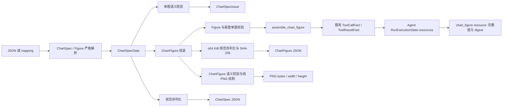

# Charts：单图与画布内容模型

> 更新日期：2026-10-02。[返回总览](../figura-implementation-overview.md)。范围：`src/figura/charts/` 负责 `ChartSpecData` 单图值、`ChartFigure` 多图画布值及纯 PNG 绘制。相关实现和后续生成布局修正均已归档；主规格的资源旧字段差异见[总览](../figura-implementation-overview.md#规格与实现的已知差异)。Charts 只负责从已校验 Figure 生成图像字节，不管理文件存储、运行事实或网页预览。

## 1. 职责与边界

`ChartSpecData` 表示一张图的语义内容；`ChartFigure` 按顺序组合 1–4 个 ChartSpecData，并保存简单双列布局和每张子图选用的测量调用引用。两者都是不可变内容值，不含独立图表 ID、来源授权或发布状态。Charts 负责纯解析、规范序列化、语义校验和纯 PNG 绘制，不读 Run、数据库或文件。模型调用 `assemble_chart_figure` 时，Tools 负责把 Figure 中的测量引用解析到同 Session 已提交成功的测量事实；成功后，完整 Figure JSON 保存在现有 `ToolCallFact.arguments_json`，精简摘要保存在 `ToolResultFact.result`，不新建 Figure 表或 Runtime fact kind。`ChartFigure` 的稳定身份是成功工具调用的 `(run_id, call_id)`，字段由[本篇第 4 节](#4-完整模型字段)定义。

```text
src/figura/charts/
  chartspec/     # 单图模型、Schema、codec、语义校验、错误和专属限制
  chartfigure/   # 画布模型、Schema、codec、校验、错误和专属限制
  limits.py      # 两个子域共用的文本与错误上限
```

`chartfigure` 组合并校验 `chartspec` 内容；`chartspec` 不依赖 `chartfigure`。两个子包各自提供自己的公开入口，根 `charts` 包不再混合导出两类 API。

## 2. 内部流转

1. **输入**：`parse_chart_spec_data_json` 拒绝重复 JSON key；`parse_chart_spec_data` 严格解析形状、类型、必填字段和未知字段，返回完整 `ChartSpecData` 或有界 `ChartSpecParseError`。解析不会自动修复缺失数据。
2. **语义校验**：`validate_chart_spec_data` 按图型检查点形状、类别/系列完整性、顺序、范围和有限数值，返回有序且最多 32 条 `ChartSpecIssue`。它不读取 Run、附件或 Evidence。
3. **规范序列化**：按版本一合同输出确定性 JSON，保持 dataset 和 categories 顺序；序列化上限 256 KiB。已接入的 Figure 工具参数仍受工具运行时更小的参数上限约束。
4. **组装画布**：`parse_chart_figure` 拒绝重复 JSON key、未知字段、非有限数值、布尔数值和超过 64 KiB 的完整 Figure；遗漏 `title` 与 `measurement_refs` 分别规范为 `""` 与空数组。`validate_chart_figure` 检查图表数、唯一 chart_id、列数、引用形状及每个嵌套 ChartSpecData 的语义，返回有界字段路径问题。
5. **验证引用与留存**：`assemble_chart_figure` 先完成 Charts 校验，再读取当前 Run 的新鲜 `RunExecutionState`，确认每个 `MeasurementRef` 对应同 Session 中已提交成功的测量资源。任一引用不满足就整体失败；成功结果返回 `(run_id, call_id)`、规范 JSON 的 SHA-256、标题和有序子图摘要。Runtime 的既有工具事实保存完整输入与成功结果；Agent 重建的 `chart_figure` 资源保留完整值和 digest，提示清单只包含精简索引，完整 Figure 输入可从普通工具调用历史读取；工具结果是摘要。
6. **绘制画布**：`render_chart_figure_image` 接收已接受的 `ChartFigure` 值并再次运行纯语义校验，按 `layout.columns` 与子图顺序绘制 bar、line、scatter 或 pie，返回 `(png_bytes, width, height)`。绘制函数不解析工具引用、不读附件或文件，也不自行保存产物；`render_chart_figure` 的调用、持久化和 Agent 回看由[Tools](tools.md#8-图表渲染工具)、[Sources](sources.md#4-存储失败与访问边界)和[Agent](agent.md#4-runexecutionstate-资源合同与完整字段)分别负责。



`Charts` 的解析、校验和绘制保持纯函数边界；Runtime 引用解析、PNG 文件保存与图片预览分别留在 Tool、Sources 与 Web。Agent 的 `chart_figure` 资源保留完整已接受 Figure 与 digest；请求提示只给精简索引，完整工具响应仍由 Memory ToolMessage 提供。资源目录是从已提交 Run 事实重建的调用期值，不复制或替代 Runtime 的权威事实。`ChartMetadata.source` 是展示文本，不是来源授权或证据。当前已可生成并预览 PNG，但尚无独立图表实体、来源证据、生成图验证或发布；边界见[总览中的规划能力](../figura-implementation-overview.md#4-规划能力与边界)。

## 3. 模型关系与约束

`ChartSpecData.dataset` 的元素是 `CategoryValuePoint | CoordinatePoint`；前者用于 bar/pie，后者用于 line/scatter。`ChartFigure.charts` 保持画布顺序，`layout.columns` 只能为 1 或 2，行数由图表数和列数计算。每个 `ChartFigureItem` 的 `measurement_refs` 可为空；非空引用只声明被选中的观察调用，不证明子图数据与测量结果数值一致。ChartSpec 字段按已同步主规格；Figure 字段按[已同步主规格](../../openspec/figura/openspec/specs/chart-figure-assembly/spec.md)；change 归档于[实施方案](../../openspec/figura/openspec/changes/archive/2026-09-29-add-figura-chart-figure-assembly/design.md)。

## 4. 完整模型字段

### ChartMetadata

图型及展示用元信息；source 不是 provenance。 **写入者：**ChartSpecData 解析/构建。**权威位置：**ChartSpecData 值内部；作为 Figure 子图时随 ToolCallFact 参数留存。**读取与公开：**纯校验、规范序列化和后续 Figure 绘制；无单独 Web DTO。[定义](../../src/figura/charts/chartspec/models.py)。

| 完整字段路径 | 类型 | 构造默认 | 含义与约束 | 写入 → 权威 → 读取/公开 |
|---|---|---|---|---|
| ChartMetadata.chart_type | ChartType | 必传 | 图型枚举 bar/line/pie/scatter | ChartSpecData 解析/构建 → ChartSpecData 值内部；作为 Figure 参数随 Run 工具事实留存 → 校验、规范序列化与 PNG 绘制 |
| ChartMetadata.title | str | '' | 图表标题；默认空文本 | ChartSpecData 解析/构建 → ChartSpecData 值内部；作为 Figure 参数随 Run 工具事实留存 → 子图标题绘制 |
| ChartMetadata.source | str \| None | None | 展示用来源文字；不等于证据或授权 | ChartSpecData 解析/构建 → ChartSpecData 值内部；作为 Figure 参数随 Run 工具事实留存 → 子图说明文字绘制 |
| ChartMetadata.note | str | '' | 展示用备注 | ChartSpecData 解析/构建 → ChartSpecData 值内部；作为 Figure 参数随 Run 工具事实留存 → 子图说明文字绘制 |

### Axis

单个坐标轴标签、类别和可选范围。 **写入者：**ChartSpecData 解析/构建。**权威位置：**Axes 值内部；作为 Figure 子图时随 ToolCallFact 参数留存。**读取与公开：**纯校验；作为 Figure 子图时参与当前 PNG 绘制。[定义](../../src/figura/charts/chartspec/models.py)。

| 完整字段路径 | 类型 | 构造默认 | 含义与约束 | 写入 → 权威 → 读取/公开 |
|---|---|---|---|---|
| Axis.label | str | 必传 | 坐标轴标签 | ChartSpecData 解析/构建 → Axes 值内部；独立调用期值不持久化，作为 Figure 子图时随 `ToolCallFact.arguments_json` 留存 → 纯校验与 ChartFigure PNG 绘制 |
| Axis.categories | tuple[str, ...] \| None | None | 可选有序类别域；无类别域时为空 | ChartSpecData 解析/构建 → Axes 值内部；独立调用期值不持久化，作为 Figure 子图时随 `ToolCallFact.arguments_json` 留存 → 纯校验与 ChartFigure PNG 绘制 |
| Axis.min_value | int \| float \| None | None | 可选数值下界 | ChartSpecData 解析/构建 → Axes 值内部；独立调用期值不持久化，作为 Figure 子图时随 `ToolCallFact.arguments_json` 留存 → 纯校验与 ChartFigure PNG 绘制 |
| Axis.max_value | int \| float \| None | None | 可选数值上界 | ChartSpecData 解析/构建 → Axes 值内部；独立调用期值不持久化，作为 Figure 子图时随 `ToolCallFact.arguments_json` 留存 → 纯校验与 ChartFigure PNG 绘制 |

### Axes

x、y 两个轴的组合。 **写入者：**ChartSpecData 解析/构建。**权威位置：**ChartSpecData.axes；作为 Figure 子图时随 ToolCallFact 参数留存。**读取与公开：**纯校验；作为 Figure 子图时参与当前 PNG 绘制。[定义](../../src/figura/charts/chartspec/models.py)。

| 完整字段路径 | 类型 | 构造默认 | 含义与约束 | 写入 → 权威 → 读取/公开 |
|---|---|---|---|---|
| Axes.x | Axis | 必传 | x Axis；完整字段见同页 | ChartSpecData 解析/构建 → ChartSpecData.axes；独立调用期值不持久化，作为 Figure 子图时随 `ToolCallFact.arguments_json` 留存 → 纯校验与 ChartFigure PNG 绘制 |
| Axes.y | Axis | 必传 | y Axis；完整字段见同页 | ChartSpecData 解析/构建 → ChartSpecData.axes；独立调用期值不持久化，作为 Figure 子图时随 `ToolCallFact.arguments_json` 留存 → 纯校验与 ChartFigure PNG 绘制 |

### CategoryValuePoint

类别和值点，用于 bar/pie。 **写入者：**ChartSpecData 解析/构建。**权威位置：**ChartSpecData.dataset；作为 Figure 子图时随 ToolCallFact 参数留存。**读取与公开：**纯校验；作为 Figure 子图时参与当前 PNG 绘制。[定义](../../src/figura/charts/chartspec/models.py)。

| 完整字段路径 | 类型 | 构造默认 | 含义与约束 | 写入 → 权威 → 读取/公开 |
|---|---|---|---|---|
| CategoryValuePoint.category | str | 必传 | 类别点的类别名 | ChartSpecData 解析/构建 → ChartSpecData.dataset；独立调用期值不持久化，作为 Figure 子图时随 `ToolCallFact.arguments_json` 留存 → 纯校验与 ChartFigure PNG 绘制 |
| CategoryValuePoint.value | int \| float | 必传 | 有限类别数值；图型专属非负/完整性规则由验证器判断 | ChartSpecData 解析/构建 → ChartSpecData.dataset；独立调用期值不持久化，作为 Figure 子图时随 `ToolCallFact.arguments_json` 留存 → 纯校验与 ChartFigure PNG 绘制 |
| CategoryValuePoint.series | str \| None | None | 可选系列名；缺省表示未命名系列 | ChartSpecData 解析/构建 → ChartSpecData.dataset；独立调用期值不持久化，作为 Figure 子图时随 `ToolCallFact.arguments_json` 留存 → 纯校验与 ChartFigure PNG 绘制 |

### CoordinatePoint

坐标点，用于 line/scatter。 **写入者：**ChartSpecData 解析/构建。**权威位置：**ChartSpecData.dataset；作为 Figure 子图时随 ToolCallFact 参数留存。**读取与公开：**纯校验；作为 Figure 子图时参与当前 PNG 绘制。[定义](../../src/figura/charts/chartspec/models.py)。

| 完整字段路径 | 类型 | 构造默认 | 含义与约束 | 写入 → 权威 → 读取/公开 |
|---|---|---|---|---|
| CoordinatePoint.x | int \| float | 必传 | 有限 x 数值；line 按系列严格递增 | ChartSpecData 解析/构建 → ChartSpecData.dataset；独立调用期值不持久化，作为 Figure 子图时随 `ToolCallFact.arguments_json` 留存 → 纯校验与 ChartFigure PNG 绘制 |
| CoordinatePoint.y | int \| float | 必传 | 有限 y 数值 | ChartSpecData 解析/构建 → ChartSpecData.dataset；独立调用期值不持久化，作为 Figure 子图时随 `ToolCallFact.arguments_json` 留存 → 纯校验与 ChartFigure PNG 绘制 |
| CoordinatePoint.series | str \| None | None | 可选系列名；缺省表示未命名系列 | ChartSpecData 解析/构建 → ChartSpecData.dataset；独立调用期值不持久化，作为 Figure 子图时随 `ToolCallFact.arguments_json` 留存 → 纯校验与 ChartFigure PNG 绘制 |

### ChartSpecData

单图不可变语义内容值，不含运行身份或来源证据。**写入者：**严格解析/调用方构建。**权威位置：**独立构建时为调用期值；作为 `ChartFigureItem.chart_spec` 时随完整 Figure 参数写入 ToolCallFact。**读取与公开：**纯校验、规范序列化与 Figure 组装；没有独立 ChartSpec 表。[定义](../../src/figura/charts/chartspec/models.py)。

| 完整字段路径 | 类型 | 构造默认 | 含义与约束 | 写入 → 权威 → 读取/公开 |
|---|---|---|---|---|
| ChartSpecData.metadata | ChartMetadata | 必传 | ChartMetadata；完整字段见同页模型 | 严格解析/调用方构建 → 当前调用期值或 Figure 参数 → 纯校验/规范序列化；Figure 内容随 Runtime 工具事实持久化 |
| ChartSpecData.axes | Axes \| None | 必传 | Axes 或空；pie 为 null | 严格解析/调用方构建 → 当前调用期值或 Figure 参数 → 纯校验/规范序列化；Figure 内容随 Runtime 工具事实持久化 |
| ChartSpecData.dataset | tuple[DataPoint, ...] | 必传 | 有序 DataPoint 联合类型，1–512 点 | 严格解析/调用方构建 → 当前调用期值或 Figure 参数 → 纯校验/规范序列化；Figure 内容随 Runtime 工具事实持久化 |
| ChartSpecData.schema_version | int | CHART_SPEC_SCHEMA_VERSION | 当前内容 Schema 版本 1 | 严格解析/调用方构建 → 当前调用期值或 Figure 参数 → 纯校验/规范序列化；Figure 内容随 Runtime 工具事实持久化 |

### ChartSpecIssue

有界图表解析或语义问题。 **写入者：**图表解析/校验。**权威位置：**调用期返回。**读取与公开：**调用方；不包含提交值。[定义](../../src/figura/charts/chartspec/errors.py)。

| 完整字段路径 | 类型 | 构造默认 | 含义与约束 | 写入 → 权威 → 读取/公开 |
|---|---|---|---|---|
| ChartSpecIssue.code | str | 必传 | 稳定错误/问题码 | 图表解析/校验 → 调用期返回 → 调用方；不包含提交值 |
| ChartSpecIssue.field_path | str | 必传 | 有界 JSON Pointer 问题路径；不包含提交值 | 图表解析/校验 → 调用期返回 → 调用方；不包含提交值 |
| ChartSpecIssue.message | str | 必传 | 有界安全错误说明 | 图表解析/校验 → 调用期返回 → 调用方；不包含提交值 |

### FigureLayout

多图画布的显式列数。行数按 `ceil(图表数 / columns)` 派生，不单独保存。**写入者：**ChartFigure 解析/构建。**权威位置：**ChartFigure.layout；Figure 作为成功工具调用时随 ToolCallFact 参数留存。**读取与公开：**纯校验与当前 PNG renderer；控制子图排布。[定义](../../src/figura/charts/chartfigure/models.py)。

| 完整字段路径 | 类型 | 构造默认 | 含义与约束 | 写入 → 权威 → 读取/公开 |
|---|---|---|---|---|
| FigureLayout.columns | int | 必传 | 1 或 2，且不得大于同一 Figure 中的图表数 | ChartFigure 解析/构建 → ChartFigure.layout → Figure 校验与当前 PNG renderer 排列子图；随 ToolCallFact 参数留存 |

### MeasurementRef

一个已选择测量工具调用的 opaque `(run_id, call_id)` 引用。Charts 只校验引用字段形状；同 Session 与成功状态由 `assemble_chart_figure` 在 Tool 边界解析。**写入者：**Figure 模型解析/构建。**权威位置：**ChartFigureItem.measurement_refs；随 ToolCallFact 参数留存。**读取与公开：**Figure 校验、组装工具；引用本身不是数值证据。[定义](../../src/figura/charts/chartfigure/models.py)。

| 完整字段路径 | 类型 | 构造默认 | 含义与约束 | 写入 → 权威 → 读取/公开 |
|---|---|---|---|---|
| MeasurementRef.run_id | str | 必传 | 测量来源 Run 的非空 opaque ID | Figure 解析/构建 → ChartFigureItem.measurement_refs → `assemble_chart_figure` 在同 Session 内核验；随 ToolCallFact 参数留存 |
| MeasurementRef.call_id | str | 必传 | 测量工具调用的非空逻辑 ID | Figure 解析/构建 → ChartFigureItem.measurement_refs → `assemble_chart_figure` 核验成功测量结果；随 ToolCallFact 参数留存 |

### ChartFigureItem

画布中的一个有序子图。每项嵌入完整 `ChartSpecData`，不另设 child title；标题来自 `chart_spec.metadata.title`。**写入者：**Figure 解析/构建。**权威位置：**ChartFigure.charts 元素；成功组装后完整保存于 ToolCallFact 参数。**读取与公开：**Figure 校验、工具摘要与后续渲染能力。[定义](../../src/figura/charts/chartfigure/models.py)。

| 完整字段路径 | 类型 | 构造默认 | 含义与约束 | 写入 → 权威 → 读取/公开 |
|---|---|---|---|---|
| ChartFigureItem.chart_id | str | 必传 | 1–64 个 ASCII 字符，匹配 `[A-Za-z0-9_-]{1,64}`；同一 Figure 内唯一 | Figure 解析/构建 → ChartFigure.charts → 校验与工具摘要；绘图按数组顺序使用子图；随 ToolCallFact 参数留存 |
| ChartFigureItem.chart_spec | ChartSpecData | 必传 | 完整有效的单图语义内容；全部字段见本页 ChartSpecData | Figure 解析/构建 → ChartFigure.charts → 嵌套单图校验、工具摘要及当前 PNG renderer；随 ToolCallFact 参数留存 |
| ChartFigureItem.measurement_refs | tuple[MeasurementRef, ...] | () | 最多 16 个不重复引用；输入可省略，规范化为空数组；顺序保留 | Figure 解析/构建 → ChartFigure.charts → Tool handler 解析 Run 事实；随 ToolCallFact 参数留存 |

### ChartFigure

版本一多图画布内容值。标题和测量引用可在输入省略并规范化为默认值；图表顺序与引用顺序均有意义。完整内容最多 64 KiB。**写入者：**Agent 模型提出、Charts 严格解析。**权威位置：**只有成功的 `assemble_chart_figure` ToolCallFact/ToolResultFact 配对使该 Figure 被接受；没有独立 Figure 表或 ID。**读取与公开：**普通工具调用历史保留完整 JSON，Agent `RunExecutionState.resources` 中的 `chart_figure` 项重建完整 Figure 与 digest；请求提示只投影精简索引。[定义](../../src/figura/charts/chartfigure/models.py)。

| 完整字段路径 | 类型 | 构造默认 | 含义与约束 | 写入 → 权威 → 读取/公开 |
|---|---|---|---|---|
| ChartFigure.schema_version | int | CHART_FIGURE_SCHEMA_VERSION | 必须为版本 1；布尔或浮点伪整数不接受 | Charts 解析/构建 → Figure 工具调用参数；成功调用使内容被接受 → Runtime 工具事实、Agent 摘要投影 |
| ChartFigure.title | str | "" | 最多 160 个 Unicode 字符；输入可省略，规范化为空文本 | Charts 解析/构建 → Figure 工具调用参数；成功调用使内容被接受 → ToolResultFact 摘要、Agent 提示清单 |
| ChartFigure.layout | FigureLayout | 必传 | 显式布局；columns 为 1–2 且不大于子图数 | Charts 解析/构建 → Figure 工具调用参数 → 校验与当前 PNG renderer |
| ChartFigure.charts | tuple[ChartFigureItem, ...] | 必传 | 1–4 个有序子图；每个 chart_id 在该 Figure 内唯一 | Charts 解析/构建 → Figure 工具调用参数 → 完整工具历史和有序摘要 |

### ChartFigureIssue

Figure 解析或语义校验产生的安全有界问题；错误不包含提交的数据内容。校验最多返回 32 项。**写入者：**Figure codec/validator。**权威位置：**调用期返回。**读取与公开：**`assemble_chart_figure` 转为有界 ToolExecutionError。[定义](../../src/figura/charts/chartfigure/errors.py)。

| 完整字段路径 | 类型 | 构造默认 | 含义与约束 | 写入 → 权威 → 读取/公开 |
|---|---|---|---|---|
| ChartFigureIssue.code | str | 必传 | ASCII 错误码，最多 64 字符 | Figure codec/validator → 调用期问题 → ToolExecutionError；不包含提交值 |
| ChartFigureIssue.field_path | str | 必传 | 最多 256 UTF-8 字节的 JSON Pointer；过长路径收敛为空 | Figure codec/validator → 调用期问题 → ToolExecutionError.field_path |
| ChartFigureIssue.message | str | 必传 | 最多 240 字符的安全说明 | Figure codec/validator → 调用期问题 → ToolExecutionError.message |

## 5. PNG 绘制边界

`render_chart_figure_image(value: ChartFigure) -> tuple[bytes, int, int]` 是 Charts 域内的纯绘制函数；它先运行 `validate_chart_figure`，无效 Figure 抛出 `ValueError`，有效时返回 PNG 字节、像素宽和高。它不接收调用方的尺寸、主题或调色参数，不读 Runtime、Sources 或文件，也不写入渲染产物。模型可见的引用校验与结果字段属于 [render_chart_figure 工具](tools.md#8-图表渲染工具)；保存 PNG 属于 [Sources](sources.md#4-存储失败与访问边界)。

绘制按 `FigureLayout.columns` 和 `ChartFigure.charts` 顺序排列 1–4 张子图；支持 bar、line、scatter 与 pie。每格固定为 6.4 × 4.8 英寸、100 DPI；Figure 标题存在时顶部再加 0.42 英寸。最大输出为 1280 × 1962 像素，编码 PNG 不超过共享 `MAX_IMAGE_BYTES`（24 MiB 减 64 字节）。每格使用固定白底、服务器字体回退和十色调色板：bar 按类别与 series 分组，line 显示点标记，scatter 显示散点，pie 从 90° 顺时针绘制。图表标题、轴标签与范围、来源文字和备注分别取自 ChartSpecData；调用者不能覆盖这些绘图策略。输出大小或尺寸不满足限制时绘制失败，不返回部分产物。

当前绘制按文字实际像素宽度换行，为总标题、各子图标题、来源/备注及绘图区分别预留空间。绘图区在文字布局之后创建，并最多三次按 tight bounding box 缩调；可用文字区域或绘图区过小、文字超出画布、坐标标签越界或饼图标签重叠时返回有界失败，不保存被裁切的成功图片。标题及说明使用普通文本模式，不将 `$` 等内容当数学表达式；没有新增模型控制的样式/尺寸字段。

饼图按每个值除以该图总量显示一位小数百分比；零值省略百分比标注。舍入后的标签合计不强制等于 100%，原 dataset 数值不改写。line 的类别轴按索引位置映射类别；这些表达合同也已写入 ChartSpec Schema 描述，帮助模型生成正确参数。

该函数仅做图形转换，不验证底层数据是否符合图像来源，也不执行生成图审核。工具调用身份、PNG 文件生命周期、运行态投影和网页预览在各自 owner 专题中描述；总流程见[系统总览](../figura-implementation-overview.md#3-跨组件内容流)。

## 6. 状态与依据

`ChartType` 的全部取值为 `bar`、`line`、`pie`、`scatter`。`DataPoint` 是上述两个点模型的联合类型。实现见 [ChartSpec 模型](../../src/figura/charts/chartspec/models.py)、[ChartSpec codec](../../src/figura/charts/chartspec/codec.py)、[ChartSpec 校验](../../src/figura/charts/chartspec/validation.py)、[ChartFigure 模型](../../src/figura/charts/chartfigure/models.py)、[ChartFigure codec](../../src/figura/charts/chartfigure/codec.py)、[ChartFigure 校验](../../src/figura/charts/chartfigure/validation.py)、[ChartFigure renderer](../../src/figura/charts/chartfigure/rendering.py)及各自的 Schema。ChartSpec 合同见[主规格](../../openspec/figura/openspec/specs/chart-spec-core/spec.md)，ChartFigure 合同见[主规格](../../openspec/figura/openspec/specs/chart-figure-assembly/spec.md)，PNG 绘制与渲染工具合同见[主规格](../../openspec/figura/openspec/specs/chart-rendering/spec.md)；assembly change 的[实施方案](../../openspec/figura/openspec/changes/archive/2026-09-29-add-figura-chart-figure-assembly/design.md)及 rendering change 的[实施方案](../../openspec/figura/openspec/changes/archive/2026-09-29-add-figura-chart-rendering/design.md)均已归档。ChartSpec Core 的原始设计见归档的[proposal](../../openspec/figura/openspec/changes/archive/2026-09-27-add-figura-chartspec-core/proposal.md)。
