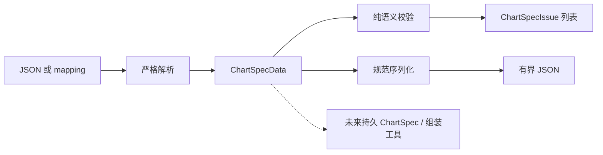

# ChartSpecData：单图内容模型

> [返回总览](../figura-implementation-overview.md)。状态：`src/figura/chartspec/` 当前工作树已有未提交代码；`add-figura-chartspec-core` 已移入未提交归档目录，主规格已出现。本文只说明这一纯内容模型，不把未来持久 ChartSpec、产物或来源合同写成已实现。

## 1. 职责与边界

`ChartSpecData` 表示一张图的语义内容，不含 Run/对象 ID、来源授权、证据、生成上下文、存储位置、渲染或发布状态。它由 metadata、可空 axes、有序 dataset 和 schema_version 组成。当前支持 bar、line、pie、scatter。它是不可变值；持久 ChartSpec envelope 与来源绑定留给后续 change。

## 2. 内部流转

1. **输入**：`parse_chart_spec_data_json` 拒绝重复 JSON key；`parse_chart_spec_data` 严格解析形状、类型、必填字段和未知字段，返回完整 `ChartSpecData` 或有界 `ChartSpecParseError`。解析不会自动修复缺失数据。
2. **语义校验**：`validate_chart_spec_data` 按图型检查点形状、类别/系列完整性、顺序、范围和有限数值，返回有序且最多 32 条 `ChartSpecIssue`。它不读取 Run、附件或 Evidence。
3. **规范序列化**：按版本一合同输出确定性 JSON，保持 dataset 和 categories 顺序；序列化上限 256 KiB。未来工具参数仍受工具运行时更小的参数上限约束。

虚线连接尚未实现。`ChartMetadata.source` 是展示文本，不是来源授权或证据。数据来源、选证与图像发布另见[后续能力边界](future-boundaries.md)。

## 3. 模型关系与约束

`ChartSpecData.dataset` 的元素是 `CategoryValuePoint | CoordinatePoint`；前者用于 bar/pie，后者用于 line/scatter。`axes` 对 pie 必须为空，对笛卡尔图需与点形状相符。各值模型的全部声明字段见下一节；可选字段的序列化省略/规范化规则以当前工作树的[主规格](../../openspec/figura/openspec/specs/chart-spec-core/spec.md)为准。

## 4. 完整模型字段

### ChartMetadata

图型及展示用元信息；source 不是 provenance。 **写入者：**ChartSpecData 解析/构建。**权威位置：**ChartSpecData 值内部；当前不持久化。**读取与公开：**纯校验/未来渲染。[定义](../../src/figura/chartspec/models.py)。

| 完整字段路径 | 类型 | 构造默认 | 含义与约束 | 写入 → 权威 → 读取/公开 |
|---|---|---|---|---|
| ChartMetadata.chart_type | ChartType | 必传 | 图型枚举 bar/line/pie/scatter | ChartSpecData 解析/构建 → ChartSpecData 值内部；当前不持久化 → 纯校验/未来渲染 |
| ChartMetadata.title | str | '' | 图表标题；默认空文本 | ChartSpecData 解析/构建 → ChartSpecData 值内部；当前不持久化 → 纯校验/未来渲染 |
| ChartMetadata.source | str \| None | None | 展示用来源文字；不等于证据或授权 | ChartSpecData 解析/构建 → ChartSpecData 值内部；当前不持久化 → 纯校验/未来渲染 |
| ChartMetadata.note | str | '' | 展示用备注 | ChartSpecData 解析/构建 → ChartSpecData 值内部；当前不持久化 → 纯校验/未来渲染 |

### Axis

单个坐标轴标签、类别和可选范围。 **写入者：**ChartSpecData 解析/构建。**权威位置：**Axes 值内部；当前不持久化。**读取与公开：**纯校验/未来渲染。[定义](../../src/figura/chartspec/models.py)。

| 完整字段路径 | 类型 | 构造默认 | 含义与约束 | 写入 → 权威 → 读取/公开 |
|---|---|---|---|---|
| Axis.label | str | 必传 | 坐标轴标签 | ChartSpecData 解析/构建 → Axes 值内部；当前不持久化 → 纯校验/未来渲染 |
| Axis.categories | tuple[str, ...] \| None | None | 可选有序类别域；无类别域时为空 | ChartSpecData 解析/构建 → Axes 值内部；当前不持久化 → 纯校验/未来渲染 |
| Axis.min_value | int \| float \| None | None | 可选数值下界 | ChartSpecData 解析/构建 → Axes 值内部；当前不持久化 → 纯校验/未来渲染 |
| Axis.max_value | int \| float \| None | None | 可选数值上界 | ChartSpecData 解析/构建 → Axes 值内部；当前不持久化 → 纯校验/未来渲染 |

### Axes

x、y 两个轴的组合。 **写入者：**ChartSpecData 解析/构建。**权威位置：**ChartSpecData.axes；当前不持久化。**读取与公开：**纯校验/未来渲染。[定义](../../src/figura/chartspec/models.py)。

| 完整字段路径 | 类型 | 构造默认 | 含义与约束 | 写入 → 权威 → 读取/公开 |
|---|---|---|---|---|
| Axes.x | Axis | 必传 | x Axis；完整字段见同页 | ChartSpecData 解析/构建 → ChartSpecData.axes；当前不持久化 → 纯校验/未来渲染 |
| Axes.y | Axis | 必传 | y Axis；完整字段见同页 | ChartSpecData 解析/构建 → ChartSpecData.axes；当前不持久化 → 纯校验/未来渲染 |

### CategoryValuePoint

类别和值点，用于 bar/pie。 **写入者：**ChartSpecData 解析/构建。**权威位置：**ChartSpecData.dataset；当前不持久化。**读取与公开：**纯校验/未来渲染。[定义](../../src/figura/chartspec/models.py)。

| 完整字段路径 | 类型 | 构造默认 | 含义与约束 | 写入 → 权威 → 读取/公开 |
|---|---|---|---|---|
| CategoryValuePoint.category | str | 必传 | 类别点的类别名 | ChartSpecData 解析/构建 → ChartSpecData.dataset；当前不持久化 → 纯校验/未来渲染 |
| CategoryValuePoint.value | int \| float | 必传 | 有限类别数值；图型专属非负/完整性规则由验证器判断 | ChartSpecData 解析/构建 → ChartSpecData.dataset；当前不持久化 → 纯校验/未来渲染 |
| CategoryValuePoint.series | str \| None | None | 可选系列名；缺省表示未命名系列 | ChartSpecData 解析/构建 → ChartSpecData.dataset；当前不持久化 → 纯校验/未来渲染 |

### CoordinatePoint

坐标点，用于 line/scatter。 **写入者：**ChartSpecData 解析/构建。**权威位置：**ChartSpecData.dataset；当前不持久化。**读取与公开：**纯校验/未来渲染。[定义](../../src/figura/chartspec/models.py)。

| 完整字段路径 | 类型 | 构造默认 | 含义与约束 | 写入 → 权威 → 读取/公开 |
|---|---|---|---|---|
| CoordinatePoint.x | int \| float | 必传 | 有限 x 数值；line 按系列严格递增 | ChartSpecData 解析/构建 → ChartSpecData.dataset；当前不持久化 → 纯校验/未来渲染 |
| CoordinatePoint.y | int \| float | 必传 | 有限 y 数值 | ChartSpecData 解析/构建 → ChartSpecData.dataset；当前不持久化 → 纯校验/未来渲染 |
| CoordinatePoint.series | str \| None | None | 可选系列名；缺省表示未命名系列 | ChartSpecData 解析/构建 → ChartSpecData.dataset；当前不持久化 → 纯校验/未来渲染 |

### ChartSpecData

单图不可变语义内容值，不含运行身份或来源证据。 **写入者：**严格解析/调用方构建。**权威位置：**当前调用期值；未来 envelope 待设计。**读取与公开：**纯校验/规范序列化；当前不进入 Run。[定义](../../src/figura/chartspec/models.py)。

| 完整字段路径 | 类型 | 构造默认 | 含义与约束 | 写入 → 权威 → 读取/公开 |
|---|---|---|---|---|
| ChartSpecData.metadata | ChartMetadata | 必传 | ChartMetadata；完整字段见同页模型 | 严格解析/调用方构建 → 当前调用期值；未来 envelope 待设计 → 纯校验/规范序列化；当前不进入 Run |
| ChartSpecData.axes | Axes \| None | 必传 | Axes 或空；pie 为 null | 严格解析/调用方构建 → 当前调用期值；未来 envelope 待设计 → 纯校验/规范序列化；当前不进入 Run |
| ChartSpecData.dataset | tuple[DataPoint, ...] | 必传 | 有序 DataPoint 联合类型，1–512 点 | 严格解析/调用方构建 → 当前调用期值；未来 envelope 待设计 → 纯校验/规范序列化；当前不进入 Run |
| ChartSpecData.schema_version | int | CHART_SPEC_SCHEMA_VERSION | 当前内容 Schema 版本 1 | 严格解析/调用方构建 → 当前调用期值；未来 envelope 待设计 → 纯校验/规范序列化；当前不进入 Run |

### ChartSpecIssue

有界图表解析或语义问题。 **写入者：**图表解析/校验。**权威位置：**调用期返回。**读取与公开：**调用方；不包含提交值。[定义](../../src/figura/chartspec/errors.py)。

| 完整字段路径 | 类型 | 构造默认 | 含义与约束 | 写入 → 权威 → 读取/公开 |
|---|---|---|---|---|
| ChartSpecIssue.code | str | 必传 | 稳定错误/问题码 | 图表解析/校验 → 调用期返回 → 调用方；不包含提交值 |
| ChartSpecIssue.field_path | str | 必传 | 有界 JSON Pointer 问题路径；不包含提交值 | 图表解析/校验 → 调用期返回 → 调用方；不包含提交值 |
| ChartSpecIssue.message | str | 必传 | 有界安全错误说明 | 图表解析/校验 → 调用期返回 → 调用方；不包含提交值 |

## 5. 状态与依据

`ChartType` 的全部取值为 `bar`、`line`、`pie`、`scatter`。`DataPoint` 是上述两个点模型的联合类型。当前工作树代码见[模型](../../src/figura/chartspec/models.py)、[解析和序列化](../../src/figura/chartspec/codec.py)、[校验](../../src/figura/chartspec/validation.py)；合同见[主规格](../../openspec/figura/openspec/specs/chart-spec-core/spec.md)，设计缘由见未提交归档中的[proposal](../../openspec/figura/openspec/changes/archive/2026-09-27-add-figura-chartspec-core/proposal.md)和[design](../../openspec/figura/openspec/changes/archive/2026-09-27-add-figura-chartspec-core/design.md)。归档和主规格在当前工作树可见，不代表这些文件已提交。
