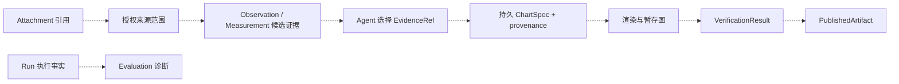

# 后续组件边界：来源、产物与诊断

> [返回总览](../figura-implementation-overview.md)。本文是**状态边界图**，不为尚未落地的模型编造字段。Local Gateway、React Figura mode 和网页 DTO 已在当前工作树实现，详见[网页端边界](web-boundary.md)；本文只列尚未落地的业务能力。完整目标设计见[Figura 架构设计草案](../figura-architecture-design.md)；未来每个模型确定后，应在所属专题文档列出全部字段。

## 1. 当前与目标

| 能力 | 新 Figura 当前状态 | 目标流转所需的合同 |
|---|---|---|
| Source/Panel/Observation/Measurement/Evidence | 尚未实现生产工具与持久事实 | 来源引用和授权、Panel 修订、候选观察/测量事实、Agent 明确选择证据 |
| 持久 ChartSpec 与来源 | 当前只有未提交的纯 `ChartSpecData` 工作树代码 | 带身份的图表 envelope、精确内容版本、来源及证据引用 |
| 生成图与发布 | 无新 Figura 渲染、验证、发布服务 | 暂存图与确切 ChartSpec 绑定、验证结果、幂等发布身份 |
| Evaluation | 无新 Figura 评测适配 | 从同一权威 Run 事实读取诊断，不另建在线事实来源 |

## 2. 目标内容流（仅设计）

所有虚线均表示目标关系，不表示当前新 Figura 已运行。草案区分来源授权、实际观察范围、选中的 EvidenceRef 和图表 provenance；测量输出是候选证据，不能自动升格为图表事实。用户原文数字和模型生成示例数据也需要不同的来源声明。暂存、验证和发布必须绑定确切内容与图像版本。

## 3. 与旧系统的关系

`src/chartagent/` 中已经有 Panel、Measurement、ChartSpec、Gateway、前端和 Evaluation 等实现；其对象身份、字段与存储不能直接视作 `src/figura/` 的当前合同。迁移时应逐项比较，而不是把旧字段复制到新文档或把目标草案称为已落地。

参考：[新 Figura 实现总览](../figura-implementation-overview.md)、[当前网页边界](web-boundary.md)、[架构设计草案](../figura-architecture-design.md)、[当前 ChartSpecData](chartspec.md)。
