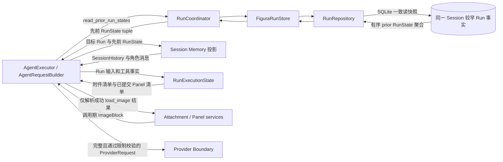

# Memory：当前跨 Run 对话投影

> [返回系统总览](../figura-implementation-overview.md)。依据：当前 `src/figura/memory/` 与 `src/figura/agent/` 工作树实现，以及 [Session Memory 主规格](../../openspec/figura/openspec/specs/session-memory/spec.md)。本文描述已实现的临时投影，不代表独立的长期记忆存储。

## 1. 职责与边界

Session Memory 将同一 Session 中目标 Run 之前的终态 Run 投影为有序对话消息，供后续 Provider 请求使用。它读取 Runtime 持久化的 Run 事实，不拥有这些事实，也不创建消息表、历史副本、摘要、裁剪预算或跨 Session 用户记忆。每次模型动作都从提交事实重新构建完整上下文；超过 Provider 硬限制时，由 Agent 在领取 Provider attempt 前失败。

权威内容仍属于 [Run Runtime](runtime.md)：用户输入来自 `RunInput`，助手内容来自 `ModelResponseFact`，工具调用与结果来自 `ToolCallFact`、`ToolAttemptStartedFact`、`ToolResultFact`。Memory 对象只是一组不可变、调用期投影；附件只保留 ID。Agent 的附件/Panel 清单及图像加载规则由[Agent](agent.md#4-运行时状态字段)定义，附件与 Panel 的持久模型由[Sources](sources.md)定义；历史附件不会因为进入 Memory 而自动解析为图像字节。

## 2. 模型关系与组件边界

Runtime 在一个 SQLite 读快照内读取目标 Run 的所有较早 ordinal，并验证目标归属、ordinal 连续、先前 Run 均已终结和历史附件归属。Memory 再从这些 RunState 投影消息。`SessionHistory.messages` 只包含目标 Run 之前的消息；当前 Run 的输入和已提交进度由 `project_run_messages` 单独投影，再由 AgentRequestBuilder 拼接。

## 3. 内部流转与失败边界

1. **读取稳定前缀**：Agent 在模型动作中调用 `RunCoordinator.read_prior_run_states(session_id, run_id)`。RunRepository 对目标 Run 做同 Session 校验，在单个 SQLite 读事务中加载所有较小 ordinal 的 RunState；缺失、ordinal 缺口、跨 Session 或先前仍为 running 时不返回部分历史。
2. **投影旧 Run**：`project_session_history` 要求先前 Run ordinal 恰为 `1..target_run.ordinal-1`，且 Session 相同、全部终态。它按 Run ordinal 顺序调用 `project_run_messages`。每个 Run 先生成一条用户消息，再按 ExecutionRecord 顺序生成助手消息；工具调用保留 provider 顺序，且每个工具结果与其原 call ID 配对。
3. **投影当前 Run**：AgentRequestBuilder 同样对当前 Run 已提交前缀调用 `project_run_messages`，将其接在 SessionHistory 后面。最终回答记录只引用已有助手响应，不再产生重复消息。未完成工具批次、无匹配调用的结果、重复/错误来源引用或不受支持的事实会使整次投影失败；不会省略问题消息后继续。
4. **恢复图像和调用期字段**：每条用户消息保留原文本和有序 attachment ID。AgentRequestBuilder 把消息文本与附件 ID 保留在完整对话中；另外从 RunExecutionState 加入当前 Session 图像清单。只有最新已提交工具批次里的成功 `load_image` 结果，才由附件或 Panel 服务解析为 ImageBlock，按调用顺序组成一条 user 消息。历史工具调用的 registry 版本必须与当前 Registry 匹配。Provider continuation 不属于 Memory 投影；仅当前 Run 的助手响应可从其私有 continuation 事实恢复 continuation。
5. **先校验再领取 attempt**：AgentRequestBuilder 组装完整 ProviderRequest 后使用 Provider 的既有校验器检查消息数、指令数、工具数、图片数与字节数、文本和工具 Schema 总字节等限制。Memory 不删旧 Run、不删消息、不总结、不做预算。附件无法解析、历史无效或请求超限时，Agent 将当前 Run 失败，且不创建 Provider client、不领取 Provider attempt、不发送 Provider 请求。

旧 Run 的执行事实不因后续 Run 重写。新消息只有在所属 Run 中提交后，才会在之后的模型动作中被重建；Session Memory 自身没有独立写入、更新或恢复流程。

## 4. 完整模型字段

以下模型均为 `frozen=True` dataclass，按请求临时创建，不序列化到 SQLite，也不通过 Gateway/API 独立公开。Gateway 的 Session 详情另有面向用户的只读对话投影，仅包含持久用户输入和已接受最终答案；它不是本页完整 Agent 上下文，也不公开工具消息、模型中间响应或 continuation，字段见[Web 边界](web.md#4-web-dto-字段)。写入者一栏指内存投影函数；权威位置一栏指字段的持久来源，Memory 对象本身不拥有持久权威。任何投影字段变更都需回到其 Run 源事实，而不是原地修订 Memory 对象。

### MemoryToolCall

工具调用的调用期副本，嵌套在 `AssistantMessage.tool_calls`。投影函数为 `project_run_messages`；AgentRequestBuilder 将其映射为 Provider 的 `ProviderToolCall`。

| 完整字段路径 | 类型 | 必填/默认 | 含义与约束 | 写入者 → 权威位置 | 读取者 → 公开/修订规则 |
|---|---|---|---|---|---|
| `MemoryToolCall.call_id` | `str` | 必填 | 不透明调用 ID；须与其工具结果使用同一 ID | `project_run_messages` → 对应 Run 的 `ToolCallFact.call_id` | AgentRequestBuilder → 仅随 Provider 请求发送；投影不可变，改动须由源事实重建 |
| `MemoryToolCall.tool_name` | `str` | 必填 | 被调用工具的注册名称 | `project_run_messages` → `ToolCallFact.tool_name` | AgentRequestBuilder → Provider 工具调用名；投影不可变，改动须由源事实重建 |
| `MemoryToolCall.arguments_json` | `str` | 必填；`repr=False` | 已提交调用的 JSON 参数文本；不在 dataclass repr 中显示 | `project_run_messages` → `ToolCallFact.arguments_json` | AgentRequestBuilder → Provider 调用参数；不独立公开或修订 |
| `MemoryToolCall.position` | `int` | 必填 | 响应内从 0 开始的调用顺序；投影校验位置连续 | `project_run_messages` → `ToolCallFact.position` | AgentRequestBuilder → Provider 调用顺序；投影不可变，改动须由源事实重建 |
| `MemoryToolCall.registry_version` | `str` | 必填 | 产生该调用的工具 Registry 版本 | `project_run_messages` → `ToolCallFact.registry_version` | AgentRequestBuilder → 与当前 Registry 比较；不独立公开或修订 |

### UserMessage

一个 Run 的不可变用户输入投影。Runtime 的 `Run` 行提供身份与 ordinal，input `ExecutionRecord.payload` 中的 `RunInput` 提供文本和附件 ID。

| 完整字段路径 | 类型 | 必填/默认 | 含义与约束 | 写入者 → 权威位置 | 读取者 → 公开/修订规则 |
|---|---|---|---|---|---|
| `UserMessage.run_id` | `str` | 必填 | 输入所属 Run 的不透明 ID | `project_run_messages` → `Run.run_id` | AgentRequestBuilder → 内部请求来源；不独立公开或修订 |
| `UserMessage.run_ordinal` | `int` | 必填 | Run 在 Session 内从 1 开始的顺序 | `project_run_messages` → `Run.ordinal` | `project_session_history` / AgentRequestBuilder → 历史排序与来源；不独立公开或修订 |
| `UserMessage.source_record_id` | `str` | 必填 | 本用户输入事实的 ExecutionRecord ID | `project_run_messages` → `ExecutionRecord.record_id`（kind 为 input） | AgentRequestBuilder → 内部来源追踪；不独立公开或修订 |
| `UserMessage.text` | `str` | 必填；`repr=False` | 用户提交文本原文 | `project_run_messages` → `RunInput.text` | AgentRequestBuilder → Provider user 内容；不出现在 repr/API，需修改时创建新的 Run 输入 |
| `UserMessage.attachment_ids` | `tuple[str, ...]` | 默认 `()` | 有序附件 ID；这里只存引用，不含图像字节 | `project_run_messages` → `RunInput.attachment_ids` | AgentRequestBuilder → 作为对话文本引用并参与 Panels 清单；只有显式 `load_image` 后才解析图像 |

### AssistantMessage

一个已提交模型响应的角色投影。内容来自 `ModelResponseFact`；工具调用按 `MemoryToolCall` 嵌套。

| 完整字段路径 | 类型 | 必填/默认 | 含义与约束 | 写入者 → 权威位置 | 读取者 → 公开/修订规则 |
|---|---|---|---|---|---|
| `AssistantMessage.run_id` | `str` | 必填 | 响应所属 Run 的不透明 ID | `project_run_messages` → `Run.run_id` | AgentRequestBuilder → 内部来源和 continuation 边界；不独立公开或修订 |
| `AssistantMessage.run_ordinal` | `int` | 必填 | Run 在 Session 内从 1 开始的顺序 | `project_run_messages` → `Run.ordinal` | `project_session_history` / AgentRequestBuilder → 历史顺序；不独立公开或修订 |
| `AssistantMessage.source_record_id` | `str` | 必填 | 来源模型响应 ExecutionRecord ID | `project_run_messages` → `ExecutionRecord.record_id`（kind 为 model_response） | AgentRequestBuilder → 仅当前 Run 响应可关联 continuation；不独立公开或修订 |
| `AssistantMessage.content` | `str` | 必填；`repr=False` | 已提交的助手文本；不在 dataclass repr 中显示 | `project_run_messages` → `ModelResponseFact.assistant_content` | AgentRequestBuilder → Provider assistant 消息；不经 Memory API 公开或修订 |
| `AssistantMessage.tool_calls` | `tuple[MemoryToolCall, ...]` | 默认 `()` | 当前响应的完整工具调用，按 provider position 排序；无调用时为空 | `project_run_messages` → 与该响应关联的有序 `ToolCallFact` | AgentRequestBuilder → Provider assistant 工具调用；不独立公开或修订 |

### ToolMessage

一个已提交工具结果的模型可读观察。`content` 是从结果事实生成的有界规范 JSON，不包含 handler 异常堆栈或本机执行细节。

| 完整字段路径 | 类型 | 必填/默认 | 含义与约束 | 写入者 → 权威位置 | 读取者 → 公开/修订规则 |
|---|---|---|---|---|---|
| `ToolMessage.run_id` | `str` | 必填 | 工具结果所属 Run 的不透明 ID | `project_run_messages` → `Run.run_id` | AgentRequestBuilder → 内部来源；不独立公开或修订 |
| `ToolMessage.run_ordinal` | `int` | 必填 | Run 在 Session 内从 1 开始的顺序 | `project_run_messages` → `Run.ordinal` | `project_session_history` / AgentRequestBuilder → 历史顺序；不独立公开或修订 |
| `ToolMessage.source_tool_sequence` | `int` | 必填 | 来源结果在 Run 工具事实流中的序号 | `project_run_messages` → `ToolExecutionFact.tool_sequence`（kind 为 tool_result） | AgentRequestBuilder → 内部事实来源；不独立公开或修订 |
| `ToolMessage.tool_call_id` | `str` | 必填 | 对应助手工具调用的 opaque call ID | `project_run_messages` → 匹配的 `ToolCallFact.call_id` | AgentRequestBuilder → Provider tool 消息关联键；不独立公开或修订 |
| `ToolMessage.content` | `str` | 必填；`repr=False` | 通过 `tool_observation` 编码的成功结果或安全失败对象 | `project_run_messages` → 匹配的 `ToolResultFact` | AgentRequestBuilder → Provider tool 观察；不出现在 repr/API，不独立修订 |

### SessionHistory

目标 Run 之前的同 Session 完整历史容器。该投影不含目标 Run 自身的消息；当前 Run 消息由 AgentRequestBuilder 另行追加。

| 完整字段路径 | 类型 | 必填/默认 | 含义与约束 | 写入者 → 权威位置 | 读取者 → 公开/修订规则 |
|---|---|---|---|---|---|
| `SessionHistory.session_id` | `str` | 必填 | 目标 Run 所属 Session 的不透明 ID | `project_session_history` → `target_run.session_id` | AgentRequestBuilder → 附件解析与范围校验；仅内部使用，不独立修订 |
| `SessionHistory.target_run_id` | `str` | 必填 | 当前请求所属的目标 Run ID | `project_session_history` → `target_run.run_id` | AgentRequestBuilder → 确认历史边界；仅内部使用，不独立修订 |
| `SessionHistory.target_run_ordinal` | `int` | 必填 | 目标 Run 在 Session 内的 ordinal | `project_session_history` → `target_run.ordinal` | AgentRequestBuilder → 历史边界和序号校验；仅内部使用，不独立修订 |
| `SessionHistory.messages` | `tuple[MemoryMessage, ...]` | 默认 `()` | 所有 lower-ordinal Run 的 UserMessage、AssistantMessage、ToolMessage；空 tuple 表示首个 Run | `project_session_history` → 每个更早 Run 的 input/response/tool facts | AgentRequestBuilder → 完整 Provider 对话前缀；内部不可变，不独立公开、裁剪或修订 |

`MemoryMessage` 是类型别名 `UserMessage | AssistantMessage | ToolMessage`，自身没有 dataclass 字段。模型定义位于 [`memory/models.py`](../../src/figura/memory/models.py)，投影与校验位于 [`memory/projector.py`](../../src/figura/memory/projector.py)。Runtime 源模型和各来源字段的权威表见[运行时字段合同](runtime.md#4-完整模型字段)。

## 5. 不变量、状态与依据

- Memory 仅包含同一 Session 中目标 Run ordinal 之前的终态 Run；时间戳和数据库行顺序不决定对话顺序。
- 任一历史 Run 无效时整份历史不 dispatch；不通过跳过坏 Run、缺失附件或未完成工具调用来拼装部分对话。
- 附件 ID 仍由所属 Session 校验，图像字节只在对应的成功 `load_image` 后进入下一次 Provider 请求；Memory 对象中无附件字节和本机路径。
- Provider continuation 与源 Run 绑定；Memory 投影不含该 payload，较早 Run 的 continuation 不进入后续 Run 请求。
- 完整历史超过 Provider 硬限制时当前 Run 在 Provider attempt claim 前失败；持久 Run 事实与 Memory 投影均不裁剪。
- Run 创建由 Runtime 保证同一 Session 同时最多一个 running Run；幂等重放先于 active Run 检查。完整创建与读取语义见[运行时流程](runtime.md#2-内部流转)。

代码：[Session Memory 模型](../../src/figura/memory/models.py)、[投影器](../../src/figura/memory/projector.py)、[Agent 请求构建](../../src/figura/agent/request.py)、[历史 Run 快照读取](../../src/figura/runtime/persistence/snapshots.py)。规格：[Session Memory](../../openspec/figura/openspec/specs/session-memory/spec.md)、[Agent ReAct](../../openspec/figura/openspec/specs/agent-react-execution/spec.md)、[Run 核心](../../openspec/figura/openspec/specs/run-execution-core/spec.md)。
