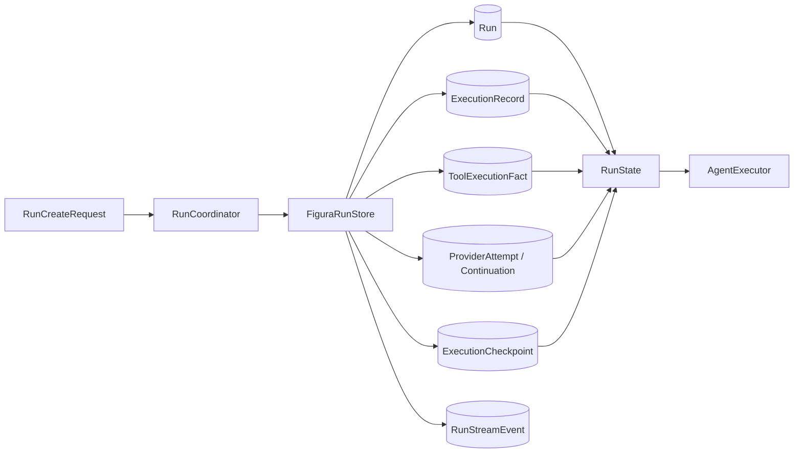

# Run Runtime：执行事实与恢复

> [返回总览](../figura-implementation-overview.md)。范围：当前 `src/figura/runtime/` 的工作树实现。这里的“事实”指已提交的执行内容；Checkpoint 是推进控制，事件是安全投影。完整字段表在第 4 节。

## 1. 职责与边界

RunCoordinator 校验并推进 Session/Run；FiguraRunStore 是持久化 owner；DurableToolExecutor 记录工具尝试与结果。Agent 只能通过这些协调入口推进 Run，不能绕过 Checkpoint 直接更新执行历史。Provider 凭据、图片字节和调用期请求不进入 Run 事实。当前无 Figura Gateway，因此 `RunStreamEvent` 已持久化但尚无新 Figura SSE 入口。

## 2. 内部流转

1. **创建**：`RunCreateRequest` 带 Session、文本、显式 provider/model、幂等键及有序附件 ID。Coordinator 校验请求；Store 在同一事务核对附件同属 Session，并写 `Run`、唯一 input `ExecutionRecord`（payload 为 `RunInput`）、初始 `ExecutionCheckpoint`、幂等映射及 created event。图片只以 ID 引用，字段见[附件文档](attachments.md#3-完整模型字段)。
2. **模型尝试**：Agent 已构建并校验 `ProviderRequest` 后，先 claim `ProviderAttempt`，再发送请求。成功时，响应事实、私有 `ProviderContinuationFact`（如有）、工具调用意图、attempt 状态及下一 checkpoint 在事务中提交。确定失败与未知结果走不同状态；读取不重发已启动请求。
3. **工具尝试**：`ToolCallFact` 是模型提出的逻辑调用；`ToolAttemptStartedFact` 表示 handler 已启动；`ToolResultFact` 记录成功或有界失败。事实按 `tool_sequence` 追加，批次完成后才继续模型轮次。未知副作用需显式处理，不由 Agent 自动 replay。
4. **终结与恢复**：Checkpoint 的 `revision` 用于拒绝过期推进；`next_action` 指明 model、provider_attempt、tool_execution、tool_attempt 或 final。终态提交 `FinalAnswerFact` 或失败/中断状态，并写安全生命周期事件。Store 重建 `RunState`；事件、历史展示和未来评测从已提交事实投影，不反向成为权威状态。

## 3. 模型关系与共同规则

Session 拥有 Run 和附件元数据；Run 引用附件，拥有自己的执行记录、工具事实、Provider attempts、continuation、Checkpoint 与事件。`ExecutionRecord.payload` 是 `RunInput | ModelResponseFact | FinalAnswerFact`；`ToolExecutionFact.payload` 是 `ToolCallFact | ToolAttemptStartedFact | ToolResultFact`。这些联合类型按 kind 判别，不能只凭同名 ID 猜测类型。事件的 `event_sequence` 与记录的 `record_sequence`、工具事实的 `tool_sequence` 分属不同序列。事件 `payload` 的 `EventValue` 仅允许 `str | int | tuple[str, ...]`。

以下字段表按当前 Python dataclass 的全部声明字段列出。表内“默认”是构造默认值；`—` 表示构造时必传，不代表值在业务上可任意为空。时间是存储的 UTC 文本。每个模型小节的写入/权威/读取边界适用于其全部字段，字段行再注明例外。

## 4. 完整模型字段

### Session

会话身份与元数据；拥有 Run 和 Attachment。 **写入者：**RunCoordinator / Store。**权威位置：**sessions 表。**读取与公开：**Session 查询、Run 创建；安全元数据可公开。[定义](../../src/figura/runtime/models.py)。

| 完整字段路径 | 类型 | 构造默认 | 含义与约束 | 写入 → 权威 → 读取/公开 |
|---|---|---|---|---|
| Session.session_id | str | 必传 | 所属 Session 的不透明身份；跨 Session 读取须拒绝 | RunCoordinator / Store → sessions 表 → Session 查询、Run 创建；安全元数据可公开 |
| Session.name | str \| None | 必传 | 可选的会话显示名称；不参与 Session 身份判定 | RunCoordinator / Store → sessions 表 → Session 查询、Run 创建；安全元数据可公开 |
| Session.created_at | str | 必传 | 创建时的 UTC 时间 | RunCoordinator / Store → sessions 表 → Session 查询、Run 创建；安全元数据可公开 |
| Session.updated_at | str | 必传 | 最后更新时的 UTC 时间 | RunCoordinator / Store → sessions 表 → Session 查询、Run 创建；安全元数据可公开 |

### Run

一次独立执行的身份、模型选择和生命周期。 **写入者：**RunCoordinator / Store。**权威位置：**runs 表。**读取与公开：**Agent、恢复与安全 Run 摘要。[定义](../../src/figura/runtime/models.py)。

| 完整字段路径 | 类型 | 构造默认 | 含义与约束 | 写入 → 权威 → 读取/公开 |
|---|---|---|---|---|
| Run.run_id | str | 必传 | 所属 Run 的不透明身份 | RunCoordinator / Store → runs 表 → Agent、恢复与安全 Run 摘要 |
| Run.session_id | str | 必传 | 所属 Session 的不透明身份；跨 Session 读取须拒绝 | RunCoordinator / Store → runs 表 → Agent、恢复与安全 Run 摘要 |
| Run.ordinal | int | 必传 | 同 Session 中 Run 的顺序号 | RunCoordinator / Store → runs 表 → Agent、恢复与安全 Run 摘要 |
| Run.input_record_id | str | 必传 | 唯一输入 ExecutionRecord 的 ID | RunCoordinator / Store → runs 表 → Agent、恢复与安全 Run 摘要 |
| Run.status | RunStatus | 必传 | 本对象的生命周期状态；值见本页枚举 | RunCoordinator / Store → runs 表 → Agent、恢复与安全 Run 摘要 |
| Run.provider | str | 必传 | Run 创建时固定的 provider 选择 | RunCoordinator / Store → runs 表 → Agent、恢复与安全 Run 摘要 |
| Run.model | str | 必传 | Run 创建时固定的 model 选择 | RunCoordinator / Store → runs 表 → Agent、恢复与安全 Run 摘要 |
| Run.created_at | str | 必传 | 创建时的 UTC 时间 | RunCoordinator / Store → runs 表 → Agent、恢复与安全 Run 摘要 |
| Run.started_at | str | 必传 | 开始执行的 UTC 时间 | RunCoordinator / Store → runs 表 → Agent、恢复与安全 Run 摘要 |
| Run.finished_at | str \| None | None | 终态时间；运行中为空 | RunCoordinator / Store → runs 表 → Agent、恢复与安全 Run 摘要 |
| Run.terminal_code | str \| None | None | 终态原因码；非适用状态为空 | RunCoordinator / Store → runs 表 → Agent、恢复与安全 Run 摘要 |
| Run.terminal_message | str \| None | None | 安全的终态说明；非适用状态为空 | RunCoordinator / Store → runs 表 → Agent、恢复与安全 Run 摘要 |
| Run.final_record_id | str \| None | None | 最终答案记录 ID；完成前为空 | RunCoordinator / Store → runs 表 → Agent、恢复与安全 Run 摘要 |

### RunInput

创建时固定的唯一输入事实。 **写入者：**RunCoordinator / Store。**权威位置：**input ExecutionRecord.payload。**读取与公开：**Agent 请求构建；文本与附件 ID 不进入普通事件。[定义](../../src/figura/runtime/models.py)。

| 完整字段路径 | 类型 | 构造默认 | 含义与约束 | 写入 → 权威 → 读取/公开 |
|---|---|---|---|---|
| RunInput.text | str | 必传 | 用户提交的原始文本；不写普通事件 | RunCoordinator / Store → input ExecutionRecord.payload → Agent 请求构建；文本与附件 ID 不进入普通事件 |
| RunInput.attachment_ids | tuple[str, ...] | 必传 | 最多 16 个有序、去重的附件 ID；创建时校验 Session 归属 | RunCoordinator / Store → input ExecutionRecord.payload → Agent 请求构建；文本与附件 ID 不进入普通事件 |
| RunInput.requested_provider | str | 必传 | 创建时请求的 provider ID | RunCoordinator / Store → input ExecutionRecord.payload → Agent 请求构建；文本与附件 ID 不进入普通事件 |
| RunInput.requested_model | str | 必传 | 创建时请求的 model ID | RunCoordinator / Store → input ExecutionRecord.payload → Agent 请求构建；文本与附件 ID 不进入普通事件 |
| RunInput.schema_version | int | 1 | 该值或 payload 的版本号 | RunCoordinator / Store → input ExecutionRecord.payload → Agent 请求构建；文本与附件 ID 不进入普通事件 |

### ModelResponseFact

已提交的模型响应事实。 **写入者：**RunCoordinator / Store。**权威位置：**model_response ExecutionRecord.payload。**读取与公开：**历史重建和 Agent；原始内容不直接作 SSE payload。[定义](../../src/figura/runtime/models.py)。

| 完整字段路径 | 类型 | 构造默认 | 含义与约束 | 写入 → 权威 → 读取/公开 |
|---|---|---|---|---|
| ModelResponseFact.provider_id | str | 必传 | 规范化 provider 身份 | RunCoordinator / Store → model_response ExecutionRecord.payload → 历史重建和 Agent；原始内容不直接作 SSE payload |
| ModelResponseFact.model_id | str | 必传 | 固定或响应中的模型身份 | RunCoordinator / Store → model_response ExecutionRecord.payload → 历史重建和 Agent；原始内容不直接作 SSE payload |
| ModelResponseFact.assistant_content | str | 必传 | 模型文本内容；需按响应规则判断可否终结 | RunCoordinator / Store → model_response ExecutionRecord.payload → 历史重建和 Agent；原始内容不直接作 SSE payload |
| ModelResponseFact.finish_reason | str | 必传 | 归一化结束原因 | RunCoordinator / Store → model_response ExecutionRecord.payload → 历史重建和 Agent；原始内容不直接作 SSE payload |
| ModelResponseFact.usage | ProviderUsage \| None | None | token 用量；可空且各计数也可空 | RunCoordinator / Store → model_response ExecutionRecord.payload → 历史重建和 Agent；原始内容不直接作 SSE payload |
| ModelResponseFact.provider_response_id | str \| None | None | Provider 返回的可选响应 ID | RunCoordinator / Store → model_response ExecutionRecord.payload → 历史重建和 Agent；原始内容不直接作 SSE payload |
| ModelResponseFact.continuation_ref | str \| None | None | 绑定私有 continuation 的内部引用；可空 | RunCoordinator / Store → model_response ExecutionRecord.payload → 历史重建和 Agent；原始内容不直接作 SSE payload |
| ModelResponseFact.schema_version | int | 2 | 该值或 payload 的版本号 | RunCoordinator / Store → model_response ExecutionRecord.payload → 历史重建和 Agent；原始内容不直接作 SSE payload |

### ProviderContinuationFact

与来源响应绑定的私有续接内容。 **写入者：**RunCoordinator / Store。**权威位置：**run_provider_continuations 表。**读取与公开：**后续请求重建；不公开 reasoning_content。[定义](../../src/figura/runtime/models.py)。

| 完整字段路径 | 类型 | 构造默认 | 含义与约束 | 写入 → 权威 → 读取/公开 |
|---|---|---|---|---|
| ProviderContinuationFact.continuation_id | str | 必传 | 私有 continuation 的不透明身份 | RunCoordinator / Store → run_provider_continuations 表 → 后续请求重建；不公开 reasoning_content |
| ProviderContinuationFact.run_id | str | 必传 | 所属 Run 的不透明身份 | RunCoordinator / Store → run_provider_continuations 表 → 后续请求重建；不公开 reasoning_content |
| ProviderContinuationFact.response_record_id | str | 必传 | 所关联的模型响应记录 ID；可空时表示尚未提交 | RunCoordinator / Store → run_provider_continuations 表 → 后续请求重建；不公开 reasoning_content |
| ProviderContinuationFact.provider_id | str | 必传 | 规范化 provider 身份 | RunCoordinator / Store → run_provider_continuations 表 → 后续请求重建；不公开 reasoning_content |
| ProviderContinuationFact.format_version | int | 必传 | Provider 私有续接格式版本 | RunCoordinator / Store → run_provider_continuations 表 → 后续请求重建；不公开 reasoning_content |
| ProviderContinuationFact.schema_version | int | 必传 | 该值或 payload 的版本号 | RunCoordinator / Store → run_provider_continuations 表 → 后续请求重建；不公开 reasoning_content |
| ProviderContinuationFact.reasoning_content | str | 必传 | Provider 私有推理/续接文本；不公开 | RunCoordinator / Store → run_provider_continuations 表 → 后续请求重建；不公开 reasoning_content |
| ProviderContinuationFact.created_at | str | 必传 | 创建时的 UTC 时间 | RunCoordinator / Store → run_provider_continuations 表 → 后续请求重建；不公开 reasoning_content |

### ProviderAttempt

一次已 claim 的模型请求尝试及确定性状态。 **写入者：**RunCoordinator / Store。**权威位置：**run_provider_attempts 表。**读取与公开：**Agent 恢复与预算；只公开安全状态。[定义](../../src/figura/runtime/models.py)。

| 完整字段路径 | 类型 | 构造默认 | 含义与约束 | 写入 → 权威 → 读取/公开 |
|---|---|---|---|---|
| ProviderAttempt.attempt_id | str | 必传 | 一次 Provider 或工具尝试的身份 | RunCoordinator / Store → run_provider_attempts 表 → Agent 恢复与预算；只公开安全状态 |
| ProviderAttempt.run_id | str | 必传 | 所属 Run 的不透明身份 | RunCoordinator / Store → run_provider_attempts 表 → Agent 恢复与预算；只公开安全状态 |
| ProviderAttempt.attempt_sequence | int | 必传 | Run 内 Provider 尝试顺序号 | RunCoordinator / Store → run_provider_attempts 表 → Agent 恢复与预算；只公开安全状态 |
| ProviderAttempt.base_record_sequence | int | 必传 | claim 时已提交的执行记录游标 | RunCoordinator / Store → run_provider_attempts 表 → Agent 恢复与预算；只公开安全状态 |
| ProviderAttempt.base_tool_sequence | int | 必传 | claim 时已提交的工具事实游标 | RunCoordinator / Store → run_provider_attempts 表 → Agent 恢复与预算；只公开安全状态 |
| ProviderAttempt.status | ProviderAttemptStatus | 必传 | 本对象的生命周期状态；值见本页枚举 | RunCoordinator / Store → run_provider_attempts 表 → Agent 恢复与预算；只公开安全状态 |
| ProviderAttempt.response_record_id | str \| None | 必传 | 所关联的模型响应记录 ID；可空时表示尚未提交 | RunCoordinator / Store → run_provider_attempts 表 → Agent 恢复与预算；只公开安全状态 |
| ProviderAttempt.failure_code | str \| None | 必传 | 安全失败码；成功或未定时为空 | RunCoordinator / Store → run_provider_attempts 表 → Agent 恢复与预算；只公开安全状态 |
| ProviderAttempt.started_at | str | 必传 | 开始执行的 UTC 时间 | RunCoordinator / Store → run_provider_attempts 表 → Agent 恢复与预算；只公开安全状态 |
| ProviderAttempt.finished_at | str \| None | 必传 | 终态时间；运行中为空 | RunCoordinator / Store → run_provider_attempts 表 → Agent 恢复与预算；只公开安全状态 |

### FinalAnswerFact

最终回答与来源响应的绑定事实。 **写入者：**RunCoordinator / Store。**权威位置：**final_answer ExecutionRecord.payload。**读取与公开：**Run 终结与回答读取；artifact_refs 当前为空。[定义](../../src/figura/runtime/models.py)。

| 完整字段路径 | 类型 | 构造默认 | 含义与约束 | 写入 → 权威 → 读取/公开 |
|---|---|---|---|---|
| FinalAnswerFact.response_record_id | str | 必传 | 所关联的模型响应记录 ID；可空时表示尚未提交 | RunCoordinator / Store → final_answer ExecutionRecord.payload → Run 终结与回答读取；artifact_refs 当前为空 |
| FinalAnswerFact.artifact_refs | tuple[str, ...] | () | 最终回答关联的产物引用；当前文本版本通常为空 | RunCoordinator / Store → final_answer ExecutionRecord.payload → Run 终结与回答读取；artifact_refs 当前为空 |
| FinalAnswerFact.guard_version | str | 'text-only-v1' | 最终回答守卫规则版本 | RunCoordinator / Store → final_answer ExecutionRecord.payload → Run 终结与回答读取；artifact_refs 当前为空 |
| FinalAnswerFact.schema_version | int | 1 | 该值或 payload 的版本号 | RunCoordinator / Store → final_answer ExecutionRecord.payload → Run 终结与回答读取；artifact_refs 当前为空 |

### ToolCallFact

模型提出的逻辑工具调用。 **写入者：**RunCoordinator / Store。**权威位置：**run_tool_execution_facts 的 tool_call payload。**读取与公开：**DurableToolExecutor 与历史重建；参数不直接公开。[定义](../../src/figura/runtime/models.py)。

| 完整字段路径 | 类型 | 构造默认 | 含义与约束 | 写入 → 权威 → 读取/公开 |
|---|---|---|---|---|
| ToolCallFact.response_record_id | str | 必传 | 所关联的模型响应记录 ID；可空时表示尚未提交 | RunCoordinator / Store → run_tool_execution_facts 的 tool_call payload → DurableToolExecutor 与历史重建；参数不直接公开 |
| ToolCallFact.call_id | str | 必传 | 模型给出的逻辑工具调用 ID | RunCoordinator / Store → run_tool_execution_facts 的 tool_call payload → DurableToolExecutor 与历史重建；参数不直接公开 |
| ToolCallFact.tool_name | str | 必传 | 工具定义名称 | RunCoordinator / Store → run_tool_execution_facts 的 tool_call payload → DurableToolExecutor 与历史重建；参数不直接公开 |
| ToolCallFact.arguments_json | str | 必传 | 模型提供的 JSON 参数原文；执行前严格解析 | RunCoordinator / Store → run_tool_execution_facts 的 tool_call payload → DurableToolExecutor 与历史重建；参数不直接公开 |
| ToolCallFact.position | int | 0 | 响应内工具调用的原始顺序 | RunCoordinator / Store → run_tool_execution_facts 的 tool_call payload → DurableToolExecutor 与历史重建；参数不直接公开 |
| ToolCallFact.registry_version | str | '' | 调用时使用的工具 Registry 版本 | RunCoordinator / Store → run_tool_execution_facts 的 tool_call payload → DurableToolExecutor 与历史重建；参数不直接公开 |
| ToolCallFact.schema_version | int | 1 | 该值或 payload 的版本号 | RunCoordinator / Store → run_tool_execution_facts 的 tool_call payload → DurableToolExecutor 与历史重建；参数不直接公开 |

### ToolAttemptStartedFact

handler 启动前的耐久标记。 **写入者：**DurableToolExecutor / Store。**权威位置：**run_tool_execution_facts 的 tool_attempt_started payload。**读取与公开：**恢复逻辑；未知结果不能自动重放。[定义](../../src/figura/runtime/models.py)。

| 完整字段路径 | 类型 | 构造默认 | 含义与约束 | 写入 → 权威 → 读取/公开 |
|---|---|---|---|---|
| ToolAttemptStartedFact.tool_call_sequence | int | 必传 | 所引用逻辑调用的工具事实序号 | DurableToolExecutor / Store → run_tool_execution_facts 的 tool_attempt_started payload → 恢复逻辑；未知结果不能自动重放 |
| ToolAttemptStartedFact.call_id | str | 必传 | 模型给出的逻辑工具调用 ID | DurableToolExecutor / Store → run_tool_execution_facts 的 tool_attempt_started payload → 恢复逻辑；未知结果不能自动重放 |
| ToolAttemptStartedFact.attempt_id | str | 必传 | 一次 Provider 或工具尝试的身份 | DurableToolExecutor / Store → run_tool_execution_facts 的 tool_attempt_started payload → 恢复逻辑；未知结果不能自动重放 |
| ToolAttemptStartedFact.attempt_number | int | 必传 | 该逻辑调用下的尝试次数 | DurableToolExecutor / Store → run_tool_execution_facts 的 tool_attempt_started payload → 恢复逻辑；未知结果不能自动重放 |
| ToolAttemptStartedFact.replay_effect | ReplayEffect | 必传 | 未知效果恢复策略 | DurableToolExecutor / Store → run_tool_execution_facts 的 tool_attempt_started payload → 恢复逻辑；未知结果不能自动重放 |
| ToolAttemptStartedFact.registry_version | str | 必传 | 调用时使用的工具 Registry 版本 | DurableToolExecutor / Store → run_tool_execution_facts 的 tool_attempt_started payload → 恢复逻辑；未知结果不能自动重放 |
| ToolAttemptStartedFact.schema_version | int | 1 | 该值或 payload 的版本号 | DurableToolExecutor / Store → run_tool_execution_facts 的 tool_attempt_started payload → 恢复逻辑；未知结果不能自动重放 |

### ToolResultFact

工具一次尝试的提交结果。 **写入者：**DurableToolExecutor / Store。**权威位置：**run_tool_execution_facts 的 tool_result payload。**读取与公开：**历史重建与 Agent；仅安全摘要可投影。[定义](../../src/figura/runtime/models.py)。

| 完整字段路径 | 类型 | 构造默认 | 含义与约束 | 写入 → 权威 → 读取/公开 |
|---|---|---|---|---|
| ToolResultFact.tool_call_sequence | int | 必传 | 所引用逻辑调用的工具事实序号 | DurableToolExecutor / Store → run_tool_execution_facts 的 tool_result payload → 历史重建与 Agent；仅安全摘要可投影 |
| ToolResultFact.attempt_id | str | 必传 | 一次 Provider 或工具尝试的身份 | DurableToolExecutor / Store → run_tool_execution_facts 的 tool_result payload → 历史重建与 Agent；仅安全摘要可投影 |
| ToolResultFact.call_id | str | 必传 | 模型给出的逻辑工具调用 ID | DurableToolExecutor / Store → run_tool_execution_facts 的 tool_result payload → 历史重建与 Agent；仅安全摘要可投影 |
| ToolResultFact.tool_name | str | 必传 | 工具定义名称 | DurableToolExecutor / Store → run_tool_execution_facts 的 tool_result payload → 历史重建与 Agent；仅安全摘要可投影 |
| ToolResultFact.outcome | ToolOutcome | 必传 | 工具结果的成功或失败状态 | DurableToolExecutor / Store → run_tool_execution_facts 的 tool_result payload → 历史重建与 Agent；仅安全摘要可投影 |
| ToolResultFact.result | Mapping[str, object] \| None | None | 成功时的有界 JSON 对象；失败时为空 | DurableToolExecutor / Store → run_tool_execution_facts 的 tool_result payload → 历史重建与 Agent；仅安全摘要可投影 |
| ToolResultFact.error | ToolExecutionError \| None | None | 失败时的安全错误；成功时为空 | DurableToolExecutor / Store → run_tool_execution_facts 的 tool_result payload → 历史重建与 Agent；仅安全摘要可投影 |
| ToolResultFact.schema_version | int | 1 | 该值或 payload 的版本号 | DurableToolExecutor / Store → run_tool_execution_facts 的 tool_result payload → 历史重建与 Agent；仅安全摘要可投影 |

### ToolExecutionFact

工具事实的排序封套。 **写入者：**Store。**权威位置：**run_tool_execution_facts 表。**读取与公开：**Agent 和恢复；payload 按 fact_kind 判别。[定义](../../src/figura/runtime/models.py)。

| 完整字段路径 | 类型 | 构造默认 | 含义与约束 | 写入 → 权威 → 读取/公开 |
|---|---|---|---|---|
| ToolExecutionFact.run_id | str | 必传 | 所属 Run 的不透明身份 | Store → run_tool_execution_facts 表 → Agent 和恢复；payload 按 fact_kind 判别 |
| ToolExecutionFact.tool_sequence | int | 必传 | Run 内工具事实序号 | Store → run_tool_execution_facts 表 → Agent 和恢复；payload 按 fact_kind 判别 |
| ToolExecutionFact.fact_kind | ToolFactKind | 必传 | 工具事实种类；决定 payload 类型 | Store → run_tool_execution_facts 表 → Agent 和恢复；payload 按 fact_kind 判别 |
| ToolExecutionFact.schema_version | int | 必传 | 该值或 payload 的版本号 | Store → run_tool_execution_facts 表 → Agent 和恢复；payload 按 fact_kind 判别 |
| ToolExecutionFact.payload | ToolFactPayload | 必传 | 按 fact_kind 为 ToolCallFact、ToolAttemptStartedFact 或 ToolResultFact；各变体全部字段见同页 | Store → run_tool_execution_facts 表 → Agent 和恢复；payload 按 fact_kind 判别 |
| ToolExecutionFact.created_at | str | 必传 | 创建时的 UTC 时间 | Store → run_tool_execution_facts 表 → Agent 和恢复；payload 按 fact_kind 判别 |

### ExecutionRecord

Run 执行内容的有序事实封套。 **写入者：**Store。**权威位置：**run_execution_records 表。**读取与公开：**历史、恢复与后续评测；payload 不直接公开。[定义](../../src/figura/runtime/models.py)。

| 完整字段路径 | 类型 | 构造默认 | 含义与约束 | 写入 → 权威 → 读取/公开 |
|---|---|---|---|---|
| ExecutionRecord.record_id | str | 必传 | 执行记录的不透明身份 | Store → run_execution_records 表 → 历史、恢复与后续评测；payload 不直接公开 |
| ExecutionRecord.run_id | str | 必传 | 所属 Run 的不透明身份 | Store → run_execution_records 表 → 历史、恢复与后续评测；payload 不直接公开 |
| ExecutionRecord.record_sequence | int | 必传 | Run 内执行记录序号 | Store → run_execution_records 表 → 历史、恢复与后续评测；payload 不直接公开 |
| ExecutionRecord.record_kind | RecordKind | 必传 | 执行记录种类；决定 payload 类型 | Store → run_execution_records 表 → 历史、恢复与后续评测；payload 不直接公开 |
| ExecutionRecord.payload | RecordPayload | 必传 | 按 record_kind 为 RunInput、ModelResponseFact 或 FinalAnswerFact；各变体全部字段见同页 | Store → run_execution_records 表 → 历史、恢复与后续评测；payload 不直接公开 |
| ExecutionRecord.created_at | str | 必传 | 创建时的 UTC 时间 | Store → run_execution_records 表 → 历史、恢复与后续评测；payload 不直接公开 |

### NextAction

checkpoint 中下一执行动作的判别值。 **写入者：**Store / Runtime 提交。**权威位置：**ExecutionCheckpoint.next_action_json。**读取与公开：**Agent；动作细节不直接公开。[定义](../../src/figura/runtime/models.py)。

| 完整字段路径 | 类型 | 构造默认 | 含义与约束 | 写入 → 权威 → 读取/公开 |
|---|---|---|---|---|
| NextAction.action_kind | ActionKind | 必传 | 下一动作类型；约束其余可空引用 | Store / Runtime 提交 → ExecutionCheckpoint.next_action_json → Agent；动作细节不直接公开 |
| NextAction.response_record_id | str \| None | None | 所关联的模型响应记录 ID；可空时表示尚未提交 | Store / Runtime 提交 → ExecutionCheckpoint.next_action_json → Agent；动作细节不直接公开 |
| NextAction.tool_call_sequence | int \| None | None | 所引用逻辑调用的工具事实序号 | Store / Runtime 提交 → ExecutionCheckpoint.next_action_json → Agent；动作细节不直接公开 |
| NextAction.attempt_id | str \| None | None | 一次 Provider 或工具尝试的身份 | Store / Runtime 提交 → ExecutionCheckpoint.next_action_json → Agent；动作细节不直接公开 |

### ExecutionCheckpoint

Run 唯一推进点和 CAS 修订。 **写入者：**Store / Runtime 提交。**权威位置：**run_execution_checkpoints 表。**读取与公开：**Agent 与恢复；只投影必要状态。[定义](../../src/figura/runtime/models.py)。

| 完整字段路径 | 类型 | 构造默认 | 含义与约束 | 写入 → 权威 → 读取/公开 |
|---|---|---|---|---|
| ExecutionCheckpoint.run_id | str | 必传 | 所属 Run 的不透明身份 | Store / Runtime 提交 → run_execution_checkpoints 表 → Agent 与恢复；只投影必要状态 |
| ExecutionCheckpoint.revision | int | 必传 | CAS 修订；拒绝旧游标提交 | Store / Runtime 提交 → run_execution_checkpoints 表 → Agent 与恢复；只投影必要状态 |
| ExecutionCheckpoint.last_committed_record_sequence | int | 必传 | 已提交执行记录的最高游标 | Store / Runtime 提交 → run_execution_checkpoints 表 → Agent 与恢复；只投影必要状态 |
| ExecutionCheckpoint.last_committed_tool_sequence | int | 必传 | 已提交工具事实的最高游标 | Store / Runtime 提交 → run_execution_checkpoints 表 → Agent 与恢复；只投影必要状态 |
| ExecutionCheckpoint.next_action | NextAction \| None | 必传 | 下一动作或终态空值；嵌套字段见 NextAction | Store / Runtime 提交 → run_execution_checkpoints 表 → Agent 与恢复；只投影必要状态 |
| ExecutionCheckpoint.schema_version | int | 必传 | 该值或 payload 的版本号 | Store / Runtime 提交 → run_execution_checkpoints 表 → Agent 与恢复；只投影必要状态 |
| ExecutionCheckpoint.updated_at | str | 必传 | 最后更新时的 UTC 时间 | Store / Runtime 提交 → run_execution_checkpoints 表 → Agent 与恢复；只投影必要状态 |

### RunStreamEvent

可重放的安全生命周期事件。 **写入者：**Store。**权威位置：**run_stream_events 表。**读取与公开：**未来 Gateway/客户端；to_public_dict 有界投影。[定义](../../src/figura/runtime/models.py)。

| 完整字段路径 | 类型 | 构造默认 | 含义与约束 | 写入 → 权威 → 读取/公开 |
|---|---|---|---|---|
| RunStreamEvent.run_id | str | 必传 | 所属 Run 的不透明身份 | Store → run_stream_events 表 → 未来 Gateway/客户端；to_public_dict 有界投影 |
| RunStreamEvent.event_sequence | int | 必传 | Run 内公开事件序号，与事实序号独立 | Store → run_stream_events 表 → 未来 Gateway/客户端；to_public_dict 有界投影 |
| RunStreamEvent.event_kind | EventKind | 必传 | 安全生命周期事件种类 | Store → run_stream_events 表 → 未来 Gateway/客户端；to_public_dict 有界投影 |
| RunStreamEvent.payload | Mapping[str, EventValue] | 必传 | 安全事件 payload；值限 str/int/字符串元组；不复制执行事实原文 | Store → run_stream_events 表 → 未来 Gateway/客户端；to_public_dict 有界投影 |
| RunStreamEvent.created_at | str | 必传 | 创建时的 UTC 时间 | Store → run_stream_events 表 → 未来 Gateway/客户端；to_public_dict 有界投影 |

### RunState

从持久 Run 数据重建的内部读取视图。 **写入者：**Store.read_run_state。**权威位置：**调用期内存；各成员各有权威存储。**读取与公开：**Agent；整体不公开。[定义](../../src/figura/runtime/models.py)。

| 完整字段路径 | 类型 | 构造默认 | 含义与约束 | 写入 → 权威 → 读取/公开 |
|---|---|---|---|---|
| RunState.run | Run | 必传 | 由 Store 读取的当前 Run；字段见 Run | Store.read_run_state → 调用期内存；各成员各有权威存储 → Agent；整体不公开 |
| RunState.records | tuple[ExecutionRecord, ...] | 必传 | 已提交的有序执行记录 | Store.read_run_state → 调用期内存；各成员各有权威存储 → Agent；整体不公开 |
| RunState.checkpoint | ExecutionCheckpoint | 必传 | 当前唯一执行检查点 | Store.read_run_state → 调用期内存；各成员各有权威存储 → Agent；整体不公开 |
| RunState.events | tuple[RunStreamEvent, ...] | 必传 | 已提交的安全事件 | Store.read_run_state → 调用期内存；各成员各有权威存储 → Agent；整体不公开 |
| RunState.tool_facts | tuple[ToolExecutionFact, ...] | () | 已提交的有序工具事实 | Store.read_run_state → 调用期内存；各成员各有权威存储 → Agent；整体不公开 |
| RunState.provider_continuations | tuple[ProviderContinuationFact, ...] | () | 与已提交响应关联的私有续接事实 | Store.read_run_state → 调用期内存；各成员各有权威存储 → Agent；整体不公开 |
| RunState.provider_attempts | tuple[ProviderAttempt, ...] | () | 已 claim 的模型尝试记录 | Store.read_run_state → 调用期内存；各成员各有权威存储 → Agent；整体不公开 |

### RunCreateRequest

内部创建 Run 的调用期输入。 **写入者：**内部调用方。**权威位置：**调用期；幂等键摘要单独入库。**读取与公开：**RunCoordinator；原始幂等键不公开。[定义](../../src/figura/runtime/models.py)。

| 完整字段路径 | 类型 | 构造默认 | 含义与约束 | 写入 → 权威 → 读取/公开 |
|---|---|---|---|---|
| RunCreateRequest.session_id | str | 必传 | 所属 Session 的不透明身份；跨 Session 读取须拒绝 | 内部调用方 → 调用期；幂等键摘要单独入库 → RunCoordinator；原始幂等键不公开 |
| RunCreateRequest.text | str | 必传 | 用户提交的原始文本；不写普通事件 | 内部调用方 → 调用期；幂等键摘要单独入库 → RunCoordinator；原始幂等键不公开 |
| RunCreateRequest.provider_id | str | 必传 | 规范化 provider 身份 | 内部调用方 → 调用期；幂等键摘要单独入库 → RunCoordinator；原始幂等键不公开 |
| RunCreateRequest.model_id | str | 必传 | 固定或响应中的模型身份 | 内部调用方 → 调用期；幂等键摘要单独入库 → RunCoordinator；原始幂等键不公开 |
| RunCreateRequest.idempotency_key | str | 必传 | 调用方提交的幂等键；Store 只保存摘要 | 内部调用方 → 调用期；幂等键摘要单独入库 → RunCoordinator；原始幂等键不公开 |
| RunCreateRequest.attachment_ids | tuple[str, ...] | () | 有序、去重的附件 ID；创建时校验 Session 归属 | 内部调用方 → 调用期；幂等键摘要单独入库 → RunCoordinator；原始幂等键不公开 |

## 5. 非 dataclass 合同与依据

- `RunStatus`：`running`、`completed`、`failed`、`interrupted`。`RecordKind`：`input`、`model_response`、`final_answer`。`ActionKind`：`model`、`provider_attempt`、`tool_execution`、`tool_attempt`、`final`。
- `ProviderAttemptStatus`：`started`、`response_committed`、`known_failure`、`outcome_unknown`。`ToolFactKind`：`tool_call`、`tool_attempt_started`、`tool_result`。`EventKind`：`run_created`、`run_completed`、`run_failed`、`run_interrupted`。
- `TerminalCode`：`execution_failed`、`invalid_response`、`storage_error`、`interrupted`、`provider_outcome_unknown`。创建幂等映射是 Store 内部存储合同，不存在同名 dataclass；不能把它当成 RunInput 的另一个字段。
- 代码：[模型](../../src/figura/runtime/models.py)、[Coordinator](../../src/figura/runtime/coordinator.py)、[Store](../../src/figura/runtime/store.py)、[工具执行](../../src/figura/runtime/tool_execution.py)。主规格：[Run 核心](../../openspec/figura/openspec/specs/run-execution-core/spec.md)、[耐久工具执行](../../openspec/figura/openspec/specs/durable-tool-execution/spec.md)、[Provider continuation](../../openspec/figura/openspec/specs/provider-continuation-persistence/spec.md)。
