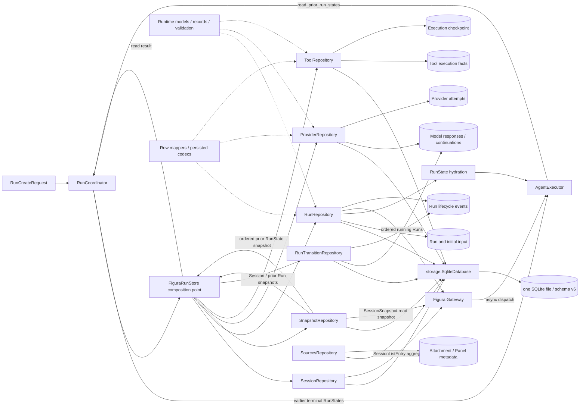

# Run Runtime：执行事实与恢复

> [返回总览](../figura-implementation-overview.md)。范围：当前 `src/figura/runtime/` 的工作树实现。这里的“事实”指已提交的执行内容；Checkpoint 是推进控制，事件是安全投影。完整字段表在第 4 节。

## 1. 职责与边界

RunCoordinator 校验并推进 Session/Run；`FiguraRunStore` 是 Runtime 仓储的组合入口；DurableToolExecutor 记录工具尝试与结果。同一 Session 同时最多有一个 running Run。Runtime 向 Agent 提供同一 Session 中目标 Run 之前的终态 RunState 一致快照，供[Session Memory](memory.md)和[Agent 资源目录](agent.md#4-runexecutionstate-资源合同与完整字段)只读投影；也向本地 Gateway 提供 Session 列表聚合、Session 全量读取快照和 running Run 恢复列表。Agent 只能通过协调入口推进 Run，不能绕过 Checkpoint 直接更新执行历史。Provider 凭据、图片字节、调用期请求和 Memory 消息投影不进入 Run 事实。附件与 Panel 元数据由[Sources](sources.md)管理；OCR、四类测量、ChartFigure 和 ChartRender 的完整调用/结果继续使用通用 `ToolCallFact`、`ToolAttemptStartedFact` 与 `ToolResultFact`。Agent 的 `RunExecutionStateService` 从这些已提交事实及 Sources 元数据重建包含六种资源类型的调用期目录；它不增加 Runtime 字段、fact kind、Figure 表或渲染表。完整 OCR/测量结果仍在 ToolResultFact 与 Memory ToolMessage 中；ChartFigure 从成功调用参数和配对结果重建；PNG 字节由 Sources 保存，渲染摘要从成功结果重建。字段与读取规则见[Agent 资源目录](agent.md#4-runexecutionstate-资源合同与完整字段)。`RunStreamEvent` 是持久生命周期事实，经 Gateway 安全投影为历史响应和 SSE；公开字段见[网页端边界](web.md)。

Runtime 按模型归属和事务职责保持中等粒度：[`runtime/models.py`](../../src/figura/runtime/models.py) 定义 Session/Run、Checkpoint 和枚举；[`runtime/records.py`](../../src/figura/runtime/records.py) 定义持久事实及 Run/Session 读取视图；[`runtime/validation.py`](../../src/figura/runtime/validation.py) 校验 Run 状态不变量，[`runtime/record_validation.py`](../../src/figura/runtime/record_validation.py) 校验持久事实字段和限制。共享 [`storage/database.py`](../../src/figura/storage/database.py) 管理 SQLite 连接和读写事务，[`storage/schema.py`](../../src/figura/storage/schema.py) 管理 schema v6。

持久化按提交边界拆分：[`sessions.py`](../../src/figura/runtime/persistence/sessions.py) 写 Session 与列表聚合；[`runs.py`](../../src/figura/runtime/persistence/runs.py) 创建 Run、幂等映射并读取 RunState；[`snapshots.py`](../../src/figura/runtime/persistence/snapshots.py) 在一致读事务中加载完整 Session 和先前 Run 快照；[`providers.py`](../../src/figura/runtime/persistence/providers.py) 提交 Provider attempt/响应/continuation；[`tools.py`](../../src/figura/runtime/persistence/tools.py) 提交工具调用、attempt 和结果；[`run_transitions.py`](../../src/figura/runtime/persistence/run_transitions.py) 提交完成及失败/中断终态。`mappers.py` 负责 SQLite 行映射，`runtime/codecs/` 按 record、tool fact 和 event payload 分组。

Sources 的附件与 Panel 元数据由 [`SourcesRepository`](../../src/figura/sources/repository.py) 管理，并与 Runtime 共用同一数据库；图像文件由 Sources 自己管理。Run 创建时的附件归属校验仍在 Run 创建写事务内执行。Agent 的 `RunExecutionStateService` 从 Runtime 快照、已提交工具事实与 Sources 资源重建统一派生目录，见[Agent 资源目录](agent.md#4-runexecutionstate-资源合同与完整字段)。`FiguraRunStore` 保留为 Runtime 的组成入口并委托各仓储，不负责文件操作或 Source CRUD。

## 2. 内部流转

1. **创建**：`RunCreateRequest` 带 Session、文本、显式 provider/model、幂等键及有序附件 ID。Coordinator 校验请求；`RunRepository` 在一个写事务内先查幂等映射，匹配则返回原 Run；否则若 Session 已有 running Run 则拒绝新建。事务随后校验附件属于该 Session，并写 `Run`、唯一 input `ExecutionRecord`（payload 为 `RunInput`）、初始 `ExecutionCheckpoint`、幂等映射及 created event。图片只以 ID 引用，字段见[Sources](sources.md#3-完整模型字段)。
2. **读取历史 Run**：Agent 在每个 model action 前请求目标 Run 的 `read_prior_run_states`。`SnapshotRepository` 在一个 SQLite 读快照中按 Session ordinal 查询全部较早 Run，校验 ordinal 从 1 连续、先前 Run 已终态、RunState 完整且附件元数据仍属该 Session，再返回完整 tuple。图像文件可读性随后由 Agent 请求构建阶段验证。此读取不写历史副本；消息投影由[Session Memory](memory.md)负责。
3. **网页读取**：Gateway 的 Session 列表使用 `SessionListEntry`，由 `SessionRepository` 的 SQL 聚合计算每个 Session 的 Run 数与最近活动时间，不逐个 hydrate `RunState`。Session 详情使用 `SnapshotRepository.read_session_snapshot`，在同一个 SQLite 读快照中读取 Session、按 ordinal 排列的完整 RunState 和 Sources 管理的附件元数据；Repository 检查 Run ordinal 连续、输入形状有效、附件都归属该 Session。Gateway 再把快照转换为有限 Web DTO；HTTP/SSE 与前端接口见[网页端边界](web.md#3-http-与前端接口)，完整 DTO 字段见[第 4 节](web.md#4-web-dto-字段)。
4. **模型尝试**：Agent 将完整历史、当前 Run 已提交前缀、图像清单及最新工具批次所需的原图、OCR/测量标注图或成功渲染的 ChartFigure PNG 组装成 `ProviderRequest`，先运行 Provider 全量限制校验。只有校验通过后，才经 `FiguraRunStore` 委托 `ProviderRepository` claim `ProviderAttempt` 并发送请求。成功时，响应事实、私有 `ProviderContinuationFact`（如有）、工具调用意图、attempt 状态及下一 checkpoint 在同一 Provider 写事务中提交。确定失败与未知结果走不同状态；读取不重发已启动请求。完整消息不得为满足 Provider 限制而裁剪，超限时不 claim。
5. **工具尝试**：`ToolCallFact` 是模型提出的逻辑调用；`ToolAttemptStartedFact` 表示 handler 已启动；`ToolResultFact` 记录成功或有界失败。DurableToolExecutor 执行 handler 并通过 `ToolRepository` 追加事实和推进 checkpoint；批次完成后才继续模型轮次。Sources 保存 Panel PNG 与元数据；只有成功分割结果事实提交后，Panel 才进入 Agent 的资源目录和 Web 列表。`extract_text` 与四种测量工具读取被授权的 Attachment 或 Panel；完整 OCR、测量结果以及安全错误均随通用 `ToolResultFact` 保存。`assemble_chart_figure` 复用同一事实模型：完整 Figure 位于原调用参数，成功配对后由 Agent 重建为 `ChartFigureContent`。`render_chart_figure` 将已接受 Figure 引用写入 ToolCallFact，ToolResultFact 仅保存 Figure digest、PNG SHA-256、media type、byte count 和尺寸，不保存图片字节；PNG 私有文件由 [Sources](sources.md#4-存储失败与访问边界) 管理。Agent 将 OCR、测量、Figure 与渲染结果一并重建为有类型引用的资源内容，避免建立并行的结果投影模型。OCR/测量标注图由 Agent 临时重建，不成为 Runtime 事实。图像读取、OCR、测量与 Figure 组装为 `replay_safe`；Panel 分割和 PNG 文件保存按调用身份幂等恢复。
6. **终结与恢复**：Checkpoint 的 `revision` 用于拒绝过期推进；`next_action` 指明 model、provider_attempt、tool_execution、tool_attempt 或 final。`RunTransitionRepository` 提交 `FinalAnswerFact` 或失败/中断状态，并写安全生命周期事件。Gateway 启动时通过 `RunRepository.list_running_runs` 按 Session ID、ordinal 稳定排序发现 running Run，并通过有界 Dispatcher 交给既有 Agent 恢复路径。`RunRepository` 从 SQLite 重建 `RunState`；事件、历史展示和未来评测从已提交事实投影，不反向成为权威状态。

## 3. 模型关系与共同规则

Session 是 Runtime 的 Run 生命周期边界；附件和 Panel 元数据由 Sources 按 Session ID 管理。Run 输入只引用附件 ID。`AttachmentMetadata` 与 `PanelRecord` 的完整字段见[Sources](sources.md#3-完整模型字段)。`SessionListEntry` 是列表查询聚合，`SessionSnapshot` 是一次一致的 Session 读取视图；两者不另建持久事实。`RunExecutionState` 是 Agent 从 Runtime 快照、已提交工具事实与 Sources 资源重建的调用期类型化资源目录，只有 `run_id` 和有序 `resources`；它不扩充 RunState 或 SessionSnapshot，也不增加持久事实。目录包含附件、Panel、OCR、measurement、ChartFigure 和 ChartRender 内容；其完整字段归[Agent 专题](agent.md#4-runexecutionstate-资源合同与完整字段)。Runtime 继续只持久保存既有通用工具事实，ChartFigure 字段合同归[Charts](charts.md#4-完整模型字段)。一个 Session 同时至多有一个 `running` Run；幂等重放在 active-Run 拒绝检查之前。Run 还拥有自己的执行记录、工具事实、Provider attempts、continuation、Checkpoint 与事件。`ExecutionRecord.payload` 是 `RunInput | ModelResponseFact | FinalAnswerFact`；`ToolExecutionFact.payload` 是 `ToolCallFact | ToolAttemptStartedFact | ToolResultFact`。这些联合类型按 kind 判别，不能只凭同名 ID 猜测类型。事件的 `event_sequence` 与记录的 `record_sequence`、工具事实的 `tool_sequence` 分属不同序列。事件 `payload` 的 `EventValue` 仅允许 `str | int | tuple[str, ...]`。

Runtime 提供较早 Run 的一致读取，不负责将其转成消息。`SessionHistory` 与 role-specific Memory 消息是每次 Agent 请求时的不可变投影；它们没有 SQLite 表，不改变 Run 的字段合同。完整字段和投影来源见[Session Memory 专题](memory.md#4-完整模型字段)。

以下字段表按当前 Python dataclass 的全部声明字段列出。表内“默认”是构造默认值；`—` 表示构造时必传，不代表值在业务上可任意为空。时间是存储的 UTC 文本。每个模型小节的写入/权威/读取边界适用于其全部字段，字段行再注明例外。

字段表中的写入者按实际负责 SQLite 提交的 Repository 标注；RunCoordinator 与 DurableToolExecutor 是调用入口，`FiguraRunStore` 只组合并委托仓储。Session 与列表聚合对应 `SessionRepository`；Run、初始输入、幂等查找和 RunState hydration 对应 `RunRepository`；SessionSnapshot 与先前 Run 快照对应 `SnapshotRepository`；Provider 尝试与响应对应 `ProviderRepository`；工具事实对应 `ToolRepository`；终态事实与事件对应 `RunTransitionRepository`。`AttachmentMetadata` 由 Sources 持久化；`SessionSnapshot.attachments` 是 SnapshotRepository 从 Sources 表读取的值。以下字段合同与数据库表、字段和事务语义保持不变。

## 4. 完整模型字段

### Session

会话身份与元数据；Run 归属该 Session，Sources 附件以 Session ID 关联，不由 Runtime 拥有。 **写入/构建者：**SessionRepository（经 RunCoordinator）。**权威位置：**sessions 表。**读取与公开：**Session 查询、Run 创建；安全元数据可公开。[定义](../../src/figura/runtime/models.py)。

| 完整字段路径 | 类型 | 构造默认 | 含义与约束 | 写入 → 权威 → 读取/公开 |
|---|---|---|---|---|
| Session.session_id | str | 必传 | 所属 Session 的不透明身份；跨 Session 读取须拒绝 | SessionRepository（经 RunCoordinator） → sessions 表 → Session 查询、Run 创建；安全元数据可公开 |
| Session.name | str \| None | 必传 | 可选的会话显示名称；不参与 Session 身份判定 | SessionRepository（经 RunCoordinator） → sessions 表 → Session 查询、Run 创建；安全元数据可公开 |
| Session.created_at | str | 必传 | 创建时的 UTC 时间 | SessionRepository（经 RunCoordinator） → sessions 表 → Session 查询、Run 创建；安全元数据可公开 |
| Session.updated_at | str | 必传 | 最后更新时的 UTC 时间 | SessionRepository（经 RunCoordinator） → sessions 表 → Session 查询、Run 创建；安全元数据可公开 |

### SessionListEntry

Session 列表的查询聚合值，不独立持久化。**写入/构建者：**`SessionRepository.list_session_entries`。**权威位置：**调用期查询结果；Session 字段仍由 `sessions` 表权威，Run 数与最近活动由 SQL 聚合计算。**读取与公开：**Gateway Session 列表；经 [Web DTO](web.md#4-web-dto-字段) 安全投影。[定义](../../src/figura/runtime/models.py)。

| 完整字段路径 | 类型 | 构造默认 | 含义与约束 | 写入 → 权威 → 读取/公开 |
|---|---|---|---|---|
| SessionListEntry.session | Session | 必传 | Session 持久身份与元数据；完整字段见本页 `Session` | SessionRepository → sessions 表 → Gateway 列表投影；只公开安全 Session 元数据 |
| SessionListEntry.run_count | int | 必传 | 该 Session 当前持久 Run 总数；由 SQL `COUNT(*)` 计算，不另存 | SessionRepository → 查询聚合 → Gateway `runCount`；只公开数量 |
| SessionListEntry.latest_activity | str | 必传 | `session.updated_at`、Run `finished_at`/`created_at` 和附件 `created_at` 的最大时间 | SessionRepository → 查询聚合 → Gateway `updatedAt`；只公开 UTC 时间 |

### SessionSnapshot

Session 详情的一致读取视图，不独立持久化。**写入/构建者：**`SnapshotRepository.read_session_snapshot`。**权威位置：**调用期 SQLite 读快照；各嵌套对象由各自 owner 持久化。**读取与公开：**Gateway 详情投影；经 [Web DTO](web.md#4-web-dto-字段) 限定后公开。[定义](../../src/figura/runtime/records.py)。

| 完整字段路径 | 类型 | 构造默认 | 含义与约束 | 写入 → 权威 → 读取/公开 |
|---|---|---|---|---|
| SessionSnapshot.session | Session | 必传 | 被读取的 Session；完整字段见本页 `Session` | SnapshotRepository → sessions 表中的同一读快照 → Gateway Session 投影；安全字段公开 |
| SessionSnapshot.run_states | tuple[RunState, ...] | 必传 | 同一 Session 全部 RunState，按 ordinal 升序；Repository 要求序号连续并验证输入事实 | SnapshotRepository → 各 Run 权威表的同一读快照 → Gateway Run/消息投影；RunState 整体不公开 |
| SessionSnapshot.attachments | tuple[AttachmentMetadata, ...] | 必传 | 该 Session 保留的附件元数据，按 `created_at, attachment_id` 排序；Run 引用归属在快照内验证 | SnapshotRepository 读取、AttachmentMetadata 由 SourcesRepository 写入 → attachments 表的同一读快照 → Gateway 附件 DTO；图像字节与本机路径不公开 |

### Run

一次独立执行的身份、模型选择和生命周期。 **写入/构建者：**RunRepository（经 RunCoordinator）。**权威位置：**runs 表。**读取与公开：**Agent、恢复与安全 Run 摘要。[定义](../../src/figura/runtime/models.py)。

| 完整字段路径 | 类型 | 构造默认 | 含义与约束 | 写入 → 权威 → 读取/公开 |
|---|---|---|---|---|
| Run.run_id | str | 必传 | 所属 Run 的不透明身份 | RunRepository（经 RunCoordinator） → runs 表 → Agent、恢复与安全 Run 摘要 |
| Run.session_id | str | 必传 | 所属 Session 的不透明身份；跨 Session 读取须拒绝 | RunRepository（经 RunCoordinator） → runs 表 → Agent、恢复与安全 Run 摘要 |
| Run.ordinal | int | 必传 | 同 Session 中 Run 的顺序号 | RunRepository（经 RunCoordinator） → runs 表 → Agent、恢复与安全 Run 摘要 |
| Run.input_record_id | str | 必传 | 唯一输入 ExecutionRecord 的 ID | RunRepository（经 RunCoordinator） → runs 表 → Agent、恢复与安全 Run 摘要 |
| Run.status | RunStatus | 必传 | 本对象的生命周期状态；值见本页枚举 | RunRepository（经 RunCoordinator） → runs 表 → Agent、恢复与安全 Run 摘要 |
| Run.provider | str | 必传 | Run 创建时固定的 provider 选择 | RunRepository（经 RunCoordinator） → runs 表 → Agent、恢复与安全 Run 摘要 |
| Run.model | str | 必传 | Run 创建时固定的 model 选择 | RunRepository（经 RunCoordinator） → runs 表 → Agent、恢复与安全 Run 摘要 |
| Run.created_at | str | 必传 | 创建时的 UTC 时间 | RunRepository（经 RunCoordinator） → runs 表 → Agent、恢复与安全 Run 摘要 |
| Run.started_at | str | 必传 | 开始执行的 UTC 时间 | RunRepository（经 RunCoordinator） → runs 表 → Agent、恢复与安全 Run 摘要 |
| Run.finished_at | str \| None | None | 终态时间；运行中为空 | RunRepository（经 RunCoordinator） → runs 表 → Agent、恢复与安全 Run 摘要 |
| Run.terminal_code | str \| None | None | 终态原因码；非适用状态为空 | RunRepository（经 RunCoordinator） → runs 表 → Agent、恢复与安全 Run 摘要 |
| Run.terminal_message | str \| None | None | 安全的终态说明；非适用状态为空 | RunRepository（经 RunCoordinator） → runs 表 → Agent、恢复与安全 Run 摘要 |
| Run.final_record_id | str \| None | None | 最终答案记录 ID；完成前为空 | RunRepository（经 RunCoordinator） → runs 表 → Agent、恢复与安全 Run 摘要 |

### RunInput

创建时固定的唯一输入事实。 **写入/构建者：**RunRepository（经 RunCoordinator）。**权威位置：**input ExecutionRecord.payload。**读取与公开：**Agent 请求构建；文本与附件 ID 不进入普通事件。[定义](../../src/figura/runtime/records.py)。

| 完整字段路径 | 类型 | 构造默认 | 含义与约束 | 写入 → 权威 → 读取/公开 |
|---|---|---|---|---|
| RunInput.text | str | 必传 | 用户提交的原始文本；不写普通事件 | RunRepository（经 RunCoordinator） → input ExecutionRecord.payload → Agent 请求构建；文本与附件 ID 不进入普通事件 |
| RunInput.attachment_ids | tuple[str, ...] | 必传 | 最多 16 个有序、去重的附件 ID；创建时校验 Session 归属 | RunRepository（经 RunCoordinator） → input ExecutionRecord.payload → Agent 请求构建；文本与附件 ID 不进入普通事件 |
| RunInput.requested_provider | str | 必传 | 创建时请求的 provider ID | RunRepository（经 RunCoordinator） → input ExecutionRecord.payload → Agent 请求构建；文本与附件 ID 不进入普通事件 |
| RunInput.requested_model | str | 必传 | 创建时请求的 model ID | RunRepository（经 RunCoordinator） → input ExecutionRecord.payload → Agent 请求构建；文本与附件 ID 不进入普通事件 |
| RunInput.schema_version | int | 1 | 该值或 payload 的版本号 | RunRepository（经 RunCoordinator） → input ExecutionRecord.payload → Agent 请求构建；文本与附件 ID 不进入普通事件 |

### ModelResponseFact

已提交的模型响应事实。 **写入/构建者：**`ProviderRepository`（经 RunCoordinator）。**权威位置：**model_response ExecutionRecord.payload。**读取与公开：**历史重建和 Agent；原始内容不直接作 SSE payload。[定义](../../src/figura/runtime/records.py)。

| 完整字段路径 | 类型 | 构造默认 | 含义与约束 | 写入 → 权威 → 读取/公开 |
|---|---|---|---|---|
| ModelResponseFact.provider_id | str | 必传 | 规范化 provider 身份 | `ProviderRepository`（经 RunCoordinator） → model_response ExecutionRecord.payload → 历史重建和 Agent；原始内容不直接作 SSE payload |
| ModelResponseFact.model_id | str | 必传 | 固定或响应中的模型身份 | `ProviderRepository`（经 RunCoordinator） → model_response ExecutionRecord.payload → 历史重建和 Agent；原始内容不直接作 SSE payload |
| ModelResponseFact.assistant_content | str | 必传 | 模型文本内容；需按响应规则判断可否终结 | `ProviderRepository`（经 RunCoordinator） → model_response ExecutionRecord.payload → 历史重建和 Agent；原始内容不直接作 SSE payload |
| ModelResponseFact.finish_reason | str | 必传 | 归一化结束原因 | `ProviderRepository`（经 RunCoordinator） → model_response ExecutionRecord.payload → 历史重建和 Agent；原始内容不直接作 SSE payload |
| ModelResponseFact.usage | ProviderUsage \| None | None | token 用量；可空且各计数也可空 | `ProviderRepository`（经 RunCoordinator） → model_response ExecutionRecord.payload → 历史重建和 Agent；原始内容不直接作 SSE payload |
| ModelResponseFact.provider_response_id | str \| None | None | Provider 返回的可选响应 ID | `ProviderRepository`（经 RunCoordinator） → model_response ExecutionRecord.payload → 历史重建和 Agent；原始内容不直接作 SSE payload |
| ModelResponseFact.continuation_ref | str \| None | None | 绑定私有 continuation 的内部引用；可空 | `ProviderRepository`（经 RunCoordinator） → model_response ExecutionRecord.payload → 历史重建和 Agent；原始内容不直接作 SSE payload |
| ModelResponseFact.schema_version | int | 2 | 该值或 payload 的版本号 | `ProviderRepository`（经 RunCoordinator） → model_response ExecutionRecord.payload → 历史重建和 Agent；原始内容不直接作 SSE payload |

### ProviderContinuationFact

与来源响应绑定的私有续接内容。 **写入/构建者：**`ProviderRepository`（经 RunCoordinator）。**权威位置：**run_provider_continuations 表。**读取与公开：**后续请求重建；不公开 reasoning_content。[定义](../../src/figura/runtime/records.py)。

| 完整字段路径 | 类型 | 构造默认 | 含义与约束 | 写入 → 权威 → 读取/公开 |
|---|---|---|---|---|
| ProviderContinuationFact.continuation_id | str | 必传 | 私有 continuation 的不透明身份 | `ProviderRepository`（经 RunCoordinator） → run_provider_continuations 表 → 后续请求重建；不公开 reasoning_content |
| ProviderContinuationFact.run_id | str | 必传 | 所属 Run 的不透明身份 | `ProviderRepository`（经 RunCoordinator） → run_provider_continuations 表 → 后续请求重建；不公开 reasoning_content |
| ProviderContinuationFact.response_record_id | str | 必传 | 所关联的模型响应记录 ID；构造时必传 | `ProviderRepository`（经 RunCoordinator） → run_provider_continuations 表 → 后续请求重建；不公开 reasoning_content |
| ProviderContinuationFact.provider_id | str | 必传 | 规范化 provider 身份 | `ProviderRepository`（经 RunCoordinator） → run_provider_continuations 表 → 后续请求重建；不公开 reasoning_content |
| ProviderContinuationFact.format_version | int | 必传 | Provider 私有续接格式版本 | `ProviderRepository`（经 RunCoordinator） → run_provider_continuations 表 → 后续请求重建；不公开 reasoning_content |
| ProviderContinuationFact.schema_version | int | 必传 | 该值或 payload 的版本号 | `ProviderRepository`（经 RunCoordinator） → run_provider_continuations 表 → 后续请求重建；不公开 reasoning_content |
| ProviderContinuationFact.reasoning_content | str | 必传 | Provider 私有推理/续接文本；不公开 | `ProviderRepository`（经 RunCoordinator） → run_provider_continuations 表 → 后续请求重建；不公开 reasoning_content |
| ProviderContinuationFact.created_at | str | 必传 | 创建时的 UTC 时间 | `ProviderRepository`（经 RunCoordinator） → run_provider_continuations 表 → 后续请求重建；不公开 reasoning_content |

### ProviderAttempt

一次已 claim 的模型请求尝试及确定性状态。 **写入/构建者：**`ProviderRepository`（经 RunCoordinator）。**权威位置：**run_provider_attempts 表。**读取与公开：**Agent 恢复与预算；只公开安全状态。[定义](../../src/figura/runtime/records.py)。

| 完整字段路径 | 类型 | 构造默认 | 含义与约束 | 写入 → 权威 → 读取/公开 |
|---|---|---|---|---|
| ProviderAttempt.attempt_id | str | 必传 | 一次 Provider 请求尝试的身份 | `ProviderRepository`（经 RunCoordinator） → run_provider_attempts 表 → Agent 恢复与预算；只公开安全状态 |
| ProviderAttempt.run_id | str | 必传 | 所属 Run 的不透明身份 | `ProviderRepository`（经 RunCoordinator） → run_provider_attempts 表 → Agent 恢复与预算；只公开安全状态 |
| ProviderAttempt.attempt_sequence | int | 必传 | Run 内 Provider 尝试顺序号 | `ProviderRepository`（经 RunCoordinator） → run_provider_attempts 表 → Agent 恢复与预算；只公开安全状态 |
| ProviderAttempt.base_record_sequence | int | 必传 | claim 时已提交的执行记录游标 | `ProviderRepository`（经 RunCoordinator） → run_provider_attempts 表 → Agent 恢复与预算；只公开安全状态 |
| ProviderAttempt.base_tool_sequence | int | 必传 | claim 时已提交的工具事实游标 | `ProviderRepository`（经 RunCoordinator） → run_provider_attempts 表 → Agent 恢复与预算；只公开安全状态 |
| ProviderAttempt.status | ProviderAttemptStatus | 必传 | 本对象的生命周期状态；值见本页枚举 | `ProviderRepository`（经 RunCoordinator） → run_provider_attempts 表 → Agent 恢复与预算；只公开安全状态 |
| ProviderAttempt.response_record_id | str \| None | 必传 | 所关联的模型响应记录 ID；可空时表示尚未提交 | `ProviderRepository`（经 RunCoordinator） → run_provider_attempts 表 → Agent 恢复与预算；只公开安全状态 |
| ProviderAttempt.failure_code | str \| None | 必传 | 安全失败码；成功或未定时为空 | `ProviderRepository`（经 RunCoordinator） → run_provider_attempts 表 → Agent 恢复与预算；只公开安全状态 |
| ProviderAttempt.started_at | str | 必传 | 开始执行的 UTC 时间 | `ProviderRepository`（经 RunCoordinator） → run_provider_attempts 表 → Agent 恢复与预算；只公开安全状态 |
| ProviderAttempt.finished_at | str \| None | 必传 | 终态时间；运行中为空 | `ProviderRepository`（经 RunCoordinator） → run_provider_attempts 表 → Agent 恢复与预算；只公开安全状态 |

### FinalAnswerFact

最终回答与来源响应的绑定事实。 **写入/构建者：**`RunTransitionRepository`（经 RunCoordinator）。**权威位置：**final_answer ExecutionRecord.payload。**读取与公开：**Run 终结与回答读取；artifact_refs 当前为空。[定义](../../src/figura/runtime/records.py)。

| 完整字段路径 | 类型 | 构造默认 | 含义与约束 | 写入 → 权威 → 读取/公开 |
|---|---|---|---|---|
| FinalAnswerFact.response_record_id | str | 必传 | 所关联的模型响应记录 ID；构造时必传 | `RunTransitionRepository`（经 RunCoordinator） → final_answer ExecutionRecord.payload → Run 终结与回答读取；artifact_refs 当前为空 |
| FinalAnswerFact.artifact_refs | tuple[str, ...] | () | 最终回答关联的产物引用；当前文本版本通常为空 | `RunTransitionRepository`（经 RunCoordinator） → final_answer ExecutionRecord.payload → Run 终结与回答读取；artifact_refs 当前为空 |
| FinalAnswerFact.guard_version | str | 'text-only-v1' | 最终回答守卫规则版本 | `RunTransitionRepository`（经 RunCoordinator） → final_answer ExecutionRecord.payload → Run 终结与回答读取；artifact_refs 当前为空 |
| FinalAnswerFact.schema_version | int | 1 | 该值或 payload 的版本号 | `RunTransitionRepository`（经 RunCoordinator） → final_answer ExecutionRecord.payload → Run 终结与回答读取；artifact_refs 当前为空 |

### ToolCallFact

模型提出的逻辑工具调用。 **写入/构建者：**`ToolRepository`（经 DurableToolExecutor）。**权威位置：**run_tool_execution_facts 的 tool_call payload。**读取与公开：**DurableToolExecutor 与历史重建；参数不直接公开。[定义](../../src/figura/runtime/records.py)。

| 完整字段路径 | 类型 | 构造默认 | 含义与约束 | 写入 → 权威 → 读取/公开 |
|---|---|---|---|---|
| ToolCallFact.response_record_id | str | 必传 | 所关联的模型响应记录 ID；可空时表示尚未提交 | `ToolRepository`（经 DurableToolExecutor） → run_tool_execution_facts 的 tool_call payload → DurableToolExecutor 与历史重建；参数不直接公开 |
| ToolCallFact.call_id | str | 必传 | 模型给出的逻辑工具调用 ID | `ToolRepository`（经 DurableToolExecutor） → run_tool_execution_facts 的 tool_call payload → DurableToolExecutor 与历史重建；参数不直接公开 |
| ToolCallFact.tool_name | str | 必传 | 工具定义名称 | `ToolRepository`（经 DurableToolExecutor） → run_tool_execution_facts 的 tool_call payload → DurableToolExecutor 与历史重建；参数不直接公开 |
| ToolCallFact.arguments_json | str | 必传 | 模型提供的 JSON 参数原文；执行前严格解析 | `ToolRepository`（经 DurableToolExecutor） → run_tool_execution_facts 的 tool_call payload → DurableToolExecutor 与历史重建；参数不直接公开 |
| ToolCallFact.position | int | 0 | 响应内工具调用的原始顺序 | `ToolRepository`（经 DurableToolExecutor） → run_tool_execution_facts 的 tool_call payload → DurableToolExecutor 与历史重建；参数不直接公开 |
| ToolCallFact.registry_version | str | '' | 调用时使用的工具 Registry 版本 | `ToolRepository`（经 DurableToolExecutor） → run_tool_execution_facts 的 tool_call payload → DurableToolExecutor 与历史重建；参数不直接公开 |
| ToolCallFact.schema_version | int | 1 | 该值或 payload 的版本号 | `ToolRepository`（经 DurableToolExecutor） → run_tool_execution_facts 的 tool_call payload → DurableToolExecutor 与历史重建；参数不直接公开 |

### ToolAttemptStartedFact

handler 启动前的耐久标记。 **写入/构建者：**`ToolRepository`（经 DurableToolExecutor）。**权威位置：**run_tool_execution_facts 的 tool_attempt_started payload。**读取与公开：**恢复逻辑；未知结果不能自动重放。[定义](../../src/figura/runtime/records.py)。

| 完整字段路径 | 类型 | 构造默认 | 含义与约束 | 写入 → 权威 → 读取/公开 |
|---|---|---|---|---|
| ToolAttemptStartedFact.tool_call_sequence | int | 必传 | 所引用逻辑调用的工具事实序号 | `ToolRepository`（经 DurableToolExecutor） → run_tool_execution_facts 的 tool_attempt_started payload → 恢复逻辑；未知结果不能自动重放 |
| ToolAttemptStartedFact.call_id | str | 必传 | 模型给出的逻辑工具调用 ID | `ToolRepository`（经 DurableToolExecutor） → run_tool_execution_facts 的 tool_attempt_started payload → 恢复逻辑；未知结果不能自动重放 |
| ToolAttemptStartedFact.attempt_id | str | 必传 | 一次 Provider 或工具尝试的身份 | `ToolRepository`（经 DurableToolExecutor） → run_tool_execution_facts 的 tool_attempt_started payload → 恢复逻辑；未知结果不能自动重放 |
| ToolAttemptStartedFact.attempt_number | int | 必传 | 该逻辑调用下的尝试次数 | `ToolRepository`（经 DurableToolExecutor） → run_tool_execution_facts 的 tool_attempt_started payload → 恢复逻辑；未知结果不能自动重放 |
| ToolAttemptStartedFact.replay_effect | ReplayEffect | 必传 | 未知效果恢复策略 | `ToolRepository`（经 DurableToolExecutor） → run_tool_execution_facts 的 tool_attempt_started payload → 恢复逻辑；未知结果不能自动重放 |
| ToolAttemptStartedFact.registry_version | str | 必传 | 调用时使用的工具 Registry 版本 | `ToolRepository`（经 DurableToolExecutor） → run_tool_execution_facts 的 tool_attempt_started payload → 恢复逻辑；未知结果不能自动重放 |
| ToolAttemptStartedFact.schema_version | int | 1 | 该值或 payload 的版本号 | `ToolRepository`（经 DurableToolExecutor） → run_tool_execution_facts 的 tool_attempt_started payload → 恢复逻辑；未知结果不能自动重放 |

### ToolResultFact

工具一次尝试的提交结果。 **写入/构建者：**`ToolRepository`（经 DurableToolExecutor）。**权威位置：**run_tool_execution_facts 的 tool_result payload。**读取与公开：**历史重建与 Agent；仅安全摘要可投影。[定义](../../src/figura/runtime/records.py)。

| 完整字段路径 | 类型 | 构造默认 | 含义与约束 | 写入 → 权威 → 读取/公开 |
|---|---|---|---|---|
| ToolResultFact.tool_call_sequence | int | 必传 | 所引用逻辑调用的工具事实序号 | `ToolRepository`（经 DurableToolExecutor） → run_tool_execution_facts 的 tool_result payload → 历史重建与 Agent；仅安全摘要可投影 |
| ToolResultFact.attempt_id | str | 必传 | 一次 Provider 或工具尝试的身份 | `ToolRepository`（经 DurableToolExecutor） → run_tool_execution_facts 的 tool_result payload → 历史重建与 Agent；仅安全摘要可投影 |
| ToolResultFact.call_id | str | 必传 | 模型给出的逻辑工具调用 ID | `ToolRepository`（经 DurableToolExecutor） → run_tool_execution_facts 的 tool_result payload → 历史重建与 Agent；仅安全摘要可投影 |
| ToolResultFact.tool_name | str | 必传 | 工具定义名称 | `ToolRepository`（经 DurableToolExecutor） → run_tool_execution_facts 的 tool_result payload → 历史重建与 Agent；仅安全摘要可投影 |
| ToolResultFact.outcome | ToolOutcome | 必传 | 工具结果的成功或失败状态 | `ToolRepository`（经 DurableToolExecutor） → run_tool_execution_facts 的 tool_result payload → 历史重建与 Agent；仅安全摘要可投影 |
| ToolResultFact.result | Mapping[str, object] \| None | None | 成功时的有界 JSON 对象；失败时为空 | `ToolRepository`（经 DurableToolExecutor） → run_tool_execution_facts 的 tool_result payload → 历史重建与 Agent；仅安全摘要可投影 |
| ToolResultFact.error | ToolExecutionError \| None | None | 失败时的安全错误；成功时为空 | `ToolRepository`（经 DurableToolExecutor） → run_tool_execution_facts 的 tool_result payload → 历史重建与 Agent；仅安全摘要可投影 |
| ToolResultFact.schema_version | int | 1 | 该值或 payload 的版本号 | `ToolRepository`（经 DurableToolExecutor） → run_tool_execution_facts 的 tool_result payload → 历史重建与 Agent；仅安全摘要可投影 |

### ToolExecutionFact

工具事实的排序封套。 **写入/构建者：**`ToolRepository`（经 DurableToolExecutor）。**权威位置：**run_tool_execution_facts 表。**读取与公开：**Agent 和恢复；payload 按 fact_kind 判别。[定义](../../src/figura/runtime/records.py)。

| 完整字段路径 | 类型 | 构造默认 | 含义与约束 | 写入 → 权威 → 读取/公开 |
|---|---|---|---|---|
| ToolExecutionFact.run_id | str | 必传 | 所属 Run 的不透明身份 | `ToolRepository` → run_tool_execution_facts 表 → Agent 和恢复；payload 按 fact_kind 判别 |
| ToolExecutionFact.tool_sequence | int | 必传 | Run 内工具事实序号 | `ToolRepository` → run_tool_execution_facts 表 → Agent 和恢复；payload 按 fact_kind 判别 |
| ToolExecutionFact.fact_kind | ToolFactKind | 必传 | 工具事实种类；决定 payload 类型 | `ToolRepository` → run_tool_execution_facts 表 → Agent 和恢复；payload 按 fact_kind 判别 |
| ToolExecutionFact.schema_version | int | 必传 | 该值或 payload 的版本号 | `ToolRepository` → run_tool_execution_facts 表 → Agent 和恢复；payload 按 fact_kind 判别 |
| ToolExecutionFact.payload | ToolFactPayload | 必传 | 按 fact_kind 为 ToolCallFact、ToolAttemptStartedFact 或 ToolResultFact；各变体全部字段见同页 | `ToolRepository` → run_tool_execution_facts 表 → Agent 和恢复；payload 按 fact_kind 判别 |
| ToolExecutionFact.created_at | str | 必传 | 创建时的 UTC 时间 | `ToolRepository` → run_tool_execution_facts 表 → Agent 和恢复；payload 按 fact_kind 判别 |

### ExecutionRecord

Run 执行内容的有序事实封套。 **写入/构建者：**按 record kind 由 `RunRepository`、`ProviderRepository` 或 `RunTransitionRepository` 写入。**权威位置：**run_execution_records 表。**读取与公开：**历史、恢复与后续评测；payload 不直接公开。[定义](../../src/figura/runtime/records.py)。

| 完整字段路径 | 类型 | 构造默认 | 含义与约束 | 写入 → 权威 → 读取/公开 |
|---|---|---|---|---|
| ExecutionRecord.record_id | str | 必传 | 执行记录的不透明身份 | 对应 Runtime Repository → run_execution_records 表 → 历史、恢复与后续评测；payload 不直接公开 |
| ExecutionRecord.run_id | str | 必传 | 所属 Run 的不透明身份 | 对应 Runtime Repository → run_execution_records 表 → 历史、恢复与后续评测；payload 不直接公开 |
| ExecutionRecord.record_sequence | int | 必传 | Run 内执行记录序号 | 对应 Runtime Repository → run_execution_records 表 → 历史、恢复与后续评测；payload 不直接公开 |
| ExecutionRecord.record_kind | RecordKind | 必传 | 执行记录种类；决定 payload 类型 | 对应 Runtime Repository → run_execution_records 表 → 历史、恢复与后续评测；payload 不直接公开 |
| ExecutionRecord.payload | RecordPayload | 必传 | 按 record_kind 为 RunInput、ModelResponseFact 或 FinalAnswerFact；各变体全部字段见同页 | 对应 Runtime Repository → run_execution_records 表 → 历史、恢复与后续评测；payload 不直接公开 |
| ExecutionRecord.created_at | str | 必传 | 创建时的 UTC 时间 | 对应 Runtime Repository → run_execution_records 表 → 历史、恢复与后续评测；payload 不直接公开 |

### NextAction

checkpoint 中下一执行动作的判别值。 **写入/构建者：**Runtime action 提交仓储（`ProviderRepository`、`ToolRepository` 或 `RunTransitionRepository`）。**权威位置：**ExecutionCheckpoint.next_action_json。**读取与公开：**Agent；动作细节不直接公开。[定义](../../src/figura/runtime/models.py)。

| 完整字段路径 | 类型 | 构造默认 | 含义与约束 | 写入 → 权威 → 读取/公开 |
|---|---|---|---|---|
| NextAction.action_kind | ActionKind | 必传 | 下一动作类型；约束其余可空引用 | 对应 Runtime Repository → ExecutionCheckpoint.next_action_json → Agent；动作细节不直接公开 |
| NextAction.response_record_id | str \| None | None | 所关联的模型响应记录 ID；可空时表示尚未提交 | 对应 Runtime Repository → ExecutionCheckpoint.next_action_json → Agent；动作细节不直接公开 |
| NextAction.tool_call_sequence | int \| None | None | 所引用逻辑调用的工具事实序号 | 对应 Runtime Repository → ExecutionCheckpoint.next_action_json → Agent；动作细节不直接公开 |
| NextAction.attempt_id | str \| None | None | 一次 Provider 或工具尝试的身份 | 对应 Runtime Repository → ExecutionCheckpoint.next_action_json → Agent；动作细节不直接公开 |

### ExecutionCheckpoint

Run 唯一推进点和 CAS 修订。 **写入/构建者：**Runtime 提交仓储；CAS 更新位于对应 SQLite 事务。**权威位置：**run_execution_checkpoints 表。**读取与公开：**Agent 与恢复；只投影必要状态。[定义](../../src/figura/runtime/models.py)。

| 完整字段路径 | 类型 | 构造默认 | 含义与约束 | 写入 → 权威 → 读取/公开 |
|---|---|---|---|---|
| ExecutionCheckpoint.run_id | str | 必传 | 所属 Run 的不透明身份 | 对应 Runtime Repository → run_execution_checkpoints 表 → Agent 与恢复；只投影必要状态 |
| ExecutionCheckpoint.revision | int | 必传 | CAS 修订；拒绝旧游标提交 | 对应 Runtime Repository → run_execution_checkpoints 表 → Agent 与恢复；只投影必要状态 |
| ExecutionCheckpoint.last_committed_record_sequence | int | 必传 | 已提交执行记录的最高游标 | 对应 Runtime Repository → run_execution_checkpoints 表 → Agent 与恢复；只投影必要状态 |
| ExecutionCheckpoint.last_committed_tool_sequence | int | 必传 | 已提交工具事实的最高游标 | 对应 Runtime Repository → run_execution_checkpoints 表 → Agent 与恢复；只投影必要状态 |
| ExecutionCheckpoint.next_action | NextAction \| None | 必传 | 下一动作或终态空值；嵌套字段见 NextAction | 对应 Runtime Repository → run_execution_checkpoints 表 → Agent 与恢复；只投影必要状态 |
| ExecutionCheckpoint.schema_version | int | 必传 | 该值或 payload 的版本号 | 对应 Runtime Repository → run_execution_checkpoints 表 → Agent 与恢复；只投影必要状态 |
| ExecutionCheckpoint.updated_at | str | 必传 | 最后更新时的 UTC 时间 | 对应 Runtime Repository → run_execution_checkpoints 表 → Agent 与恢复；只投影必要状态 |

### RunStreamEvent

可重放的安全生命周期事件。 **写入/构建者：**`RunRepository` 写创建事件，`RunTransitionRepository` 写终态事件。**权威位置：**run_stream_events 表。**读取与公开：**Gateway 历史/SSE；通过 `to_public_dict` 和 Web DTO 再做有界投影。[定义](../../src/figura/runtime/records.py)。

| 完整字段路径 | 类型 | 构造默认 | 含义与约束 | 写入 → 权威 → 读取/公开 |
|---|---|---|---|---|
| RunStreamEvent.run_id | str | 必传 | 所属 Run 的不透明身份 | `RunRepository` / `RunTransitionRepository` → run_stream_events 表 → Gateway 历史/SSE；Web 投影保留 opaque ID |
| RunStreamEvent.event_sequence | int | 必传 | Run 内公开事件序号，与事实序号独立；SSE ID 由 Run ID 与此序号组成 | `RunRepository` / `RunTransitionRepository` → run_stream_events 表 → Gateway 历史/SSE；Web 投影保留稳定游标 |
| RunStreamEvent.event_kind | EventKind | 必传 | 安全生命周期事件种类 | `RunRepository` / `RunTransitionRepository` → run_stream_events 表 → Gateway 历史/SSE；值映射见[Web Event DTO](web.md#4-web-dto-字段) |
| RunStreamEvent.payload | Mapping[str, EventValue] | 必传 | 安全事件 payload；值限 str/int/字符串元组；不复制执行事实原文 | `RunRepository` / `RunTransitionRepository` → run_stream_events 表 → Gateway 历史/SSE；按事件种类映射 allowlist 字段 |
| RunStreamEvent.created_at | str | 必传 | 创建时的 UTC 时间 | `RunRepository` / `RunTransitionRepository` → run_stream_events 表 → Gateway 历史/SSE；公开为事件时间戳 |

### RunState

从持久 Run 数据重建的内部读取视图。 **写入/构建者：**`RunRepository.read_run_state`。**权威位置：**调用期内存；各成员各有权威存储。**读取与公开：**Agent；整体不公开。[定义](../../src/figura/runtime/records.py)。

| 完整字段路径 | 类型 | 构造默认 | 含义与约束 | 写入 → 权威 → 读取/公开 |
|---|---|---|---|---|
| RunState.run | Run | 必传 | 由 Store 读取的当前 Run；字段见 Run | RunRepository.read_run_state（经 FiguraRunStore） → 调用期内存；各成员各有权威存储 → Agent；整体不公开 |
| RunState.records | tuple[ExecutionRecord, ...] | 必传 | 已提交的有序执行记录 | RunRepository.read_run_state（经 FiguraRunStore） → 调用期内存；各成员各有权威存储 → Agent；整体不公开 |
| RunState.checkpoint | ExecutionCheckpoint | 必传 | 当前唯一执行检查点 | RunRepository.read_run_state（经 FiguraRunStore） → 调用期内存；各成员各有权威存储 → Agent；整体不公开 |
| RunState.events | tuple[RunStreamEvent, ...] | 必传 | 已提交的安全事件 | RunRepository.read_run_state（经 FiguraRunStore） → 调用期内存；各成员各有权威存储 → Agent；整体不公开 |
| RunState.tool_facts | tuple[ToolExecutionFact, ...] | () | 已提交的有序工具事实 | RunRepository.read_run_state（经 FiguraRunStore） → 调用期内存；各成员各有权威存储 → Agent；整体不公开 |
| RunState.provider_continuations | tuple[ProviderContinuationFact, ...] | () | 与已提交响应关联的私有续接事实 | RunRepository.read_run_state（经 FiguraRunStore） → 调用期内存；各成员各有权威存储 → Agent；整体不公开 |
| RunState.provider_attempts | tuple[ProviderAttempt, ...] | () | 已 claim 的模型尝试记录 | RunRepository.read_run_state（经 FiguraRunStore） → 调用期内存；各成员各有权威存储 → Agent；整体不公开 |

### RunCreateRequest

内部创建 Run 的调用期输入。 **写入/构建者：**内部调用方构造，`RunCoordinator` 校验。**权威位置：**调用期；幂等键摘要单独入库。**读取与公开：**RunCoordinator；原始幂等键不公开。[定义](../../src/figura/runtime/models.py)。

| 完整字段路径 | 类型 | 构造默认 | 含义与约束 | 写入 → 权威 → 读取/公开 |
|---|---|---|---|---|
| RunCreateRequest.session_id | str | 必传 | 所属 Session 的不透明身份；跨 Session 读取须拒绝 | 内部调用方 → 调用期；幂等键摘要单独入库 → RunCoordinator；原始幂等键不公开 |
| RunCreateRequest.text | str | 必传 | 用户提交的原始文本；不写普通事件 | 内部调用方 → 调用期；幂等键摘要单独入库 → RunCoordinator；原始幂等键不公开 |
| RunCreateRequest.provider_id | str | 必传 | 规范化 provider 身份 | 内部调用方 → 调用期；幂等键摘要单独入库 → RunCoordinator；原始幂等键不公开 |
| RunCreateRequest.model_id | str | 必传 | 调用方选择的 model ID | 内部调用方 → 调用期；幂等键摘要单独入库 → RunCoordinator；原始幂等键不公开 |
| RunCreateRequest.idempotency_key | str | 必传 | 调用方提交的幂等键；Store 只保存摘要 | 内部调用方 → 调用期；幂等键摘要单独入库 → RunCoordinator；原始幂等键不公开 |
| RunCreateRequest.attachment_ids | tuple[str, ...] | () | 有序、去重的附件 ID；创建时校验 Session 归属 | 内部调用方 → 调用期；幂等键摘要单独入库 → RunCoordinator；原始幂等键不公开 |

## 5. 非 dataclass 合同与依据

- `RunStatus`：`running`、`completed`、`failed`、`interrupted`。`RecordKind`：`input`、`model_response`、`final_answer`。`ActionKind`：`model`、`provider_attempt`、`tool_execution`、`tool_attempt`、`final`。
- `ProviderAttemptStatus`：`started`、`response_committed`、`known_failure`、`outcome_unknown`。`ToolFactKind`：`tool_call`、`tool_attempt_started`、`tool_result`。`EventKind`：`run_created`、`run_completed`、`run_failed`、`run_interrupted`。
- `TerminalCode`：`execution_failed`、`invalid_response`、`storage_error`、`interrupted`、`provider_outcome_unknown`。创建幂等映射是 `RunRepository` 的内部存储合同，不存在同名 dataclass；不能把它当成 `RunInput` 的另一个字段。
- 代码：[核心模型](../../src/figura/runtime/models.py)、[持久事实与快照模型](../../src/figura/runtime/records.py)、[运行状态校验](../../src/figura/runtime/validation.py)、[持久记录校验](../../src/figura/runtime/record_validation.py)、[Runtime 组合入口](../../src/figura/runtime/store.py)、[SQLite 连接与事务](../../src/figura/storage/database.py)、[SQLite schema](../../src/figura/storage/schema.py)、[Session Repository](../../src/figura/runtime/persistence/sessions.py)、[Run Repository](../../src/figura/runtime/persistence/runs.py)、[Snapshot Repository](../../src/figura/runtime/persistence/snapshots.py)、[Provider Repository](../../src/figura/runtime/persistence/providers.py)、[Tool Repository](../../src/figura/runtime/persistence/tools.py)、[终态 Repository](../../src/figura/runtime/persistence/run_transitions.py)、[工具执行](../../src/figura/runtime/tool_execution.py)。主规格：[Run 核心](../../openspec/figura/openspec/specs/run-execution-core/spec.md)、[Session Memory](../../openspec/figura/openspec/specs/session-memory/spec.md)、[Agent ReAct](../../openspec/figura/openspec/specs/agent-react-execution/spec.md)、[耐久工具执行](../../openspec/figura/openspec/specs/durable-tool-execution/spec.md)、[Provider continuation](../../openspec/figura/openspec/specs/provider-continuation-persistence/spec.md)。
