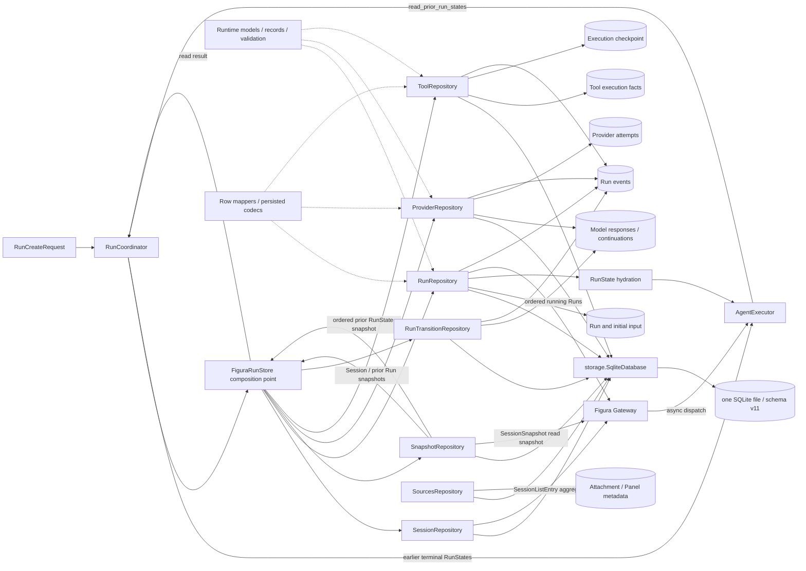

# Run Runtime：执行事实与恢复

> 更新日期：2026-10-03。[返回总览](../figura-implementation-overview.md)。范围：当前 `src/figura/runtime/` 的工作树实现。这里的“事实”指已提交的执行内容；Checkpoint 是推进控制，事件是安全投影。完整字段表在第 4 节。

## 1. 职责与边界

RunCoordinator 校验并推进 Session/Run；`FiguraRunStore` 是 Runtime 仓储的组合入口；DurableToolExecutor 记录工具尝试与结果。同一 Session 同时最多有一个 running Run。Runtime 向 Agent 提供同一 Session 中目标 Run 之前的终态 RunState 一致快照，供[Session Memory](memory.md)和[Agent 资源目录](agent.md#4-runexecutionstate-资源合同与完整字段)只读投影；也向本地 Gateway 提供 Session 列表聚合、Session 全量读取快照和 running Run 恢复列表。Agent 只能通过协调入口推进 Run，不能绕过 Checkpoint 直接更新执行历史。Provider 凭据、图片字节、调用期请求和 Memory 消息投影不进入 Run 事实。附件与 Panel 元数据由[Sources](sources.md)管理；OCR、四类测量、ChartFigure 和 ChartRender 的完整调用/结果继续使用通用 `ToolCallFact`、`ToolAttemptStartedFact` 与 `ToolResultFact`。Agent 的 `RunExecutionStateService` 从这些已提交事实及 Sources 元数据重建包含六种资源类型的调用期目录；它不增加 Runtime 字段、fact kind、Figure 表或渲染表。完整 OCR/测量结果仍在 ToolResultFact 与 Memory ToolMessage 中；ChartFigure 从成功调用参数和配对结果重建；PNG 字节由 Sources 保存，渲染摘要从成功结果重建。字段与读取规则见[Agent 资源目录](agent.md#4-runexecutionstate-资源合同与完整字段)。`RunStreamEvent` 保存生命周期事件和安全进度标记；`run_progress` 与事实提交、Checkpoint 推进处于同一事务，Gateway 用它触发工具时间线刷新，不把工具 payload 复制到 SSE。公开投影见[网页端边界](web.md)。

Runtime 按模型归属和事务职责保持中等粒度：[`runtime/models.py`](../../src/figura/runtime/models.py) 定义 Session/Run、Checkpoint 和枚举；[`runtime/records.py`](../../src/figura/runtime/records.py) 定义持久事实及 Run/Session 读取视图；[`runtime/validation.py`](../../src/figura/runtime/validation.py) 校验 Run 状态不变量，[`runtime/record_validation.py`](../../src/figura/runtime/record_validation.py) 校验持久事实字段和限制。共享 [`storage/database.py`](../../src/figura/storage/database.py) 管理 SQLite 连接和读写事务，[`storage/schema.py`](../../src/figura/storage/schema.py) 管理 schema v11。

### SQLite schema v11 迁移

当前版本为 **v10**：v10 增加独立停止请求表；v7 增加 `run_progress`；v8 引入 `session_deletion_scopes` 与仅允许 Session 整体删除的条件触发器；v9 允许 DeepSeek continuation 保存显式空字符串和 SQL NULL。新库直接建立当前表结构；已有 v1–v9 在 `BEGIN IMMEDIATE` 写锁内迁移，最后执行外键与完整性检查并提交 `user_version=10`。失败则回滚，未知未来版本拒绝读取。

- v1–v4 补建附件及 Panel 表；v5 只补建 Panel 表；既有 Sources 表与内容保留。
- 实际迁移代码对 v1–v7 重建事件表，复制原事件身份、序号、payload 和时间，并恢复触发器；v7 也会重建，不能把“已是 v7”当作迁移已完成。
- v3–v8 重建 continuation 表以放宽 DeepSeek 空/null 值约束，保留既有值、ID 和响应关联；更早版本直接建立当前 continuation 表。不为缺失历史推理伪造 payload。
- 删除 scope 表及六类条件删除触发器在升级路径统一安装；普通事实更新仍被禁止。scope 只在整会话删除事务内建立并移除，不是持久垃圾队列。

迁移不改变 Run 终态、checkpoint 或已提交内容，也不创建补偿模型响应。版本合同以 [`schema.py`](../../src/figura/storage/schema.py) 为准；当前表结构和空/null 续接不适合直接交给旧版本解释。

持久化按提交边界拆分：[`sessions.py`](../../src/figura/runtime/persistence/sessions.py) 写 Session 与列表聚合；[`runs.py`](../../src/figura/runtime/persistence/runs.py) 创建 Run、幂等映射并读取 RunState；[`snapshots.py`](../../src/figura/runtime/persistence/snapshots.py) 在一致读事务中加载完整 Session 和先前 Run 快照；[`providers.py`](../../src/figura/runtime/persistence/providers.py) 提交 Provider attempt/响应/continuation；[`tools.py`](../../src/figura/runtime/persistence/tools.py) 提交工具调用、attempt 和结果；[`run_transitions.py`](../../src/figura/runtime/persistence/run_transitions.py) 提交完成及失败/中断终态；[`controls.py`](../../src/figura/runtime/persistence/controls.py) 独立提交停止请求与通知。`mappers.py` 负责 SQLite 行映射，`runtime/codecs/` 按 record、tool fact 和 event payload 分组。

Sources 的附件与 Panel 元数据由 [`SourcesRepository`](../../src/figura/sources/repository.py) 管理，并与 Runtime 共用同一数据库；图像文件由 Sources 自己管理。Run 创建时的附件归属校验仍在 Run 创建写事务内执行。Agent 的 `RunExecutionStateService` 从 Runtime 快照、已提交工具事实与 Sources 资源重建统一派生目录，见[Agent 资源目录](agent.md#4-runexecutionstate-资源合同与完整字段)。`FiguraRunStore` 保留为 Runtime 的组成入口并委托各仓储，不负责文件操作或 Source CRUD。

## 2. 内部流转

1. **创建**：`RunCreateRequest` 带 Session、文本、显式 provider/model、幂等键及有序附件 ID。Coordinator 校验请求；`RunRepository` 在一个写事务内先查幂等映射，匹配则返回原 Run；否则若 Session 已有 running Run 则拒绝新建。事务随后校验附件属于该 Session，并写 `Run`、唯一 input `ExecutionRecord`（payload 为 `RunInput`）、初始 `ExecutionCheckpoint`、幂等映射及 created event。图片只以 ID 引用，字段见[Sources](sources.md#3-完整模型字段)。
2. **读取历史 Run**：Agent 在每个 model action 前请求目标 Run 的 `read_prior_run_states`。`SnapshotRepository` 在一个 SQLite 读快照中按 Session ordinal 查询全部较早 Run，校验 ordinal 从 1 连续、先前 Run 已终态、RunState 完整且附件元数据仍属该 Session，再返回完整 tuple。图像文件可读性在显式图像读取或最新批次回看时由 ImageReader 验证；纯历史投影不自动加载每个历史文件。此读取不写历史副本；消息投影由[Session Memory](memory.md)负责。
3. **网页读取**：Gateway 的 Session 列表使用 `SessionListEntry`，由 `SessionRepository` 的 SQL 聚合计算每个 Session 的 Run 数与最近活动时间，不逐个 hydrate `RunState`。Session 详情使用 `SnapshotRepository.read_session_snapshot`，在同一个 SQLite 读快照中读取 Session、按 ordinal 排列的完整 RunState 和 Sources 管理的附件元数据；Repository 检查 Run ordinal 连续、输入形状有效、附件都归属该 Session。Gateway 再把快照转换为有限 Web DTO；HTTP/SSE 与前端接口见[网页端边界](web.md#3-http-与前端接口)，完整 DTO 字段见[第 4 节](web.md#4-web-dto-字段)。
4. **模型尝试**：Agent 将完整历史、当前 Run 已提交前缀、图像清单及最新工具批次所需的原图、OCR/测量标注图或成功渲染的 ChartFigure PNG 组装成 `ProviderRequest`，由 ProviderClient.prepare 完成全量限制校验与 Provider 专属 payload 准备。只有准备通过并在锁内复查 checkpoint 后，才经 `FiguraRunStore` 委托 `ProviderRepository` claim `ProviderAttempt` 并发送请求。成功时，响应事实、私有 `ProviderContinuationFact`（如有）、工具调用意图、attempt 状态及下一 checkpoint 在同一 Provider 写事务中提交；若响应包含工具调用，该事务同时追加 `run_progress`，payload 只包含新的 checkpoint revision；纯文本响应不追加进度事件。确定失败与未知结果走不同状态；读取不重发已启动请求。prepare 失败无 attempt，Run 以 `execution_failed` 终结；已知拒绝映射为 `PREPARATION_MESSAGES` 白名单文案，其他错误使用通用说明。既有 `terminal_message` 保存原因，SSE 仍只投影 terminal code。完整消息不得为满足 Provider 限制而裁剪，超限时不 claim。
5. **工具尝试**：`ToolCallFact` 是模型提出的逻辑调用；`ToolAttemptStartedFact` 表示执行尝试已领取、即将调用 handler；孤立 start 不能证明 handler 未执行或已完成；`ToolResultFact` 记录成功或有界失败。DurableToolExecutor 执行 handler 并通过 `ToolRepository` 追加事实和推进 checkpoint；每次写入工具调用、开始 attempt 或提交结果时，同一事务还追加携带新 checkpoint revision 的 `run_progress`。该事件让 Web 重新读取只读时间线，不承载工具参数或结果。批次完成后才继续模型轮次。Sources 保存 Panel PNG 与元数据；只有成功分割结果事实提交后，Panel 才进入 Agent 的资源目录和 Web 列表。`extract_text` 与四种测量工具读取被授权的 Attachment 或 Panel；完整 OCR、测量结果以及安全错误均随通用 `ToolResultFact` 保存。`assemble_chart_figure` 复用同一事实模型：完整 Figure 位于原调用参数，成功配对后由 Agent 重建为 `ChartFigureContent`。`render_chart_figure` 将已接受 Figure 引用写入 ToolCallFact，ToolResultFact 仅保存 Figure digest、PNG SHA-256、media type、byte count 和尺寸，不保存图片字节；PNG 私有文件由 [Sources](sources.md#4-存储失败与访问边界) 管理。Agent 将 OCR、测量、Figure 与渲染结果一并重建为有类型引用的资源内容，避免建立并行的结果投影模型。OCR/测量标注图由 Agent 临时重建，不成为 Runtime 事实。图像读取、OCR、测量与 Figure 组装为 `replay_safe`；Panel 分割和 PNG 文件保存按调用身份幂等恢复。
6. **终结与恢复**：Checkpoint 的 `revision` 用于拒绝过期推进；`next_action` 指明 model、provider_retry、provider_attempt、tool_execution、tool_attempt 或 final。`RunTransitionRepository` 提交 `FinalAnswerFact` 或失败/中断状态，并写安全终态事件。Gateway 启动及周期扫描时通过 `RunRepository.list_running_runs` 按 Session ID、ordinal 稳定排序发现 running Run，并通过有界 Dispatcher 交给既有 Agent 恢复路径。`RunRepository` 从 SQLite 重建 `RunState`；事件、历史展示和未来评测从已提交事实投影，不反向成为权威状态。

7. **接受停止**：`RunControlRepository.request_stop` 在独立写事务核对 Session 归属、Run 状态与已有请求。首次 running 请求写 `RunStopRequest` 和唯一进度通知，重复请求返回原对象，终态不新增请求；checkpoint revision 不变。Agent 与动作 claim/completion 读取该控制事实决定是否继续；HTTP 接受不等于动作已经退出。完整竞态与恢复规则见[停止、所有权与恢复事务](#停止所有权与恢复事务)。

### Session 整体删除的提交边界

删除由 Gateway 的 `FiguraSessionDeletion` 协调，Runtime 不自行操作图片文件。它先按 Run 顺序取得全部执行 owner，确认前序执行者释放，再持有同一个 SQLite 写事务，经 `SessionRepository.assert_deletable` 核对 Session 存在且没有 running Run，再取出该 Session 的全部渲染调用身份；Sources 在该事务中列出附件/Panel 身份并暂存文件。然后按以下顺序处理数据库：

1. 建立 `session_deletion_scopes` 授权行，允许该 Session 的不可变事实整体删除；其他 Session 仍受删除触发器保护。
2. 删除其停止请求、幂等映射、continuation、Provider attempts、request bindings、checkpoint、事件、工具事实和执行记录。
3. Sources 删除 Panel/附件元数据；Runtime 删除 Run 行，最后移除 scope 并删除 Session。
4. SQLite 提交成功后才丢弃暂存图片；事务失败时行全部回滚，并由 Gateway 恢复图片。恢复失败报安全 storage error；重启可继续对账。完整文件步骤见 [Web 删除协调](web.md#会话删除与恢复) 与 [Sources 文件生命周期](sources.md#2-内部流转与不变量)。

`session_deletion_scopes` 是事务授权表，没有对应 dataclass：`session_id` 为主键并外键指向 Session，`created_at` 为 Runtime 写入的 UTC 文本。二者只由 `SessionRepository.begin_deletion/complete_deletion` 在同一删除事务写入和移除，触发器读取；不公开、不用于追踪已删除会话或恢复图片。删除冲突使用 `RunErrorCode.SESSION_HAS_RUNNING_RUN`；不存在的 Session 使用 `SESSION_NOT_FOUND`。跨存储协调不是 SQLite 与文件系统的原子事务，其恢复依据是提交后 Session 是否仍存在。

## 3. 模型关系与共同规则

Session 是 Runtime 的 Run 生命周期边界；附件和 Panel 元数据由 Sources 按 Session ID 管理。Run 输入只引用附件 ID。`AttachmentMetadata` 与 `PanelRecord` 的完整字段见[Sources](sources.md#3-完整模型字段)。`SessionListEntry` 是列表查询聚合，`SessionSnapshot` 是一次一致的 Session 读取视图；两者不另建持久事实。`RunExecutionState` 是 Agent 从 Runtime 快照、已提交工具事实与 Sources 资源重建的调用期类型化资源目录，只有 `run_id` 和有序 `resources`；它不扩充 RunState 或 SessionSnapshot，也不增加持久事实。目录包含附件、Panel、OCR、measurement、ChartFigure 和 ChartRender 内容；其完整字段归[Agent 专题](agent.md#4-runexecutionstate-资源合同与完整字段)。Runtime 继续只持久保存既有通用工具事实，ChartFigure 字段合同归[Charts](charts.md#4-完整模型字段)。一个 Session 同时至多有一个 `running` Run；幂等重放在 active-Run 拒绝检查之前。Run 还拥有自己的执行记录、工具事实、Provider attempts、continuation、Checkpoint 与事件。`ExecutionRecord.payload` 是 `RunInput | ModelResponseFact | FinalAnswerFact`；`ToolExecutionFact.payload` 是 `ToolCallFact | ToolAttemptStartedFact | ToolResultFact`。这些联合类型按 kind 判别，不能只凭同名 ID 猜测类型。事件的 `event_sequence` 与记录的 `record_sequence`、工具事实的 `tool_sequence` 分属不同序列。事件 `payload` 的 `EventValue` 仅允许 `str | int | tuple[str, ...]`。

Runtime 提供较早 Run 的一致读取，不负责将其转成消息。`SessionHistory` 与 role-specific Memory 消息是每次 Agent 请求时的不可变投影；它们没有 SQLite 表，不改变 Run 的字段合同。完整字段和投影来源见[Session Memory 专题](memory.md#4-完整模型字段)。

以下字段表按当前 Python dataclass 的全部声明字段列出。表内“默认”是构造默认值；`—` 表示构造时必传，不代表值在业务上可任意为空。时间是存储的 UTC 文本。每个模型小节的写入/权威/读取边界适用于其全部字段，字段行再注明例外。

字段表中的写入者按实际负责 SQLite 提交的 Repository 标注；RunCoordinator 与 DurableToolExecutor 是调用入口，`FiguraRunStore` 只组合并委托仓储。Session 与列表聚合对应 `SessionRepository`；Run、初始输入、幂等查找和 RunState hydration 对应 `RunRepository`；SessionSnapshot 与先前 Run 快照对应 `SnapshotRepository`；Provider 尝试、响应及同响应提交的工具调用意图对应 `ProviderRepository`；独立工具调用追加、attempt 和结果对应 `ToolRepository`；终态事实与事件对应 `RunTransitionRepository`。`AttachmentMetadata` 由 Sources 持久化；`SessionSnapshot.attachments` 是 SnapshotRepository 从 Sources 表读取的值。以下字段按当前 schema v11 与代码列出；跨 Run 续接重放只读取源事实，不把源 continuation 写到新 Run。Session 整体删除是不可变事实禁止单独删除的受控例外。

## 4. 完整模型字段

### Session

会话身份与元数据；Run 归属该 Session，Sources 附件以 Session ID 关联，不由 Runtime 拥有。 **写入/构建者：**SessionRepository（经 RunCoordinator）。**权威位置：**sessions 表。**读取与公开：**Session 查询、Run 创建；安全元数据可公开。[定义](../../src/figura/runtime/models.py)。

| 完整字段路径 | 类型 | 构造默认 | 含义与约束 | 写入 → 权威 → 读取/公开 |
|---|---|---|---|---|
| Session.session_id | str | 必传 | 所属 Session 的不透明身份；跨 Session 读取须拒绝 | SessionRepository（经 RunCoordinator） → sessions 表 → Session 查询、Run 创建；安全元数据可公开 |
| Session.name | str \| None | 必传 | 可选的会话显示名称；不参与 Session 身份判定 | SessionRepository（经 RunCoordinator） → sessions 表 → Session 查询、Run 创建；安全元数据可公开 |
| Session.created_at | str | 必传 | 创建时的 UTC 时间 | SessionRepository（经 RunCoordinator） → sessions 表 → Session 查询、Run 创建；安全元数据可公开 |
| Session.updated_at | str | 必传 | 最后更新时的 UTC 时间 | SessionRepository（经 RunCoordinator） → sessions 表 → Session 查询、Run 创建；安全元数据可公开 |

### SessionListEntry

Session 列表的查询聚合值，不独立持久化。**写入/构建者：**`SessionRepository.list_session_entries`。**权威位置：**调用期查询结果；Session 字段仍由 `sessions` 表权威，Run 数与最近活动由 SQL 聚合计算。**读取与公开：**Gateway Session 列表；经 [Web DTO](web.md#4-web-dto-字段) 安全投影。[定义](../../src/figura/runtime/models.py)。

| 完整字段路径 | 类型 | 构造默认 | 含义与约束 | 写入 → 权威 → 读取/公开 |
|---|---|---|---|---|
| SessionListEntry.session | Session | 必传 | Session 持久身份与元数据；完整字段见本页 `Session` | SessionRepository → sessions 表 → Gateway 列表投影；只公开安全 Session 元数据 |
| SessionListEntry.run_count | int | 必传 | 该 Session 当前持久 Run 总数；由 SQL `COUNT(*)` 计算，不另存 | SessionRepository → 查询聚合 → Gateway `runCount`；只公开数量 |
| SessionListEntry.latest_activity | str | 必传 | `session.updated_at`、Run `finished_at`/`created_at` 和附件 `created_at` 的最大时间 | SessionRepository → 查询聚合 → Gateway `updatedAt`；只公开 UTC 时间 |

### SessionSnapshot

Session 详情的一致读取视图，不独立持久化。**写入/构建者：**`SnapshotRepository.read_session_snapshot`。**权威位置：**调用期 SQLite 读快照；各嵌套对象由各自 owner 持久化。**读取与公开：**Gateway 详情投影；经 [Web DTO](web.md#4-web-dto-字段) 限定后公开。[定义](../../src/figura/runtime/records.py)。

| 完整字段路径 | 类型 | 构造默认 | 含义与约束 | 写入 → 权威 → 读取/公开 |
|---|---|---|---|---|
| SessionSnapshot.session | Session | 必传 | 被读取的 Session；完整字段见本页 `Session` | SnapshotRepository → sessions 表中的同一读快照 → Gateway Session 投影；安全字段公开 |
| SessionSnapshot.run_states | tuple[RunState, ...] | 必传 | 同一 Session 全部 RunState，按 ordinal 升序；Repository 要求序号连续并验证输入事实 | SnapshotRepository → 各 Run 权威表的同一读快照 → Gateway Run/消息投影；RunState 整体不公开 |
| SessionSnapshot.attachments | tuple[AttachmentMetadata, ...] | 必传 | 该 Session 保留的附件元数据，按 `created_at, attachment_id` 排序；Run 引用归属在快照内验证 | SnapshotRepository 读取、AttachmentMetadata 由 SourcesRepository 写入 → attachments 表的同一读快照 → Gateway 附件 DTO；图像字节与本机路径不公开 |

### Run

一次独立执行的身份、模型选择和生命周期。 **写入/构建者：**RunRepository 创建；ProviderRepository / RunTransitionRepository 写入失败或完成终态（均经 RunCoordinator）。**权威位置：**runs 表。**读取与公开：**Agent、恢复与安全 Run 摘要。[定义](../../src/figura/runtime/models.py)。

| 完整字段路径 | 类型 | 构造默认 | 含义与约束 | 写入 → 权威 → 读取/公开 |
|---|---|---|---|---|
| Run.run_id | str | 必传 | 所属 Run 的不透明身份 | Runtime 创建/终态仓储（经 RunCoordinator） → runs 表 → Agent、恢复与安全 Run 摘要 |
| Run.session_id | str | 必传 | 所属 Session 的不透明身份；跨 Session 读取须拒绝 | Runtime 创建/终态仓储（经 RunCoordinator） → runs 表 → Agent、恢复与安全 Run 摘要 |
| Run.ordinal | int | 必传 | 同 Session 中 Run 的顺序号 | Runtime 创建/终态仓储（经 RunCoordinator） → runs 表 → Agent、恢复与安全 Run 摘要 |
| Run.input_record_id | str | 必传 | 唯一输入 ExecutionRecord 的 ID | Runtime 创建/终态仓储（经 RunCoordinator） → runs 表 → Agent、恢复与安全 Run 摘要 |
| Run.status | RunStatus | 必传 | 本对象的生命周期状态；值见本页枚举 | Runtime 创建/终态仓储（经 RunCoordinator） → runs 表 → Agent、恢复与安全 Run 摘要 |
| Run.provider | str | 必传 | Run 创建时固定的 provider 选择 | Runtime 创建/终态仓储（经 RunCoordinator） → runs 表 → Agent、恢复与安全 Run 摘要 |
| Run.model | str | 必传 | Run 创建时固定的 model 选择 | Runtime 创建/终态仓储（经 RunCoordinator） → runs 表 → Agent、恢复与安全 Run 摘要 |
| Run.created_at | str | 必传 | 创建时的 UTC 时间 | Runtime 创建/终态仓储（经 RunCoordinator） → runs 表 → Agent、恢复与安全 Run 摘要 |
| Run.started_at | str | 必传 | Run 创建时写入的 UTC 开始时间；当前与 created_at 相同，不代表首次模型请求的发送时刻 | Runtime 创建/终态仓储（经 RunCoordinator） → runs 表 → Agent、恢复与安全 Run 摘要 |
| Run.finished_at | str \| None | None | 终态时间；运行中为空 | Runtime 创建/终态仓储（经 RunCoordinator） → runs 表 → Agent、恢复与安全 Run 摘要 |
| Run.terminal_code | str \| None | None | 终态原因码；非适用状态为空 | Runtime 创建/终态仓储（经 RunCoordinator） → runs 表 → Agent、恢复与安全 Run 摘要 |
| Run.terminal_message | str \| None | None | 安全终态说明，最多 256 UTF-8 bytes；默认 TERMINAL_MESSAGES，execution_failed 可用 PREPARATION_MESSAGES 白名单解释本地拒绝，非适用状态为空 | Runtime 创建/终态仓储（经 RunCoordinator） → runs 表 → Agent、恢复与安全 Run 摘要 |
| Run.final_record_id | str \| None | None | 最终答案记录 ID；完成前为空 | Runtime 创建/终态仓储（经 RunCoordinator） → runs 表 → Agent、恢复与安全 Run 摘要 |

### RunInput

创建时固定的唯一输入事实。 **写入/构建者：**RunRepository（经 RunCoordinator）。**权威位置：**input ExecutionRecord.payload。**读取与公开：**Agent 请求构建；文本与附件 ID 不进入普通事件。[定义](../../src/figura/runtime/records.py)。

| 完整字段路径 | 类型 | 构造默认 | 含义与约束 | 写入 → 权威 → 读取/公开 |
|---|---|---|---|---|
| RunInput.text | str | 必传 | 用户提交的原始文本；不写普通事件 | RunRepository（经 RunCoordinator） → input ExecutionRecord.payload → Agent 请求构建；文本与附件 ID 不进入普通事件 |
| RunInput.attachment_ids | tuple[str, ...] | 必传 | 最多 16 个有序、去重的附件 ID；创建时校验 Session 归属 | RunRepository（经 RunCoordinator） → input ExecutionRecord.payload → Agent 请求构建；文本与附件 ID 不进入普通事件 |
| RunInput.requested_provider | str | 必传 | 创建时请求的 provider ID | RunRepository（经 RunCoordinator） → input ExecutionRecord.payload → Agent 请求构建；文本与附件 ID 不进入普通事件 |
| RunInput.requested_model | str | 必传 | 创建时请求的 model ID | RunRepository（经 RunCoordinator） → input ExecutionRecord.payload → Agent 请求构建；文本与附件 ID 不进入普通事件 |
| RunInput.schema_version | int | 2 | 该值或 payload 的版本号 | RunRepository（经 RunCoordinator） → input ExecutionRecord.payload → Agent 请求构建；文本与附件 ID 不进入普通事件 |

### ModelResponseFact

已提交的模型响应事实。 **写入/构建者：**`ProviderRepository`（经 RunCoordinator）。**权威位置：**model_response ExecutionRecord.payload。**读取与公开：**历史重建和 Agent；原始内容不直接作 SSE payload。[定义](../../src/figura/runtime/records.py)。

| 完整字段路径 | 类型 | 构造默认 | 含义与约束 | 写入 → 权威 → 读取/公开 |
|---|---|---|---|---|
| ModelResponseFact.provider_id | str | 必传 | 规范化 provider 身份 | `ProviderRepository`（经 RunCoordinator） → model_response ExecutionRecord.payload → 历史重建和 Agent；原始内容不直接作 SSE payload |
| ModelResponseFact.model_id | str | 必传 | 固定或响应中的模型身份 | `ProviderRepository`（经 RunCoordinator） → model_response ExecutionRecord.payload → 历史重建和 Agent；原始内容不直接作 SSE payload |
| ModelResponseFact.assistant_content | str | 必传 | 模型文本内容；需按响应规则判断可否终结 | `ProviderRepository`（经 RunCoordinator） → model_response ExecutionRecord.payload → 历史重建和 Agent；原始内容不直接作 SSE payload |
| ModelResponseFact.finish_reason | str | 必传 | 归一化结束原因 | `ProviderRepository`（经 RunCoordinator） → model_response ExecutionRecord.payload → 历史重建和 Agent；原始内容不直接作 SSE payload |
| ModelResponseFact.usage | ProviderUsage \| None | None | token 用量；可空且各计数也可空 | `ProviderRepository`（经 RunCoordinator） → model_response ExecutionRecord.payload → 历史重建和 Agent；原始内容不直接作 SSE payload |
| ModelResponseFact.provider_response_id | str \| None | None | Provider 返回的可选响应 ID | `ProviderRepository`（经 RunCoordinator） → model_response ExecutionRecord.payload → 历史重建和 Agent；原始内容不直接作 SSE payload |
| ModelResponseFact.continuation_ref | str \| None | None | 绑定私有 continuation 的内部引用；可空 | `ProviderRepository`（经 RunCoordinator） → model_response ExecutionRecord.payload → 历史重建和 Agent；原始内容不直接作 SSE payload |
| ModelResponseFact.schema_version | int | 3 | 该值或 payload 的版本号 | `ProviderRepository`（经 RunCoordinator） → model_response ExecutionRecord.payload → 历史重建和 Agent；原始内容不直接作 SSE payload |

### ProviderContinuationFact

与来源响应绑定的私有续接内容。 **写入/构建者：**`ProviderRepository`（经 RunCoordinator）。**权威位置：**run_provider_continuations 表。**读取与公开：**后续请求重建；不公开 reasoning_content。[定义](../../src/figura/runtime/records.py)。

| 完整字段路径 | 类型 | 构造默认 | 含义与约束 | 写入 → 权威 → 读取/公开 |
|---|---|---|---|---|
| ProviderContinuationFact.continuation_id | str | 必传 | 私有 continuation 的不透明身份 | `ProviderRepository`（经 RunCoordinator） → run_provider_continuations 表 → 后续请求重建；不公开 reasoning_content |
| ProviderContinuationFact.run_id | str | 必传 | 所属 Run 的不透明身份 | `ProviderRepository`（经 RunCoordinator） → run_provider_continuations 表 → 后续请求重建；不公开 reasoning_content |
| ProviderContinuationFact.response_record_id | str | 必传 | 所关联的模型响应记录 ID；构造时必传 | `ProviderRepository`（经 RunCoordinator） → run_provider_continuations 表 → 后续请求重建；不公开 reasoning_content |
| ProviderContinuationFact.provider_id | str | 必传 | 规范化 provider 身份 | `ProviderRepository`（经 RunCoordinator） → run_provider_continuations 表 → 后续请求重建；不公开 reasoning_content |
| ProviderContinuationFact.format_version | int | 必传 | Provider 私有续接格式版本 | `ProviderRepository`（经 RunCoordinator） → run_provider_continuations 表 → 后续请求重建；不公开 reasoning_content |
| ProviderContinuationFact.schema_version | int | 必传 | 该值或 payload 的版本号 | `ProviderRepository`（经 RunCoordinator） → run_provider_continuations 表 → 后续请求重建；不公开 reasoning_content |
| ProviderContinuationFact.reasoning_content | str \| None | 必传，无默认 | 私有续接原值，最多 512 KiB UTF-8；DeepSeek 允许空字符串/SQL NULL，其他 Provider 要求非空文本；缺失对象不等于 null | `ProviderRepository`（经 RunCoordinator） → run_provider_continuations 表 → 后续请求重建；不公开 reasoning_content |
| ProviderContinuationFact.created_at | str | 必传 | 创建时的 UTC 时间 | `ProviderRepository`（经 RunCoordinator） → run_provider_continuations 表 → 后续请求重建；不公开 reasoning_content |

### ProviderRequestBinding

Runtime 拥有逻辑网络操作的不可变身份；Agent 从 Provider prepared descriptor 构造，初次 claim 在同一 SQLite 事务写入。凭据、原文、图像字节、原生 payload 不入绑定。Provider/model、原 record/tool prefix 与冻结选项共同确定重建请求；摘要不进入 prompt、HTTP/SSE 或日志。

| 完整字段路径 | 类型 | 默认 | 语义与校验 | 写入 → 权威 → 读取/公开 |
|---|---|---|---|---|
| ProviderRequestBinding.operation_id | str | 必传 | 逻辑请求唯一身份 | Agent/ProviderRepository → run_provider_request_bindings.payload_json → Agent 重建/Runtime 校验；私有不可修订 |
| ProviderRequestBinding.run_id | str | 必传 | 所属 Run | Agent/ProviderRepository → run_provider_request_bindings.payload_json → Agent 重建/Runtime 校验；私有不可修订 |
| ProviderRequestBinding.base_record_sequence | int | 必传 | 绑定的记录前缀，正数 | Agent/ProviderRepository → run_provider_request_bindings.payload_json → Agent 重建/Runtime 校验；私有不可修订 |
| ProviderRequestBinding.base_tool_sequence | int | 必传 | 绑定的工具前缀，非负 | Agent/ProviderRepository → run_provider_request_bindings.payload_json → Agent 重建/Runtime 校验；私有不可修订 |
| ProviderRequestBinding.provider_id | str | 必传 | Run 固定 Provider | Agent/ProviderRepository → run_provider_request_bindings.payload_json → Agent 重建/Runtime 校验；私有不可修订 |
| ProviderRequestBinding.model_id | str | 必传 | Run 固定 model | Agent/ProviderRepository → run_provider_request_bindings.payload_json → Agent 重建/Runtime 校验；私有不可修订 |
| ProviderRequestBinding.request_fingerprint | str | 必传 | 准备后的 SDK payload、POST/path 与 endpoint binding 的 canonical SHA-256 | Agent/ProviderRepository → run_provider_request_bindings.payload_json → Agent 重建/Runtime 校验；私有不可修订 |
| ProviderRequestBinding.endpoint_binding | str | 必传 | 规范配置 base URL 加 /chat/completions 的 SHA-256；不存原 URL | Agent/ProviderRepository → run_provider_request_bindings.payload_json → Agent 重建/Runtime 校验；私有不可修订 |
| ProviderRequestBinding.options | Mapping[str, object] | 必传 | 冻结的四个 Provider 选项与 timeout_seconds；stream=false | Agent/ProviderRepository → run_provider_request_bindings.payload_json → Agent 重建/Runtime 校验；私有不可修订 |
| ProviderRequestBinding.asset_manifest | Mapping[str, object] | 必传 | 提示、Registry、Adapter 和有序图片身份/digest | Agent/ProviderRepository → run_provider_request_bindings.payload_json → Agent 重建/Runtime 校验；私有不可修订 |
| ProviderRequestBinding.created_at | str | 必传 | 初次绑定的 UTC 时间 | Agent/ProviderRepository → run_provider_request_bindings.payload_json → Agent 重建/Runtime 校验；私有不可修订 |
| ProviderRequestBinding.request_contract_version | int | 1 | 当前可重建 wire 合同版本 | Agent/ProviderRepository → run_provider_request_bindings.payload_json → Agent 重建/Runtime 校验；私有不可修订 |
| ProviderRequestBinding.schema_version | int | 1 | 绑定 envelope 版本 | Agent/ProviderRepository → run_provider_request_bindings.payload_json → Agent 重建/Runtime 校验；私有不可修订 |
| ProviderRequestBinding.generation_only | bool | True | 仅生成请求可替代 unknown | Agent/ProviderRepository → run_provider_request_bindings.payload_json → Agent 重建/Runtime 校验；私有不可修订 |
| ProviderRequestBinding.max_attempts | int | 4 | 固定首次加最多三次，不是 Run 总次数 | Agent/ProviderRepository → run_provider_request_bindings.payload_json → Agent 重建/Runtime 校验；私有不可修订 |
| ProviderRequestBinding.retry_policy_version | int | 1 | 持久重试政策版本 | Agent/ProviderRepository → run_provider_request_bindings.payload_json → Agent 重建/Runtime 校验；私有不可修订 |

`options` 是只读 Mapping，精确包含下面五个字段；未知字段拒绝。它不沿用 ProviderOptions 的 schema_version 字段，绑定 envelope 自身拥有版本。`asset_manifest` 同样只读，不存路径、endpoint 原文或原图。

| 完整字段路径 | 类型/约束 | 写入 → 权威 → 读取/公开 |
|---|---|---|
| ProviderRequestBinding.options.max_completion_tokens | int 或 null；正数或未设 | Provider prepare → 私有 binding JSON → 重建 ProviderOptions；不公开 |
| ProviderRequestBinding.options.stream | false | Provider prepare → 私有 binding JSON → generation-only 重试校验 |
| ProviderRequestBinding.options.thinking_mode | bool | Provider prepare 解析默认值 → binding → 重建时冻结 |
| ProviderRequestBinding.options.reasoning_effort | str 或 null | Provider prepare 解析默认值 → binding → 重建时冻结 |
| ProviderRequestBinding.options.timeout_seconds | 有限正 int/float，默认60 | Provider profile → binding → 每次 SDK 请求显式覆盖 timeout；不受改变后的默认值影响 |
| ProviderRequestBinding.asset_manifest.prompt_digest | SHA-256 | Agent 三层完整指令 → binding → 重建比较 |
| ProviderRequestBinding.asset_manifest.registry_version | 非空 str | Registry → binding → 重建比较 |
| ProviderRequestBinding.asset_manifest.registry_digest | SHA-256 | Agent 完整 definitions（含参数/结果 Schema 与 replay effect）→ binding → 重建比较 |
| ProviderRequestBinding.asset_manifest.adapter_contract_version | int，1 | Provider prepare → binding → 重建比较 |
| ProviderRequestBinding.asset_manifest.images | 有序只读 tuple | Agent 图片块 → Provider prepare → binding → 重建比较；无图片为空 |
| ProviderRequestBinding.asset_manifest.images[].source_ref | original 为 {kind: attachment/panel, id}；annotated 为 {kind: ocr/measurement, run_id, call_id}；rendered 为 {kind: chart_render, run_id, call_id} | Agent 授权资源引用 → binding → 图片身份比较；引用完整合同见 [Agent](agent.md) |
| ProviderRequestBinding.asset_manifest.images[].observation_kind | original/annotated/rendered | Agent 图像回看 → binding → 重建比较 |
| ProviderRequestBinding.asset_manifest.images[].media_type | 允许的 image MIME | Sources/Agent → binding → 重建比较 |
| ProviderRequestBinding.asset_manifest.images[].byte_count | 正 int | Provider 对真实图像取长度 → binding → 重建比较 |
| ProviderRequestBinding.asset_manifest.images[].sha256 | SHA-256 | Provider 对真实图像取 digest → binding → 重建比较 |

### ProviderAttempt

一次已 claim 的模型请求尝试及确定性状态。 **写入/构建者：**`ProviderRepository`（经 RunCoordinator）。**权威位置：**run_provider_attempts 表。**读取与公开：**Agent 恢复与预算；只公开安全状态。[定义](../../src/figura/runtime/records.py)。

| 完整字段路径 | 类型 | 构造默认 | 含义与约束 | 写入 → 权威 → 读取/公开 |
|---|---|---|---|---|
| ProviderAttempt.attempt_id | str | 必传 | 一次 Provider 请求尝试的身份 | `ProviderRepository`（经 RunCoordinator） → run_provider_attempts 表 → Agent 恢复与预算；只公开安全状态 |
| ProviderAttempt.run_id | str | 必传 | 所属 Run 的不透明身份 | `ProviderRepository`（经 RunCoordinator） → run_provider_attempts 表 → Agent 恢复与预算；只公开安全状态 |
| ProviderAttempt.attempt_sequence | int | 必传 | Run 内 Provider 尝试顺序号 | `ProviderRepository`（经 RunCoordinator） → run_provider_attempts 表 → Agent 恢复与预算；只公开安全状态 |
| ProviderAttempt.base_record_sequence | int | 必传 | claim 时已提交的执行记录游标 | `ProviderRepository`（经 RunCoordinator） → run_provider_attempts 表 → Agent 恢复与预算；只公开安全状态 |
| ProviderAttempt.base_tool_sequence | int | 必传 | claim 时已提交的工具事实游标 | `ProviderRepository`（经 RunCoordinator） → run_provider_attempts 表 → Agent 恢复与预算；只公开安全状态 |
| ProviderAttempt.status | ProviderAttemptStatus | 必传 | 本对象的生命周期状态；值见本页枚举 | `ProviderRepository`（经 RunCoordinator） → run_provider_attempts 表 → Agent 恢复与预算；只公开安全状态 |
| ProviderAttempt.response_record_id | str \| None | 必传 | 所关联的模型响应记录 ID；可空时表示尚未提交 | `ProviderRepository`（经 RunCoordinator） → run_provider_attempts 表 → Agent 恢复与预算；只公开安全状态 |
| ProviderAttempt.failure_code | str \| None | 必传 | 安全失败码；成功或未定时为空 | `ProviderRepository`（经 RunCoordinator） → run_provider_attempts 表 → Agent 恢复与预算；只公开安全状态 |
| ProviderAttempt.started_at | str | 必传 | 开始执行的 UTC 时间 | `ProviderRepository`（经 RunCoordinator） → run_provider_attempts 表 → Agent 恢复与预算；只公开安全状态 |
| ProviderAttempt.finished_at | str \| None | 必传 | 终态时间；运行中为空 | `ProviderRepository`（经 RunCoordinator） → run_provider_attempts 表 → Agent 恢复与预算；只公开安全状态 |

| ProviderAttempt.operation_id | str \| None | None | 逻辑请求 binding 的身份；legacy 空 | ProviderRepository → run_provider_attempts → Agent/Dispatcher；私有，不进入 prompt 或公共 DTO |
| ProviderAttempt.operation_attempt_number | int \| None | None | 绑定操作内连续 1–4；legacy 空 | ProviderRepository → run_provider_attempts → Agent/Dispatcher；私有，不进入 prompt 或公共 DTO |
| ProviderAttempt.retry_of_attempt_id | str \| None | None | 前一个已关闭 attempt；初次/legacy 空 | ProviderRepository → run_provider_attempts → Agent/Dispatcher；私有，不进入 prompt 或公共 DTO |
| ProviderAttempt.failure_category | str \| None | None | temporary_unsent / temporary_rejected / temporary_unknown / permanent / invalid_response / internal_error；started/accepted 空 | ProviderRepository → run_provider_attempts → Agent/Dispatcher；私有，不进入 prompt 或公共 DTO |
| ProviderAttempt.http_status | int \| None | None | 安全 HTTP 状态码，100–599 | ProviderRepository → run_provider_attempts → Agent/Dispatcher；私有，不进入 prompt 或公共 DTO |
| ProviderAttempt.next_eligible_at | str \| None | None | 可重试关闭后的 UTC 到期时间；非重试和第4次为空 | ProviderRepository → run_provider_attempts → Agent/Dispatcher；私有，不进入 prompt 或公共 DTO |

### FinalAnswerFact

最终回答与来源响应的绑定事实。 **写入/构建者：**`RunTransitionRepository`（经 RunCoordinator）。**权威位置：**final_answer ExecutionRecord.payload。**读取与公开：**Run 终结与回答读取；artifact_refs 当前为空。[定义](../../src/figura/runtime/records.py)。

| 完整字段路径 | 类型 | 构造默认 | 含义与约束 | 写入 → 权威 → 读取/公开 |
|---|---|---|---|---|
| FinalAnswerFact.response_record_id | str | 必传 | 所关联的模型响应记录 ID；构造时必传 | `RunTransitionRepository`（经 RunCoordinator） → final_answer ExecutionRecord.payload → Run 终结与回答读取；artifact_refs 当前为空 |
| FinalAnswerFact.artifact_refs | tuple[str, ...] | () | 最终回答关联的产物引用；当前文本版本通常为空 | `RunTransitionRepository`（经 RunCoordinator） → final_answer ExecutionRecord.payload → Run 终结与回答读取；artifact_refs 当前为空 |
| FinalAnswerFact.guard_version | str | 'text-only-v1' | 最终回答守卫规则版本 | `RunTransitionRepository`（经 RunCoordinator） → final_answer ExecutionRecord.payload → Run 终结与回答读取；artifact_refs 当前为空 |
| FinalAnswerFact.schema_version | int | 2 | 该值或 payload 的版本号 | `RunTransitionRepository`（经 RunCoordinator） → final_answer ExecutionRecord.payload → Run 终结与回答读取；artifact_refs 当前为空 |

### ToolCallFact

模型提出的逻辑工具调用。 **写入/构建者：**`ProviderRepository`（响应原子提交）或 `ToolRepository`（独立追加）。**权威位置：**run_tool_execution_facts 的 tool_call payload。**读取与公开：**DurableToolExecutor 与历史重建；参数不直接公开。[定义](../../src/figura/runtime/records.py)。

| 完整字段路径 | 类型 | 构造默认 | 含义与约束 | 写入 → 权威 → 读取/公开 |
|---|---|---|---|---|
| ToolCallFact.response_record_id | str | 必传 | 来源已提交模型响应记录 ID；不可为空 | `ProviderRepository`（响应原子提交）或 `ToolRepository`（独立追加） → run_tool_execution_facts 的 tool_call payload → DurableToolExecutor 与历史重建；参数不直接公开 |
| ToolCallFact.call_id | str | 必传 | 模型给出的 opaque 逻辑工具调用 ID，Run 内唯一；恢复沿用，不跨 Run 重映射 | `ProviderRepository`（响应原子提交）或 `ToolRepository`（独立追加） → run_tool_execution_facts 的 tool_call payload → DurableToolExecutor 与历史重建；参数不直接公开 |
| ToolCallFact.tool_name | str | 必传 | 工具定义名称 | `ProviderRepository`（响应原子提交）或 `ToolRepository`（独立追加） → run_tool_execution_facts 的 tool_call payload → DurableToolExecutor 与历史重建；参数不直接公开 |
| ToolCallFact.arguments_json | str | 必传 | 模型提供的 JSON 参数原文；执行前严格解析 | `ProviderRepository`（响应原子提交）或 `ToolRepository`（独立追加） → run_tool_execution_facts 的 tool_call payload → DurableToolExecutor 与历史重建；参数不直接公开 |
| ToolCallFact.position | int | 0 | 响应内工具调用的原始顺序 | `ProviderRepository`（响应原子提交）或 `ToolRepository`（独立追加） → run_tool_execution_facts 的 tool_call payload → DurableToolExecutor 与历史重建；参数不直接公开 |
| ToolCallFact.registry_version | str | '' | 调用时使用的工具 Registry 版本 | `ProviderRepository`（响应原子提交）或 `ToolRepository`（独立追加） → run_tool_execution_facts 的 tool_call payload → DurableToolExecutor 与历史重建；参数不直接公开 |
| ToolCallFact.schema_version | int | 2 | 该值或 payload 的版本号 | `ProviderRepository`（响应原子提交）或 `ToolRepository`（独立追加） → run_tool_execution_facts 的 tool_call payload → DurableToolExecutor 与历史重建；参数不直接公开 |

### ToolAttemptStartedFact

handler 启动前的耐久标记。 **写入/构建者：**`ToolRepository`（经 DurableToolExecutor）。**权威位置：**run_tool_execution_facts 的 tool_attempt_started payload。**读取与公开：**恢复逻辑；未知结果须显式恢复或核对。[定义](../../src/figura/runtime/records.py)。

| 完整字段路径 | 类型 | 构造默认 | 含义与约束 | 写入 → 权威 → 读取/公开 |
|---|---|---|---|---|
| ToolAttemptStartedFact.tool_call_sequence | int | 必传 | 所引用逻辑调用的工具事实序号 | `ToolRepository`（经 DurableToolExecutor） → run_tool_execution_facts 的 tool_attempt_started payload → 恢复逻辑；未知结果须显式恢复或核对 |
| ToolAttemptStartedFact.call_id | str | 必传 | 模型给出的逻辑工具调用 ID | `ToolRepository`（经 DurableToolExecutor） → run_tool_execution_facts 的 tool_attempt_started payload → 恢复逻辑；未知结果须显式恢复或核对 |
| ToolAttemptStartedFact.attempt_id | str | 必传 | 一次 Provider 或工具尝试的身份 | `ToolRepository`（经 DurableToolExecutor） → run_tool_execution_facts 的 tool_attempt_started payload → 恢复逻辑；未知结果须显式恢复或核对 |
| ToolAttemptStartedFact.attempt_number | int | 必传 | 该逻辑调用下从 1 开始的持久尝试序号；自动 Agent 在已有序号达到 3 时停止 replay，重启不重置 | `ToolRepository`（经 DurableToolExecutor） → run_tool_execution_facts 的 tool_attempt_started payload → 恢复逻辑；未知结果须显式恢复或核对 |
| ToolAttemptStartedFact.replay_effect | ReplayEffect | 必传 | 未知效果恢复策略 | `ToolRepository`（经 DurableToolExecutor） → run_tool_execution_facts 的 tool_attempt_started payload → 恢复逻辑；未知结果须显式恢复或核对 |
| ToolAttemptStartedFact.registry_version | str | 必传 | 调用时使用的工具 Registry 版本 | `ToolRepository`（经 DurableToolExecutor） → run_tool_execution_facts 的 tool_attempt_started payload → 恢复逻辑；未知结果须显式恢复或核对 |
| ToolAttemptStartedFact.schema_version | int | 2 | 该值或 payload 的版本号 | `ToolRepository`（经 DurableToolExecutor） → run_tool_execution_facts 的 tool_attempt_started payload → 恢复逻辑；未知结果须显式恢复或核对 |

### ToolResultFact

工具一次尝试的提交结果。 **写入/构建者：**`ToolRepository`（经 DurableToolExecutor）。**权威位置：**run_tool_execution_facts 的 tool_result payload。**读取与公开：**历史重建与 Agent；仅安全摘要可投影。[定义](../../src/figura/runtime/records.py)。

| 完整字段路径 | 类型 | 构造默认 | 含义与约束 | 写入 → 权威 → 读取/公开 |
|---|---|---|---|---|
| ToolResultFact.tool_call_sequence | int | 必传 | 所引用逻辑调用的工具事实序号 | `ToolRepository`（经 DurableToolExecutor） → run_tool_execution_facts 的 tool_result payload → 历史重建与 Agent；仅安全摘要可投影 |
| ToolResultFact.attempt_id | str | 必传 | 一次 Provider 或工具尝试的身份 | `ToolRepository`（经 DurableToolExecutor） → run_tool_execution_facts 的 tool_result payload → 历史重建与 Agent；仅安全摘要可投影 |
| ToolResultFact.call_id | str | 必传 | 模型给出的逻辑工具调用 ID | `ToolRepository`（经 DurableToolExecutor） → run_tool_execution_facts 的 tool_result payload → 历史重建与 Agent；仅安全摘要可投影 |
| ToolResultFact.tool_name | str | 必传 | 工具定义名称 | `ToolRepository`（经 DurableToolExecutor） → run_tool_execution_facts 的 tool_result payload → 历史重建与 Agent；仅安全摘要可投影 |
| ToolResultFact.outcome | ToolOutcome | 必传 | 工具结果的成功或失败状态 | `ToolRepository`（经 DurableToolExecutor） → run_tool_execution_facts 的 tool_result payload → 历史重建与 Agent；仅安全摘要可投影 |
| ToolResultFact.result | Mapping[str, object] \| None | None | 成功时的有界 JSON 对象；失败时为空 | `ToolRepository`（经 DurableToolExecutor） → run_tool_execution_facts 的 tool_result payload → 历史重建与 Agent；仅安全摘要可投影 |
| ToolResultFact.error | ToolExecutionError \| None | None | 失败时的安全错误；成功时为空 | `ToolRepository`（经 DurableToolExecutor） → run_tool_execution_facts 的 tool_result payload → 历史重建与 Agent；仅安全摘要可投影 |
| ToolResultFact.schema_version | int | 2 | 该值或 payload 的版本号 | `ToolRepository`（经 DurableToolExecutor） → run_tool_execution_facts 的 tool_result payload → 历史重建与 Agent；仅安全摘要可投影 |

### ToolExecutionFact

工具事实的排序封套。 **写入/构建者：**ProviderRepository 写同响应提交的 call，ToolRepository 写独立 call/attempt/result。**权威位置：**run_tool_execution_facts 表。**读取与公开：**Agent 和恢复；payload 按 fact_kind 判别。[定义](../../src/figura/runtime/records.py)。

| 完整字段路径 | 类型 | 构造默认 | 含义与约束 | 写入 → 权威 → 读取/公开 |
|---|---|---|---|---|
| ToolExecutionFact.run_id | str | 必传 | 所属 Run 的不透明身份 | 对应 ProviderRepository / ToolRepository → run_tool_execution_facts 表 → Agent 和恢复；payload 按 fact_kind 判别 |
| ToolExecutionFact.tool_sequence | int | 必传 | Run 内工具事实序号 | 对应 ProviderRepository / ToolRepository → run_tool_execution_facts 表 → Agent 和恢复；payload 按 fact_kind 判别 |
| ToolExecutionFact.fact_kind | ToolFactKind | 必传 | 工具事实种类；决定 payload 类型 | 对应 ProviderRepository / ToolRepository → run_tool_execution_facts 表 → Agent 和恢复；payload 按 fact_kind 判别 |
| ToolExecutionFact.schema_version | int | 必传 | 该值或 payload 的版本号 | 对应 ProviderRepository / ToolRepository → run_tool_execution_facts 表 → Agent 和恢复；payload 按 fact_kind 判别 |
| ToolExecutionFact.payload | ToolFactPayload | 必传 | 按 fact_kind 为 ToolCallFact、ToolAttemptStartedFact 或 ToolResultFact；各变体全部字段见同页 | 对应 ProviderRepository / ToolRepository → run_tool_execution_facts 表 → Agent 和恢复；payload 按 fact_kind 判别 |
| ToolExecutionFact.created_at | str | 必传 | 创建时的 UTC 时间 | 对应 ProviderRepository / ToolRepository → run_tool_execution_facts 表 → Agent 和恢复；payload 按 fact_kind 判别 |

### ExecutionRecord

Run 执行内容的有序事实封套。 **写入/构建者：**按 record kind 由 `RunRepository`、`ProviderRepository` 或 `RunTransitionRepository` 写入。**权威位置：**run_execution_records 表。**读取与公开：**历史、恢复与后续评测；payload 不直接公开。[定义](../../src/figura/runtime/records.py)。

| 完整字段路径 | 类型 | 构造默认 | 含义与约束 | 写入 → 权威 → 读取/公开 |
|---|---|---|---|---|
| ExecutionRecord.record_id | str | 必传 | 执行记录的不透明身份 | 对应 Runtime Repository → run_execution_records 表 → 历史、恢复与后续评测；payload 不直接公开 |
| ExecutionRecord.run_id | str | 必传 | 所属 Run 的不透明身份 | 对应 Runtime Repository → run_execution_records 表 → 历史、恢复与后续评测；payload 不直接公开 |
| ExecutionRecord.record_sequence | int | 必传 | Run 内执行记录序号 | 对应 Runtime Repository → run_execution_records 表 → 历史、恢复与后续评测；payload 不直接公开 |
| ExecutionRecord.record_kind | RecordKind | 必传 | 执行记录种类；决定 payload 类型 | 对应 Runtime Repository → run_execution_records 表 → 历史、恢复与后续评测；payload 不直接公开 |
| ExecutionRecord.payload | RecordPayload | 必传 | 按 record_kind 为 RunInput、ModelResponseFact 或 FinalAnswerFact；各变体全部字段见同页 | 对应 Runtime Repository → run_execution_records 表 → 历史、恢复与后续评测；payload 不直接公开 |
| ExecutionRecord.created_at | str | 必传 | 创建时的 UTC 时间 | 对应 Runtime Repository → run_execution_records 表 → 历史、恢复与后续评测；payload 不直接公开 |

### NextAction

checkpoint 中下一执行动作的判别值。 **写入/构建者：**Runtime action 提交仓储（`ProviderRepository`、`ToolRepository` 或 `RunTransitionRepository`）。**权威位置：**ExecutionCheckpoint.next_action_json。**读取与公开：**Agent；动作细节不直接公开。[定义](../../src/figura/runtime/models.py)。

| 完整字段路径 | 类型 | 构造默认 | 含义与约束 | 写入 → 权威 → 读取/公开 |
|---|---|---|---|---|
| NextAction.action_kind | ActionKind | 必传 | 下一动作类型；约束其余可空引用 | 对应 Runtime Repository → ExecutionCheckpoint.next_action_json → Agent；动作细节不直接公开 |
| NextAction.response_record_id | str \| None | None | 所关联的模型响应记录 ID；可空时表示尚未提交 | 对应 Runtime Repository → ExecutionCheckpoint.next_action_json → Agent；动作细节不直接公开 |
| NextAction.tool_call_sequence | int \| None | None | 所引用逻辑调用的工具事实序号 | 对应 Runtime Repository → ExecutionCheckpoint.next_action_json → Agent；动作细节不直接公开 |
| NextAction.attempt_id | str \| None | None | 一次 Provider 或工具尝试的身份 | 对应 Runtime Repository → ExecutionCheckpoint.next_action_json → Agent；动作细节不直接公开 |

### ExecutionCheckpoint

Run 唯一推进点和 CAS 修订。 **写入/构建者：**Runtime 提交仓储；CAS 更新位于对应 SQLite 事务。**权威位置：**run_execution_checkpoints 表。**读取与公开：**Agent 与恢复；只投影必要状态。[定义](../../src/figura/runtime/models.py)。

| 完整字段路径 | 类型 | 构造默认 | 含义与约束 | 写入 → 权威 → 读取/公开 |
|---|---|---|---|---|
| ExecutionCheckpoint.run_id | str | 必传 | 所属 Run 的不透明身份 | 对应 Runtime Repository → run_execution_checkpoints 表 → Agent 与恢复；只投影必要状态 |
| ExecutionCheckpoint.revision | int | 必传 | CAS 修订；拒绝旧游标提交 | 对应 Runtime Repository → run_execution_checkpoints 表 → Agent 与恢复；只投影必要状态 |
| ExecutionCheckpoint.last_committed_record_sequence | int | 必传 | 已提交执行记录的最高游标 | 对应 Runtime Repository → run_execution_checkpoints 表 → Agent 与恢复；只投影必要状态 |
| ExecutionCheckpoint.last_committed_tool_sequence | int | 必传 | 已提交工具事实的最高游标 | 对应 Runtime Repository → run_execution_checkpoints 表 → Agent 与恢复；只投影必要状态 |
| ExecutionCheckpoint.next_action | NextAction \| None | 必传 | 下一动作或终态空值；嵌套字段见 NextAction | 对应 Runtime Repository → run_execution_checkpoints 表 → Agent 与恢复；只投影必要状态 |
| ExecutionCheckpoint.schema_version | int | 必传 | 该值或 payload 的版本号 | 对应 Runtime Repository → run_execution_checkpoints 表 → Agent 与恢复；只投影必要状态 |
| ExecutionCheckpoint.updated_at | str | 必传 | 最后更新时的 UTC 时间 | 对应 Runtime Repository → run_execution_checkpoints 表 → Agent 与恢复；只投影必要状态 |

### RunStreamEvent

持久化的安全生命周期事件与进度标记。**顺序不变量：**创建事件为首；可有零个或多个进度事件；如有终态事件，它必须为末尾。历史上只有生命周期事件的 Run 仍有效。**写入/构建者：**`RunRepository` 写创建事件；`ProviderRepository` 与 `ToolRepository` 在响应/工具事实和 Checkpoint 同事务写 `run_progress`；`RunTransitionRepository` 写终态事件。**权威位置：**run_stream_events 表。**读取与公开：**Gateway 历史/SSE；再经 Web DTO 做有界投影。进度事件只提示客户端刷新工具时间线，不是工具结果事实。[定义](../../src/figura/runtime/records.py)。

| 完整字段路径 | 类型 | 构造默认 | 含义与约束 | 写入 → 权威 → 读取/公开 |
|---|---|---|---|---|
| RunStreamEvent.run_id | str | 必传 | 所属 Run 的不透明身份 | `RunRepository` / `ProviderRepository` / `ToolRepository` / `RunTransitionRepository` / `RunControlRepository` → run_stream_events 表 → Gateway 历史/SSE；Web 投影保留 opaque ID |
| RunStreamEvent.event_sequence | int | 必传 | Run 内公开事件序号，与事实序号独立；SSE ID 由 Run ID 与此序号组成 | `RunRepository` / `ProviderRepository` / `ToolRepository` / `RunTransitionRepository` / `RunControlRepository` → run_stream_events 表 → Gateway 历史/SSE；Web 投影保留稳定游标 |
| RunStreamEvent.event_kind | EventKind | 必传 | 安全事件种类：创建、进度或终态 | `RunRepository` / `ProviderRepository` / `ToolRepository` / `RunTransitionRepository` / `RunControlRepository` → run_stream_events 表 → Gateway 历史/SSE；值映射见[Web Event DTO](web.md#4-web-dto-字段) |
| RunStreamEvent.payload | Mapping[str, EventValue] | 必传 | 安全事件 payload；值限 str/int/字符串元组；`run_progress` 恰含正整数 `checkpoint_revision`，不复制执行事实原文 | 对应 Repository → run_stream_events 表 → Gateway 历史/SSE；按事件种类映射 allowlist 字段 |
| RunStreamEvent.created_at | str | 必传 | 创建时的 UTC 时间 | `RunRepository` / `ProviderRepository` / `ToolRepository` / `RunTransitionRepository` / `RunControlRepository` → run_stream_events 表 → Gateway 历史/SSE；公开为事件时间戳 |

### RunStopRequest

当前工作树已存在，主规格已同步，对应 change 已归档。Runtime `RunControlRepository` 在独立事务中接受停止请求；`run_stop_requests` 以 Run ID 为主键、request ID 唯一、Run 外键级联删除，并禁止单独更新/删除。请求和一条 progress 同时提交；重放不新增事件。它不推进执行事实、游标或 checkpoint revision。终态请求不新增控制事实；Session 不匹配返回不存在。

| 完整字段路径 | 类型 | 构造默认 | 含义与约束 | 写入 → 权威 → 读取/公开 |
|---|---|---|---|---|
| RunStopRequest.run_id | str | 必传 | 受控 Run 的 opaque ID，唯一请求 | RunControlRepository → run_stop_requests.run_id → Agent/RunState；Web 从 Run DTO 提供身份 |
| RunStopRequest.request_id | str | 必传 | 首次接受时生成的 opaque ID，重放保持不变 | RunControlRepository → run_stop_requests.request_id → Web StopRequestDto；不可修改 |
| RunStopRequest.requested_at | str | 必传 | 首次接受的 UTC 时间 | RunControlRepository → run_stop_requests.requested_at → Agent/Run DTO/StopRequestDto；不可修改 |
| RunStopRequest.reason | str | 必传 | 固定 user_requested | RunControlRepository → run_stop_requests.reason → Agent/Web；不接受任意原因 |

### 停止、所有权与恢复事务

SQLite 从 v9 升至 v10 只增加控制表和保护触发器；已有 Run 事实保持原样，旧 Run 读取为无停止请求。新数据中的终态码和控制事件不承诺能由旧二进制读取，回退需要升级前备份。schema v9 已有的 continuation 迁移规则继续保留。

全任务 `RunExecutionOwnership` 使用 `.run-owner-locks` 中的非阻塞 OS 锁，动作锁仍位于 `.run-locks`。安全路径、目录权限和进程退出释放规则相同；顺序为 owner → action → SQLite。统一 Agent 入口全程持有 owner，内部 owned 路径避免重复获取；公开 interrupt/fail/complete、工具恢复入口、新 Run 创建和 Session 删除均协调 owner。锁忙只等待，不能提前宣告 handler 已退出。终态 owner 尚未释放时新 Run 创建仍会冲突；既有幂等重放可返回原 Run。

Provider claim、初始/replay tool claim 和 completion 在写事务内检查控制表。stop-first 禁止新动作；claim-first 允许真实结果提交，下一边界再 interrupted；completion-first 保持 completed。终结与 Provider outcome 同事务提交，interrupted 可保留 known_failure 或 outcome_unknown，并保持原 checkpoint next_action 说明中断位置。有请求绑定的 generation-only 未知 Provider 可在原 owner 退出后创建新 attempt；legacy 无绑定保守终结；未知工具依据原 registry/replay 分类：安全读与本地幂等写可自动 replay，同逻辑调用最多两次 replay，持久 attempt_number 达 3 后失败。没有可信 adapter 的 reconcile_required、Registry 不兼容分别以 tool_outcome_unknown、tool_recovery_unavailable 失败；预算耗尽为 tool_recovery_exhausted。错误均为固定中文白名单。

停止通知允许当前 revision 不递增，事件序号递增。校验要求该通知与持久请求时间对应且唯一；普通 progress 仍严格递增。请求字段不装入 SSE payload，客户端通过有界读取刷新 DTO。线程 handler 不返回时 owner 保持，Run 仍 running/stopping，不能强制中止或删除 Session。

### RunState

从持久 Run 数据重建的内部读取视图。 **写入/构建者：**`RunRepository.read_run_state`。**权威位置：**调用期内存；各成员各有权威存储。**读取与公开：**Agent；整体不公开。[定义](../../src/figura/runtime/records.py)。

| 完整字段路径 | 类型 | 构造默认 | 含义与约束 | 写入 → 权威 → 读取/公开 |
|---|---|---|---|---|
| RunState.run | Run | 必传 | 由 Store 读取的当前 Run；字段见 Run | RunRepository.read_run_state（经 FiguraRunStore） → 调用期内存；各成员各有权威存储 → Agent；整体不公开 |
| RunState.records | tuple[ExecutionRecord, ...] | 必传 | 已提交的有序执行记录 | RunRepository.read_run_state（经 FiguraRunStore） → 调用期内存；各成员各有权威存储 → Agent；整体不公开 |
| RunState.checkpoint | ExecutionCheckpoint | 必传 | 当前唯一执行检查点 | RunRepository.read_run_state（经 FiguraRunStore） → 调用期内存；各成员各有权威存储 → Agent；整体不公开 |
| RunState.events | tuple[RunStreamEvent, ...] | 必传 | 已提交的安全事件 | RunRepository.read_run_state（经 FiguraRunStore） → 调用期内存；各成员各有权威存储 → Agent；整体不公开 |
| RunState.stop_request | RunStopRequest 或 None | None | 同一 SQLite 快照内读取的首次停止请求 | RunRepository + RunControlRepository → run_stop_requests → Agent；整体不公开，只映射安全控制 DTO |
| RunState.tool_facts | tuple[ToolExecutionFact, ...] | () | 已提交的有序工具事实 | RunRepository.read_run_state（经 FiguraRunStore） → 调用期内存；各成员各有权威存储 → Agent；整体不公开 |
| RunState.provider_continuations | tuple[ProviderContinuationFact, ...] | () | 与已提交响应关联的私有续接事实 | RunRepository.read_run_state（经 FiguraRunStore） → 调用期内存；各成员各有权威存储 → Agent；整体不公开 |
| RunState.provider_attempts | tuple[ProviderAttempt, ...] | () | 已 claim 的模型尝试记录 | RunRepository.read_run_state（经 FiguraRunStore） → 调用期内存；各成员各有权威存储 → Agent；整体不公开 |

| RunState.provider_request_bindings | tuple[ProviderRequestBinding, ...] | () | 原子读取的请求绑定，按前缀排列 | RunRepository → 私有 binding 表 → Agent；整个对象不公开 |

### RunCreateRequest

内部创建 Run 的调用期输入。 **写入/构建者：**内部调用方构造，`RunCoordinator` 校验。**权威位置：**调用期；幂等键摘要单独入库。**读取与公开：**RunCoordinator；原始幂等键不公开。[定义](../../src/figura/runtime/models.py)。

| 完整字段路径 | 类型 | 构造默认 | 含义与约束 | 写入 → 权威 → 读取/公开 |
|---|---|---|---|---|
| RunCreateRequest.session_id | str | 必传 | 所属 Session 的不透明身份；跨 Session 读取须拒绝 | 内部调用方 → 调用期；幂等键摘要单独入库 → RunCoordinator；原始幂等键不公开 |
| RunCreateRequest.text | str | 必传 | 用户提交的原始文本；不写普通事件 | 内部调用方 → 调用期；幂等键摘要单独入库 → RunCoordinator；原始幂等键不公开 |
| RunCreateRequest.provider_id | str | 必传 | 规范化 provider 身份 | 内部调用方 → 调用期；幂等键摘要单独入库 → RunCoordinator；原始幂等键不公开 |
| RunCreateRequest.model_id | str | 必传 | 调用方选择的 model ID | 内部调用方 → 调用期；幂等键摘要单独入库 → RunCoordinator；原始幂等键不公开 |
| RunCreateRequest.idempotency_key | str | 必传 | 调用方提交的幂等键；Store 只保存摘要 | 内部调用方 → 调用期；幂等键摘要单独入库 → RunCoordinator；原始幂等键不公开 |
| RunCreateRequest.attachment_ids | tuple[str, ...] | () | 有序、去重的附件 ID；创建时校验 Session 归属 | 内部调用方 → 调用期；幂等键摘要单独入库 → RunCoordinator；原始幂等键不公开 |

## 5. 非 dataclass 合同与依据

- `RunStatus`：`running`、`completed`、`failed`、`interrupted`。`RecordKind`：`input`、`model_response`、`final_answer`。`ActionKind`：`model`、`provider_retry`、`provider_attempt`、`tool_execution`、`tool_attempt`、`final`。
- `ProviderAttemptStatus`：`started`、`response_committed`、`known_failure`、`outcome_unknown`。`ToolFactKind`：`tool_call`、`tool_attempt_started`、`tool_result`。`EventKind`：`run_created`、`run_progress`、`run_completed`、`run_failed`、`run_interrupted`。
- `TerminalCode`：`execution_failed`、`invalid_response`、`storage_error`、`interrupted`、`provider_outcome_unknown`、`tool_outcome_unknown`、`tool_recovery_unavailable`、`tool_recovery_exhausted`。创建幂等映射是 `RunRepository` 的内部存储合同，不存在同名 dataclass；不能把它当成 `RunInput` 的另一个字段。
- `PREPARATION_MESSAGES` 是固定安全文案映射：`missing_deepseek_continuation`、`invalid_request`、`unsupported_capability`、`invalid_configuration`、`configuration_missing`。Agent 在 prepare 失败时只选用白名单文案；Runtime 只允许 `execution_failed` 携带这些覆盖文本，读写双方均校验，不保存原始 Provider 错误或私有续接引用。
- 代码：[核心模型](../../src/figura/runtime/models.py)、[持久事实与快照模型](../../src/figura/runtime/records.py)、[运行状态校验](../../src/figura/runtime/validation.py)、[持久记录校验](../../src/figura/runtime/record_validation.py)、[Runtime 组合入口](../../src/figura/runtime/store.py)、[SQLite 连接与事务](../../src/figura/storage/database.py)、[SQLite schema](../../src/figura/storage/schema.py)、[Session Repository](../../src/figura/runtime/persistence/sessions.py)、[Run Repository](../../src/figura/runtime/persistence/runs.py)、[Snapshot Repository](../../src/figura/runtime/persistence/snapshots.py)、[Provider Repository](../../src/figura/runtime/persistence/providers.py)、[Tool Repository](../../src/figura/runtime/persistence/tools.py)、[终态 Repository](../../src/figura/runtime/persistence/run_transitions.py)、[工具执行](../../src/figura/runtime/tool_execution.py)。主规格：[Run 核心](../../openspec/figura/openspec/specs/run-execution-core/spec.md)、[Session Memory](../../openspec/figura/openspec/specs/session-memory/spec.md)、[Agent ReAct](../../openspec/figura/openspec/specs/agent-react-execution/spec.md)、[耐久工具执行](../../openspec/figura/openspec/specs/durable-tool-execution/spec.md)、[Provider continuation](../../openspec/figura/openspec/specs/provider-continuation-persistence/spec.md)。

## 持久重试和 schema v11

初次 claim 在 owner/action lock 内用 checkpoint CAS 事务提交 binding、attempt1、provider_attempt checkpoint；直接 Store claim 同样验证独占权。临时失败闭合旧 attempt，并按 full jitter `[0,1]`、`[0,2]`、`[0,4]` 秒（指数 cap 30 秒）与有效 Retry-After 的较大值保存 `next_eligible_at`、provider_retry checkpoint 和 revision-only progress；没有 Run 累计重试配额。到期 claim 验证原 binding/prefix、上一状态、连续序号、retry link、四次 allowance 和 stop，创建新 attempt。第4次失败终结；成功只允许提交一个 response、continuation 和 ordered batch。旧 unknown 不改成成功。active owner 不能被替代，late response 被旧 identity/CAS 拒绝。

schema 10→11 在 SQLite writer lock 下原子重建 record、tool fact、continuation 和 attempts 表，保留原行/游标/时间和 FK；删除 payload 小 CHECK 与 Run attempt<=8，增加操作分组唯一索引、immutable binding 和新字段。迁移失败整个事务回滚，支持旧 schema1–10。Session 删除先删 attempts（重试链同一批删除），再删 bindings，其余 aggregate 删除 scope 继续保护。

新版 writers：RunInput2、ModelResponse3、FinalAnswer2、ToolCall/Started/Result2、continuation envelope2、checkpoint2；Provider 私有 continuation format 仍是1。旧 decoder 保留旧合同且原值不变。`execution_payload_metadata` 的 `singleton=1`、`read_ceiling` 是存储内部合同：成功写事务把 ceiling 单调提高到当时配置；读取只使用 max(当前写 guard, 已记录 ceiling)，降低配置不会损坏既有大事实。此 metadata 不公开，读取快照不修改它。

升级前停服务并用 SQLite backup API 保存完整数据库，连同 Sources 私有文件保留；不要仅复制运行中的主数据库文件而遗漏 WAL。升级后旧 runtime 不支持 schema11；回退需要恢复同一次备份中的数据库与文件。迁移或校验失败保留旧数据库，修复原因再打开。
