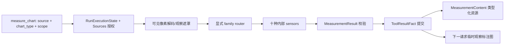

# Tool：能力定义与调用边界

> 更新日期：2026-10-06。[返回总览](../figura-implementation-overview.md)。本篇拥有工具定义、注册、调用及结果合同；`ToolCallFact`、`ToolAttemptStartedFact`、`ToolResultFact` 是[Run Runtime](runtime.md#4-完整模型字段)所拥有的持久事实。

## 1. 职责与边界

`ToolRegistry` 保存有序、版本化的 `ToolDefinition`；`ToolRuntime` 校验参数、运行同步 handler，并验证成功结果或返回安全错误。`DurableToolExecutor` 属于 Run 执行边界，负责在调用前后提交事实。当前工作树 Gateway Registry 为 `figura-web-v10`，按序注册九个工具：`load_image`、`decompose_chart_image`、`search_history`、`read_history`、`read_resource_image`、`extract_text`、`measure_chart`、`assemble_chart_figure` 和 `render_chart_figure`。历史工具只读当前 Session 的授权前缀；历史图片只有显式请求才附加到下一模型请求。图像、OCR 与测量工具处理已授权 Attachment/Panel；画布组装工具接收 Charts 域的完整 ChartFigure v2 并核对测量引用；渲染工具只接收已接受 Figure 的 `(run_id, call_id)`。当前 Registry 不注册旧测量工具、结果适配器或旧版 ChartSpec/Figure 转换器。启动时若仍有任何绑定较旧 Registry 的活动 Run，Gateway 会拒绝激活 v10；旧事实留在 Runtime 历史中，但不投影成 v2 图表资源。

## 2. 内部流转

1. **注册**：Gateway 组装有序 `ToolDefinition`，检查名称唯一、参数与结果 JSON Schema、描述及总大小。当前 v10 工具顺序为 `load_image`、`decompose_chart_image`、`search_history`、`read_history`、`read_resource_image`、`extract_text`、`measure_chart`、`assemble_chart_figure`、`render_chart_figure`；Registry 对外提供只读版本、定义顺序和按名查找。
2. **模型投影**：Agent 把允许的工具定义映射为 Provider 的 `FunctionTool`；模型只见名称、说明与参数 Schema，不见 handler、结果 Schema 或本地上下文。九个定义均有工具级 description；原生参数的 description 说明来源引用、坐标点形状、历史局部读取和图表数据语义，并在 Provider 投影中保留。SYSTEM 目录与同一 Registry 同序，但不重复整份 Schema。
3. **调用**：`ToolInvocation` 的 call ID、名称和 JSON 参数进入 `ToolRuntime`；解析拒绝重复键、无效数值与不符合 Schema 的内容。handler 只收到已验证参数及 `ToolContext`。
4. **结果与恢复**：成功时结果必须是有界 JSON 对象；失败时返回 `ToolExecutionError`。图像读取、OCR、测量与 `assemble_chart_figure` 为 `replay_safe`；Panel 分割和 `render_chart_figure` 为 `idempotent_local_write`。组装工具不新建外部资源，只验证、摘要并通过既有 Runtime 工具事实保留 Figure；渲染工具把 PNG 安装到 Sources 私有文件区，ToolResultFact 只保存有界摘要。结果超出既有大小上限时整体拒绝，不静默截断或删减观测。`replay_effect` 决定不确定结果能否安全重放或必须显式协调；ToolRuntime 自身不拥有 Run checkpoint。

## 3. 模型关系与共同规则

`ToolExecutionResult` 根据 `outcome` 在 `result` 与 `error` 之间二选一。`ToolDefinition.parameters_schema` 是模型输入合同，`result_schema` 是内部结果合同。`ToolContext.idempotency_key` 只给需要本地幂等写的 handler 使用。以下逐模型列出全部声明字段。

## 4. 完整模型字段

### ToolContext

传给单次 handler 的已验证执行上下文。 **写入者：**DurableToolExecutor。**权威位置：**调用期内存。**读取与公开：**handler；幂等键与取消信号不公开。[定义](../../src/figura/tools/contracts.py)。

| 完整字段路径 | 类型 | 构造默认 | 含义与约束 | 写入 → 权威 → 读取/公开 |
|---|---|---|---|---|
| ToolContext.run_id | str | 必传 | 所属 Run 的不透明身份 | DurableToolExecutor → 调用期内存 → handler；幂等键与取消信号不公开 |
| ToolContext.session_id | str | 必传 | 所属 Session 的不透明身份；跨 Session 读取须拒绝 | DurableToolExecutor → 调用期内存 → handler；幂等键与取消信号不公开 |
| ToolContext.call_id | str | 必传 | 模型给出的逻辑工具调用 ID | DurableToolExecutor → 调用期内存 → handler；幂等键与取消信号不公开 |
| ToolContext.cancellation | CancellationSignal | CancellationSignal() | 只读协作取消信号 | DurableToolExecutor → 调用期内存 → handler；幂等键与取消信号不公开 |
| ToolContext.idempotency_key | str \| None | None | 本地幂等写的 SHA-256 十六进制键；可空 | DurableToolExecutor → 调用期内存 → handler；幂等键与取消信号不公开 |

### ToolInvocation

一次工具调用的名称、ID 与 JSON 参数。 **写入者：**Agent / DurableToolExecutor。**权威位置：**调用期；逻辑意图另见 ToolCallFact。**读取与公开：**ToolRuntime。[定义](../../src/figura/tools/contracts.py)。

| 完整字段路径 | 类型 | 构造默认 | 含义与约束 | 写入 → 权威 → 读取/公开 |
|---|---|---|---|---|
| ToolInvocation.call_id | str | 必传 | 模型给出的逻辑工具调用 ID | Agent / DurableToolExecutor → 调用期；逻辑意图另见 ToolCallFact → ToolRuntime |
| ToolInvocation.name | str | 必传 | 注册的工具名称，非空 ASCII 字母/数字/_/-，无通用长度上限 | Agent / DurableToolExecutor → 调用期；逻辑意图另见 ToolCallFact → ToolRuntime |
| ToolInvocation.arguments_json | str | 必传 | 模型提供的 JSON 参数原文；执行前严格解析 | Agent / DurableToolExecutor → 调用期；逻辑意图另见 ToolCallFact → ToolRuntime |

### ToolExecutionError

可安全传回的有界工具错误。 **写入者：**ToolRuntime / handler。**权威位置：**调用期；可嵌入 ToolResultFact。**读取与公开：**Agent；仅安全字段可投影。[定义](../../src/figura/tools/contracts.py)。

| 完整字段路径 | 类型 | 构造默认 | 含义与约束 | 写入 → 权威 → 读取/公开 |
|---|---|---|---|---|
| ToolExecutionError.code | str | 必传 | 稳定错误/问题码 | ToolRuntime / handler → 调用期；可嵌入 ToolResultFact → Agent；仅安全字段可投影 |
| ToolExecutionError.message | str | 必传 | 有界安全错误说明 | ToolRuntime / handler → 调用期；可嵌入 ToolResultFact → Agent；仅安全字段可投影 |
| ToolExecutionError.retryable | bool | 必传 | 供模型判断后续动作的信息，不触发 Runtime 自动失败重试 | ToolRuntime / handler → 调用期；可嵌入 ToolResultFact → Agent；仅安全字段可投影 |
| ToolExecutionError.field_path | str \| None | None | 可空的有界 JSON Pointer 错误位置 | ToolRuntime / handler → 调用期；可嵌入 ToolResultFact → Agent；仅安全字段可投影 |

### ToolExecutionResult

一次工具调用的成功对象或失败错误。 **写入者：**ToolRuntime。**权威位置：**调用期；随后转 ToolResultFact。**读取与公开：**DurableToolExecutor / Agent。[定义](../../src/figura/tools/contracts.py)。

| 完整字段路径 | 类型 | 构造默认 | 含义与约束 | 写入 → 权威 → 读取/公开 |
|---|---|---|---|---|
| ToolExecutionResult.call_id | str | 必传 | 模型给出的逻辑工具调用 ID | ToolRuntime → 调用期；随后转 ToolResultFact → DurableToolExecutor / Agent |
| ToolExecutionResult.tool_name | str | 必传 | 工具定义名称 | ToolRuntime → 调用期；随后转 ToolResultFact → DurableToolExecutor / Agent |
| ToolExecutionResult.outcome | ToolOutcome | 必传 | 工具结果的成功或失败状态 | ToolRuntime → 调用期；随后转 ToolResultFact → DurableToolExecutor / Agent |
| ToolExecutionResult.result | Mapping[str, Any] \| None | None | 成功时的有界 JSON 对象；失败时为空 | ToolRuntime → 调用期；随后转 ToolResultFact → DurableToolExecutor / Agent |
| ToolExecutionResult.error | ToolExecutionError \| None | None | 失败时的安全错误；成功时为空 | ToolRuntime → 调用期；随后转 ToolResultFact → DurableToolExecutor / Agent |

### ToolDefinition

单个版本化工具的参数、结果和 handler 合同。 **写入者：**进程启动时组装 ToolRegistry。**权威位置：**进程内 Registry。**读取与公开：**Agent 工具投影与 ToolRuntime；handler 不进模型。[定义](../../src/figura/tools/contracts.py)。

| 完整字段路径 | 类型 | 构造默认 | 含义与约束 | 写入 → 权威 → 读取/公开 |
|---|---|---|---|---|
| ToolDefinition.name | str | 必传 | 注册的工具名称，非空 ASCII 字母/数字/_/-，无通用长度上限 | 进程启动时组装 ToolRegistry → 进程内 Registry → Agent 工具投影与 ToolRuntime；handler 不进模型 |
| ToolDefinition.description | str | 必传 | 模型可见工具说明 | 进程启动时组装 ToolRegistry → 进程内 Registry → Agent 工具投影与 ToolRuntime；handler 不进模型 |
| ToolDefinition.parameters_schema | Mapping[str, Any] | 必传 | 工具输入参数的有界对象 Schema | 进程启动时组装 ToolRegistry → 进程内 Registry → Agent 工具投影与 ToolRuntime；handler 不进模型 |
| ToolDefinition.result_schema | Mapping[str, Any] | 必传 | 工具成功结果的有界对象 Schema | 进程启动时组装 ToolRegistry → 进程内 Registry → Agent 工具投影与 ToolRuntime；handler 不进模型 |
| ToolDefinition.replay_effect | ReplayEffect \| str | 必传 | 未知效果恢复策略 | 进程启动时组装 ToolRegistry → 进程内 Registry → Agent 工具投影与 ToolRuntime；handler 不进模型 |
| ToolDefinition.handler | ToolHandler | 必传 | 同步处理函数；不进入模型投影 | 进程启动时组装 ToolRegistry → 进程内 Registry → Agent 工具投影与 ToolRuntime；handler 不进模型 |

## 5. 枚举、非 dataclass 合同与依据

- `ReplayEffect`：`replay_safe`、`idempotent_local_write`、`reconcile_required`。`ToolOutcome`：`succeeded`、`failed`。
- `ToolRegistry` 是不可变 Registry：只读 `version`、有序 `definitions`、`by_name` 映射；创建于进程内，调用事实只记录当时的 registry 版本。`CancellationSignal` 只暴露 `is_cancelled()`。`ToolHandler` 是同步处理函数合同，不进入模型投影。
- JSON Schema 的共享 `SchemaIssue` 字段在[共享验证合同](validation.md#3-完整模型字段)定义；本篇只说明 ToolRuntime 怎样消费它。
- 代码：[合同](../../src/figura/tools/contracts.py)、[Registry](../../src/figura/tools/registry.py)、[Runtime](../../src/figura/tools/runtime.py)、[Provider 投影](../../src/figura/tools/provider.py)；主规格：[tool-runtime](../../openspec/figura/openspec/specs/tool-runtime/spec.md)、[durable-tool-execution](../../openspec/figura/openspec/specs/durable-tool-execution/spec.md)。

## 6. 图像与测量工具合同

图像工具只接受目标 Run `RunExecutionState` 中的 Attachment/Panel 类型化引用，再经 Sources 核对 Session 所有权后读取图像。模型不能提交本机路径、URL 或图片字节。图像字节与标注 PNG 不进入工具结果、Runtime 事实或资源目录。

当前公开观察工具为 `load_image`、`extract_text` 和 `measure_chart`。统一测量实现位于 [`measure_chart.py`](../../src/figura/tools/implementations/measure_chart.py)；来源解析位于 [`measurement_source.py`](../../src/figura/tools/implementations/measurement_source.py)；范围和共享结果合同位于 [`measurements/observation_scope.py`](../../src/figura/tools/measurements/observation_scope.py) 与 [`measurements/contracts.py`](../../src/figura/tools/measurements/contracts.py)；十个 family adapter 由 [`family_adapters.py`](../../src/figura/tools/measurements/family_adapters.py) 路由到 `tools/measurements/` 中各自的视觉算法。旧的四个公开测量定义和 v1 结果兼容执行器不在 v10 Registry 中。

### 6.1 `measure_chart` 输入与决策边界

这是唯一公开的图表测量入口。Agent 必须提交图表家族；工具按该值调用对应内部 sensor，不做 Provider 调用、隐藏分类、家族猜测、静默切换或自动重试。图像类型不明时，Agent 可以先显式调用 `load_image`，再自行决定 family。

| 参数 | 类型与约束 | 含义 |
|---|---|---|
| `source_kind` | `attachment` 或 `panel` | 来源类型 |
| `source_id` | 非空 string，1–128 字符 | Run 资源目录中的 opaque ID；不是调用 ID 或路径 |
| `chart_type` | `bar`、`line`、`scatter`、`pie`、`area`、`histogram`、`box_plot`、`radar`、`heatmap`、`treemap` | 必传的 family discriminator；气泡图使用 `scatter`，甜甜圈图使用 `pie` |
| `observation_scope` | 可选闭合对象，含 `include` 或 `exclude` 至少一项 | 来源图像内的临时观察多边形；额外字段拒绝 |

多边形坐标相对来源图，使用 0–1000 整数归一化；多个 include 取并集，exclude 优先从可见区域扣除。未传范围代表完整来源图。透明像素按白底合成，隐藏 RGB 不参与检测。范围为空、格式无效或与可见区域交集为空时返回失败，不能扩大到全图。范围只遮罩本次检测像素，不裁切图像、不更换坐标原点；结果坐标仍使用 Attachment 或 Panel 的完整像素框。

`MeasurementSource` 是来源授权后、调用期内存中的值；`PreparedMeasurementImage` 是应用共享可见像素解码和观察范围后的图像。以下列出两者全部字段。两者都只在测量调用期间存在，不持久化，也不进入模型投影。

| 完整字段路径 | 类型与默认 | 含义与字段流转 |
|---|---|---|
| `MeasurementSource.source_kind` | `Literal["attachment", "panel"]`；必传 | 来源类型；来源解析器写入，调用期对象为权威，sensor 读取 |
| `MeasurementSource.source_id` | `str`；必传 | 授权来源的 opaque ID；来源解析器写入，调用期对象为权威，sensor 读取 |
| `MeasurementSource.name` | `str`；必传 | 安全显示名；由 Sources 元数据生成，sensor 可用于观察说明，不包含本地路径 |
| `MeasurementSource.coordinate_system` | `Literal["attachment_px", "panel_px"]`；必传 | 完整源图像素坐标系；sensor 输出沿用该坐标系 |
| `MeasurementSource.image_bytes` | `bytes`；必传 | 私有源图像字节；ImageReader 写入，调用期内存为权威，解码器读取，不序列化或投影 |
| `MeasurementSource.width` | `int`；必传 | 解码图像宽度；来源解析阶段写入，sensor 用于坐标和边界校验 |
| `MeasurementSource.height` | `int`；必传 | 解码图像高度；来源解析阶段写入，sensor 用于坐标和边界校验 |
| `PreparedMeasurementImage.source_kind` | `Literal["attachment", "panel"]`；必传 | 保留已授权来源类型；共享图像准备器写入，sensor 读取 |
| `PreparedMeasurementImage.source_id` | `str`；必传 | 保留已授权来源 opaque ID；共享图像准备器写入，sensor 读取 |
| `PreparedMeasurementImage.coordinate_system` | `Literal["attachment_px", "panel_px"]`；必传 | 保留完整源坐标系；观察遮罩不平移坐标原点 |
| `PreparedMeasurementImage.width` | `int`；必传 | 完整源图宽度，单边不超过 100000；sensor 用于观察结果边界 |
| `PreparedMeasurementImage.height` | `int`；必传 | 完整源图高度，单边不超过 100000；sensor 用于观察结果边界 |
| `PreparedMeasurementImage.rgb` | `numpy.ndarray`；必传 | 按可见像素规则合成的 RGB 图像；解码器写入，sensor 读取，不持久化 |
| `PreparedMeasurementImage.observation_mask` | `numpy.ndarray \| None`；默认 `None` | 可空有效像素遮罩；范围处理器写入，sensor 只观察保留区域，坐标系仍是完整源图 |

### 6.2 v3 统一结果

成功结果是以顶层 `chart_type` 判别的封闭 schema_version 3 联合类型；Schema 对象禁止额外字段。未校准的图表数值必须为 null，不能只依据几何外观补造单位值。

**字段流转：**`measure_chart` handler 与对应 family sensor 写入结果；成功结果的权威持久位置是 Runtime `ToolResultFact.result`，Agent 从匹配的调用、attempt 与结果事实重建 `MeasurementContent`。Agent 和后续工具读取完整 JSON；Provider 收到工具结果文本，Web 只提供经授权的观察图与摘要，不公开原始测量 JSON。结果是已提交 Run 事实的一部分，不原位修订；再次观察会产生新的调用与资源。

| 完整字段路径 | 类型、默认与约束 |
|---|---|
| `MeasurementResult.schema_version` | `int`；默认固定为 `3` |
| `MeasurementResult.chart_type` | `ChartType`；必传，十类之一且与调用输入相同 |
| `MeasurementResult.source_kind` | `Literal["attachment", "panel"]`；必传 |
| `MeasurementResult.source_id` | `str`；必传，须与目标 Run 授权资源匹配 |
| `MeasurementResult.image_size` | `tuple[int, int]`；必传；JSON 输出为对象 `width`、`height`，均为正整数且不超过 100000 |
| `MeasurementResult.coordinate_system` | `Literal["attachment_px", "panel_px"]`；必传，必须与 source kind 匹配 |
| `MeasurementResult.status` | `MeasurementStatus`；必传：`measured`、`partial`、`no_evidence` 或 `unsupported` |
| `MeasurementResult.plot_area_px` | `PixelRect \| None`；默认 `None`；完整来源坐标中的矩形，不等同于 observation_scope |
| `MeasurementResult.observations` | `MeasurementObservations`；必传；由 `chart_type` 判别的十类闭合联合类型 |
| `MeasurementResult.confidence` | `MeasurementConfidence`；必传；四项 0–1 置信度 |
| `MeasurementResult.warnings` | `tuple[str, ...]`；默认空；最多 32 条、每条最多 256 字符，JSON 输出为数组 |
| `MeasurementResult.truncated` | `bool`；默认 `False`；为 true 时 status 必须为 `partial` |
| `MeasurementResult.coverage` | `Mapping`；JSON 必需：scope_kind、requested_scope、structure_status、detected_counts；内部默认 None，由 router 构建 |
| `MeasurementResult.issues` | 结构化问题数组；默认空，最多 32 条 |
| `MeasurementResult.evidence` | OCR/geometry 闭合联合数组；默认空，最多 4096 条 |
| `MeasurementResult.calibrations` | axis/radial/color_scale 校准数组；默认空，最多 4096 条 |
| `MeasurementResult.value_provenance` | 非空语义数值的逐值依据数组；默认空，最多 4096 条 |

每个非空语义数值恰好对应一条可解析 JSON Pointer；纯像素几何、置信度及内部校准参数不属于语义数值。证据 ID 在一次结果内唯一，引用不得悬空；derived 输入必须已有依据且无环。对象数量受 Schema 上界与保留支持数量共同约束；结果体还必须为 ToolResultFact 外层记录留出空间，适配当前 `ToolRegistry` 的 `ExecutionPayloadLimits.max_json_bytes`。达到数量或字节边界时，移除无法保留完整支持闭包的读数及其衍生依赖，将状态标为 partial/truncated；不会静默删减仍然非空的无依据值。若必要的结构/几何本身超过 Runtime payload budget，则整次调用失败，不保存不完整事实。

| 闭合结构 | 全部字段与语义 |
|---|---|
| `coverage` | scope_kind（full_source/scoped）、requested_scope（原始 normalized include/exclude 或 null）、structure_status（established/partial/unknown）、detected_counts（与输出对象一致） |
| `detected_counts` | bar: series/bars；line、scatter: series/points；pie: sectors；area: series/samples；histogram: bins；box_plot: groups；radar: series/dimensions/vertices；heatmap: rows/columns/cells；treemap: nodes/leaves/groups |
| `issues[]` | code、field_path、evidence_ids、message；路径指向实际存在字段，数值冲突可保留证据并令值为 null |
| OCR evidence | id、kind=ocr、bounds_px、text、confidence；文本最多 160 字符 |
| Geometry evidence | id、kind=geometry、bounds_px（可空）、points_px、ratio_denominator（可空，非空须大于零） |
| Calibration | id、kind、axis_role（x/y/radial/color）、supported、support_evidence_ids、parameters、residual_value、support_domain（两个有序标量）；supported 要求至少两个不同可读支持值 |
| Axis parameters | slope、intercept、points_px；值为轴投影标量乘 slope 加 intercept |
| Radial parameters | slope、intercept、center_px；值为中心距离乘 slope 加 intercept |
| Color-scale parameters | slope、intercept、start_px、end_px、samples；samples[] 为 position_px/color，使用观察色条匹配，不预设色图；多个远离位置同色时保持未知 |
| Value provenance | field_path、method、evidence_ids、calibration_ids、input_paths、error_bound（可空）；method 为 direct_text、axis_calibration、radial_calibration、color_scale_calibration、geometry_ratio、derived |

family sensor 在公共 router 补充来源身份前返回 `MeasurementSensorResult`；校验器用 `MeasurementResultIssue` 描述首个合同问题。两者是调用期内部模型，不是对外工具结果。

| 完整字段路径 | 类型、默认与约束 | 写入、权威与读取 |
|---|---|---|
| `MeasurementSensorResult.status` | `MeasurementStatus`；必传 | family sensor 写入；router 读取并合并为最终结果 |
| `MeasurementSensorResult.observations` | `MeasurementObservations`；必传 | family sensor 写入对应分支；router 按 `chart_type` 校验 |
| `MeasurementSensorResult.confidence` | `MeasurementConfidence`；必传 | family sensor 写入；router 保留并校验四项置信度 |
| `MeasurementSensorResult.plot_area_px` | `PixelRect \| None`；默认 `None` | family sensor 写入可选绘图区；router 传入最终结果 |
| `MeasurementSensorResult.warnings` | `tuple[str, ...]`；默认空；构造时 list 会规范为 tuple | family sensor 写入；router 合并后受数量和长度约束 |
| `MeasurementSensorResult.issues/evidence/calibrations/value_provenance` | 与公共结果同义；各自默认空 tuple | family sensor 写入局部支持；router 追加笛卡尔支持并验证闭合引用 |
| `MeasurementSensorResult.truncated` | `bool`；默认 `False` | family sensor 标记候选裁断；router 用于最终状态一致性校验 |
| `MeasurementResultIssue.code` | `str`；必传 | 结果 validator 写入；`measure_chart` 转为有界 ToolExecutionError |
| `MeasurementResultIssue.field_path` | `str`；必传，最多 256 字符 | validator 写入 JSON Pointer；随错误返回 Agent |
| `MeasurementResultIssue.message` | `str`；必传，最多 240 字符 | validator 写入安全问题说明；随错误返回 Agent |

结果最多包含 512 个主要观察项；文本最多 160 字符、family 内部 ID 最多 64 字符、坐标维度最多 100000。超出候选或文本边界时按合同保留截断状态和警告；ToolRuntime 的结果 JSON 总字节上限仍适用，超限结果整体失败，不静默删减字段。

| `chart_type` | observations 模型 | `observations` 的闭合字段与证据含义 |
|---|---|---|
| `bar` | `BarObservations` | `orientation`、`mode`、`axes`、`baseline_px`、`baseline_value`、`series`、`bars`；包含柱像素几何、类别/系列关联、像素长度与可选校准值 |
| `line` | `LineObservations` | `axes`、`series`；每个系列保留断开线段与观察点，不跨遮挡缺口连线 |
| `scatter` | `ScatterObservations` | `axes`、`series`；包含可见点中心、可空半径与校准坐标及重叠标志 |
| `pie` | `PieObservations` | `center_px`、`outer_radius_px`、`inner_radius_px`、`sectors`；甜甜圈保留内半径 |
| `area` | `AreaObservations` | `axes`、`stacking`、`series`；保留多段上下边界与可空校准值，不把纯折线改判为面积 |
| `histogram` | `HistogramObservations` | `axes`、`y_measure`、`bins`；每个 bin 保留像素边界、可空数值区间端点及测量值 |
| `box_plot` | `BoxPlotObservations` | `axes`、`orientation`、`groups`；每组保留箱体、须端、四分位/中位标记及显式离群候选 |
| `radar` | `RadarObservations` | `center_px`、`spokes`、`radial_grid`、`series`；保留维度方向、径向网格与有序顶点 |
| `heatmap` | `HeatmapObservations` | `row_labels`、`column_labels`、`cells`；保留单元格几何/颜色与可空校准值 |
| `treemap` | `TreemapObservations` | `nodes`；保留节点关系、标签、像素矩形、可空数据值与面积占比 |

#### 嵌套观测字段

除 `PixelRect` 外，下表中的像素坐标均为完整来源图的 `[x, y]`，x 向右、y 向下；图像被 scope 遮罩后坐标原点不变。对象都是闭合结构，除表中标为 nullable 的字段外都必需。

| 结构 | 完整字段 | 类型与含义 |
|---|---|---|
| `PixelRect` | `x`, `y`, `width`, `height` | 像素矩形左上角及宽高 |
| `MeasurementConfidence` | `overall`, `geometry`, `calibration`, `association` | 四个 0–1 置信度分量 |
| `CartesianAxes` | `x`, `y` | 两个 `AxisObservation`，分别描述 x/y 轴 |
| `AxisObservation` | `kind`, `label_text`, `label_confidence`, `points_px`, `ticks`, `calibration` | 轴类型 numeric/categorical/unknown；标签与置信度；可空两个轴端像素点；刻度数组；可空线性标定 |
| `AxisTick` | `id`, `text`, `value`, `bbox_px`, `point_px`, `confidence` | 刻度身份/原文、可空数值、文字框、定位像素和置信度 |
| `AxisCalibration` | `slope`, `intercept`, `residual_value`, `support_count`, optional `support_tick_ids`, `support_span_px`, `confidence`, `calibrated` | 拟合参数、残差、支持刻度数与像素跨度、置信度及是否通过标定；提供 ID 时必须唯一对应可读刻度 |
| `MeasurementSeries` | `id`, `color`, `label`, `label_confidence` | 系列身份、可空颜色、可空 OCR 标签及标签关联置信度 |
| `BarObservation` | `id`, `bounds_px`, `polygon_px`, `category_id`, `category_label`, `series_id`, `pixel_length_px`, `value` | 柱身份/边框/多边形、可空类别关联、可空系列、像素长度与可空标定值 |
| `LinePoint` | `position_px`, `x_value`, `y_value`, `point_source`, `category_id`, `category_label` | 像素点、可空校准坐标；来源为 marker 或 axis_tick_sample |
| `LineSeries` | `MeasurementSeries` 字段、`segments_px`, `points` | 保留断点的像素折线段与测量点 |
| `ScatterPoint` | `center_px`, `radius_px`, `x_value`, `y_value`, `series_id`, `flags` | 点中心、可空半径/校准坐标/系列关联；flags 为 merged、occluded、dense、overlap 的子集 |
| `PieSector` | `start_angle_deg`, `sweep_angle_deg`, `ratio`, `label`, `color` | 起始角、覆盖角、可空角度占比、可空关联标签和颜色 |
| `AreaBoundary` | `upper_boundary_px`, `lower_boundary_px`, `upper_values`, `lower_values`, `samples` | 上下边界像素轨迹及逐点可空的校准值；下边界和下值允许 null |
| `AreaBoundary.samples[]` | `position_px`, `lower_position_px`, `category_id`, `category_label`, `x_value`, `upper_value`, `lower_value`, `series_value` | 对齐采样的上/下边界；下位置与所有语义值可空，series_value 以衍生支持记录边界差 |
| `AreaSeries` | `MeasurementSeries` 字段、`segments` | 有序填充区域边界段 |
| `HistogramBin` | `bounds_px`, `interval_start`, `interval_end`, `value` | 柱体像素矩形、可空区间端点与可空 count/frequency 等测量值 |
| `BoxPlotGroup` | `id`, `label`, `bounds_px` | 分组身份/可空标签/可空整体像素矩形 |
|  | `lower_whisker_px`, `q1_px`, `median_px`, `q3_px`, `upper_whisker_px` | 五个可空统计标记像素位置 |
|  | `lower_whisker`, `q1`, `median`, `q3`, `upper_whisker` | 五个分别与像素标记对应的可空标定值 |
|  | `outliers` | `BoxPlotOutlier[]`，只收录显式可见候选 |
| `BoxPlotOutlier` | `position_px`, `value` | 像素位置与可空校准值 |
| `RadarSpoke` | `dimension_id`, `label`, `angle_deg`, `endpoint_px` | 可空维度 ID/标签、方向角与像素端点 |
| `RadarGrid` | `value`, `radius_px` | 可空标定值及网格像素半径 |
| `RadarVertex` | `dimension_id`, `position_px`, `value` | 可空维度 ID、可空像素顶点与可空校准值；缺失位置不伪装成轴端点 |
| `RadarSeries` | `MeasurementSeries` 字段、`vertices` | 系列元数据与有序雷达顶点 |
| `HeatmapCell` | `row_id`, `column_id`, `bounds_px`, `color`, `value` | 可空行列关联、像素矩形、可空颜色与可空色阶校准值 |
| `TreemapNodeObservation` | `id`, `parent_id`, `label`, `bounds_px`, `value`, `area_ratio`, `role`, `area_ratio_basis`, `area_ratio_parent_id` | 节点身份、可空父 ID/标签、像素矩形、可空数值及可空面积比例 |

这些 observation dataclass/TypedDict 与 `MEASUREMENT_RESULT_SCHEMA` 由 [`contracts.py`](../../src/figura/tools/measurements/contracts.py) 定义；各家族只写自己的字段，公共 router 统一补入来源、坐标系、状态、置信度和警告，并验证结果 family 与调用参数一致。

### 6.3 范围、资源与重建

handler 先从当前目标 Run 的授权资源目录解析精确来源，再通过 Sources 服务验证 Session/Panel 记录并读图。工具成功或失败都作为普通 ToolResultFact 持久化；当前 schema_version 3 的 `measure_chart` 调用由 Agent 重建为一个独立 `MeasurementContent`，保留 attempt ID、tool name、来源引用、原始 scope、outcome 和完整结果。资源投影不会重算、规范化或修复提交结果。冻结 schema_version 2 的结果只按原样保留在历史 ToolResultFact 中，不投影为当前 MeasurementContent；可通过历史读取工具查看原始结果，不会因此获得新调用或组装权限。旧 `measure_bars`、`measure_lines`、`measure_scatter`、`measure_pie` 事实同样留在原始 Run 历史中。

成功 OCR 与 `measure_chart` 结果在下一次 Provider 请求中按当前已提交批次与调用顺序生成临时标注图；它们不成为独立事实。历史读取和工具结果可以提供文字证据，但只有成功 `load_image` 或当前批次观察才按对应规则附图。图片无法重建、来源不再可读或请求图片越过 Provider 边界时，在 Provider attempt claim 前失败。

`extract_text` 仍是独立 OCR 工具，使用相同的来源授权、可见像素解码与 observation scope；它返回文字片段、位置和置信度，不替代 family sensor。OCR 候选的详细合同与错误由 [`extract_text.py`](../../src/figura/tools/implementations/extract_text.py) 及 OCR 主规格负责。

测量与资源合同见[统一测量主规格](../../openspec/figura/openspec/specs/chart-family-measurement/spec.md)和[RunExecutionResources 主规格](../../openspec/figura/openspec/specs/run-execution-resources/spec.md)；实现见[`measure_chart.py`](../../src/figura/tools/implementations/measure_chart.py)、[`family_adapters.py`](../../src/figura/tools/measurements/family_adapters.py)和[观察图绘制](../../src/figura/tools/measurements/visualization.py)。

## 7. 图表画布组装工具

`assemble_chart_figure` 的输入是一个完整 ChartFigure v2 JSON 对象，不再增加包装字段。完整图表、布局、子图和 MeasurementRef 字段只在[Charts 专题](charts.md#4-chartfigure-v2-字段与测量引用)定义；此处记录工具执行、跨域校验和持久边界。代码见[工具 handler](../../src/figura/tools/implementations/assemble_chart_figure.py)、[Gateway Registry 装配](../../src/figura/bootstrap.py)和[RunExecutionState 投影](../../src/figura/agent/execution_state.py)。合同见[ChartFigure 装配主规格](../../openspec/figura/openspec/specs/chart-figure-assembly/spec.md)。

### 调用流转

1. ToolRuntime 先以 `CHART_FIGURE_SCHEMA` 校验 shape、类型、必填项及额外字段；handler 再用 Charts codec 严格解析并运行 `validate_chart_figure` 验证唯一 chart ID、布局和全部嵌套 ChartSpecData。ChartSpec v2 的 `chart_type` 选择十类之一及其专属 dataset/coordinate system；缺少必需字段不会自动猜测或补全。无效输入先于测量引用解析被拒绝。
2. handler 为本次调用读取新鲜的同 Session `RunExecutionState`，并按 `ToolResourceRef("measurement", run_id, call_id)` 精确查询。每个 `measurement_refs` 必须命中已提交成功的 MeasurementContent；支持先前终态 Run，也支持目标 Run 中已经先提交的结果。不存在、失败、尚未提交、未授权来源或其他 Session 的引用都会使整份 Figure 失败，并返回相应的 JSON Pointer `field_path`。引用为空表示该子图没有选择测量，不从文本或数据值推断引用。
3. 全部校验通过后，工具返回摘要。任一子图或引用失败时没有部分成功结果；ToolRuntime 将有界错误结果交给 DurableToolExecutor，执行事实仍由 Runtime 提交。

### 成功结果合同

成功结果恰含下列字段；对象不允许额外属性。Charts 与引用数组顺序保留。字段写入者为 handler，权威位置先是调用期 ToolExecutionResult，随后是 Runtime `ToolResultFact.result`；Agent 从成功配对调用重建完整 Figure 和 digest；SYSTEM 资源提示只呈现摘要。

| 完整字段路径 | 类型、必填与约束 | 含义 |
|---|---|---|
| `assemble_chart_figure.result.figure_ref` | object，必填；恰含 `run_id`、`call_id` | 成功组装工具调用的稳定身份；Figure 不另生成 ID |
| `assemble_chart_figure.result.figure_ref.run_id` | string，必填且非空 | 当前执行 Run ID |
| `assemble_chart_figure.result.figure_ref.call_id` | string，必填且非空 | 当前模型逻辑工具调用 ID |
| `assemble_chart_figure.result.figure_digest` | string，必填；64 位小写十六进制 | 完整 ChartFigure 规范 JSON 的 SHA-256 |
| `assemble_chart_figure.result.title` | string，必填；最多 160 字符 | Figure 标题；输入省略时为空文本 |
| `assemble_chart_figure.result.charts` | object 数组，必填；1–4 项 | 与 ChartFigure.charts 同序的子图摘要 |
| `assemble_chart_figure.result.charts[].chart_id` | string，必填；匹配 `[A-Za-z0-9_-]{1,64}` | Figure 内子图身份 |
| `assemble_chart_figure.result.charts[].chart_type` | string，必填；ChartSpec v2 十类之一 | 来自对应子图 ChartSpecData.metadata |
| `assemble_chart_figure.result.charts[].title` | string，必填；最多 160 字符，可为空 | 来自对应子图 ChartSpecData.metadata.title |

完整 ChartFigure JSON 保存在成功或失败调用对应的 `ToolCallFact.arguments_json`；只有成功提交的 `ToolResultFact` 会让该 `(run_id, call_id)` 成为已接受 Figure。摘要由 `ToolResultFact.result` 提供给 Agent。没有 Figure 表、新 fact kind、独立 Figure ID 或可变更新；单独的 `render_chart_figure` 按 Figure 引用生成 PNG，完整 PNG 生命周期见下一节。digest 用于后续渲染从历史调用参数恢复并核对内容。选中的测量引用只表达模型选择，不证明子图数据与测量数值完全一致。

## 8. 图表渲染工具

`render_chart_figure` 将同一 Session 已成功组装的 ChartFigure 绘制为一张 PNG。模型输入只包含引用，不传图表数据、尺寸、主题或颜色；工具结果只有有限摘要，没有图像字节、路径或新的 Figure/render ID。处理由 Tool handler 协调：[Charts](charts.md#5-确定性-png-renderer)负责纯绘制，[Sources](sources.md#4-存储失败与访问边界)负责私有文件存取，Runtime 仍持久化通用工具事实，Agent 重建运行态，Web 负责预览路由。

实现见[render handler](../../src/figura/tools/implementations/render_chart_figure.py)、[Charts renderer](../../src/figura/charts/chartfigure/rendering.py)、[Sources 存储服务](../../src/figura/sources/chart_renders.py)、[Registry 装配](../../src/figura/bootstrap.py)和[Agent 请求组装](../../src/figura/agent/request.py)。十类 ChartSpec v2 的绘制合同见[Chart rendering 主规格](../../openspec/figura/openspec/specs/chart-rendering/spec.md)。

### 输入字段

输入必须是恰含 `figure_ref` 的对象，`figure_ref` 必须恰含以下两个字段；不允许额外字段。工具不能接受模型指定输出文件或渲染选项。

| 完整字段路径 | JSON 类型 | 必填/约束 | 含义与校验 |
|---|---|---|---|
| `render_chart_figure.arguments.figure_ref` | object | 必填；无额外属性 | 被渲染的 Figure 工具调用引用 |
| `render_chart_figure.arguments.figure_ref.run_id` | string | 必填；1–128 字符 | 组装 Figure 的 Run opaque ID |
| `render_chart_figure.arguments.figure_ref.call_id` | string | 必填；非空有效 UTF-8，受完整 JSON 单元 guard | 成功 `assemble_chart_figure` 调用的逻辑 ID |

**解析与授权：**handler 从目标 Run 的新鲜资源目录按 `ToolResourceRef("chart_figure", run_id, call_id)` 读取已接受 Figure。ChartFigureContent 已由 Agent 从已提交 assembly 调用参数完整重建并核对 canonical digest；handler 使用其中的完整 ChartFigure 交给 Charts 绘图，不再实现一条独立的 Runtime 事实查找路径。未知、失败、未提交、跨 Session、内容损坏或摘要不一致时返回有界失败，不创建可见产物。

### 成功结果字段

返回对象恰含下表字段，Tool Runtime 以结果 JSON Schema 再次校验。写入者为 render handler；调用期间先位于 ToolExecutionResult，成功提交后权威事实是 Run Runtime 的 ToolResultFact.result。PNG 字节不进入该对象或 Run 事实。

| 完整字段路径 | JSON 类型 | 必填/约束 | 含义、写入与读取 |
|---|---|---|---|
| `render_chart_figure.result.figure_ref` | object | 必填；恰含 `run_id`、`call_id` | 原样返回被渲染 Figure 引用；Agent 用它匹配接受状态 |
| `render_chart_figure.result.figure_ref.run_id` | string | 必填；1–128 字符 | 被渲染 Figure 的来源 Run ID |
| `render_chart_figure.result.figure_ref.call_id` | string | 必填；非空有效 UTF-8，受完整 JSON 单元 guard | 被渲染 Figure 的 assembly call ID |
| `render_chart_figure.result.figure_digest` | string | 必填；64 位小写十六进制 | 完整规范 Figure JSON 的 SHA-256；须匹配接受 Figure |
| `render_chart_figure.result.image_sha256` | string | 必填；64 位小写十六进制 | PNG 内容 SHA-256；Agent 与 Gateway 读取文件时核对 |
| `render_chart_figure.result.media_type` | string | 必填；固定 `image/png` | 文件媒体类型；Web 返回 `image/png` |
| `render_chart_figure.result.byte_count` | integer | 必填；1–`MAX_IMAGE_BYTES` | 存储 PNG 的精确字节数，`MAX_IMAGE_BYTES` 为 24 MiB 减 64 字节 |
| `render_chart_figure.result.width` | integer | 必填；1–1280 | PNG 像素宽度 |
| `render_chart_figure.result.height` | integer | 必填；1–1962 | PNG 像素高度 |

### 持久化、重放与回看

1. Tool handler 通过 Charts 纯函数生成 PNG；Sources 使用渲染调用 `(run_id, call_id)` 派生文件名，并原子安装、校验并返回已存内容和尺寸。相同调用重放时复用既有文件并从原字节重新得到相同摘要，不创建重复文件。
2. DurableToolExecutor 随后提交普通 ToolResultFact；工具调用参数保留 Figure 引用，成功结果只保存上表摘要。没有新增 Runtime fact kind、Figure 表、render ID 或渲染元数据表。
3. Agent 资源目录以 `ToolResourceRef("chart_render", run_id, call_id)` 收录已提交渲染结果；ChartRenderContent 将 `figure_ref` 与 result/error 分开，成功 metadata 不重复存放该引用。完整状态字段归[Agent](agent.md#4-runexecutionstate-资源合同与完整字段)。未提交结果、无效引用或其他 Session 的文件不能通过运行态/Web 投影读取。
4. AgentRequestBuilder 对当前 Run 最新工具响应中的成功 render call 再读取 PNG，校验字节数、尺寸、媒体类型及 SHA-256，将图像追加到紧接着的 Provider 请求。后续 Run 不会自动重放旧 PNG 图像；模型可再次调用渲染工具按引用读取生成图。

| 错误码 | 触发边界 | 对外行为 |
|---|---|---|
| `figure_reference_not_found` | 引用不是当前 Session 的已接受 Figure | 安全失败，不访问产物 |
| `figure_unavailable` / `execution_state_unavailable` | Run 事实或状态暂时不可读 | 有界失败；仅明确存储错误可重试 |
| `figure_integrity_error` | Figure 参数无法解析、校验失败或 digest 不符 | 有界完整性失败，不返回 PNG |
| `chart_render_failed` | ChartFigure 无法生成合规 PNG | 有界渲染失败 |
| `chart_render_storage_failed` | Sources 无法写入或校验 PNG | 有界存储失败；仅 `STORAGE_ERROR` 标记可重试 |

`render_chart_figure` 的 `replay_effect` 是 `idempotent_local_write`。文件可以先于 ToolResultFact 安装；在结果未成功提交时它仍是不可从 Agent/Web 读取的孤儿，重放同一调用会验证并复用原文件。工具不会用新内容覆盖损坏或冲突的既有文件。
当前 Registry 是 `figura-web-v10`。Bootstrap 在启动时检查仍在运行的 Run：只要其已提交工具事实或 Provider binding 仍绑定较旧 Registry，就拒绝启动并要求先完成或中断该 Run。当前 Registry 不注册旧测量工具、结果 adapter、ChartSpec/Figure 转换器或 unresolved-call executor；已存旧事实原样保留，不创建新类型化图表资源。渲染的文字布局与百分比规则见[Charts 确定性 PNG renderer](charts.md#5-确定性-png-renderer)；会话删除会清除其私有 Panel/render 文件，详见[Sources](sources.md#2-内部流转与不变量)。

## 9. Session 历史读取工具

当前 v10 Registry 提供三个只读历史工具，可搜索当前 Run 的已闭合前缀与较早历史，再按需取得原始内容或图像；当前未闭合的调用批次不会进入搜索结果。它们的 `ToolContext.session_id` 与 `run_id` 由 DurableToolExecutor 注入，模型不能指定 Session，也不能越过当前 Run 已授权前缀。调用自身仍作为当前 Run 的普通工具事实审计；执行没有重放旧工具的副作用。Memory 拥有来源引用格式、搜索匹配及精确读取语义，见[来源引用](memory.md#historysourceref)和[历史检索边界](memory.md#搜索读取与历史图像边界)；Agent 拥有六类资源内容字段，见[资源合同](agent.md#4-runexecutionstate-资源合同与完整字段)。

`search_history` 的输入对象只含下表属性且拒绝额外字段。查询使用本地文本匹配与分页，不访问未来 Run；默认页大小为 10，`page_size` 可设为 1–20。

| 完整字段路径 | 类型与约束 | 含义 |
|---|---|---|
| `search_history.arguments.query` | string，必填，至少 1 字符 | 搜索短语；精确匹配和多词匹配规则由 Memory 定义 |
| `search_history.arguments.page_size` | integer，可选，1–20 | 返回数量；省略时为 10 |
| `search_history.arguments.cursor` | string，可选，非空 | 延续绑定相同 Session、目标 Run、查询和过滤器的分页 |
| `search_history.arguments.run_id` | string，可选，非空 | 将搜索限制在授权前缀内的指定 Run |
| `search_history.arguments.source_kind` | enum string，可选：`message`、`tool_result`、`resource`、`attachment`、`panel`、`ocr`、`measurement`、`chart_figure`、`chart_render` | 限定历史事实类型或具体资源类型 |

`search_history.result` 是严格对象，所有字段必需。每条 match 的来源身份由 Memory 的引用合同定义。

| 完整字段路径 | 类型与约束 | 含义 |
|---|---|---|
| `search_history.result.trust` | 固定字符串 `untrusted_history` | 提醒 Agent 把结果作为不可信历史数据 |
| `search_history.result.query` | string | 原搜索词 |
| `search_history.result.matches` | match object 数组 | 按 Memory 排序规则返回的短摘录与来源定位 |
| `search_history.result.matches[].reference` | HistorySourceRef 或类型化资源引用 | 可交给 `read_history` 的来源键；字段形状由[Memory](memory.md#historysourceref)和[Agent](agent.md#引用联合类型与目录操作)拥有 |
| `search_history.result.matches[].run_id` | string | 来源 Run 的 opaque ID |
| `search_history.result.matches[].run_ordinal` | integer，至少 1 | Session 内 Run 序号 |
| `search_history.result.matches[].source_kind` | enum string：`message`、`tool_result`、`resource` | 匹配类别 |
| `search_history.result.matches[].resource_kind` | enum string，可选：`attachment`、`panel`、`ocr`、`measurement`、`chart_figure`、`chart_render` | `source_kind=resource` 时的具体 kind |
| `search_history.result.matches[].role` | enum string，可选：`user`、`assistant` | message 来源的角色 |
| `search_history.result.matches[].tool_name` | string，可选 | 工具结果来源的工具名 |
| `search_history.result.matches[].outcome` | string，可选 | 工具结果或异常 outcome 的简要状态 |
| `search_history.result.matches[].label` | string | 短来源标题 |
| `search_history.result.matches[].excerpt` | string | 有界文本摘录；完整内容须用 `read_history` 读取 |
| `search_history.result.next_cursor` | string 或 null | 后续页游标；无后续页时为 null |
| `search_history.result.has_more` | boolean | 是否还有匹配项 |

`read_history` 按历史查询、摘要或资源清单提供的引用读取已有事实，不执行旧工具。省略 selector 返回原消息、工具结果/错误或完整资源内容；`chart_figure` 的 content 含完整 Figure，可读回后装配新的完整 Figure。`selector` 可选且拒绝额外字段；field_path 从返回 `content` 根开始使用 JSON Pointer（例如 `/figure` 或 `/result`），选择后才对字符串/数组切片；对象不支持切片。

| 完整字段路径 | 类型与约束 | 含义 |
|---|---|---|
| `read_history.arguments.reference` | HistorySourceRef 或类型化资源引用，必填 | 精确定位 message、tool result 或资源；引用字段由其 owner 文档定义 |
| `read_history.arguments.selector` | object，可选 | 可选内容选择器 |
| `read_history.arguments.selector.field_path` | string，可选 | 从 content 根开始的 JSON Pointer；空字符串选择完整 content |
| `read_history.arguments.selector.start` | integer，可选，≥0 | 字符串/数组的 0-based 起始偏移，包含；省略为 0 |
| `read_history.arguments.selector.end` | integer，可选，≥0 | 字符串/数组的结束偏移，不包含；省略到末尾 |
| `read_history.result.trust` | 固定字符串 `untrusted_history` | 返回内容是不可信历史数据 |
| `read_history.result.reference` | 原请求引用 | 实际读取的来源键 |
| `read_history.result.run_id` | string 或 null | 来源 Run ID；资源引用按其类型/来源确定 |
| `read_history.result.run_ordinal` | integer，至少 1 | 来源 Run 序号 |
| `read_history.result.source_kind` | enum string：`message`、`tool_result`、`resource` | 返回内容类别 |
| `read_history.result.status` | enum string，可选：`committed`、`unresolved` | 工具结果是已提交观察还是异常尾部未决项 |
| `read_history.result.call_state` | enum string，可选：`not_started`、`outcome_unknown` | 未决调用状态；不代表工具已成功 |
| `read_history.result.selected_field` | string，可选 | 实际选择的 JSON Pointer |
| `read_history.result.content` | object、string、array 或 null | 被授权读取的原始历史内容或资源元数据；不补造缺失的结果 |

`read_resource_image` 的结果 JSON 只含图像元数据；成功图像由 Agent 在该工具完成后的下一次 Provider 请求中附加，不放入工具结果或 Runtime facts。Attachment/Panel、成功 OCR/测量标注和成功 ChartRender 可读取；ChartFigure 必须先显式渲染，失败/未决资源不能产生图像。输入与结果对象均拒绝额外字段。

| 完整字段路径 | 类型与约束 | 含义 |
|---|---|---|
| `read_resource_image.arguments.resource_ref` | 必填专用 Image Reference union | 仅允许 `attachment`/`panel`（`kind,id`）和 `ocr`/`measurement`/`chart_render`（`kind,run_id,call_id`）；message、tool_result、chart_figure 在 handler 前以 `invalid_arguments` 拒绝。ChartFigure 先渲染或读取已有 ChartRender |
| `read_resource_image.result.trust` | 固定字符串 `untrusted_history` | 标记图像来源元数据的不可信性质 |
| `read_resource_image.result.resource_ref` | 同输入的专用 Image Reference union | 成功解析的图片来源 |
| `read_resource_image.result.name` | 非空 string | 安全显示名或资源类型名 |
| `read_resource_image.result.media_type` | enum string：`image/jpeg`、`image/png`、`image/gif`、`image/webp` | 已检查的图像媒体类型 |
| `read_resource_image.result.width` | integer，1–100000 | 图像宽度 |
| `read_resource_image.result.height` | integer，1–100000 | 图像高度 |

三个定义的 `replay_effect` 均为 `replay_safe`。search/read/image resource handler 返回安全历史错误；授权范围或引用不可用映射为 `history_reference_unavailable`，Schema 入参拒绝为 `invalid_arguments`，handler 内无效查询映射为 `invalid_history_request`，其他读取错误映射为可重试的 `history_unavailable`。图像字节仅作为下一 Provider 请求输入，不会进入该工具的 JSON 结果。

## 10. 执行载荷与未知效果

Registry 完整 metadata/parameter Schema/result Schema 投影、参数、成功/失败 observation 和耐久 fact 分别使用共享 JSON guard。删除工具数量、描述、Schema、参数、结果和批次 arguments 的通用微上限；领域 Schema 中的 maxItems/maxLength 继续生效，安全错误 message 512 B、pointer 256 B 保留。调用 ID 原值跨 intent、start、result、history 和 Figure 引用保留。

已知 ToolFailure 或参数校验失败只提交一次 failed observation，`retryable=True` 由模型解读；模型的新决策使用新 call ID。未知的部分写入通过 `ToolOutcomeUnknown` 传播，不产生伪造 failed result。Panel 分割与 PNG 保存的无法确认存储异常采用这一分支；按原 replay_effect 和稳定 SHA-256 `[run_id, call_id]` 键恢复。存储 claim 入口强制每逻辑调用最多三次尝试。CancellationSignal 读取持久停止状态；读取失败传播并拒绝执行。尚在 native handler 内的动作保留 owner，真实返回后可保存结果再停止。

工具执行、历史读取与图像观察边界见 [Tool Runtime](../../openspec/figura/openspec/specs/tool-runtime/spec.md)、[历史检索](../../openspec/figura/openspec/specs/session-context-retrieval/spec.md)和[图像观察解码](../../openspec/figura/openspec/specs/image-observation-decoding/spec.md)主规格。结构与回归测试不证明真实模型遵循效果。

### 测量回归与调用期共享基础

`context.py` 仅在一次已授权工具调用内复用 OCR 与局部 OCR 候选，结束即释放；`layout.py` 联合紧凑色样与排列文字判断图例，不通过 RGB 距离删除真实系列。OCR 使用 scope 后的像素，局部放大后映射回来源坐标并再次检查掩码；不会创建新的 Panel 或调用 Provider。校准失败、数字冲突和集合截断仍保留不确定性，不将测量自动提升为 ChartSpec 真值。

固定模拟样例及参考答案位于 `tests/fixtures/figura_measurement/`。生成命令为 `conda run -n agent python scripts/generate_figura_measurement_fixtures.py`，评测命令为 `conda run -n agent python scripts/evaluate_figura_measurements.py`；Gallery 按固定 Panel 范围通过生产授权工具路径执行，参考答案仅用于事后比较。本 Change 的实际通过情况见其 validation.md；不能用注册了十个 family 或工具调用成功代替精度验收。

新 Registry 的发布前提是旧绑定 Run 已终态。历史 schema_version 2 的 measure_chart 事实只用冻结历史 Schema 校验，原 JSON 保持不变，也不会投影为当前测量资源；冻结 Schema 不注册为工具定义，也不参与新调用执行。回滚前同样须确认新绑定 Run 全部终态，禁止改写历史事实。
