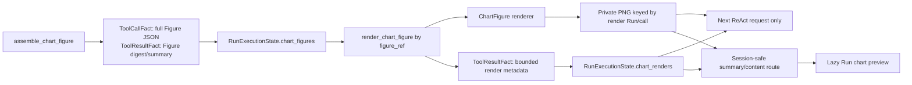

## Context

See `proposal.md` for the motivation and scope. The current `ChartFigure` assembly stores the canonical Figure JSON in the existing `ToolCallFact.arguments_json`, its digest and child-chart summaries in `ToolResultFact.result`, and exposes accepted summaries through `RunExecutionState.chart_figures`. Assembly intentionally does not render or write a second copy.

The Runtime already commits ordered tool calls, attempt starts, and bounded result/error facts. A successful tool result is limited to 256 KiB, while the shared image limit is about 24 MiB. `matplotlib` and Pillow are already project dependencies. Sources already owns private Attachment and Panel image storage. The Agent request builder currently resolves image feedback only from the latest fully committed tool batch.

## Goals / Non-Goals

**Goals:**

- Render any accepted 1–4 chart Figure as one bounded PNG, preserving child order and the Figure column count.
- Keep the durable boundary simple: existing tool facts own invocation/result metadata; private managed storage owns PNG bytes; `RunExecutionState` owns only a rebuilt read-only projection.
- Make retries after an uncertain local write return the same Run/call artifact under the existing idempotent local-write contract.
- Let the next Agent action inspect the latest render and let the owning Session preview any committed render on demand.
- Keep tool inputs, outputs, files, and Web DTOs explicit enough to trace Figure → render call → image → next model action or browser preview.

**Non-Goals:**

- No new Runtime fact kind, Run column, `RunExecutionState` persistence, Figure/render database table, or independent render ID.
- No chart-content editing, semantic fidelity review, approval gate, publication lifecycle, retry/resume controls, or model-selected dimensions/theme.
- No automatic resend of chart images from older tool batches or Runs to the Provider.
- No change to ChartFigure assembly rules or legacy ChartAgent behavior.

## Decisions

### 1. Render by accepted Figure reference

`render_chart_figure` accepts only:

```json
{
  "figure_ref": {
    "run_id": "<assembly-run-id>",
    "call_id": "<assembly-call-id>"
  }
}
```

The tool resolves that pair through the target Session's `RunExecutionState.chart_figures`, then reads the complete immutable Figure from the referenced assembly `ToolCallFact.arguments_json`. It re-parses and validates the Figure and compares its canonical SHA-256 with the committed `figure_digest` before rendering. This supports a Figure assembled earlier in the same Run or in a prior Run, does not repeat a large ChartFigure argument, and prevents the renderer from receiving an unaccepted or cross-Session Figure.

The renderer converts the existing value types directly:

- `bar`: categories and values, grouped by the optional series field; category and series order follow the ChartSpec data or declared x categories.
- `line`: coordinate points grouped by series, preserving their validated order.
- `scatter`: coordinate points grouped by series.
- `pie`: category/value slices in dataset order.
- Figure title, per-chart title, axis labels, configured numeric bounds, and nonempty display-only source/note text are drawn from the ChartSpec fields. No field is inferred or repaired.

### 2. Keep the renderer pure and separate storage/tool orchestration

Use the existing Matplotlib dependency with the noninteractive Agg canvas. The rendering function belongs in `src/figura/charts/chartfigure/rendering.py` and accepts a validated `ChartFigure`, returning PNG bytes and dimensions. It does not read Runtime, Session, or files. One chart cell uses a fixed 6.4 × 4.8 inch canvas at 100 dpi; total width is `columns × 6.4` inches and total height is `rows × 4.8` inches plus a fixed Figure-title area when the title is nonempty. A fixed white background, stable categorical palette, and server-selected font fallback keep model inputs limited to chart meaning.

`src/figura/tools/implementations/render_chart_figure.py` owns tool schema, accepted-Figure resolution, digest verification, renderer invocation, and bounded result construction. `bootstrap.py` registers the tool. It is classified as `idempotent_local_write` because successful execution installs a persistent PNG.

### 3. Store image bytes in Sources; use Run facts as the metadata authority

`src/figura/sources/chart_renders.py` owns the private image directory and validated read/write operations. Files live under the configured Figura data root in `chart-renders/`; a SHA-256 derived from canonical `[run_id, call_id]` supplies a safe filename. No path or image bytes enter a tool result, event, Agent projection, or Web JSON.

The successful `ToolResultFact.result` contains exactly:

| Field | Type | Meaning |
|---|---|---|
| `figure_ref` | `{run_id, call_id}` | Accepted Figure used by the render |
| `figure_digest` | lowercase SHA-256 | Canonical Figure digest verified before drawing |
| `image_sha256` | lowercase SHA-256 | Digest of the installed PNG bytes |
| `media_type` | literal `image/png` | Stored image format |
| `byte_count` | positive integer | Exact PNG byte length |
| `width` | positive integer | PNG pixel width |
| `height` | positive integer | PNG pixel height |

The handler checks PNG encoding, positive dimensions, and the existing per-image byte limit before returning success. It writes to a private staging file, flushes it, and atomically installs it without overwriting an existing Run/call artifact. On replay, the same immutable call identity maps to the existing file; the handler validates the PNG, derives byte count/hash/dimensions from those bytes, recomputes the Figure digest from the immutable referenced content, and returns the same logical result. A committed result's SHA-256 is checked again whenever an image is loaded for Agent or Web use. Missing or corrupted committed content fails closed.

No SQLite migration or image metadata table is needed. An installed file without a committed result stays invisible because every consumer first resolves a committed successful result from Runtime facts. The tool call identity and `ToolContext.idempotency_key` are enough to reconcile an interrupted local write; there is no extra `artifact_id`.

### 4. Add a derived render observation, not a durable execution-state field

`RunExecutionState` is the Agent's reconstructed Session-aware projection; it is not the Runtime checkpoint or a new persistence model. Add this immutable observation to `src/figura/agent/execution_state.py`:

| Field | Type | Ownership |
|---|---|---|
| `run_id` | `str` | Run that called `render_chart_figure` |
| `call_id` | `str` | Render tool-call identity and image-file key input |
| `attempt_id` | `str` | Attempt associated with the committed result |
| `figure_ref` | `{run_id, call_id}` | Accepted source Figure |
| `outcome` | `ToolOutcome` | Committed success or failure |
| `result` | read-only JSON mapping or `None` | Success metadata listed above, excluding the already separate `figure_ref` |
| `error` | `ToolExecutionError` or `None` | Bounded structured failure |

For success, exactly one of `result` or `error` is present; the same invariant applies to failure with only `error`. Build the tuple from the committed tool facts for the target Run and earlier terminal Runs in the same Session, ordered by Run ordinal and tool-call position. Validate that the call arguments, committed result, attempt, and accepted Figure reference agree. Include a failed observation only when its Figure reference resolves to an accepted same-Session Figure; omit malformed, unresolved, uncommitted, and cross-Session references. Do not copy Figure JSON, image bytes, or mutable status into the projection.

### 5. Feed back only images from the latest committed tool batch

Extend `AgentRequestBuilder` in `src/figura/agent/request.py`. When the immediately preceding fully committed tool batch contains successful `render_chart_figure` calls, load each PNG by the current Run/call identity, verify its SHA-256, byte count, dimensions, and same-Session `chart_renders` observation, then append one `ImageBlock` per call after its matching tool-result history. Preserve provider tool-call order. The image is assembled in memory for this request and is not copied into another record or cache.

The next request includes every successful render from that batch, subject to existing Provider image-count and byte bounds. If content is unavailable or invalid, or those bounds are exceeded, fail before claiming the Provider attempt. A later batch or a later Run receives only textual Figure/render summaries unless it explicitly renders again; this keeps behavior aligned with the current observation-image lifecycle and avoids automatically resending historical images.

### 6. Expose a safe Gateway summary and a Session-owned content route

Add successful render summaries to each originating Run in Session detail and Run history. The public summary fields are `callId`, `figureRef`, `figureTitle`, `figureDigest`, `imageSha256`, `mediaType`, `byteCount`, `width`, and `height`. `figureTitle` is joined from the already accepted Figure summary; render failures remain internal Agent observations and do not create a preview card.

Add `GET /api/v1/sessions/{session_id}/runs/{render_run_id}/chart-renders/{render_call_id}/content`. Before reading bytes, the Gateway verifies Run ownership, a committed successful render fact, and a matching same-Session accepted Figure reference. The source image service validates the PNG and recorded digest/size/dimensions, then responds with `image/png`, `Cache-Control: no-store`, and `X-Content-Type-Options: nosniff`. The existing Session/origin boundary remains authoritative.

The frontend adds the DTO and URL method to the Figura client, then displays the image grouped under its Run and loads bytes on demand as it does for Panels. Components do not call HTTP directly and browser state does not persist base64 or paths.



## Risks / Trade-offs

- **[Rendering details can become hard to read]** → Use a fixed per-chart canvas, preserve declared category/series order, and keep the first version to a single composite image with no custom theme controls.
- **[A crash can leave an image file without a committed result]** → Gate every projection, Provider read, and Gateway response on committed Run facts; replay the same idempotency key; do not expose the orphan file.
- **[Local storage can be edited or damaged]** → Validate PNG structure and compare its SHA-256, byte count, and dimensions against the committed result on every read; fail closed.
- **[Matplotlib font availability varies by host, especially for CJK labels]** → Configure deterministic font fallback and verify representative Chinese labels in the implementation's rendering tests; decide whether a bundled font is needed only if the supported runtime lacks one.
- **[Each committed render adds a durable image file]** → Keep exactly one file per render tool call and do not duplicate bytes in SQLite or browser persistence. Retention/garbage collection remains a separate policy decision rather than silently deleting Run output.
- **[A valid render does not prove the chart data is faithful to measurements]** → Preserve the boundary: rendering faithfully draws accepted ChartSpec content; semantic review and publication remain separate future capabilities.
